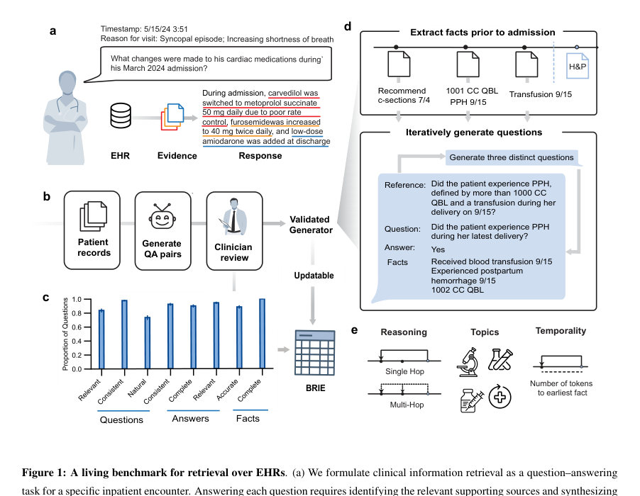
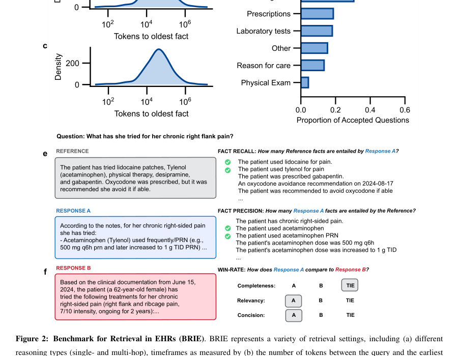
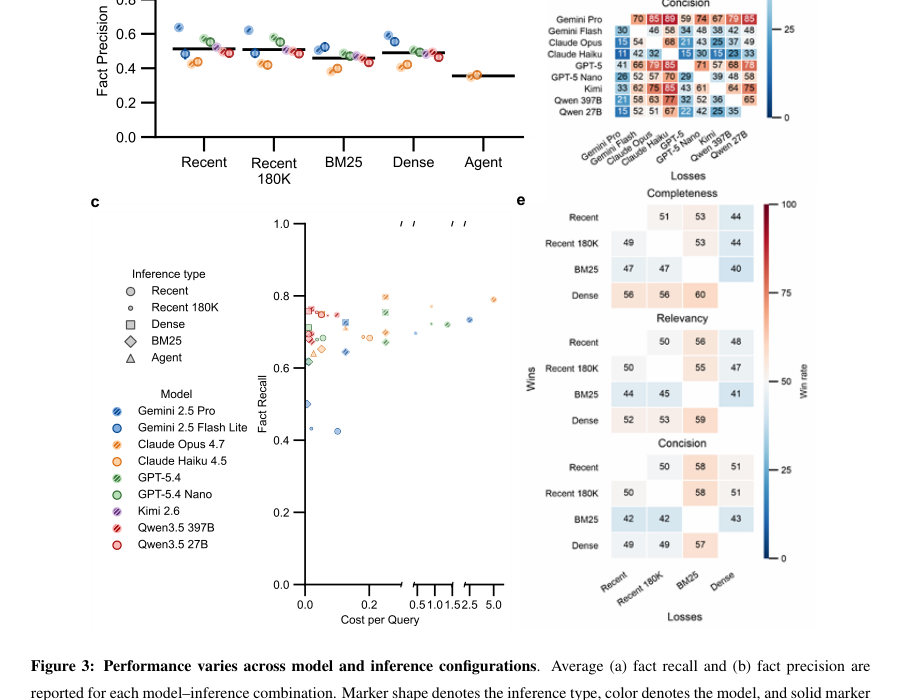

# A Living Benchmark for Information Retrieval from Electronic Health Records

- **게시일:** 2026-09-26
- **arXiv:** [2609.30205v1](http://arxiv.org/abs/2609.30205v1) · [PDF](https://arxiv.org/pdf/2609.30205v1)
- **저자:** Jordan L. Cahoon, Chloe O. Stanwyck, Sulaiman Somani, Philip Chung, Kevin R Keet, Kameron C. Black, Andrea T. Fisher, Sarita Khemani, Jerry Liu, Stephen Ma, Saloni K. Maharaj, Rita M. Pandya, Eduardo Perez-Guerrero, Priyanka Pillai, Lisa Shieh, David J. H. Wu, James Xie, James C. McAvoy, Teresa Nguyen, Jessica Tran, Lucy Yin, Bridget Lin, Alison Callahan, Jason A. Fries, Nigam H. Shah, Emily Alsentzer
- **분야:** cs.AI
- **선정 점수:** 6.74
- **선정 이유:** 최근성 0.8, 인용 영향 0.0 (인용 0회), 저자 영향 1.8 (최고 h-index 24), AI 주제 적합성 3.0, 개발자 관심 0.2, 학술 신호 0.9, 오픈 웨이트·주요 연구조직 신호 0.0

[← 2026-09-26 목록으로 돌아가기](../daily/2026-09-26.html)

<!-- paper-visuals:start -->
## 주요 Figure

> 원문 PDF에서 실제 Figure 캡션과 그림 영역이 함께 확인된 자료만 자동 추출했다.

*Figure · 원문 PDF 5쪽 · Figure 1: A living benchmark for retrieval over EHRs. (a) We formulate clinical information retrieval as a question–answering*

*Figure · 원문 PDF 7쪽 · Figure 2: Benchmark for Retrieval in EHRs (BRIE). BRIE represents a variety of retrieval settings, including (a) different*

*Figure · 원문 PDF 10쪽 · Figure 3: Performance varies across model and inference configurations. Average (a) fact recall and (b) fact precision are*

<!-- paper-visuals:end -->

## 한 문장 요약

전자건강기록(EHR)으로부터 자동 생성된 임상 질의–응답 쌍을 임상의가 검증한 ‘생활형(living)’ 벤치마크 BRIE를 제안하고, 이를 통해 다양한 LLM·추론 구성에서 EHR 정보검색의 실패 모드를 정량적으로 분석하였다.

## 해결하려는 문제

임상 차트 리뷰에서 LLM 기반 보조 도구의 안전성과 유용성 평가는 필수이나 기존 벤치마크는 수작업으로 작성·갱신 비용이 크고 빠르게 구식이 되어 배포된 시스템의 성능을 지속적으로 평가·모니터링하기에 부적합하다. 또한 환자 기록은 길고 중복·시간적 모호성이 있어, 문서 간 합성을 요구하는 질의에서 모델이 관련 정보를 누락하는 경향이 있다.

## 핵심 기여

- EHR 장기 문서로부터 자동으로 사실(fact)을 추출하고 H&P(History & Physical) 기준 시점까지의 이전 기록에서만 근거를 뽑아 질의–응답 쌍을 생성하는 확장 가능한 생성기 설계 및 구현.
- 생성기 출력에 대해 19명의 임상의가 검증을 수행하여 생성기의 품질을 확립하고 이를 기반으로 한 생활형 벤치마크 BRIE(최종 508개 질문·응답)를 구성.
- BRIE를 이용해 9개 모델과 5가지 추론(Recent, Recent-180K, Dense, BM25, Agentic)을 평가하여 ‘허위 생성(hallucination)’은 드물지만 중요한 사실 누락(omission)이 주요 실패 모드임을 규명.
- 다중 참조(여러 정답 해석)를 자동생성·검증하는 파이프라인을 제시하여 단일 참조 기반 평가가 성능을 과소평가함을 보임(사실 재현 증가 등).
- 생성기를 신규 입원 기록(2년 후)으로 재실행해 BRIE를 자동 갱신할 수 있음을 보이고(재현성), 필터링 전후·신규 코호트 간 성능 분포가 유사함을 제시.

## 접근 방법

* 논문 본문 기준으로 접근법은 다음과 같다.
* 첫째, 각 환자의 H&P 작성 시점을 쿼리 시점으로 설정하고 그 시점 이전의 모든 임상 노트에서 LLM을 사용해 환자 사실(facts)을 추출·중복 제거(복사·forward 문서 중복을 완화).
* 둘째, 추출한 사실 목록과 H&P를 결합해(단일 프롬프트, Gemini Pro 2.5 사용 예시) LLM으로부터 질의–응답 쌍을 반복 생성하되, 생성된 응답의 근거는 오직 추출된 사실 목록에만 의존하도록 제약하여 '이전 기록으로부터의 검색'을 평가하도록 설계.
* 셋째, 질의 생성은 평가 목적의 분류축(taxonomy)에 따라 Reasoning(단일호프 vs 다중호프), Topics(임상 주제들), 그리고 생성 후 측정되는 Temporality(최초 근거 사실까지의 토큰 거리)로 구성.
* 넷째, 생성기 출력은 두 명의 의사 리뷰어가 각 쌍을 14개 기준으로 검토·평가(임상 관련성·정확성 등)하고, 불일치는 제3자 조정으로 해결해 최종 BRIE를 구성.
* 다섯째, 대규모 모델·추론 실험을 위해 자동 평가 파이프라인을 구축: (a) 사실(entailment) 기반 자동 판정으로 fact recall/precision 산출, (b) 쌍별 비교용 'win-rate' LLM 심판(완전성·관련성·간결성 기준)으로 상대평가 수행.
* 평가에 사용된 추론 구성은 최근 노트 전체를 컨텍스트로 넣는 Recent/Recent-180K, BM25(키워드·sparse)·Dense(semantic) RAG, LLM 에이전트(도구 사용·조건부 중지)이다.

## 주요 결과

- 데이터·벤치마크: Stanford Health Care의 68명 환자(총 63,878 de-identified 노트, 환자당 중앙값 400 노트, 범위 102–9,319)에서 생성기를 적용해 초기에 675개 질의 생성, 임상의 검증 후 최종 BRIE는 508개 질문(276 single-hop, 232 multi-hop). 각 응답은 중간값 5개의 지지 사실을 포함; 최초 근거 사실까지의 중앙값 토큰 거리는 3.8×10^4, 지지 사실 간 범위 중앙값 2.3×10^4; 63개 질문은 최초 근거가 180,000 토큰 이상 떨어져 있음.
- 모델·추론 평가: 9개 모델(예: Claude Opus 4.7, Gemini 2.5 Pro, GPT-5.4, Kimi K2.6, Qwen 3.5 등)과 5가지 추론 구성에서 fact recall은 0.28–0.78 범위였고(최고: Claude Opus 4.7 Recent 0.78, Gemini 2.5 Pro 0.73, GPT-5.4 0.72), fact precision은 0.17–0.63 범위로 전반적으로 precision이 낮아 모델 응답이 레퍼런스보다 장황함을 시사함.
- 주요 실패 모드: 임상적으로 중요한 사실의 누락(omission)이 지배적이며, 샘플링된 50개 쿼리에서 모델 응답 사실의 99.2%가 차트에 근거가 있어 허위생성은 거의 없었음. 다중호프 질문·지나치게 장기 기록(원거리 근거)·만성 질환·병력 추적 관련 주제에서 성능 하락이 두드러짐.
- 검색 방법의 실용성: Dense(semantic) 검색은 평균적으로 Recent 인퍼런스와 동등하거나 우수한 recall을 달성하면서 평균 329,697 토큰(약 69%)을 덜 처리해 비용·연산 절감. Dense 기반 응답은 완전성·관련성 비교에서 각각 61%·56%의 우세를 보였음. 예시로 컨텍스트 상한(상위 50 문서) 제한 시 Claude Opus 4.7에서 전체 벤치마크 처리 비용을 약 86%($≈837.43) 절감 가능.
- 다중 참조의 효과: 100개 샘플 질의에 대해 생성·검증된 추가 해석을 참조로 허용하면 fact recall이 평균 +0.12(상대 개선 31.4%) 증가하고 fact precision이 +0.14(상대 개선 45.4%) 증가, 단 최상·최하 기법의 전반적 순위는 유지됨(단일 참조 평가가 성능을 과소평가함을 시사).

## 한계

- 저자가 명시한 한계: BRIE 초기 구성은 한 번의 임상의 검증(19명)의 비용으로 생성기를 확립했지만 초기 검증은 단일 병원(Stanford Health Care)의 비식별화된 기록을 기반으로 하며, 코호트가 의료 복잡도가 높은 환자들로 구성되어 있어 다른 병원·환자군 일반화 가능성은 제한될 수 있음.
- 저자가 언급한 관찰: 자동 생성된 코호트(BRIEunfiltered, BRIEnew)는 전반적 난이도를 보존했으나, BRIEnew에서 장기(≥180K 토큰) 근거를 필요로 하는 질문에 대해 성능 저하가 감지되는 등 시간적·코호트 변화에 따른 세부적 변동이 존재함.
- 본 실험에서 드러나는 제약(본문 근거): 평가 대상이 되는 모델들 중 다수는 상업적·프로프라이어터리 모델로 구성되어 있어 재현 시 동일 모델·컨텍스트 제약(컨텍스트 윈도우, 비용 등)에 따라 결과가 달라질 수 있음; 또한 LLM 기반 자동 판정(사실-entailement·win-rate 심판)은 본문에서 유효성 검증을 거쳤지만(일부 보조지표·Cohen’s kappa 등 보조 자료 존재), 자동 심판의 완전한 인간 동등성은 여전히 한계가 있을 수 있음.

## 개발자 관점

- 생성기 검증 후에는 동일 생성기를 신규 EHR 데이터에 재실행해 벤치마크를 자동 갱신할 수 있어 벤치마크 오염(contamination)과 드리프트를 완화하는 실용적 운영모델을 제공한다(초기 임상의 검증은 필요).
- 배포 관점에서 Dense(semantic) 검색 기반 RAG는 장기 컨텍스트를 통째로 넣는 Recent 방식 대비 연산·비용을 크게 낮추면서 동등하거나 더 나은 사실 회수 성능을 줄 수 있으므로 대규모 EHR 배포에서는 우선 고려 대상이다.
- 임상용 평가에서는 허위생성(hallucination)보다 '중요 사실 누락'이 더 위험하므로, 내부 모니터링 지표로 fact recall(지지 사실 회수율)을 도입하고 다중-참조 평가를 병행해 실제 임상의 관점의 다양성을 반영해야 한다.
- 다중호프(multi-hop)·장기 근거 검색 관련 질의에서 성능이 특히 저하되므로 생산 시스템은 해당 유형의 질의에 대한 경고·불확실성 표시 또는 인간 검토 플로우를 설계해야 한다.
- 자동 평가 파이프라인(사실-entailement 기반 정량 지표 + 쌍별 win-rate 신뢰도 비교)은 대규모 모델·설정 비교에 실용적이며, 재현 시 동일한 평가 파이프라인을 재사용해 일관된 모니터링을 수행하라.

**근거 범위:** 본 분석은 제공된 논문 PDF 본문(주요 본문 및 보조자료/부록에서 추출된 텍스트)을 기반으로 작성되었음. 본문에 직접 기재된 수치(예: 생성된 QA 수, 환자·노트 수, 모델별 fact recall/precision, 다중참조에서의 향상치, 비용·토큰 절감 등)를 사용하였고, PDF에서 명시적 수치가 없거나 부록에만 부분적으로 제시된 통계(예: 자동 판정의 Cohen’s kappa 구체값)는 본문에 명시적 수치가 없어 산출하지 않았음을 밝힘.
