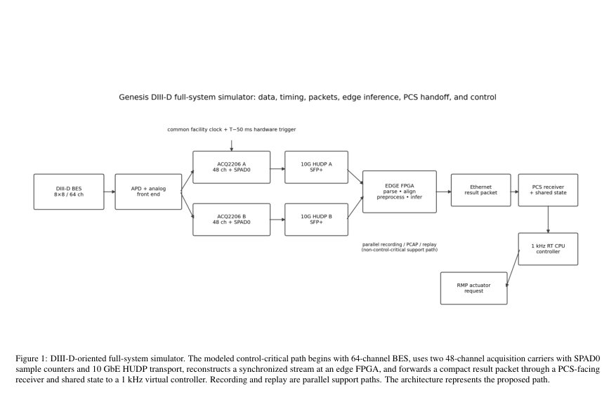
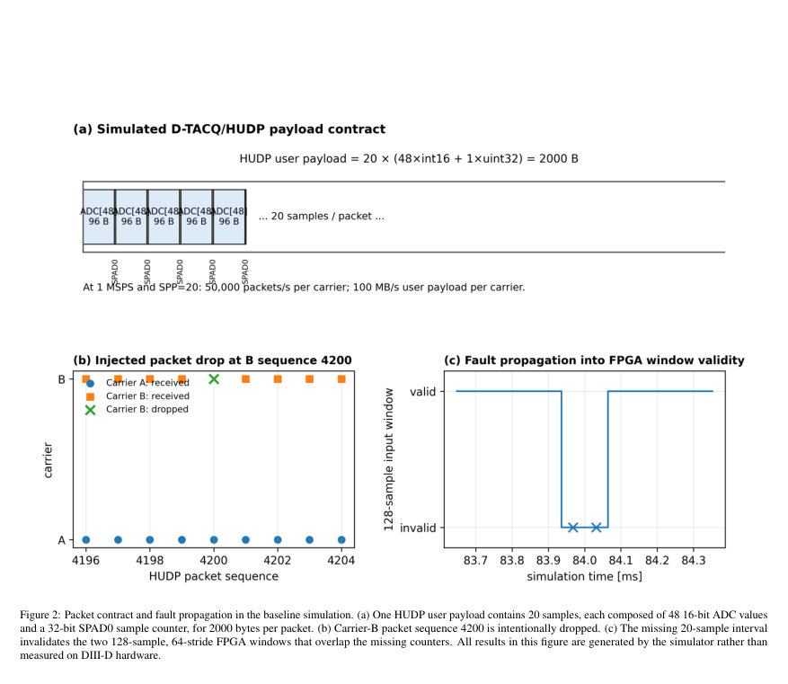
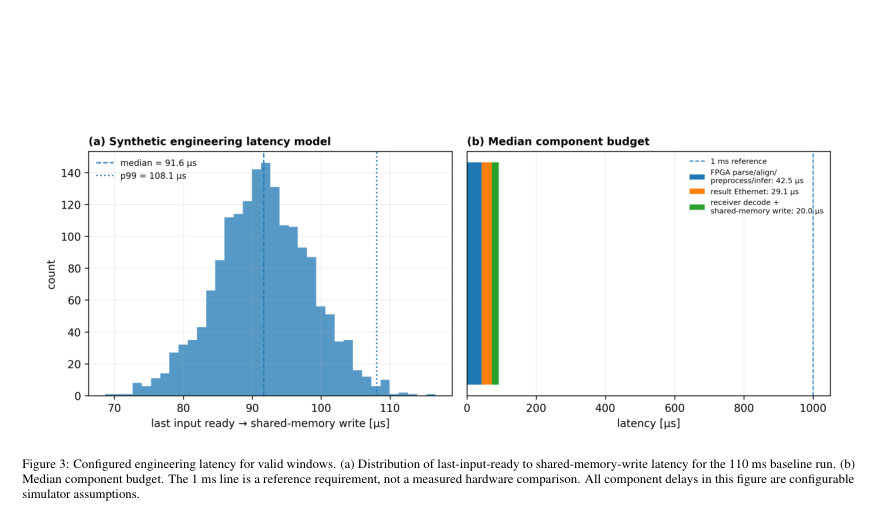

# A packet-level digital hardware twin for commissioning megahertz diagnostic edge AI and plasma control system integration in tokamaks

- **게시일:** 2026-09-29
- **arXiv:** [2609.33994v1](http://arxiv.org/abs/2609.33994v1) · [PDF](https://arxiv.org/pdf/2609.33994v1)
- **저자:** Semin Joung, Abhilasha Dave, Luca Scomparin, Filipp Khabanov, Zheng Yan, Benedikt Geiger, George McKee, Ryan N. Coffee, David R. Smith
- **분야:** physics.plasm-ph, cs.AI
- **선정 점수:** 5.22
- **선정 이유:** 최근성 0.8, 인용 영향 0.0 (인용 0회), 저자 영향 0.0 (최고 h-index 0), AI 주제 적합성 2.8, 개발자 관심 1.1, 학술 신호 0.6, 오픈 웨이트·주요 연구조직 신호 0.0

[← 2026-09-29 목록으로 돌아가기](../daily/2026-09-29.html)

<!-- paper-visuals:start -->
## 주요 Figure

> 원문 PDF에서 실제 Figure 캡션과 그림 영역이 함께 확인된 자료만 자동 추출했다.

*Figure · 원문 PDF 3쪽 · Figure 1: DIII-D-oriented full-system simulator. The modeled control-critical path begins with 64-channel BES, uses two 48-channel acquisition carriers with SPAD0*

*Figure · 원문 PDF 5쪽 · Figure 2: Packet contract and fault propagation in the baseline simulation. (a) One HUDP user payload contains 20 samples, each composed of 48 16-bit ADC values*

*Figure · 원문 PDF 6쪽 · Figure 3: Configured engineering latency for valid windows. (a) Distribution of last-input-ready to shared-memory-write latency for the 110 ms baseline run. (b)*

<!-- paper-visuals:end -->

## 한 문장 요약

메가헤르츠급 빔 방출 분광(BES) 진단에서 샘플-카운터와 이더넷 UDP 패킷 수준까지 이르는 전송·FPGA 전처리·엣지 추론·PCS(플라즈마 제어 시스템) 연동을 바이너리 패킷 단위로 재현하는 디지털 하드웨어 트윈을 개발하여 통합 검증·커미셔닝 환경을 제공한다.

## 해결하려는 문제

고속(메가헤르츠) 진단 데이터를 머신러닝 기반 엣지 추론과 PCS로 전달하는 전체 경로는 샘플링률·패킷화·카운터 연속성·양쪽 링크의 데스크류(deskew)·패킷 손실·네트워크 지터·FPGA 윈도우 유효성·인퍼런스 인지 지연·수신자 측 공유 상태 및 제어 주기 등 여러 인터페이스가 얽혀 있어, 개별 구성요소만 검증하면 통합 시 발생할 수 있는 결함을 발견하지 못한다. 기존의 배열 수준 시뮬레이션은 바이너리 패킷·샘플 카운터·패킷 결함 전파 등 패킷 수준 실패 모드를 포착하지 못한다.

## 핵심 기여

- 이진(바이너리) 듀얼-캐리어 HUDP(10 GbE Hardware UDP) 패킷화 구현: ADC 코드·SPAD0 샘플 카운터·Ethernet/IPv4/UDP 캡슐화·PCAP 출력으로 96채널(실제 동작은 64채널 BES) 동기 스트림을 결정론적으로 재구성함.
- 패킷 수준 결함을 FPGA 윈도우 유효성→因果적 전처리→엣지 인퍼런스→컴팩트 결과 패킷→수신기 공유 상태→PCS 유사 제어 논리까지 전파하도록 모델링하여 결함 감지·정책 검증이 가능하게 함.
- 버전 관리되는 64바이트 FPGA→PCS 결과 패킷 계약과 운영체제 루프백(UDP 소켓→POSIX 공유메모리)을 제공하여 수신 프로세스 경계와 바이너리 호환성을 조기에 검증할 수 있게 함.
- 인터랙티브 GUI를 통해 샘플당 패킷화, 링크 지터·손실·재정렬·카운터 점프 같은 장애 주입, FPGA 필터와 윈도우 설정,제어 사이클·stale timeout·페일세이프 정책 등을 조정·관찰할 수 있는 커미셔닝 표면을 제공함.
- 패킷율·결함 감지·지연 모델의 기본 사례(베이스라인)를 정량화하고, 하드웨어 측정으로 대체해야 할 인터페이스들을 명확히 식별함.

## 접근 방법

* 논문 본문에 따라 구현한 시스템은 다음 요소로 구성된다.
* (1) 신호원: 8×8 형상의 물리 기반 합성 BES 전압 신호를 1 MSPS로 샘플링하고 부호화(16-bit ADC 코드)한다.
* (2) 듀얼 캐리어 패킷화: 96채널 용량을 두 개 캐리어(A,B)로 나누어 각 캐리어는 48개의 16-bit ADC 값과 샘플 카운터(SPAD0, 32-bit)를 포함한다.
* 사용자 페이로드 길이는 NSPP(샘플/패킷)과 NSPAD(샘플 메타워드 수)로 LUDP = NSPP (48×2 + 4NSPAD) 바이트로 계산되며, 베이스라인은 NSPP=20, NSPAD=1으로 2000바이트 HUDP 페이로드를 생성한다.
* (3) 타이밍·카운터 재구성: 과학 시간축은 패킷 도착시간이 아니라 트리거 epoch와 SPAD0 카운터로 재구성(t = t_trig + (C−C_trig)/f_s − τ_ADC/FIR).
* (4) 네트워크 결함 모델: 각 캐리어에 대해 독립적 지연 분포, 패킷 드롭·중복·재정렬·카운터 점프 등을 주입 가능하며, 수신기는 SPAD0 기준으로 샘플을 색인하고 두 캐리어의 동일 카운터가 일치할 때만 그 96채널 샘플을 유효로 본다(데스크류 불일치 시 유효성 플래그로 전파).
* (5) FPGA 측 처리: 병렬 정합 후 전압 단위 복원, 인과적 밴드패스 필터(기본 8–180 kHz), 128샘플 윈도우(스트라이드 64) 기반 특성(채널 RMS, 시공간 일관성 프록시, 차분 RMS, 4차 순간, CCTD 유사 시간 지연 기반 vturb 등) 계산 및 경량 로지스틱 서러게이트 모델로 P_ELM(ELM 확률)·vturb 등 출력.
* (6) 결과 패킷·공유 상태: 버전화된 64바이트 'PCS Packet v0'(헬스 플래그·샷 ID·시퀀스·샘플 카운터·타임스탬프·PELM·vturb·RMS·coherence·신뢰도·CRC32)를 만들어 수신기로 전송하고 수신기는 CRC점검 후 POSIX 공유메모리에 기록하며 1 kHz PCS 유사 루프가 T_stale 기반으로 상태 유효성 판단을 수행한다.
* (7) 실행 모드: 빠른 이벤트 기반 모드(이벤트 타임스탬프로 많은 패킷 신속 생성)와 실제 OS UDP 소켓+POSIX 공유메모리 프로세스 레벨 모드(바이너리 호환성·프로세스 경계 검증)를 제공한다.

## 주요 결과

- 베이스라인 구성(NSPP=20, NSPAD=1, fs=1 MHz)에서 각 캐리어는 50,000 패킷·s^{-1}, 사용자 페이로드 100 MB·s^{-1}를 생성하며 110 ms 기준 런은 두 캐리어 합계로 11,000 HUDP 패킷을 생산함(문서화된 10 GbE 한계보다 낮음).
- 레퍼런스 런에서 생성된 엣지 인퍼런스 윈도우는 총 1717개였고, 의도적으로 Carrier B의 한 패킷(시퀀스 4200, 카운터 84000–84019)을 삭제한 결과 1715개가 유효, 2개(윈도우 중심 시각 83.968 ms 및 84.032 ms)가 무효로 판정되어 무효 윈도우 비율은 0.116%였음(누락된 샘플을 실시간 경로에서 보간하지 않음).
- 구성된 공학적(latency) 모델에 따르면 '마지막 입력 샘플 준비 시점'부터 '공유메모리 기록'까지의 지연 분포는 유효 윈도우(1715개)에 대해 중앙값 91.6 µs, 95 퍼센타일 103.2 µs, 99 퍼센타일 108.1 µs, 최대 116.6 µs로 보고됨(이 값들은 측정값이 아니라 시뮬레이터에 설정된 가정임).
- 운영체제 루프백 검사에서 로컬호스트 UDP를 통해 20개의 FPGA 결과 이진 패킷을 전송했을 때 수신자는 순서·생성 카운터를 보존했고 CRC 검증은 20/20 성공함으로 바이너리·프로세스 경계 호환성이 확인됨.

## 한계

- 저자 명시 한계(본문에서 직접 언급): (1) 지연 분포는 측정값이 아니라 구성된 공학적 모델이므로 실제 FPGA·네트워크·수신기 측정값으로 대체되어야 한다. (2) PCS Packet v0는 최종 DIII-D 수신 스키마의 자리 표시자이며 최종 계약이 아님. (3) 합성 BES 신호와 로지스틱 ELM 서러게이트는 인터페이스 시험용이며 실제 예측 성능을 보장하지 않음. (4) 가상 RMP/플랜트 응답은 휴리스틱이며 실제 플라즈마 제어 모델이 아님.
- 추가로 본문에서 확인 가능한 제약(실험 범위에서 드러나는 한계): (5) 프로세스-레벨 모드는 실제 하드 리얼타임 스케줄링을 재현하지 않으므로 실시간 성능 보증에는 한계가 있다. (6) 현재 구현은 표준 UDP 캡슐화를 사용하며(사용한 이유는 디코더 재사용성), 특정 하드웨어 MGT/맞춤 네트워크 셔임과의 정확한 동작 차이는 추후 벤치 검사로 확인해야 한다.

## 개발자 관점

- 패킷-레벨 계약(바이너리 페이로드·샘플 카운터·바이트 오더·버전 필드·CRC)을 초반부터 정의하고 PCAP으로 캡처·재생하면 물리 하드웨어가 준비되기 전에도 수신·디코딩 경계를 검증할 수 있다.
- 샘플 카운터(SPAD0) 기반 정렬과 '무효 윈도우 전달' 정책을 통해 패킷 손실을 무시하거나 보간하지 않고 상태 플래그로 상위 스택에 노출해야 디버깅·안전성 확보에 유리하다.
- 재현 검증을 위해 단계적 검증 절차를 권장: (i) 합성 데이터로 소프트웨어 회귀, (ii) 기록된 DIII-D 샷 재생을 패킷·FPGA 인터페이스로 통과시켜 오프라인과 비교, (iii) 물리 D-TACQ+FPGA 벤치 테스트(공통 클록/트리거로 카운터·필터 지연·전송 지연 측정), (iv) DIII-D 네트워크에서의 수신기/공유메모리 테스트(행동권한 없는 상태).
- 에지-ML과 제어 사이에 명확한 경계를 두어 획득 어댑터(기기별)와 전처리/인퍼런스 코어(공통)를 분리하면 다른 토카막·하드웨어로 이식하기 쉬워진다.
- 배포 관점에서 안전성 설계: 수신 측 stale timeout, generation counter, CRC 검사, 페일세이프(hold-last 또는 idle) 정책을 명시적으로 구현하고 테스트 시나리오로 긴 드롭아웃과 짧은 드롭아웃 모두 검증해야 함.

**근거 범위:** 이 분석은 제공된 논문 PDF 본문(페이지 1–9) 텍스트에 근거하여 작성되었다. 수치와 사건(패킷 수, NSPP=20, 50,000 패킷·s−1, 100 MB·s−1, 110 ms→11,000 패킷, 1717 윈도우/1715 유효·2 무효, 지연 중앙값 91.6 µs 등)은 본문에 명시된 값만 사용했다. 본문에 명시되지 않은 실제 FPGA/네트워크/수신기의 측정값이나 구현 세부사항은 생성하지 않았으며, 본문에서도 해당 항목들이 구성된 가정(측정 아님)임을 저자가 명시하고 있다.
