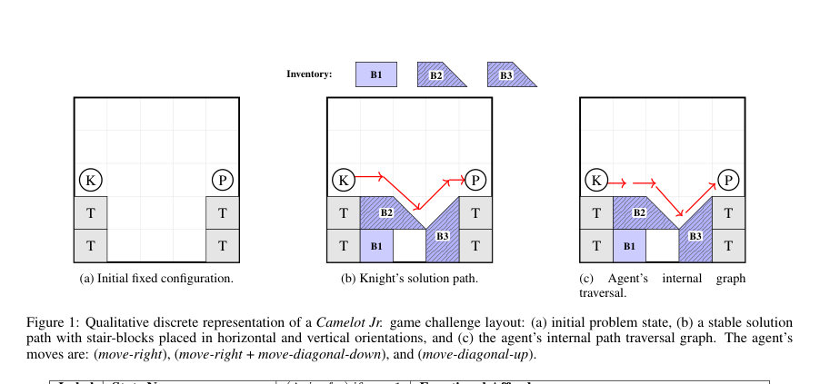
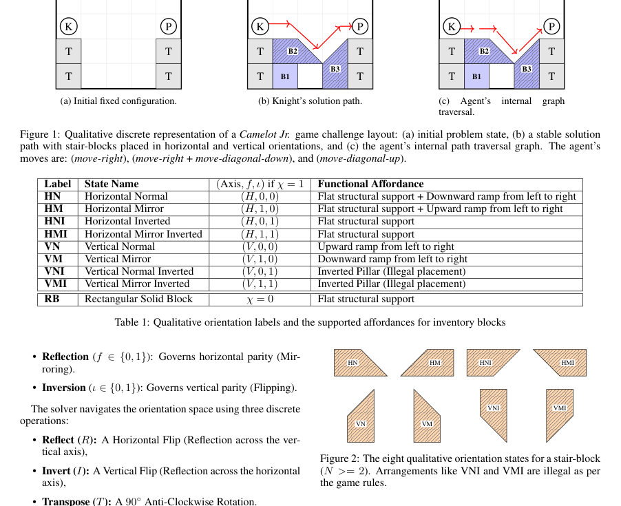

# A Qualitative Model for Reasoning about Path and Support

- **게시일:** 2026-09-18
- **arXiv:** [2609.20349v1](http://arxiv.org/abs/2609.20349v1) · [PDF](https://arxiv.org/pdf/2609.20349v1)
- **저자:** Abhishek Jaiswal, Zoe Falomir
- **분야:** cs.AI
- **선정 점수:** 4.57
- **선정 이유:** 최근성 1.2, 인용 영향 0.0 (인용 0회), 저자 영향 0.0 (최고 h-index 0), AI 주제 적합성 2.8, 개발자 관심 0.2, 학술 신호 0.3, 오픈 웨이트·주요 연구조직 신호 0.0

[← 2026-09-18 목록으로 돌아가기](../daily/2026-09-18.html)

<!-- paper-visuals:start -->
## 주요 Figure

> 원문 PDF에서 실제 Figure 캡션과 그림 영역이 함께 확인된 자료만 자동 추출했다.

*Figure · 원문 PDF 3쪽 · Figure 1: Qualitative discrete representation of a Camelot Jr. game challenge layout: (a) initial problem state, (b) a stable solution*

*Figure · 원문 PDF 3쪽 · Figure 2: The eight qualitative orientation states for a stair-block*

<!-- paper-visuals:end -->

## 한 문장 요약

Camelot Jr. 블록 퍼즐을 위해 정성적 블록·지형 기술자와 수치적 무게중심(COM) 안정성 논리를 혼합한 백트래킹 기반 해법을 제안하여 경로 연결성과 구조적 지지(stability)를 동시에 검증한다.

## 해결하려는 문제

사람처럼 해석 가능한 피드백을 줄 수 있는 게임 내 공간상식 추론 에이전트가 필요하다. 기존의 정성적 공간·시간 추론(QSTR) 접근은 기호적·해석적 장점이 있으나, Camelot Jr.처럼 정밀한 정적 평형을 요구하는 물리적 퍼즐에서는 순수 기호적 추상만으로는 부족하다. 본 논문은 다음 질문을 다룬다: 제한된 블록을 사용해 탑(고정 구조) 사이에 보(bridge)를 만들고, 모든 블록을 사용하면서 플랫폼의 안정성(전도·뒤집힘 없음)과 보행 가능 경로(나이트→프린세스)를 어떻게 동시에 만족시키는가?

## 핵심 기여

- Camelot Jr. 도메인에 특화된 정성적 묘사(그리드, 블록 정의, 방향 상태 벡터, 계단블록의 8상태 등)를 정식화함.
- 정성적 블록 배치 제약(공간적 배타성, 경계, 기반 지원 검사 등)과 블록별 기능적 어포던스(평지/경사/불가지지)를 명시함.
- 수치적 물리량(무게중심 COM) 기반의 재귀적 안정성 검증 로직(하중 집계, 결과 COM, 볼록 껍질 제약, 레버 규칙)을 기호적 추론과 결합함.
- 에이전트의 이동 어포던스(오른쪽, 대각상승, 대각하강)와 이를 이용한 DAG 기반 경로 탐색 규칙을 정식화함.
- 제한적 탐색공간을 가지는 순차적 블록 배치와 기하학적 가지치기(pruning)를 포함한 재귀 백트래킹 해법 알고리즘을 제시함.

## 접근 방법

* 아키텍처 및 알고리즘 개요: 입력은 W×H의 2D 수직 그리드, 고정 타워, 나이트·프린세스 위치, 그리고 크기·계단 여부·방향 벡터(O=(Axis,f,ι))를 갖는 블록 인벤토리이다.
* 블록 배치는 앵커 좌표 (x,y)에 대한 매핑 L:B→(x,y)로 표현된다.
* 계단블록은 Axis(수평/수직), Reflection, Inversion 세 요소로 8개(합법적)방향을 정의하며, Reflect/Invert/Transpose 연산으로 상태전이행렬(Table 2)을 통해 탐색한다.
* 배치 제약: 블록의 유효 치수(we,he)가 격자 비어있음과 경계조건을 만족해야 하고(Section 4.1), 지면이 아닌 경우 아래에 적어도 하나의 유효한 지지점이 있어야 한다(Section 4.2).
* 지지 유효성은 지지 블록 유형(RB, HNI/HMI 등)과 계단의 램프셀 여부에 따라 결정된다.
* 안정성 평가: 모든 배치가 완료되면 위→아래 순으로 각 블록 Bi에 대해 상부 하중 Loads(i)를 누적하여 Wi, 모멘트 Mi를 계산하고 COMres,i = Mi / Wi 를 얻는다.
* 서브스택 안정성은 결과 COM이 기저 지지 영역 [smin,smax] 내에 존재해야 하며, 다중지지(브리지)에서는 레버 규칙으로 하중 분배(f1,f2)를 계산해 재귀적으로 지면·타워로 전달한다(Section 5).
* 경로 탐색: 블록 배치가 안정적이면 에이전트는 Knight 위치에서 DAG 기반으로 move-right, move-diagonal-up, move-diagonal-down 원시동작을 사용해 걷기 가능 여부를 판단한다.
* 각 이동은 착지셀과 그 아래 지지 셀의 어포던스 규칙(평지·계단 상승·하강 등)을 통해 유효성검사를 거친다(Section 6).
* 전체 해법은 순차적 블록 선택·배치·가지치기·전수검증(안정성→경로)의 재귀 백트래킹(Algorithm 1)으로 구현되며, 불안정하거나 불가능한 배치는 되돌리는 방식이다(Section 7).

## 주요 결과

- 본문에는 정량적 실험, 데이터셋, 수치적 성능 지표(성공률, 시간복잡도, 탐색 가지수 등)를 제공하지 않는다.
- 논문은 방법론적 기술과 예시(그림 1: 초기 구성, 한 가지 안정 경로 예시, 에이전트 내부 그래프 탐색)를 제시하며, 결론에서 ‘agent successfully solves arbitrary configuration challenges within the game’s problem space’라 기술하여 제안한 모델로 문제 공간 내의 구성 문제를 해결할 수 있음을 주장한다(정량적 검증 수치 없음).
- 비교 기준이나 벤치마크 비교는 본문에 없음; 실험적 평가(사용자 연구, 실행 시간 측정)는 향후 작업으로 명시됨.

## 한계

- 저자가 명시한 한계 및 향후 과제: 학생 대상 교육적 실험(사용자 연구) 및 다른 유사 퍼즐게임으로의 확장 필요성(Section 8).
- 본문에서 확인되는 제약/한계(추론된 한계):
- - 정량적 평가 부재: 성공률, 탐색시간, 메모리 사용량, 평균 해 탐색 깊이 등 수치적 성능 지표가 제시되지 않음.
- - 계산 복잡성·확장성 미제시: 백트래킹 기반 완전탐색은 인벤토리 크기·격자 크기가 커지면 지수적으로 확장될 가능성이 있으나 시간 복잡도·실행시간, 스케일 한계가 본문에 기술되어 있지 않음. 예시로 안정성 검사는 모든 블록 배치 후에 수행되며(Section 7.2), 이는 중간에 불필요한 탐색을 유발할 수 있음(증거: 본문 설명).  
- 물리 모델의 한계: 안정성 검증은 정적 COM 기반의 정적 평형만 고려하며 마찰, 동적 반응, 충돌·유동성 등 실제 동적 물리 현상은 다루지 않음(본문의 COM 정의와 가정에서 확인 가능).  
- 구현·재현 정보 부재: 코드, 런타임 환경, 성능 수치, 파라미터(블록 무게 wi 값의 정의나 단위) 등 구체적 구현 세부가 제공되지 않음.  
- 도메인 특화 규칙: 계단의 램프 위에 블록을 올릴 수 없음 등 도메인 규칙이 하드코딩되어 있어 다른 물리 퍼즐로의 직접 이식에는 제약이 있을 수 있음.

## 개발자 관점

- 재현(구현) 관련: 재현하려면 W×H 그리드, 블록 데이터구조(크기 N, id, O, χ), 방향 상태 전이행렬, 위치·오리엔테이션에 대한 유효성 검사(충돌·경계·지지 체크)를 정확히 구현해야 한다. 안정성 검증을 위해 각 블록의 질량 wi와 블록 내부 COM(ci) 정의가 필요하나 본문은 구체적 질량값을 제공하지 않으므로 설계 시 합리적 스케일(예: 블록 부피에 비례)을 정해야 한다.
- 성능·비용: 현재 알고리즘은 완전 재귀 백트래킹이므로 인벤토리(블록 수)·격자 크기 증가에 따라 계산비용이 급증할 가능성이 높다. 실제 배포 전 가지치기(기하학적 불가능성 탐지), 휴리스틱(블록 선택 순서), 증분적 안정성 체크(중간 단계에서 COM 평가)와 캐싱(대칭·회전 동형 케이스 제거) 도입을 고려해야 한다.
- 배포·확장성: 설명 가능한 기호적 표현은 튜터링 시스템 통합에 유리하다(인간에게 해석 가능한 규칙 기반 피드백 생성). 다만 실시간 인터랙티브 제품으로 배포하려면 탐색시간 최적화 또는 근사해 탐색이 필요하다.
- 안전성·신뢰성: 시스템은 안정성 검증을 담당하므로, 물리적 실행(예: 로봇이 실제로 블록을 배치하는 경우)과 연동 시 정적 COM 가정의 한계를 명확히 안내해야 한다. 사용자에게 불안정 가능성이나 모델 가정을 명시적인 해석히트(hint)로 제공하는 것이 중요하다.
- 추가 구현 팁: 구현 시 블록 무게와 COM 계산(정확한 좌표계), 지지 셀의 수평 중심(cp1, cp2) 계산, 레버 규칙에 따른 하중 전달 구현을 우선적으로 검증하는 것이 바람직하다. 또한 그림 1과 표 1·2의 방향·상태 전이 규칙을 정확히 반영해야 동일한 동작을 재현할 수 있다.

**근거 범위:** 이 분석은 제공된 논문 PDF 본문(페이지 1–7)을 기반으로 작성되었다. 본문에는 알고리즘적·정성적 기술과 예시(그림 1)가 포함되어 있으나 정량적 실험 결과, 구체적 구현 세부(무게 wi 수치, 코드, 실행시간 등)는 제공되어 있지 않아 성능 관련 수치나 실행 비용은 본문에서 확인되지 않는다.
