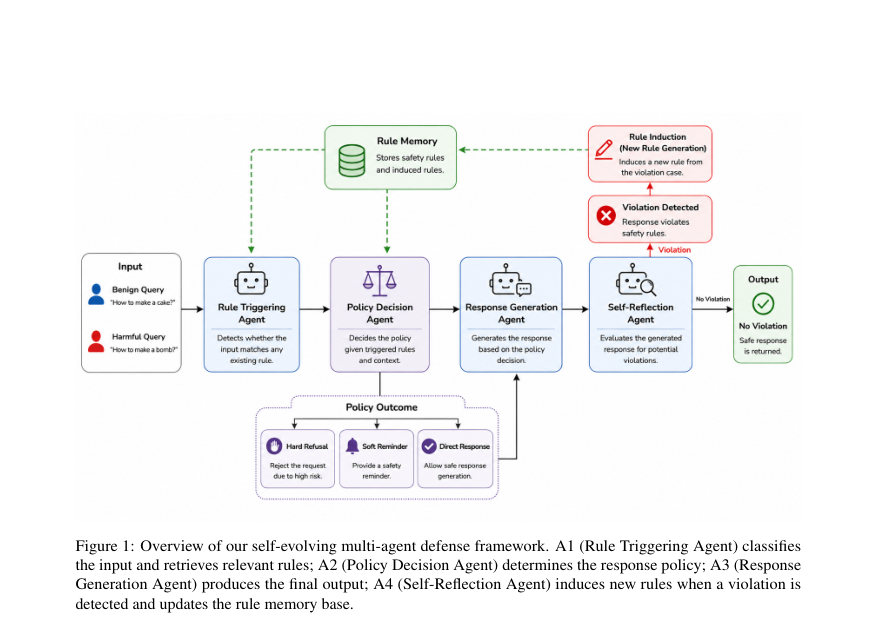
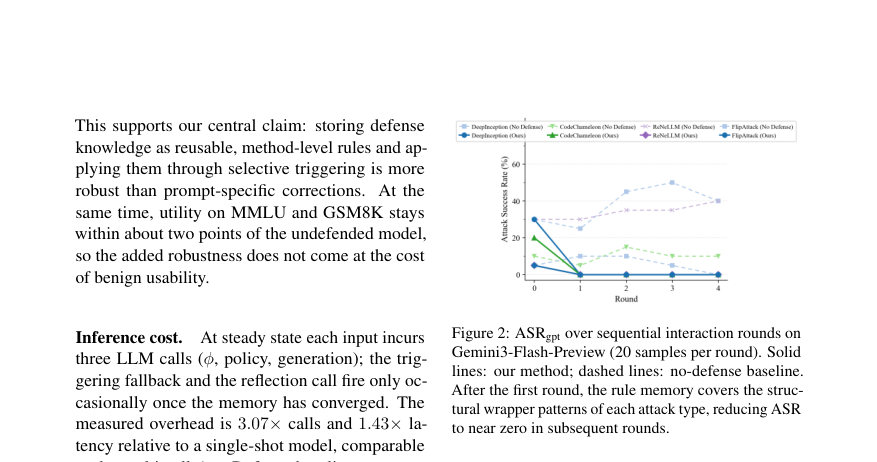
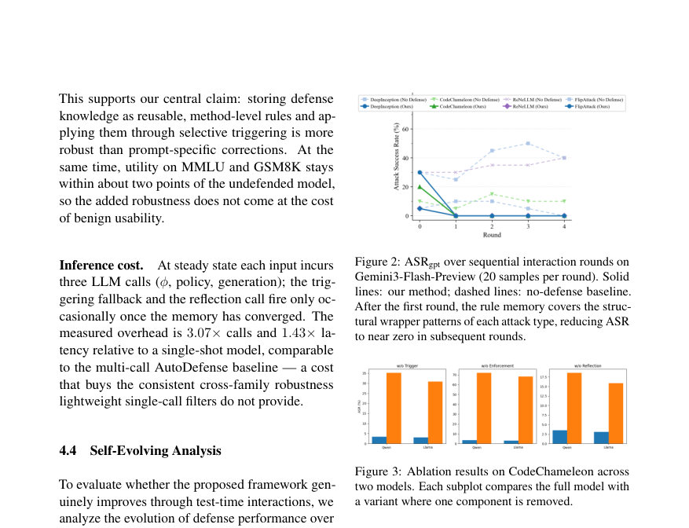

# A Self-Evolving Multi-Agent Framework Defense against LLM Jailbreak Attacks

- **게시일:** 2026-08-27
- **arXiv:** [2608.26008v1](http://arxiv.org/abs/2608.26008v1) · [PDF](https://arxiv.org/pdf/2608.26008v1)
- **저자:** Tongyan Hu, Bryan Hooi
- **분야:** cs.CR, cs.CL
- **선정 점수:** 7.13
- **선정 이유:** 최근성 1.2, 인용 영향 0.0 (인용 0회), 저자 영향 0.0 (최고 h-index 0), AI 주제 적합성 3.0, 개발자 관심 1.0, 학술 신호 0.3, 오픈 웨이트·주요 연구조직 신호 1.6

[← 2026-08-27 목록으로 돌아가기](../daily/2026-08-27.html)

<!-- paper-visuals:start -->
## 주요 Figure

> 원문 PDF에서 실제 Figure 캡션과 그림 영역이 함께 확인된 자료만 자동 추출했다.

*Figure · 원문 PDF 4쪽 · Figure 1: Overview of our self-evolving multi-agent defense framework. A1 (Rule Triggering Agent) classifies*

*Figure · 원문 PDF 7쪽 · Figure 2: ASRgpt over sequential interaction rounds on*

*Figure · 원문 PDF 7쪽 · Figure 3: Ablation results on CodeChameleon across*

<!-- paper-visuals:end -->

## 한 문장 요약

운영 중 발생한 성공한 jailbreak 실패를 구조적 '랩퍼' 수준의 재사용 가능한 규칙으로 추상화해 외부 영구 규칙 메모리에 저장·선택적 발동함으로써(파라미터 업데이트 없이) 블랙박스/오픈 모델에 대해 테스트타임에서 자기진화적으로 방어력을 높이는 다중 에이전트 프레임워크를 제안한다.

## 해결하려는 문제

기존 LLM 안전 방법(고정 시스템 프롬프트, 안전 파인튜닝, 외부 분류기 등)은 배포 시 고정되어 새로운 혹은 조합적·난독화된 jailbreak 기법에 적응하지 못한다. 본문은 연속 상호작용 환경에서 발생하는 새로운 탈옥 전략에 대해 시스템이 경험을 축적해 적응할 수 있는 테스트타임 방어가 부족하다는 문제를 다룬다.

## 핵심 기여

- 영구적이며 상호작용 간 공유되는 규칙 메모리(Rt)를 중심으로 실패를 '방법(method)-수준'의 규칙으로 추상화해 저장하고 재사용하는 자체 진화(self-evolving) 테스트타임 방어 메커니즘을 제안함(파라미터 업데이트 없음, 블랙박스 적용 가능).
- 공격을 토픽이 아닌 구조적 래퍼(wrapper) 수준에서 추상화하는 동적 규칙 트리거링 메커니즘을 설계해 하나의 유도 규칙이 전체 공격 계열에 일반화되도록 함(라벨 공간은 구조적으로 새로우면 확장).
- 정책 결정(강제 거부/완곡 거부/허용)과 규칙 주입을 통해 선택적으로 규칙을 입력으로 주입·강제하는 설계로 정상 유틸리티 훼손을 최소화함.
- 네 개의 프롬프트 기반 에이전트(A1: 규칙 트리거링/분류기 ϕ, A2: 정책 결정 g, A3: 응답 생성, A4: 자기성찰·규칙 유도)를 구현해 본 메커니즘을 실현하고, 여러 공개·비공개 모델과 네 가지 jailbreak 계열에서 실험을 통해 방어 효능을 보임.
- 적응형 복합 래퍼 공격에서도 견고하며 규칙 메모리 증가가 과도한 과도거부(over-refusal)를 유발하지 않음을 보이고(추적지표와 XSTest 평가 포함), 추론 비용(평균 호출 수/지연)을 정량적으로 보고함.

## 접근 방법

* 프레임워크는 외부 영구 규칙 메모리 Rt와 다섯 연산자를 정의한다.
* 규칙은 [label=Li] If the request uses Pi, then Di 형태로 저장되며 Li는 방법-수준 라벨(예: roleplay-nested-persona), Pi는 구조적 래퍼 설명, Di는 거부 제약을 나타낸다.
* 입력 x(t)에 대해 (1) 공격-패턴 분류기 ϕ가 입력을 benign / 기존 라벨 / other로 분류해 z(t)를 만든다.
* (2) match 연산은 z(t)와 메모리의 라벨 Li를 비교하여 최대 K=2개의 규칙을 트리거한다(라벨-우선, LLM 유사도 폴백, 키워드 폴백 순).
* (3) 정책 연산 g는 트리거된 규칙 집합에 대해 HARD_REFUSE / SOFT_REFUSE / ALLOW 중 응답 정책 π를 결정하고 우선순위는 HARD_REFUSE ≻ SOFT_REFUSE ≻ ALLOW이다.
* (4) 응답 생성 에이전트는 해당 정책을 동적으로 시스템 지시어로 주입해 y(t)=fθ(x(t);π) 를 생성한다.
* (5) 위반 탐지기 h(LLM-as-judge)가 y(t)의 유해성 점수 s(y) ∈ {1..10}을 판정하고 임계값 τ=7 이상이면 v(t)=1로 간주한다.
* v(t)=1이고 z(t) ≠ benign이면 반성(Reflection) 에이전트 F가 x(t), y(t)로부터 공격 래퍼를 요약해 신규 규칙 r_new를 생성하고 메모리 업데이트 U는 의미적 중복 제거와 라벨당 용량 C=4를 적용해 Rt를 갱신한다.
* 모든 적응은 외부 메모리·프롬프트 층에서 일어나며 파라미터 업데이트는 없다.
* 알고리즘 1은 한 상호작용 단계를 요약한다.
* 구현은 A1–A4 네 개의 프롬프트 기반 에이전트로 제시되며 상세 프롬프트는 부록 A.6에 제공된다.
* 추론 비용은 정상 상태에서 ϕ, 정책, 생성의 세 번의 LLM 호출이 지배적이며 저자측 측정에서 호출 수는 3.07×, 지연은 1.43×였다.

## 주요 결과

- 대표 정량 결과(ASR_rej / ASR_gpt, 낮을수록 좋음) — Qwen2.5-7B 기준: DeepInception No Defense 78.0 / 14.6 → Ours 4.1 / 3.5; CodeChameleon No Defense 98.0 / 57.0 → Ours 4.5 / 1.4; ReNeLLM No Defense 97.0 / 27.0 → Ours 2.5 / 1.1; FlipAttack No Defense 96.0 / 30.4 → Ours 1.0 / 0.4 (Table 1).
- 다중 모델에서 유효 — 예: Llama3.1-8B 및 Gemini-3-Flash-Preview에서도 Ours가 네 공격 계열 전반에서 ASR를 크게 낮춤(표 1의 각 셀 참조).
- 유틸리티 영향 — MMLU·GSM8K 성능 저하는 경미함: Qwen2.5-7B에서 MMLU No Defense 68.7 → Ours 66.8, GSM8K 71.8 → Ours 70.1; Llama3.1-8B에서는 MMLU가 소폭 증가(60.8 → 61.7)함(표 1).
- 자기진화 분석 — Gemini3-Flash-Preview에서 공격 샘플을 배치(20개/라운드)로 스트리밍했을 때 첫 라운드 이후 메모리가 해당 공격 래퍼를 포괄해 ASR_gpt가 이후 라운드에서 거의 0으로 수렴(Figure 2).
- 절성분(ablations) — 규칙 트리거링을 제거(w/o Trigger), 규칙 집행을 제거(w/o Enforcement), 반성을 제거(w/o Reflection)한 변형은 각각 ASR가 실질적으로 악화되어 트리거·집행·반성이 상호보완적임을 보임(Figure 3). 추가 블랙박스 비교: AegisLLM(예: CodeChameleon 16 / 4)이나 ICD(예: CodeChameleon 68 / 23) 대비 본 방법이 더 낮은 ASR를 보임(Table 3). 또한 추론 오버헤드는 호출 수 기준 3.07×, 지연 1.43×로 보고됨(본문).

## 한계

- [저자 명시] 평가 범위 제한: 네 가지 대표적인 블랙박스 프롬프트 수준의 jailbreak 계열과 적응형 복합 래퍼를 포함하지만 최근 제안된 모든 공격(특히 멀티턴·에이전틱 공격)과 전체 범위를 다루지 못함.
- [저자 명시] 메모리 관리 한계: 현재 설계는 의미적 중복 제거와 라벨당 용량 C로 성장 억제를 하지만 명시적 규칙 제거(pruning)나 충돌 해결 메커니즘이 없어 매우 장기간 상호작용에서 효율성·일관성 문제가 남음.
- [저자 명시] 판단자·분류기 한계: 위반 탐지기(h)와 분류기(ϕ)가 프롬프트된 LLM 구성요소이므로 기본 모델의 판단 오류를 물려받아 과도거부(over-refusal)가 발생할 수 있음(본문의 XSTest 분석에서 빈도화됨).
- [추론] 실환경 적용 시 비용·지연 고려: 정상 상태에서도 입력당 평균 3회의 LLM 호출로 비용·지연이 증가하므로 저지연/저비용 서비스에선 부담이 될 수 있음(본문의 3.07× 호출·1.43× 지연 수치 근거).

## 개발자 관점

- 재현·구현: 핵심은 외부 규칙 메모리(Rt)와 ϕ, match, g, h, F, U 연산자의 프롬프트화된 구현이다. 부록 A.6에 각 에이전트(A1–A4) 및 평가 프롬프트가 제공되어 복제 가능성이 높다.
- 배포 시 검토사항: 시스템은 파라미터 업데이트가 필요 없고 블랙박스 API에서도 동작하므로 기존 상용 모델에 적용 가능하지만, 입력당 평균 3회의 호출이 필요하므로 비용·지연 예산을 산정해야 한다(논문 측정: 호출 3.07×, 지연 1.43×).
- 운영 정책: 규칙은 방법-수준(래퍼)으로 저장해야 일반화 효과가 크다. 라벨당 용량(C)과 최대 주입 규칙 수(K)는 본 논문 범위(K∈{1,2}, C∈{2,4})에서 민감도가 낮음으로 보고되나 장기간 서비스에서는 규칙 제거·충돌 해결 로직을 추가해 메모리 성장 문제를 완화해야 한다.
- 안전성·평가: 위반 판정은 내부 LLM(h)으로, 최종 평가는 외부 LLM(ASR-gpt용)으로 분리해 평가 편향을 줄였다는 설계 의도를 따르는 것이 바람직하다(논문은 in-system judge와 외부 GPT-4o-mini 판정을 분리하여 사용).
- 테스트·검증: cold-start 온라인 프로토콜(메모리 초기화 후 스트림 순서대로 처리)을 따를 것. 초기 실패(메모리에 규칙이 없을 때 성공한 공격)는 실제 운영에서도 발생하므로 평가·모니터링에서 고려해야 한다.

**근거 범위:** 이 분석은 제출된 논문 PDF 본문(제목·초록·서론·방법·실험·부록 포함)의 텍스트를 근거로 작성되었다. 표·그림·부록(A.6 포함)에 제시된 수치(표 1, 표 3, XSTest 결과, 호출·지연 오버헤드 등)와 알고리즘·프롬프트 템플릿을 직접 인용했다. PDF에서 제공되지 않은 내부 파라미터나 구현 세부(예: LLM 프롬프트의 세부 튜닝, 정확한 비용 산정 방식)는 생성하지 않았으며, 문서에 명시된 한계와 본문으로부터 합리적으로 확인되는 제약을 구분해 기술했다.
