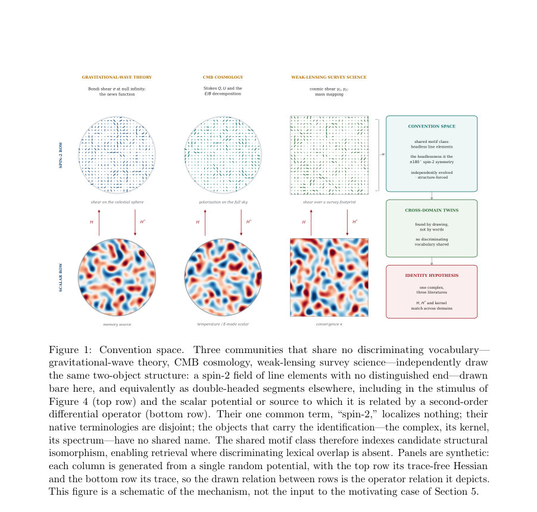
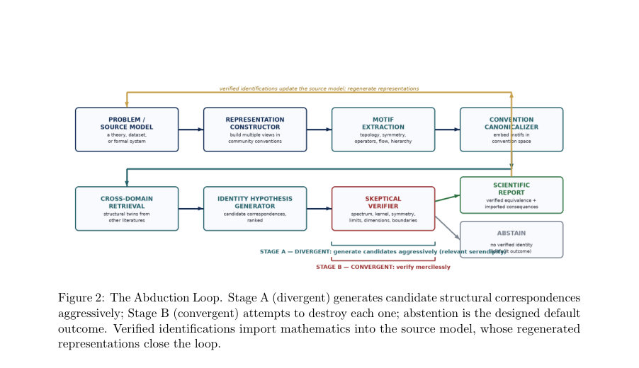
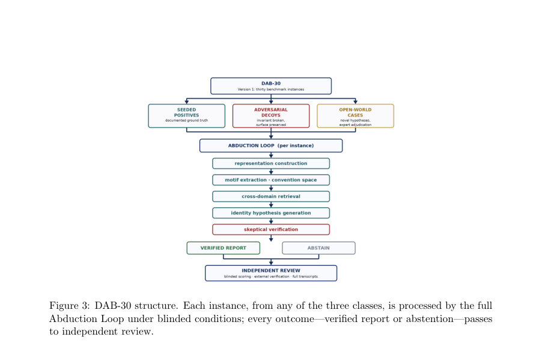

# Abduction Without a Body? Representational Grounding and the Abduction Loop for Scientific Hypothesis Generation

- **arXiv:** [2608.02505v1](http://arxiv.org/abs/2608.02505v1) · [PDF](https://arxiv.org/pdf/2608.02505v1)
- **저자:** Michael Farmer
- **분야:** cs.AI, cs.CV, cs.IR
- **선정 점수:** 10.29
- **선정 이유:** 최근성 0.7, 핵심어: agent, 핵심어: inference, 핵심어: multimodal, 핵심어: benchmark

<!-- paper-visuals:start -->
## 주요 그림·그래프·표

> 원문 PDF에서 자동 추출한 자료다. 정확한 해석은 원문 캡션과 본문을 함께 확인해야 한다.

*그림·그래프 · 원문 PDF 7쪽 · Figure 1: Convention space.*

*그림·그래프 · 원문 PDF 10쪽 · Figure 2: The Abduction Loop. Stage A (divergent) generates candidate structural correspondences*

*그림·그래프 · 원문 PDF 13쪽 · Figure 3: DAB-30 structure. Each instance, from any of the three classes, is processed by the full*

<!-- paper-visuals:end -->

### 한 문장 요약

온라인·지각적 신체성 없이도 도식화된 표현을 통해 서로 다른 분야의 구조가 동일 객체라는 가설(정체성 귀추)을 생성·검증할 수 있다는 메커니즘적 제안과 평가 프로그램을 제시한다.

### 해결하려는 문제

최근 AI·과학철학 논의에서는 진정한 과학적 귀추(가설 생성)가 지속적인 감각운동적 신체성(continuous sensorimotor embodiment)을 필요로 한다고 주장한다. 이 논문은 모든 귀추 행위에 온라인 신체성이 반드시 필요한 것은 아니라는 좁은 주장을 방어하며, 특히 '정체성 귀추'(두 독립적으로 발전한 구조가 명시적 대응 하에서 동일 객체임을 추론하는 행위)에 초점을 맞춘다.

### 핵심 기여

- 정체성 귀추(identity abduction)를 중심에 둔 문제설정과, 이를 물리적 상호작용이 아닌 표현 변환을 통한 'representational grounding'으로 설명하는 좁은 이론적 주장.
- 과학적 도표(diagrams)를 실용적 기반(substrate)으로 보고, 분야 간 대칭성·위상·연산 구조를 부분적으로 표준화하는 'convention space'라는 개념을 도입하여 어휘가 다른 두 분야 사이의 수학적 관련 작업을 찾아내는 검색 문제를 다룸.
- 구체적 메커니즘으로서의 아키텍처 'Abduction Loop' 제안: representation generation, motif extraction, convention-space canonicalization, cross-domain retrieval, identity-hypothesis generation, adversarial verification(및 기본적으로 abstention).
- 가능성 증거(possibility witness)로서의 문서화된 에피소드 제시: 멀티모달 모델에 중력을 기억하는 수송 모델 그림을 주었을 때, 그 중심 미분 복합체가 약한 렌즈 천체역학의 구면 Kaiser–Squires 질량 매핑 복합체와 동등하다는 가설을 생성·검증한 사례(단 일반적 능력의 증거로 제시되지는 않음).
- 반증 가능하고 재현 가능한 평가 프로그램으로서의 DAB-30 벤치마크 제안.

### 접근 방법

아키텍처적 관점에서 Abduction Loop를 제시한다. 단계는 (1) 표현 생성(이미지·도식·수식 등으로의 변환), (2) 모티프 추출(표현에 드러난 패턴·불변성 추출), (3) convention-space의 정규화(여러 분야의 표기·관습을 부분적으로 통일시켜 대칭·위상·연산 구조를 노출), (4) 교차영역 검색(어휘가 다른 분야 간에 수학적 관련성을 찾기), (5) 정체성 가설 생성(두 구조가 동일하다는 대응 제안), (6) 적대적 검증 및 기권(abstention)을 기본 동작으로 삼는 검증과정. 논문 초록은 이 절차를 메커니즘적 제안으로 설명하며, 실험적 사례는 가능성을 보여주는 증거로 제시한다고 명시한다.

### 주요 결과

- Abduction Loop이라는 메커니즘·아키텍처 제안.
- convention space 개념과 도표를 실용적 기반으로 사용하는 아이디어 제시.
- 멀티모달 모델이 특정 도표로부터 중심 미분 복합체와 구면 Kaiser–Squires 질량 매핑 복합체의 동등성 가설을 생성·검증한 문서화된 에피소드가 제시됨(저자는 이것을 일반적 능력의 증거가 아니라 가능성의 목격자(possibility witness)로 서술함).
- DAB-30이라는 반증 가능한 평가 프로그램(벤치마크) 제안.

### 한계

- 초록만으로는 Abduction Loop의 구체적 구현 세부사항(모델 구조, 학습 절차, 데이터 종류 및 전처리, 성능 수치 등)을 확인하기 어렵다.
- 문서화된 에피소드가 단일 사례인지, 반복 실험·통계적 평가를 거쳤는지, 어떤 모델·설정으로 재현 가능한지는 초록만으로 확인하기 어렵다.
- convention space를 어떻게 형식화하고 구축하는지(자동 학습 vs 규칙화된 매핑), 그리고 다양한 분야의 표기법 차이를 얼마나 넓게 커버할 수 있는지는 초록만으로 확인하기 어렵다.
- 제안된 접근이 얼마나 일반화 가능한지(다양한 과학 분야·도식 유형에서 동작하는지), 또는 계산적·표현적 한계(스케일, 노이즈, 애매성)에 대한 정보는 초록만으로 확인하기 어렵다.

### 개발자 관점

- 아키텍처 모듈별(표현 생성, 모티프 추출, convention-space canonicalization, 교차영역 검색, 정체성 가설 생성, 적대적 검증) 인터페이스와 책임을 명확히 설계하라. 각 모듈을 독립적으로 개발·평가할 수 있어야 하며, 실패 시 기권(abstention)하도록 설계하라.
- 도표·수식·텍스트를 통합하는 멀티모달 표현 파이프라인을 준비하고, 표현 변환 단계에서 불변성(대칭·위상·연산자 구조)을 추출하는 알고리즘을 우선 개발하라. (초록은 구체적 방법을 제공하지 않으므로 기법 선택은 설계자에게 달려있다.)
- convention space 구축은 핵심 과제이므로, 소규모의 수작업 매핑과 자동 임베딩 기반 매핑을 병행해 프로토타입을 만들고, 매핑의 신뢰도·범위를 정량화하는 메트릭을 도입하라.
- 교차영역 검색을 위해 분야별 어휘가 불일치해도 구조적·수학적 유사성으로 보정할 수 있는 유사도 함수(예: 그래프·위상·연산자 수준의 비교)를 설계하라. 단, 초록만으로 특정 수식적 정의는 확인할 수 없다.
- 적대적 검증(adversarial verification) 단계에서 반증을 시도하는 자동화된 테스트셋을 만들고, 인간 전문가의 검토를 포함하는 루프를 마련해 가설의 해석 가능성 및 출처 추적(provenance)을 확보하라. 기권을 기본 동작으로 두어 잘못된 확신을 줄여야 한다는 설계 원칙을 지켜라.

**근거 범위:** 이 요약과 분석은 제공된 제목과 초록에만 근거한다. 구체적 실험결과, 구현 상세, 재현성 관련 정보는 초록만으로 확인하기 어렵다.

---

- **소개 날짜:** 2026-08-05
- [← 2026-08-05 논문 목록으로 돌아가기](../daily/2026-08-05.md)
- [일별 아카이브 보기](../daily/index.md)

