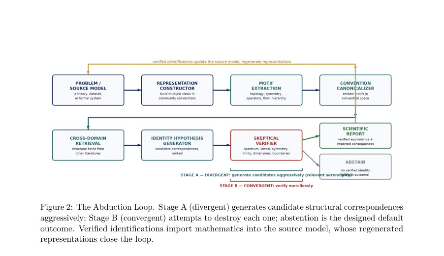

# Abduction Without a Body? Representational Grounding and the Abduction Loop for Scientific Hypothesis Generation

- **arXiv:** [2608.02505v1](http://arxiv.org/abs/2608.02505v1) · [PDF](https://arxiv.org/pdf/2608.02505v1)
- **저자:** Michael Farmer
- **분야:** cs.AI, cs.CV, cs.IR
- **선정 점수:** 10.29
- **선정 이유:** 최근성 0.7, 핵심어: agent, 핵심어: inference, 핵심어: multimodal, 핵심어: benchmark

### 한 문장 요약

몸을 이용한 온라인 구현 없이도 representational grounding과 Abduction Loop를 통해 서로 다른 학문 간의 도식이 동일한 객체임을 추론하고 검증할 수 있음을 주장하며, 이를 위한 DAB-30 벤치마크와 구조-기반 검색 아키텍처를 제시한다.

### 해결하려는 문제

Embodiment Necessity Thesis(ENT) 하에서 모든 과학적 귀추가 지속적 온라인 몸-세계 커플링 없이도 가능하다고 보는지에 대한 근본적 질문에 대해, identity abduction이라는 특정 귀추 유형에서 representational grounding이 충분한지 입증하고자 한다. 핵심은 두 독립적으로 개발된 구조가 명시적 대응 맵핑 아래 같은 객체임을 제안하고 검증하는 방식이며, 이를 위해 그림-기반 표현과 convention-space를 활용한 cross-domain retrieval 및 검증 루프의 필요성과 가능성을 제시하는 것이다.

### 핵심 기여

- (1) Embodiment Necessity Thesis에 대한 철학적 반박과 embodiment가 필요조건이 아님을 분명히 제시
- (2) Representational grounding의 정의 및 inferential affordances와 invariant-accessibility 조건 제시
- (3) convention space 개념 및 Independently evolved 그래픽 관례를 통한 cross-domain 검색의 새로운 인덱싱 관점 제시
- (4) Abduction Loop 아키텍처의 구체적 구성(표상 생성 → 모티프 추출 → convention-space 매칭 → 정체성 가설 생성 → 대적 검증 → abstention) 및 DAB-30 평가 프로그램 제시
- (5) Diagram Abduction Benchmark(DAB-30) 설계 및 평가 프로토콜의 초안 제시

### 접근 방법

핵심 아이디어는 표상 간의 변환을 통해 구조적 불변성을 노출시키는 representational grounding을 토대로 귀추를 생성하고 검증하는 Abduction Loop를 구현하는 것이다. 구체적으로는(1) Representation construction: source 모델의 다중 관점(renderings)을 구축하고(2) Motif extraction: 각 뷰를 모티프로 분해하여 위상, 대칭성, 계층, 흐름 방향 등의 구조 정보를 추출하고(3) Convention-space canonicalization and cross-domain retrieval: 모티프를 convention space에 매핑하여 서로 다른 분야의 문헌에서 구조적으로 일치하는 쌍을 찾고(4) Identity-hypothesis generation: 각 쌍에 대해 명시적 대응딕셔너리를 포함한 후보 매핑을 도출하고(5) Adversarial verification: 스펙트럼, 커널, 대칭 클래스, 연산 순서, 경계조건 등 computable invariants으로 후보를 의도적으로 파괴하려 시도하여 검증 가능성을 평가하며(6) abstention을 기본값으로 두어 검증되지 않는 경우에는 침묵하도록 설계한다. 또한 Stage A(전시적 발견)와 Stage B(반증 중심 검증)라는 두 설계 원칙을 제시하고, 모티프 레벨 M1–M4 구분 및 5단계 L1–L5의 등급 체계로 증거의 깊이와 신뢰도를 계량화한다. DAB-30 벤치마크는 30개의 대상 그림에 대해 전체 루프를 블라인드 조건에서 실행해 정합성 있는 cross-domain 귀추를 평가하도록 구성된다.

### 주요 결과

- Motivating Case: 2026년 7월 10일, Claude Fable 5가 주어진 CMT-4D 수식-그래프 그림에서 시각적 모티프를 분해하고, 서로 다른 문헌에서의 그림 관례를 회복한 뒤 memory complex와 spherical Kaiser–Squires mass-mapping complex 간의 동일성(정합성)을 제시하는 identity hypothesis를 생성했다. 중앙 객체들의 스펙트럼, 커널, 정상화 관계가 일치함을 수식적으로 명시했고, 역치(검정)에서의 수치적 일치도 확인되었다. 구체적으로 H*, H의 제곱이 1/2 ∆(∆+2)로 매핑되며, ℓ≥2 영역에서 Kaiser–Squires 역이를 통해 memory source를 재구성하고, ℓ≤1 모드가 커널에 의해 제약되는 것을 확인했다. 상대 오차는 1.2×10−16 수준으로 보고되었다.
- 벤치마크 설계 및 평가 계획: Diagram Abduction Benchmark(DAB-30)은 cross-domain 구조 귀추를 평가하기 위한 30개 인스턴스로 구성되며, seeded-positives, adversarial decoys, open-world 케이스를 포함한다. 전체 루프를 블라인드 조건에서 실행하고, 후보의 구조-불변성 보존 여부, computable invariant 존재 여부, 재현 가능성 등을 독립적으로 검증하도록 설계되어 있다. 8장에는 평가 차원으로 구조 이해, 표현 추상화, cross-domain 가설 생성, 대적 검증, 절제된 abstention 및 재현성 등의 다섯 축이 제시되어 있다.
- 상대적 한계와 검증 수단: 주요 수행 사례가 단일 사례에 의존하며, 벤치마크가 아직 실행되기 전이며, 프로토콜의 구체적 실행은 Paper 2 및 부록에서 다루기로 제시된다. 이로 인해 현재 데이터세트 기반의 일반화 성능 수치나 광범위한 재현성 검증은 제시되지 않았다.

### 한계

- 동기 사례는 단일 연구 맥락에 의존하며 전향적 대조 실험이 제한적이다(추적 가능성에 의문이 있음).
- 벤치마크(DAB-30)는 아직 실행되지 않았고, Paper 2의 구체적 실행 프로토콜 및 transcripts 공개가 필요하다.
- 모듈화된 다이어그램-기반 구현이 제안되었으나, 전체 아키텍처의 일반화 능력은 실험적으로 입증되지 않았다.
- 의도적으로 제시된 normalizations은 관례-의존적이므로 재현 시 다른 convention에서 상이한 상수들이 도출될 수 있다.

### 개발자 관점

- 구현 시 모듈화를 강조하되 Representation construction, Motif extraction, Convention-space retrieval, Identity-hypothesis generation, Adversarial verification의 각 컴포넌트를 독립적으로 검증 가능하도록 설계할 것.
- 대조(decoy) 및 abstention 메커니즘을 필수로 포함하여 false-positive를 억제하고, verification 로그의 재현 가능성을 확보할 것.
- DAB-30 벤치마크의 blinded 실행 및 independent verification의 원칙은 재현성과 신뢰성 향상의 핵심으로 유지할 것.
- 구현 시 convention-space를 학습 기반 인덱싱 혹은 기하-그래프 기반의 유사도 측정으로 구현하되, 구조-불변성 보존 여부를 우선적으로 판단하는 이중 기준을 적용할 것.
- 투명한 버전 관리 및 transcript-중립적 검증 체계를 구축해 독립 검증이 가능하도록 하되, Paper 2와 보조 자료에서의 구체적 프로토콜에 의존하지 않도록 API/스키마를 명확히 정의할 것.

## 주요 Figure

> 원문 PDF에서 실제 Figure 캡션과 그림 영역이 함께 확인된 자료만 자동 추출했다.

*Figure · 원문 PDF 7쪽 · Figure 1: Convention space.*

*Figure · 원문 PDF 10쪽 · Figure 2: The Abduction Loop. Stage A (divergent) generates candidate structural correspondences*

*Figure · 원문 PDF 13쪽 · Figure 3: DAB-30 structure. Each instance, from any of the three classes, is processed by the full*

<!-- paper-visuals:end -->

**근거 범위:** 논문 PDF 본문 기반 분석. 주어진 PDF 본문(페이지 1–20)에 근거하여 요약 및 정리했으며, Appendix B 및 Paper 2에 수록될 실험 프로토콜과 세부 수치·재현 절차는 본문에 한정되어 완전하게 확인하기 어렵다. motivating case의 수치적 확인은 본문에 제시된 상대 오차 1.2×10−16 등 일부 수치를 포함하였으며, 전체 벤치마크의 실행 결과는 아직 공개되지 않았다.

---

- **소개 날짜:** 2026-08-05
- [← 2026-08-05 논문 목록으로 돌아가기](../daily/2026-08-05.md)
- [일별 아카이브 보기](../daily/index.md)

