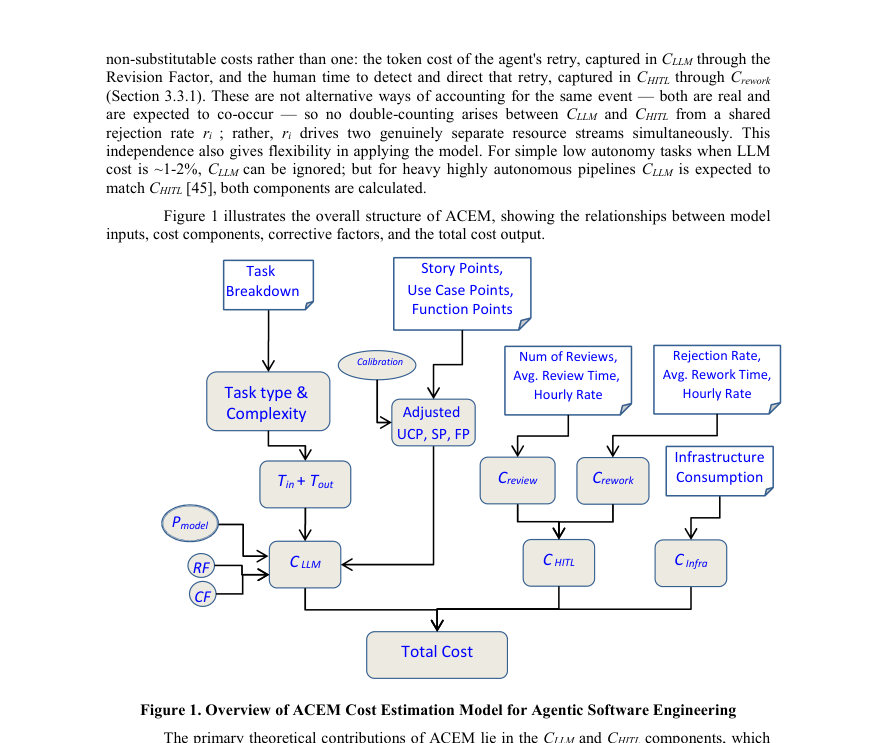
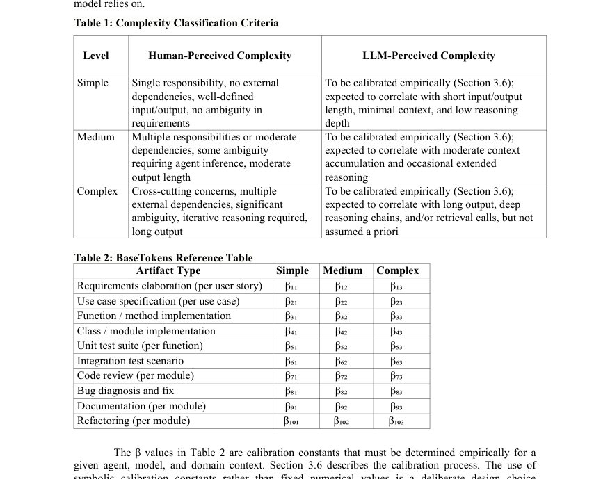
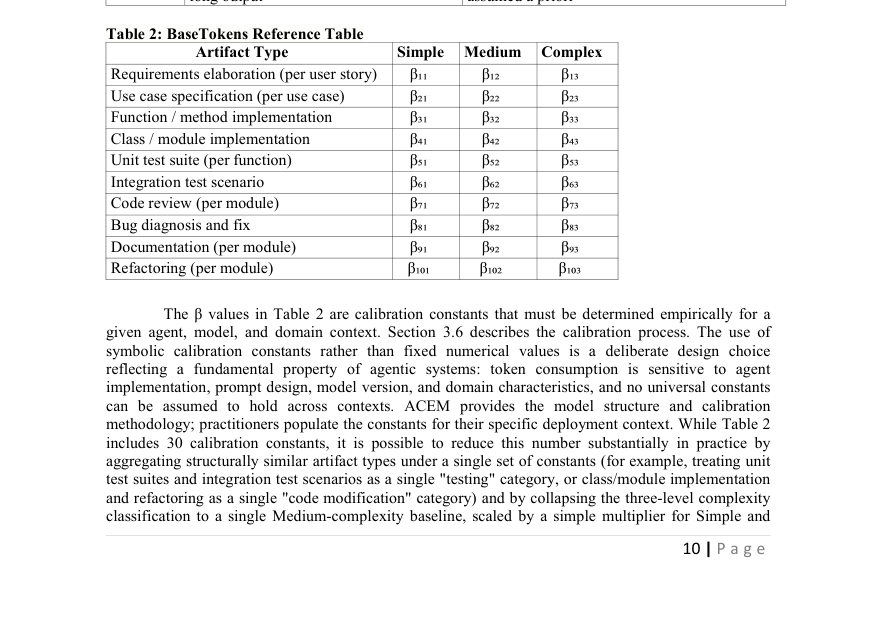

# ACEM: A Cost Estimation Model for Agentic Software Engineering

- **arXiv:** [2608.02582v1](http://arxiv.org/abs/2608.02582v1) · [PDF](https://arxiv.org/pdf/2608.02582v1)
- **저자:** Mohammad El-Ramly
- **분야:** cs.SE
- **선정 점수:** 11.90
- **선정 이유:** 최근성 0.7, 핵심어: large language model, 핵심어: llm, 핵심어: agent, 핵심어: reasoning

<!-- paper-visuals:start -->
## 주요 그림·그래프·표

> 원문 PDF에서 자동 추출한 자료다. 정확한 해석은 원문 캡션과 본문을 함께 확인해야 한다.

*그림·그래프 · 원문 PDF 8쪽 · Figure 1. Overview of ACEM Cost Estimation Model for Agentic Software Engineering*

*표 · 원문 PDF 10쪽 · Table 1: Complexity Classification Criteria*

*표 · 원문 PDF 10쪽 · Table 2: BaseTokens Reference Table*

<!-- paper-visuals:end -->

### 한 문장 요약

ACEM은 에이전트가 실질적인 구현을 수행하는 '에이전트형 소프트웨어 공학'에서 발생하는 LLM 토큰 비용, 인간감독(HITL) 비용, 인프라 비용을 합산해 예측하는 초기 제안형 비용추정 모델이다.

### 해결하려는 문제

기존의 소프트웨어 비용추정 모델(COCOMO II, Function Points, Story Points 등)은 개발 노력을 주로 인간의 설계·코딩·테스트 노동에서 발생한다고 가정하나, 자율 에이전트가 구현을 담당하는 환경에서는 이 가정이 깨지고 토큰 소비, HITL 감독, 에이전트 오케스트레이션 인프라 등 새로운 비용 차원이 등장한다.

### 핵심 기여

- 에이전트형 개발 비용을 LLM(토큰) 비용, HITL(감독) 비용, 인프라 비용의 세 가지 가산 차원으로 분해하는 ACEM(Agentic Cost Estimation Model)을 제안한다.
- 에이전트 동적 특성을 설명하는 세 가지 구성요소를 제시한다: Revision Factor(RF, 출력 거부·재시도에 따른 토큰 오버헤드), Context Factor(CF, 누적 컨텍스트에 따른 토큰 증가), HITL Intensity Score(HIS, 4단계 감독 강도 분류).
- Use Case Points, Story Points, Function Points 등의 기존 사이징 지표를 토큰 소비량으로 매핑하는 방법을 제안하여 조직이 기존 프로젝트 스코핑 데이터를 재사용할 수 있게 한다.
- 완전한 모델 구조와 보정(calibration) 방법론을 제시하되, 실증적 근거가 확보될 때까지 몇몇 상수는 기호(symbolic)로 남겨둔다.

### 접근 방법

초록에 따르면 ACEM은 전체 에이전트형 개발비용을 LLM 토큰 비용, HITL 감독 비용, 인프라 비용의 합으로 모델링한다. 에이전트 동작에서 발생하는 비용 변동을 설명하기 위해 RF(재시도·거부로 인한 토큰 오버헤드), CF(문맥 누적으로 증가하는 토큰 사용), HIS(감독 강도를 4단계로 정량화)를 도입하고, 기존의 사이징 메트릭을 토큰 소비 추정으로 매핑하는 절차와 보정 방법론을 제시한다. 구체적 수식, 보정 절차의 세부 파라미터 및 경험적 값들은 초록만으로는 확인하기 어렵다.

### 주요 결과

- ACEM이라는 구조화된 개념 모델과 이를 구성하는 주요 요소(RF, CF, HIS)를 제시했다.
- 기존 사이징 지표를 토큰 소비로 변환하는 매핑 아이디어를 제공해 조직이 기존 스코핑 데이터를 활용할 수 있도록 했다.
- 모델의 상수와 보정 절차는 '기호적'으로 남아 있어 아직 실증적 값이나 사례 기반 검증은 제공되지 않았다.
- 저자는 이 모델을 초안으로 제시하고 연구 커뮤니티에 실험 및 보정을 통한 확장과 검증을 요청하고 있다.

### 한계

- 초록에 따르면 ACEM은 개념적·초기 제안 단계로, 모델 내 상수들이 실증적으로 보정되지 않은 상태이다.
- 초록만으로는 구체적인 수식, 보정 방법의 단계별 절차, 예제 적용 사례나 실험 결과를 확인하기 어렵다.
- 에이전트 비결정성(토큰 변동, 추론 경로 차이, 인간 수정량 변동)에 대한 정량적 분산·불확실성 모델링 세부사항은 초록만으로 확인하기 어렵다.
- 제안된 매핑(Use Case/Story/Function Points → 토큰 소비)의 정확도·범용성·도메인별 차이에 대한 검증이 아직 없다.

### 개발자 관점

- 에이전트형 개발 예산을 잡을 때 LLM 토큰 비용, HITL 감독 시간·노동비, 에이전트 오케스트레이션 및 도구 인프라 비용을 별도 항목으로 고려해야 한다.
- 프로젝트 추정 시 토큰 사용량 변동을 설명하는 지표(예: Revision Factor, Context Factor)를 측정·로그하도록 에이전트와 파이프라인을 계측해야 한다(토큰 소비, 재시도 횟수, 누적 컨텍스트 길이 등).
- HITL Intensity Score와 유사한 감독 등급을 정의하고 각 등급에 대응하는 평균 감독 시간·검수율을 조직별로 수집하여 보정값을 만들라.
- 기존의 스코핑 데이터(Use Case Points, Story Points, Function Points)를 토큰 소비로 매핑하려면 초기 파일럿 프로젝트를 통해 매핑 계수를 추정·검증해야 한다.
- 비용 추정에 불확실성을 반영하기 위해 분산·시나리오 기반(낙관/중간/비관) 예측과 예비비(버퍼)를 포함시켜 리스크를 관리하라; ACEM은 비결정성을 명시하지만 초록만으로 분산모델 세부화는 불가능하다는 점에 유의하라.

**근거 범위:** 이 분석은 제공된 제목과 초록만을 근거로 작성되었으며, 초록에 명시되지 않은 구체적 수식, 보정값, 실증 결과, 구현 세부사항은 포함하지 않았다. 초록만으로 확인하기 어려운 내용은 본문에 명시한 대로 별도로 표시했다.

---

- **소개 날짜:** 2026-08-05
- [← 2026-08-05 논문 목록으로 돌아가기](../daily/2026-08-05.md)
- [일별 아카이브 보기](../daily/index.md)

