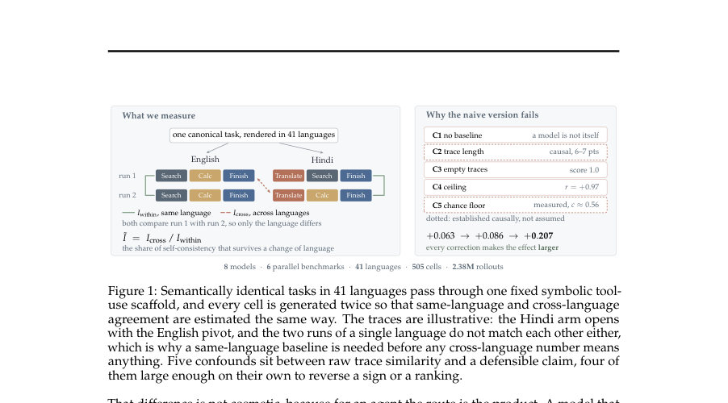
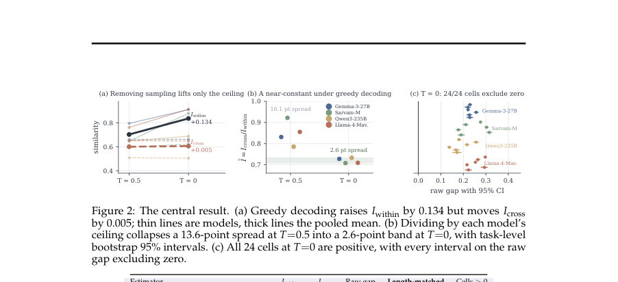
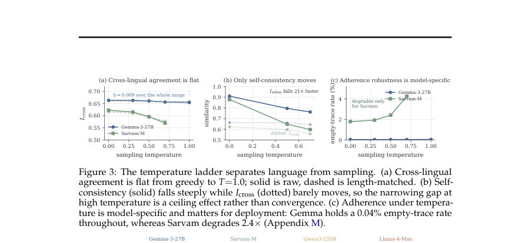

# Actions Speak Louder than Words: Measuring Cross-Lingual Policy Retention in Tool-Using Agents

- **게시일:** 2026-08-13
- **arXiv:** [2608.11110v1](http://arxiv.org/abs/2608.11110v1) · [PDF](https://arxiv.org/pdf/2608.11110v1)
- **저자:** Sourabrata Mukherjee, Kalika Bali, Sunayana Sitaram
- **분야:** cs.CL
- **선정 점수:** 4.26
- **선정 이유:** 최근성 0.8, 인용 영향 0.0 (인용 0회), 저자 영향 0.0 (최고 h-index 0), AI 주제 적합성 2.2, 개발자 관심 0.6, 학술 신호 0.8, 오픈 웨이트·주요 연구조직 신호 0.0

[← 2026-08-13 목록으로 돌아가기](../daily/2026-08-13.html)

<!-- paper-visuals:start -->
## 주요 Figure

> 원문 PDF에서 실제 Figure 캡션과 그림 영역이 함께 확인된 자료만 자동 추출했다.

*Figure · 원문 PDF 2쪽 · Figure 1: Semantically identical tasks in 41 languages pass through one fixed symbolic tool-*

*Figure · 원문 PDF 4쪽 · Figure 2: The central result. (a) Greedy decoding raises Iwithin by 0.134 but moves Icross*

*Figure · 원문 PDF 5쪽 · Figure 3: The temperature ladder separates language from sampling. (a) Cross-lingual*

<!-- paper-visuals:end -->

## 한 문장 요약

다국어로 동일한 작업을 줬을 때 도구를 호출하는 에이전트가 같은 행동정책(action trace)을 유지하는지를, 원시 트레이스의 다섯 가지 교란요인을 통제한 정규화된 추정치로 대규모(2.38M 롤아웃) 측정해 '정책 보존(policy retention)'의 경계와 원인을 규명했다.

## 해결하려는 문제

기존 다국어/에이전트 평가들은 최종 정답만 비교하고 중간의 행동(도구 호출 시퀀스)을 버린다. 그러나 에이전트의 실제 산출물은 행동 경로로서 비용·지연·실패 모드·감사 가능성에 직접 영향을 준다. 동일한 작업을 다른 언어로 줬을 때 행동정책이 달라지는지를 측정하려면 (1) 모델 자체의 비재현성, (2) 트레이스 길이, (3) 비파싱(빈 트레이스), (4) 모델 재현성(천장), (5) 우연히 일치하는 바닥값 등 다섯 가지 교란을 제거한 신뢰 가능한 추정치가 필요하다.

## 핵심 기여

- 행동 트레이스(공통 심볼 도구 알파벳)를 측정대상으로 삼고 8개 모델·6개 병렬 벤치마크·41개 언어·505셀·2.38M 롤아웃으로 대규모 실험을 수행함.
- 원시 트레이스 유사도와 정책 보존 주장 사이에 끼어있는 다섯 가지 교란(C1–C5)을 정의·측정하고, 이들을 제거·보정하는 측정 프로토콜(길이 매칭·빈 트레이스 제외·동일-언어 기준 등)을 제시함 (추정치 ˜I = Icross / Iwithin).
- 교란을 제거한 뒤 얻은 핵심 발견: 그리디 디코딩(T=0) 하에서 서로 다른 전선(frontier) 모델 4종이 각자 자기 재현성의 약 71–73%의 행동정책을 언어 변경 시 유지하며(모델 정체성은 분산의 5.7%만 설명), 이 규칙성은 샘플링(온도)을 바꿔도 유지됨을 보임.
- 경계 규명: 약 10B 매개변수 이하에서는 규칙성이 깨지고, 작은 모델들 사이의 순위는 우연한 바닥값(chance floor)에 의해 왜곡될 수 있음을 보였음(바닥값을 실제로 측정하여 보정함).
- 원인 규명·개입 실험: 에이전트들이 비영어 입력을 내부적으로 영어로 피벗(Translate 도구 사용, 사고 텍스트 ≈99% ASCII)하며 이 피벗이 인과적으로 로드-베어링임을 제거·강제 실험으로(제거/의무화, 사전등록된 예측 포함) 입증함. 또한 단일 추출 정규표현식이 GPT-OSS-120B의 다국어 실패를 인위적으로 만들었음을 보이고, 예시(exemplar)로 부착하면 파싱 가능성(가독성)이 복구되어 측정된 정확도가 크게 상승함(능력 자체는 거의 변함 없음)을 보임.

## 접근 방법

* 공통의 ReAct 스타일 스캐폴드(Thought:/Action: ToolName(args) … Finish)와 다섯-도구(Search, Calc, Translate, Summarize, Finish) 심볼 알파벳을 고정하고 각 (모델,벤치,언어) 셀을 동일한 조건으로 두 번(다른 시드) 실행해 같은-언어 동결(Iwithin)과 교차-언어 비교(Icross)를 교차-시드(pairing)로 계산했다.
* 핵심 추정량은 ˜I = Icross / Iwithin으로, 모델 자체의 재현성(천장)을 분모로 정규화한다.
* 모든 비교는 양방향 길이-매칭을 적용하고 빈 트레이스 쌍은 제외하며, 바닥 우연치(c)는 각 셀 내에서 task→trace 할당을 섞어(permutation) 직접 추정해 보정했다.
* 디코딩 온도(0,0.3,0.5,0.7,1.0), 그리디( T=0) 및 샘플링 조건, 도구 알파벳 개입(Translate 제거·의무화), 사고 언어 지시, 투표(voting) 등 여러 개입을 설계·실행했다.
* 도구 호출은 파싱·비교만 하고 실제 실행은 하지 않아 '유도된 도구 사용 정책'을 측정했다.

## 주요 결과

- 데이터 규모: 8개 모델, 6개 병렬 벤치마크(FLORES-200, XQuAD, XNLI, Belebele, XCOPA, synthetic), 41개 언어, 505셀, 총 2,382,875 롤아웃.
- 다섯 교란을 하나씩 제거하면 원시 격차(raw gap)는 오히려 커졌음(예: 매칭된 복제와 T=0에서 길이-매칭된 보정 후 pooled raw gap = +0.2074; Table 1). 모든 24개의 '프로토콜 준수' 셀에서 그리디(T=0) 하의 길이-매칭 원시 갭은 양수였고 각 부트스트랩 신뢰구간이 0을 제외함(Figure 2c).
- 중심 결과: 그리디 디코딩에서 4개 서로 다른 frontier 모델(Gemma-3-27B, Sarvam-M, Qwen3-235B, Llama-4-Maverick)은 각각 자신의 재현성 대비 ˜I = 0.71–0.73 범위에 수렴(모델 정체성은 전체 분산의 5.7%만 설명), 셀 수준 SD = 0.052(풀된 band 폭 2.6 포인트). (Table 2, Table 3, Figure 2b)
- 샘플링 온도 영향: Icross(교차-언어 일치)는 온도 변화에 거의 영향받지 않고(flat), 반면 Iwithin(동일-언어 재현성)은 온도 상승에 따라 급격히 떨어짐. 따라서 샘플링은 격차를 숨겼을 뿐 발생 원인은 언어 매핑에 구조적으로 있음(Figures 3a,b).
- 바닥 우연치: 평균 chance floor c ≈ 0.561 (T=0)로 매우 높고 벤치마크·모델별로 넓게 변함(셀 범위 0.266–0.753). 이 보정을 적용하면 '추가 보정된' 보존률은 15–18% 수준으로(원래 71–73%에서 축소) 해석될 수 있음(Appendix Q). 즉, 동일-언어에서 우연 초과로 얻는 일치도의 약 1/6만이 언어 변경을 견딤. (본문: "chance-corrected retention is 15–18% rather than 71–73%") . 
    ] ,
    "results": [
    "도구 피벗(English pivot): Translate가 적응형 벤치마크에서 가장 많이 쓰이는 도구였고(모델별 차이 큼; 예: Qwen3 Translate 호출 비중 50.5% vs Sarvam 18.0%), 사고 텍스트는 Devanagari/Tamil/Odia 입력에서도 ≈99% ASCII로 나타나 에이전트가 내부적으로 영어로 피벗함을 보임.",
    "피벗 개입: Translate 제거는 원시 수치로는 유리하게 보이지만(짧아진 트레이스가 더 높은 유사도 획득) 길이-매칭하면 Translate 제거는 모델이 얼마나 Translate에 의존했는지에 비례해 교차-언어 일치를 낮춤(제거는 대체 동작을 유도함; 예: Qwen3는 Summarize로, Gemma는 Search/Calc로 재배치). Translate 의무화는 사전등록(predicted by head-room)된 순서를 확인했고, 의무화의 준수율은 대부분 모델에서 98.7–99.6%였으나 Sarvam은 81.4%로 낮았음(Table 4, Figure 6).",
    "파싱/가독성 문제: GPT-OSS-120B는 원시에서 76.4%의 롤아웃에서 파싱 불가(빈 트레이스)로 보였으나 이는 단일 추출 정규표현식(regex) 문제였음. 2개의 작업 예시를 추가하자 측정된 정확도가 26배 상승했지만, 사람이 읽을 수 있는 출력의 정확도는 거의 변하지 않아 개선은 '가독성' 회복이지 모델 능력 향상이 아님(Figure 7). 연구진은 파싱 실패율이 ~20% 초과인 모델은 랭킹에서 제외할 것을 권고함(예: Aya-Expanse-8B은 31.2% 빈 트레이스).",
    "투표(voting): 다중 복제에 대한 다수결 투표는 분산을 줄여 Iwithin을 Icross보다 더 많이 증대시켰기 때문에(예: k=5에서 ˜I는 약 −0.016∼−0.019 감소) 보존 개선이 아니라 단순 분산 감소로 작용함(측정은 T=0.7에서 수행되어 그리디 결과와 직접 비교 불가).",
    "트레이스 길이 영향(인과): 3단계 길이 조작(같은 seed·예산 유지)으로 평균 트레이스 길이를 약 3배로 바꾸자 ˜I가 6–7 포인트 이동하여(불연속 구간) 길이가 보존에 1차적인 영향 요인임을 보였음. 다만 두 모델에서 방향성은 일치하지 않아(모델별 차이) 일반적 부호는 추가 검증 필요함(본문 §5, Figure 5c)."
  ],
  "limitations": [
    "저자가 명시한 한계: (1) 측정은 호출된 도구를 실제로 실행하지 않고 파싱·비교만 하는 '유도된 도구 사용 정책'을 대상으로 함. 도구 출력이 상태를 바꾸는 실제 환경에서 동일한 발산이 나타나는지는 미검증임. (본문 'Calls are parsed and compared but never dispatched').",
    "저자가 명시한 한계: (2) ‘프런티어 밴드’는 그리디 조건에서 4개 모델에 기반한 관찰(n=4)이며, 10B 미만 영역의 결론은 두 개의 작은 모델 관찰에 근거한 가설임. 따라서 일반화에는 추가 모델·벤더 검증이 필요함.",
    "저자가 명시한 한계: (3) 네 번째 공급업체(Aya-Expanse-8B)는 응답의 31.2%가 파싱 불가여서 '준수 실패'로 간주되어 보존 비교에서 제외됨—벤더 일반화가 열려 있음.",
    "저자가 명시한 한계: (4) '사고(Thought) 언어를 과제 언어로 하라'는 조작은 모델이 거부하여(<1% 수행) 해당 실험은 실패로 기록되었음. 따라서 내부 사고 언어가 보존에 미치는 효과는 미검증임.",
    "실험·측정 제약(본문에서 합리적으로 확인되는 한계): 사용한 유사도 지표 S는 단일 시퀀스-유사도 계열로, 다른 거리/집합 기반 측정(metric family)이 동일한 결론을 내릴지는 확인되지 않음. 또한 보정은 길이-빈도에 의존하여 일부 셀(매우 높은 바닥값 c)에서는 수치적으로 민감함(예: c ≈0.947 근처에서 보정 결과 큰 변동 가능)."
  ],
  "developer_takeaways": [
    "에이전트 평가 시 행동 트레이스(trace)를 반드시 수집·저장하라. 정답만으로는 비용·실패모드·감사 가능성 차이를 놓친다.",
    "교차-언어 정책 비교는 같은-언어 재현성(Iwithin)을 기준으로 정규화(˜I = Icross/Iwithin)하고, 길이-매칭 및 빈 트레이스 제외 등 교란 보정 절차를 적용해야 한다(그렇지 않으면 짧은 트레이스·빈 트레이스·우연적 일치가 결과를 왜곡함).",
    "파싱/추출기는 여러 패턴을 사용해 견고하게 설계하고 파싱 실패율(parse-failure rate)을 항상 공개하라. 단일 정규표현식에 의존하면 가독성 문제로 실제 능력을 심각히 저평가할 수 있음(예: GPT-OSS 사례).",
    "'Translate(→English) 피벗'은 모델 설계·추론 레벨에서 구조적일 수 있으므로, 다국어 에이전트의 정책·감사 규칙을 만들 때 내부 영어 피벗을 감안해 권한·비용·리스크를 설계하라. 소프트 프롬프트(사고 언어 지시)로는 피벗을 꺼지게 할 수 없음(거부율 >99%).",
    "투표(다중 복제)나 샘플링 기반 처리는 Iwithin(재현성)을 높여 보이는 개선을 만들 수 있으니, raw Icross를 높이는지 아니면 재현성 천장을 올리는지(=분산 축소인지)를 구분해 평가하라. ˜I 관점에서 투표는 보존 개선이 아니라 분산 감소일 뿐이다.",
    "실전 배포에서는 빈 트레이스 비율이 ≈20%를 넘는 모델은 랭킹에서 제외하거나 별도 취급하라(연구는 ~20% 임계권고를 제시).",
    "작은 모델(<≈10B)에서는 보존률과 모델 간 순위가 우연 바닥값에 의해 왜곡될 수 있으므로, 벤치마크·바닥 보정(permutation-based chance floor)을 함께 측정해야 함."
  ],
  

## 한계

- 저자가 명시한 한계: (1) 측정은 호출된 도구를 실제로 실행하지 않고 파싱·비교만 하는 '유도된 도구 사용 정책'을 대상으로 함. 도구 출력이 상태를 바꾸는 실제 환경에서 동일한 발산이 나타나는지는 미검증임.
- 저자가 명시한 한계: (2) 프런티어 밴드는 그리디 조건에서 4개 모델에 기반하며, 10B 미만 영역에 대한 결론은 두 개의 작은 모델 관찰에 근거한 가설임—추가 검증 필요.
- 저자가 명시한 한계: (3) 네 번째 공급업체(Aya-Expanse-8B)는 파싱 불가 비율이 높아(31.2%) 보존 비교에서 제외되어 벤더 일반화가 열려 있음.
- 저자가 명시한 한계: (4) 사고 언어 지시 조작은 모델이 거의 모두 거부하여(<1% 수행) 내부 사고 언어의 영향은 미검증으로 남음.

## 개발자 관점

- 행동 트레이스(trace)를 평가 파이프라인의 1차 데이터로 남기고 저장하라. 정답 수준의 평가는 비용·실패모드·감사성을 놓친다.
- 교차-언어 정책 비교 시 같은-언어 재현성으로 정규화(˜I = Icross/Iwithin)하고 길이-매칭·빈 트레이스 제외·바닥 보정을 반드시 적용하라.
- 파싱기는 다중 패턴(여러 regex 혹은 구조적 파서)을 사용해 견고하게 만들고 파싱 실패율을 공개하라. 단일 패턴 의존은 다국어 측정 오류를 유발한다.
- 모델이 비영어 입력을 영어로 피벗하는 경우가 흔하므로(Translate 사용·사고 텍스트 ASCII화) 다국어 배포시 내부 피벗으로 인한 비용·보안·감사 영향을 설계 단계에서 고려하라.
- 투표나 샘플링으로 raw 일치도가 높아졌더라도 그것이 보존 개선인지 재현성 천장 상승인지 구분해서 해석해야 한다. 실무적 목표에 따라 적절한 지표를 선택하라.

**근거 범위:** 이 분석은 제공된 논문 PDF 본문(본문·표·그림·부록 인용 문구 포함)을 기반으로 작성되었다. 본문과 부록에서 수치와 실험설계(예: 2.38M 롤아웃, 505셀, 8모델, 6벤치, 41언어, 핵심 표/그림/절 내용)를 직접 추출해 사용했다. 부록의 세부 구현(예: 완전한 추정기 수식·일부 세부 표)은 본 텍스트에서 인용된 부분에 근거했으며, PDF에 있는 모든 부록 행렬·코드·데이터 파일 자체는 이 요약에서 직접 재검증하지 못했음을 밝힌다.
