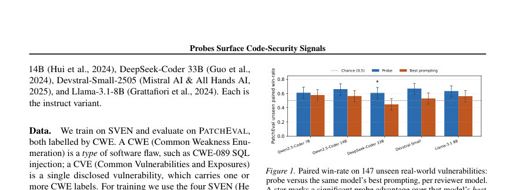

# Activation Probes Surface Code-Security Signals that the Model's Output Misses

- **게시일:** 2026-08-11
- **arXiv:** [2608.09643v1](http://arxiv.org/abs/2608.09643v1) · [PDF](https://arxiv.org/pdf/2608.09643v1)
- **저자:** Ivan Wiryadi
- **분야:** cs.CR, cs.LG
- **선정 점수:** 5.72
- **선정 이유:** 최근성 1.2, 인용 영향 0.0 (인용 0회), 저자 영향 0.0 (최고 h-index 0), AI 주제 적합성 2.1, 개발자 관심 0.5, 학술 신호 0.3, 오픈 웨이트·주요 연구조직 신호 1.6

[← 2026-08-11 목록으로 돌아가기](../daily/2026-08-11.html)

<!-- paper-visuals:start -->
## 주요 Figure

> 원문 PDF에서 실제 Figure 캡션과 그림 영역이 함께 확인된 자료만 자동 추출했다.

*Figure · 원문 PDF 2쪽 · Figure 1. Paired win-rate on 147 unseen real-world vulnerabilities:*

<!-- paper-visuals:end -->

## 한 문장 요약

오픈웨이트 코드 LLM의 내부 잔차(residual-stream) 활성값에 단일 선형 프로브를 학습시켜, 동일 모델에 같은 질문을 던져 얻는 출력(문자열/로그릿)보다 취약성 신호를 더 잘 복구하는지 실세계 취약점 데이터로 평가했다.

## 해결하려는 문제

AI가 생성하는 코드 비중이 늘어나 인간 보안검토가 확장하지 못하는 상황에서(또한 널리 쓰이는 코딩 에이전트는 폐쇄중량이라 내부 상태를 읽을 수 없음) 다음 질문을 다룬다: 오픈웨이트 '검토자' 모델의 출력(문장형 YES/NO 또는 체인오브쏘트)을 그대로 묻는 방식이 놓치는 보안 신호를, 그 모델의 활성화에서 읽어낼 수 있는가? 기존 대안(정적 분석기의 높은 오탐률, LLM 프롬프트의 비강건성)은 취약점 탐지에 한계를 보이며 본문은 활성화 기반 프로빙이 이러한 한계를 보완하는지를 실험적으로 묻는다.

## 핵심 기여

- 잔차 스트림(residual stream) 활성에서 단일 선형 로지스틱 프로브를 학습해 코드 취약성 신호를 캡처하는 방법을 제안하고 구현했다.
- SVEN-Python(학습: 4개 CWE — CWE-022, 078, 079, 089)로 학습한 프로브를 패치된 실제 공개 CVE(PATCHEVAL)의 '학습에 없는 취약유형'에 제로샷으로 적용해 일반화 성능을 평가했다.
- 같은 모델의 프롬프트 기반 판정(무샷/퓨샷/CoT)과 두 가지 읽기(로그릿 확률, 토큰 출력)를 비교하여, 활성화 프로브가 모델 출력이 놓치는 신호를 포착함을 실증적으로 보였다.
- 다섯 개 서로 다른 오픈웨이트 코드 LLM(4개 아키텍처 계열)에 걸쳐 결과가 일관되게 나타남을 보고했다(아키텍처·모델 범용성 증거).
- 출력(문장형 답변)은 취약함과 패치된 함수에 대해 같은 단어를 쓰는 경우가 매우 많아(결과적으로 순위화 불가) 내부 확률 및 활성화가 더 풍부한 신호를 포함함을 정량적으로 분석했다.

## 접근 방법

* 검토자(reviewer) 모델로 Qwen2.5-Coder 7B 및 14B, DeepSeek-Coder 33B, Devstral-Small-2505, Llama-3.1-8B(각각 instruct 변형)를 사용했다.
* 학습 데이터는 SVEN에서 파생한 SVEN-Python(취약한 함수와 패치된 함수가 쌍으로 주어짐)의 4개 CWE를 사용했고, 평가에는 PATCHEVAL의 234개 Python CVE(학습 CWE와 겹치지 않는 unseen 집합; 본문 헤드라인은 이 중 단일 함수 변경 CVE 147개)를 사용했다.
* 활성화 추출은 nnsight를 통해 layers[L].input_layernorm에서 잔차 스트림을 훅하여 수행했다.
* 프로브는 선형(로지스틱) 분류기로, 계층(layer), 토큰 풀링(mean, max, last, sliding-window-max(윈도우 16)), L2 정규화 강도 C ∈ {1e-2,1e-1,1}을 그리드 탐색하고 5-fold GroupKFold AUC(그룹은 프로젝트 단위)로 최적 구성 선택했다.
* 학습/평가 분할과 교차검증에서 프로젝트 단위 그룹화를 하여 코드 중복·유출을 방지했다.
* 평가 지표는 CVE별로 취약 전 함수에 대한 점수(ˆpvul)와 패치 후 함수 점수(ˆpfix)의 차이를 비교해 'paired win-rate'(ˆpvul−ˆpfix>0인 비율)를 사용했고, 윌슨 95% 신뢰구간과 0.5(무작위) 대비 유의성(정확한 이항 sign test)을 보고했다.
* 프롬프트 기반 비교에서는 동일 모델에 대해 무샷/퓨샷(학습에서 제외한 약한 예시들)·체인오브쏘트(CoT) 세 방식의 프롬프트를 적용하고, 읽기 방식은 (1) 로그릿에서 재정규화한 YES 대 NO 확률(답안 토큰의 확률) 연속점수와 (2) 모델이 출력한 문자열 'yes'/'no'를 사용했다.
* 프로브 대 프롬프트 비교는 같은 CVE 쌍에 대해 paired McNemar 테스트로 수행했으며, 동률은 프롬프트 측의 오답으로 처리되었다.

## 주요 결과

- 학습(인-분포) 성능(SVEN-Python, n=152): 프로브 AUC는 모델별로 0.771–0.846, 프로브 acc@0.5는 0.717–0.770 범위였다(모델별 수치 Table 1). 동일 모델의 YES/NO 프롬프트 정확도는 0.488–0.524로 프로브보다 훨씬 낮았다.
- PATCHEVAL의 학습에 없는 취약유형(single-function CVE n=147) 평가에서 프로브의 paired win-rate는 모델별로 61.2% (Qwen2.5-7B) ~ 66.9% (Devstral-Small), 전체 모델 범위는 61–67%였고 각 모델에서 윌슨 95% 구간이 0.5를 넘었으며(sign test p<0.05) (Table 2에 모델별 CI·p 명시).
- PATCHEVAL 전체 unseen 집합(단일·다중 함수 포함, n=234)에선 프로브의 paired win-rate가 모델별로 61.6%–69.4%로 보고되었다(본문·부록 A.1·A.2).
- 같은 모델의 프롬프트 비교(Table 3): 로그릿 읽기로는 프롬프트의 win-rate가 대체로 33–58% 범위로, 프로브(61–67%)보다 낮았다. 프로브는 무샷·퓨샷에 대해 여러 모델에서 유의하게 앞섰고(paired McNemar, p<0.05 표기), CoT(로그릿 읽기)와 비교한 우위는 모델에 따라 좁거나 유의하지 않을 수 있었다.
- 모델이 직접 쓰는 텍스트 판정(token readout)은 두 함수에 대해 같은 답을 쓰는 경우가 매우 많아(동일 답 비율 72–97%) 쌍을 순위화할 수 없었고(동률 처리), 실제로 문장형 판정이 정답(취약 함수에 YES, 패치 후에 NO로 다름)을 내는 비율은 전체에서 1–13%에 불과했다(부록 A.3).

## 한계

- 저자가 명시한 한계: 본 연구의 평가 지표는 쌍비교(paired win-rate)로 '같은 함수의 취약 전후를 얼마나 잘 순위화하는지'를 측정하며, 절대 임계값을 갖는 검출기(탐지기)로의 변환(보정·calibration)은 차후 작업으로 남아있다.
- 저자가 명시한 한계: 프로브가 동일 모델의 최선의 프롬프트(특히 CoT·로그릿 읽기)와의 우위는 항상 크지 않으며 일부 비교에서는 유의하지 않다.
- 저자가 명시한 한계: 학습 데이터는 SVEN의 4개 CWE(Python에서 커버리지가 충분한 것만 사용)로 제한되어 있고 데이터셋 규모가 작아 확장 필요성을 언급한다. 예비실험에서 C/C++가 지배적인 클래스는 우연수준(Chance) 성능을 보였는데, 그 원인이 언어 특성인지 샘플크기·취약유형 때문인지는 불명이다.
- 실험적 제약(본문에서 확인 가능한 제약): 프로브는 선형 로지스틱 형태와 몇 가지 풀링 전략만 사용했고(어텐션 기반 프로브 등은 미실험), 프로브 아키텍처 비교가 이루어지지 않았다(미실험 항목). 또한 본 연구는 '프로브를 코딩 에이전트의 포스트-라이트 훅에 연결해 실제 에이전트가 생성한 코드에서 평가'하는 엔드투엔드 검증을 수행하지 않았다.

## 개발자 관점

- 재현: 오픈웨이트 코드 LLM(예: Qwen2.5, DeepSeek, Devstral, Llama-3.1)에서 layers[L].input_layernorm의 잔차 스트림을 nnsight로 추출하고, 토큰 풀링 전략(mean/max/last/sliding-window-max(윈도우16))과 L2 정규화 강도를 그리드 탐색하여 5-fold GroupKFold(AUC 기준)로 최적의 레이어·풀링을 선택하면 된다(본문·부록 A.1에 모델별 선택값 표기).
- 구현·연산 비용: 모든 모델을 float16으로 HuggingFace Transformers에서 로드했고(단일 80GB H100 사용), 활성화 추출과 프로브 학습은 GPU 메모리·추론 비용이 필요하다(본 실험 구성 언급). 양자화는 적용하지 않아 정밀도 차이가 없도록 했다.
- 평가·읽기 방식 권고: 모델이 출력하는 문자열 판정(token)은 두 함수에 같은 답을 쓸 가능성이 매우 높아(동률 72–97%) 순위화에 부적합하므로, 로그릿 기반 연속 점수 또는 활성화 기반 연속 점수를 사용해 CVE 단위 paired ranking(위험 차)이 가능한지 평가해야 한다.
- 배포 시 유의점: 현재 프로브는 '순위화 신호'를 제공하므로(취약함 > 패치됨으로 랭크) 임계값 기반 자동 차단이나 완전한 판정기로 바로 쓰기엔 보정(calibration)과 더 큰·다양한 학습 데이터가 필요하다. 또한 언어·취약유형 범위를 확장해야 실제 운영에서의 신뢰성이 높아진다.
- 안전성·절차: 프로브가 잡아낸 신호는 모델 내부에 존재하는 취약성 관련 표현을 활용한 것이므로, 해석·오탐·미탐 리스크를 고려해 경고·트리아지용으로 먼저 도입하고(사람 리뷰 우선), 프로브의 오류 특성(특정 CWE·언어에서 성능 저하)을 모니터링해야 한다.

**근거 범위:** 이 분석은 제공된 논문 PDF 본문(제목, 본문, 표, 부록 포함)을 기반으로 작성되었다. 본문에 명시된 수치, 구성(모델 목록, 데이터셋, 레이어·풀링·하이퍼파라미터 탐색 범위), 통계검정 결과 및 표의 숫자를 직접 인용했다. 논문이 참조하는 세부 구현 코드, 훈련 스크립트, 프롬프트의 정확한 예시(몇-shot 예시의 선택 기준) 등은 PDF에 상세 코드로 포함되어 있지 않아 재현을 위해선 원저자 코드나 추가 자료가 필요할 수 있다.
