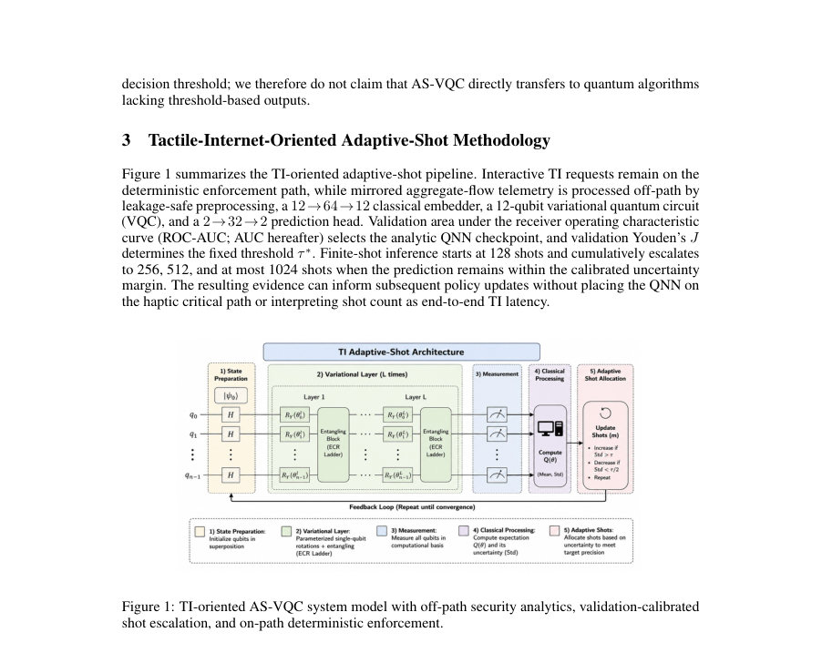
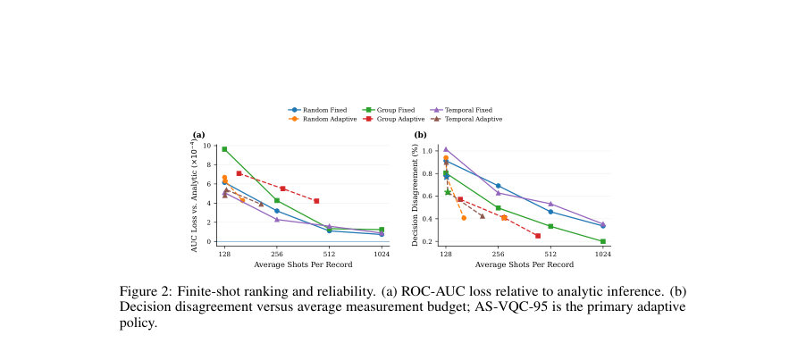
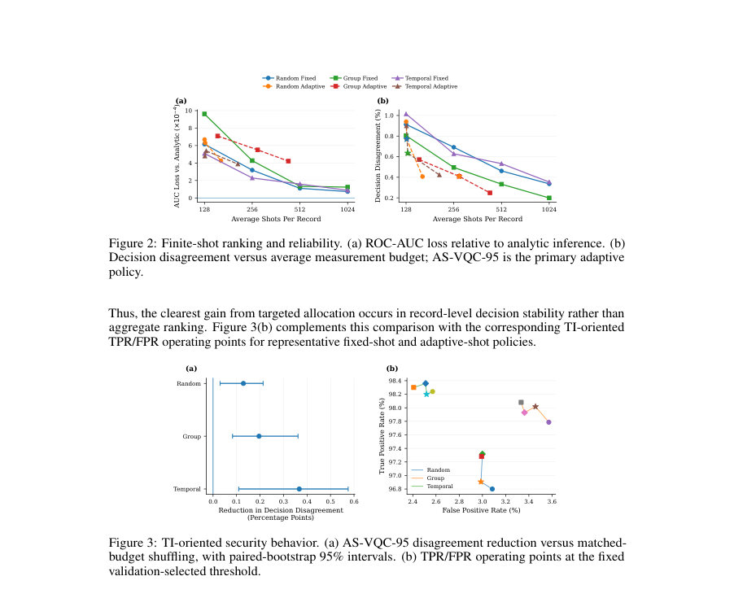

# Adaptive-Shot Hybrid Quantum Anomaly Detection for Tactile Internet Security: Reliability-Aware Measurement Allocation Under Resource Constraints

- **게시일:** 2026-10-06
- **arXiv:** [2610.05835v1](http://arxiv.org/abs/2610.05835v1) · [PDF](https://arxiv.org/pdf/2610.05835v1)
- **저자:** Mubassir Serneabat Sudipto, Shakil Ahmed, Ashfaq Khokhar, Samir M. Iqbal
- **분야:** cs.CR, cs.LG, cs.NI
- **선정 점수:** 5.50
- **선정 이유:** 최근성 0.9, 인용 영향 0.0 (인용 0회), 저자 영향 0.0 (최고 h-index 0), AI 주제 적합성 2.3, 개발자 관심 0.2, 학술 신호 0.8, 오픈 웨이트·주요 연구조직 신호 1.2

[← 2026-10-06 목록으로 돌아가기](../daily/2026-10-06.html)

<!-- paper-visuals:start -->
## 주요 Figure

> 원문 PDF에서 실제 Figure 캡션과 그림 영역이 함께 확인된 자료만 자동 추출했다.

*Figure · 원문 PDF 3쪽 · Figure 1: TI-oriented AS-VQC system model with off-path security analytics, validation-calibrated*

*Figure · 원문 PDF 7쪽 · Figure 2: Finite-shot ranking and reliability. (a) ROC-AUC loss relative to analytic inference. (b)*

*Figure · 원문 PDF 7쪽 · Figure 3: TI-oriented security behavior. (a) AS-VQC-95 disagreement reduction versus matched-*

<!-- paper-visuals:end -->

## 한 문장 요약

유한 샷(finite-shot) 환경에서 검증(validation)으로 보정한 계단식 누적 샷 할당(128→256→512→1024)을 사용하는 Adaptive-Shot VQC(AS-VQC)를 제안해, 경계(운영 임계값) 근처의 레코드에만 측정 자원을 집중시켜 기록별 의사결정 안정성을 보존하면서 전체 측정량을 크게 절감하는 것을 목표로 한다.

## 해결하려는 문제

하이브리드 양자–고전 분류기에서 관측값의 기댓값을 정확히 얻는 분석적(analytic) 시뮬레이션과 달리 실제(또는 시뮬레이션된) 유한 샷 측정은 확률적 샘플링 오차를 낳아 임계값 기반 보안 결정(thresholded decision)의 안정성을 저해할 수 있다. 반면 전체 레코드에 대해 일괄적으로 높은 샷 수를 쓰면 불필요한 측정 자원 낭비가 발생한다. 따라서 제한된 측정 자원 하에서 어느 레코드에 얼마나 많은 샷을 할당할지(신뢰성–자원 균형)를 설계·평가하는 문제가 존재한다. 논문은 검증 데이터에서 보정한 불확실성 마진을 사용해 레코드별로 누적 샷을 할당하는 정책이 자원 절감과 의사결정 안정성 사이에서 어떤 트레이드오프를 만드는지 규명한다.

## 핵심 기여

- 유한-샷 하이브리드 양자 이상 탐지 문제를 TI(촉각 인터넷) 보안 문맥의 신뢰성–자원 할당 문제로 공식화함.
- 검증 데이터로 보정된 누적(누적적) 샷 상승 규칙을 갖는 Adaptive-Shot Variational Quantum Circuit(AS-VQC) 정책을 제시함(128→256→512→1024, 단계별 β-분위수 보정).
- 랜덤/엔티티-그룹-분리(holdout)/시간적(temporal) 보유법과 4개의 고정-샷 기준선, 세 가지 보정 수준(β∈{0.90,0.95,0.99}), 그리고 동일-예산을 무작위로 재할당하는 매치-예산 제어(Budget-Shuffled-AS95)를 포함하는 포괄적 평가를 수행함.
- CESNET-TimeSeries24에서 유도한 4,875개 레코드 벤치마크와 12-큐빗 QNN 아키텍처(클래식 임베더 12→64→12, 12-qubit VQC, 헤드 2→32→2), 5개의 체크포인트(시드)·10회 측정 실험 반복을 사용해 AS-VQC의 측정 절감과 의사결정 불일치(disagreement)를 정량적으로 보고함.

## 접근 방법

* 데이터·레이블·홀드아웃: CESNET-TimeSeries24에서 4,875개 레코드를 샘플링해 12개 흐름 특징(feature)을 사용하고, 학습 집합의 0.85 점수 분위수를 기준으로 통계적 이상(pseudo-label) 이진 타깃을 구성했다.
* 홀드아웃은 Random(레코드 무작위), Group(엔티티 그룹 불일치), Temporal(시간순 분할)의 세 가지로 실험을 수행했다.
* 모델 아키텍처: 클래식 임베더 12→64→12 (GELU, π tanh 각도 바운딩) → 12-큐빗 VQC (각 큐빗에 Rot(ϕ,θ,ω) 3-파라미터 회전, 두 개 변형 레이어, 방향성 nearest-neighbor CNOT 체인 0→1→…→11) → Pauli-Z 읽출(qubits 0,1) → 헤드 2→32→2 (GELU).
* 총 학습가능 파라미터 1,846, 서킷에 12 encoding gates, 24 trainable rotations, 22 CNOTs.
* 학습·체크포인트·임계값: analytic(정확 기댓값) 시뮬레이션으로 학습(Adam lr=2e-3, weight decay=1e-4, batch=32, gradient clip=1.0, 20 epochs).
* 검증 ROC-AUC로 체크포인트 선택, 검증에서 Youden’s J를 최대화한 τ*를 운영 임계값으로 고정.
* AS-VQC 정책(추론 시): 각 테스트 레코드는 누적 샷 128에서 시작하고 단계 S∈{128,256,512}에 대해 검증에서 계산된 단계별 불확실성 마진 δ_{S,β}을 사용한다.
* δ_{S,β}는 검증 세트의 동일 S 샷에서의 절대 샘플링 오류 e_{i,S}^{(r)} = \|b p_{i,S}^{(r)} − p_i\|들의 경험적 β-분위수(Q_β)로 정의된다.
* 테스트에서 레코드의 현재 유한-샷 추정치 b p_{i,S}와 고정 임계 τ*의 거리 d_{i,S}=\|b p_{i,S}−τ*\|가 δ_{S,β}를 초과하면 정지하고, 아니면 다음 단계(추가 샷)를 누적한다.
* 마지막 단계까지 미해결이면 최대 1024샷까지 사용한다.
* 비교·통제: Fixed-{128,256,512,1024} 고정 샷 기준선, AS-VQC-{90,95,99} 보정 수준 비교, 그리고 AS-VQC-95와 동일한 최종 샷 분포·평균을 유지하되 레코드간 재배치한 Budget-Shuffled-AS95 제어를 둬 타기팅 효과를 분리했다.
* 측정 시뮬레이션: 분석적 기댓값은 CPU 기반 정확 시뮬레이션, 유한-샷 실험은 이상(noiseless) 다항 샘플링으로 수행하며, 회로의 인과성 분석을 통해 3-와이어(0–2)로 결합 분포를 정확 재구성해 효율적으로 다항표본을 생성했다.
* 집계·통계: 각 홀드아웃에 대해 5개의 독립 학습 체크포인트(시드)와 비-분석 정책당 10회의 측정 실험을 수행해 체크포인트 내 평균 후 시드 간 평균±표준편차로 보고하고, 시드 수준 차이에 대해 10,000 재표본(bootstrap)으로 쌍별 신뢰구간을 산출했다.

## 주요 결과

- 데이터셋/설정: 4,875 레코드(12개 특성), 세 가지 홀드아웃(Random, Group, Temporal), 각 홀드아웃당 5개 체크포인트(총 15개)와 1,200개의 유한-샷 정책 실험을 포함한 전체 결과 집계.
- AS-VQC-95(주요 정책) 평균 샷·절감·불일치(테이블1): Random: 평균 129.2 ±0.4 샷, Fixed-1024 대비 절감 87.39% , 결정 불일치 D = 0.0077 ±0.0012 (0.77%). Group: 평균 276.9 ±327.3 샷, 절감 72.96% , D = 0.0041 ±0.0010 (0.41%). Temporal: 평균 131.2 ±2.0 샷, 절감 87.19% , D = 0.0063 ±0.0010 (0.63%).
- AS-VQC-95는 분석적(analytic) 추정치 대비 ROC-AUC 손실이 매우 작아 평균 AUC가 분석적 기준과 6.4×10^{-4} 이내로 유사하나 Fixed-1024보다 의사결정(임계값 기준)에서는 여전히 약간 덜 안정적임(AS-VQC-95가 Fixed-1024보다 결정 불일치가 평균 +0.435, +0.210, +0.281 퍼센트포인트 더 높음).
- 타기팅의 효과: Budget-Shuffled-AS95(동일-평균샷이나 임의배정) 대비 AS-VQC-95는 결정 불일치를 각각 0.129, 0.196, 0.367 퍼센트포인트만큼 더 낮춰(대략 14–37% 상대 감소) 단순 예산 증가 외에 불확실성 기반 타기팅이 실효성이 있음을 보임.
- 보정 수준 민감도: 더 보수적 정책 AS-VQC-99(β=0.99)는 Random/Group/Temporal에서 평균 샷 162.6/432.9/207.7와 결정 불일치 0.407%/0.248%/0.423%를 기록해(관측 평균 기준) Fixed-512(512샷)보다 적은 샷으로 더 낮은 불일치를 달성하는 경우가 관찰됨(즉 관측 평균상 AS-VQC-99는 Fixed-512에 대해 파레토 우위). 또한 대다수 레코드는 128샷에서 정지: Random 99.44%, Group 82.75%, Temporal 98.83%. 

## 한계

- 저자가 논문 본문에서 명시한 한계: (1) Tactile Internet 범위 제한 — CESNET-TimeSeries24는 전용 TI/햅틱 트래픽이 아니며 전체 TI 배포(지연, URLLC, 실시간 제어) 검증을 포함하지 않음. (2) 레이블 유효성 — 타깃은 학습 유도 통계적 이상(pseudo-label)으로 검증된 공격 레이블이 아님. (3) 적응 보정 범위 — δ_{S,β}는 경험적 검증-오류 분위수로서 형식적 보증(coverage)이나 오류 제어를 제공하지 않음. (4) 아키텍처·과제 일반성 — 단일 QNN 아키텍처와 임계값 기반 이진 과제에 대한 결과로 일반화가 곧바로 성립하지 않음. (5) 벤치마크·홀드아웃 범위 — 하나의 4,875개 샘플과 단일 특성 설계만 사용. (6) 양자 실행 범위 — 실제 양자기기 잡음(게이트/리드아웃/디코히런스 등) 및 실시간 지연은 고려하지 않음. (7) 통계적 범위 — 각 홀드아웃당 5개의 독립 체크포인트만 사용, 측정 반복은 체크포인트와 독립적이지 않음. (8) 자원 변동성 — 특정 체크포인트(예: Group seed 46)가 많은 레코드를 경계로 몰리게 해 최대 예산으로 근접할 수 있음을 보임.
- 본문에서 합리적으로 확인되는 추가 제약(논문 본문에서 관찰 가능): (A) 라벨이 통계적 이상 기준이므로 실제 공격 탐지 성능과 안전성은 미확인. (B) Group 홀드아웃에서 체크포인트별 편차가 매우 큼(예: Group seed 46 평균 862.4샷), 따라서 운영 시 체크포인트·데이터-배치에 민감함. (C) 측정 시뮬레이션은 이상적 다항 샘플링으로 진행되어 물리 하드웨어 노이즈·스케줄링·대기시간 고려가 필요함. (D) 결과는 샷 수(측정 예산)를 '자원'으로 다루지만 실제 하드웨어의 시간·에너지 비용과 직접 대응하지 않음.

## 개발자 관점

- 재현성: 코드·실험 파이프라인(데이터 전처리·스플릿·훈련·적응-샷 보정·평가)은 공개 저장소(본문에 명시된 GitHub)로 제공되어 재현 가능. 재현시 검증 집합을 통해 단계별 검증-오류 분위수 δ_{S,β}를 먼저 계산해야 함.
- 구현(아키텍처): 12→64→12 임베더 + 12-큐빗 2-layer VQC + 2→32→2 헤드는 논문에 자세히 기술되어 있어 PennyLane+PyTorch 환경으로 구현·재현 가능(논문은 PennyLane 0.39.0, PyTorch 2.10.0 명시).
- 운영 통합: 제안된 QNN 스코어러는 '오프-패스'(off-path) 보안 분석 구성으로 설계되어 실시간 햅틱 루프의 지연 요구사항과 분리해 배포해야 함(샷 수는 측정 예산이지 밀리초 지연이 아님).
- 운영 안전성·정책: 체크포인트별 자원 수요 변동(예: Group seed46)을 고려해 전역 예산 상한(global budget caps), 단계적 위임(step-up), 고정-클래식 폴백, 또는 보수적 β(예: 0.99) 설정을 마련해야 함.
- 하드웨어 마이그레이션 전 검증: 실장(physical) 양자 하드웨어로 이전하기 전에는 게이트·리드아웃 노이즈, 큐잉·재시작 시간, 전송·트랜스파일 비용을 측정해 AS-VQC의 예산-신뢰성 트레이드오프가 유지되는지 확인해야 함.

**근거 범위:** 분석은 제출자가 제공한 논문 PDF 본문(본문 및 부록 포함)만을 근거로 작성되었다. 표·수치·세부 실험 설정(하이퍼파라미터, 데이터 분할, 체크포인트 수, 샷 수 등)은 본문과 부록의 명시 값을 그대로 인용했다. 외부 코드 저장소나 실행 아티팩트는 참조만 했고(본문에 URL 명시) 해당 레포지토리의 실제 실행 결과는 별도로 검증하지 않았다.
