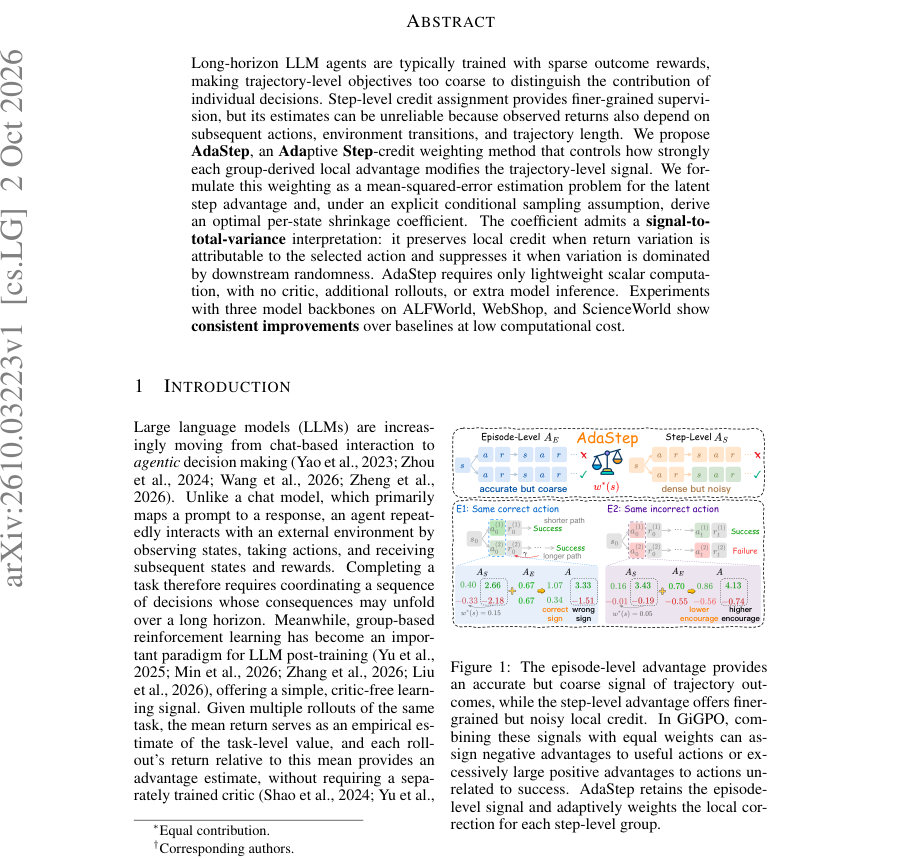
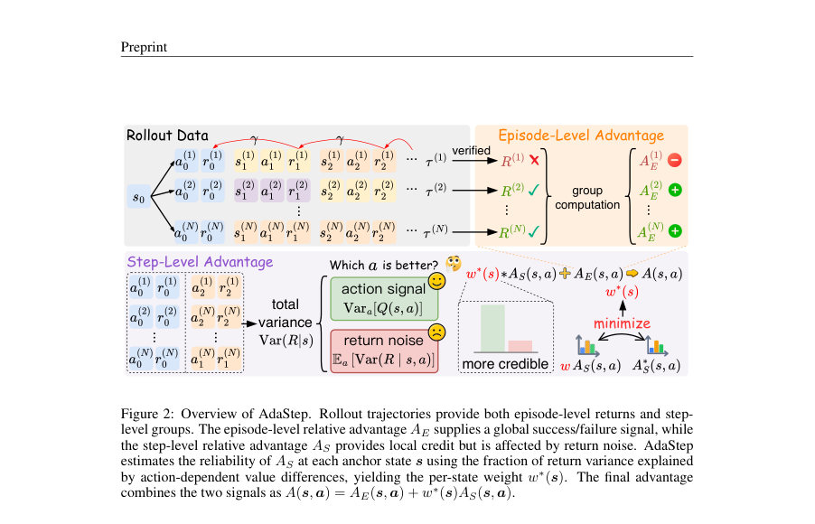
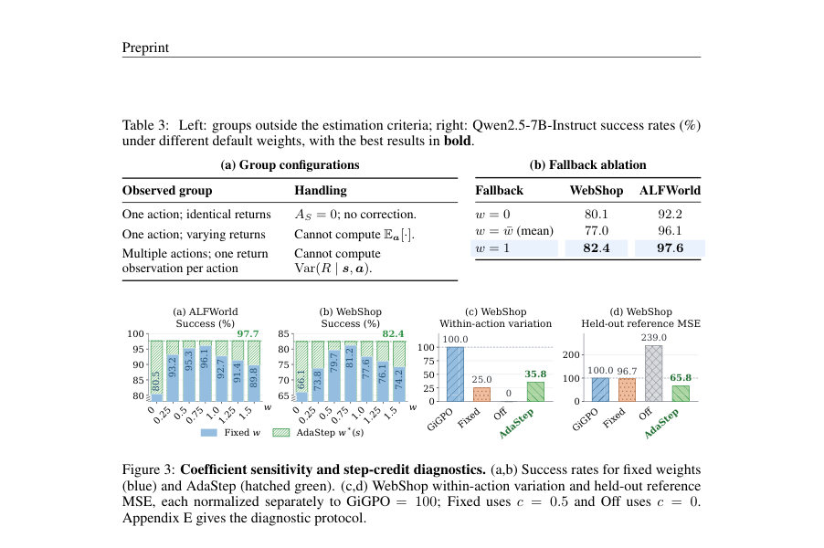

# AdaStep: Adaptive Step Credit Weighting for Agentic Reinforcement Learning

- **게시일:** 2026-10-05
- **arXiv:** [2610.03223v1](http://arxiv.org/abs/2610.03223v1) · [PDF](https://arxiv.org/pdf/2610.03223v1)
- **저자:** Xin Wang, Wenhao Wu, Menghao Zhang, Zhi Wang, Kun Shao, Jian Luan
- **분야:** cs.LG, cs.CL
- **선정 점수:** 3.78
- **선정 이유:** 최근성 0.4, 인용 영향 0.0 (인용 0회), 저자 영향 0.0 (최고 h-index 0), AI 주제 적합성 2.8, 개발자 관심 0.2, 학술 신호 0.3, 오픈 웨이트·주요 연구조직 신호 0.0

[← 2026-10-05 목록으로 돌아가기](../daily/2026-10-05.html)

<!-- paper-visuals:start -->
## 주요 Figure

> 원문 PDF에서 실제 Figure 캡션과 그림 영역이 함께 확인된 자료만 자동 추출했다.

*Figure · 원문 PDF 1쪽 · Figure 1: The episode-level advantage provides*

*Figure · 원문 PDF 4쪽 · Figure 2: Overview of AdaStep. Rollout trajectories provide both episode-level returns and step-*

*Figure · 원문 PDF 9쪽 · Figure 3: Coefficient sensitivity and step-credit diagnostics. (a,b) Success rates for fixed weights*

<!-- paper-visuals:end -->

## 한 문장 요약

긴 호라이즌 LLM 에이전트의 그룹 기반 보상 신호에서 각 스텝별 지역 어드밴티지의 신뢰도에 따라 가중치를 적응적으로 조정하는 AdaStep을 제안하여, MSE 기반의 최적 축소계수를 유도하고 그룹 통계만으로 계산해 추가 크리틱이나 롤아웃 없이 성능을 향상시킨다.

## 해결하려는 문제

긴-호라이즌 텍스트 기반 에이전트 학습에서 보상은 종종 희박하고 최종 결과에만 의존하므로(예: 성공/실패) 트래젝터리(에피소드) 레벨의 advantage는 어떤 중간 행동이 성공에 기여했는지 판별하기에 너무 거칠다. GiGPO와 같이 동일한 앵커 상태에 대해 그룹화한 step-level advantage는 더 세분화된 신호를 제공하지만, 이 추정치는 이후 행동·환경 전이·경로 길이 등으로 인한 변동(샘플링 노이즈)에 민감하여 신뢰도가 그룹마다 다르다. 고정 계수로 로컬 보정을 적용하면 유용한 행동에 대해 잘못된 부호나 지나친 보강이 발생할 수 있으므로, 각 앵커 상태별로 보정 강도를 적응적으로 결정하는 방법이 필요하다.

## 핵심 기여

- 로컬 신용(스텝 어드밴티지) 가중치를 잠재적 진짜 스텝 어드밴티지를 추정하는 평균제곱오차(MSE) 문제로 정식화하여 보존과 샘플링 오류 억제 간의 균형을 명확히 제시함.
- 상태별 최적 축소계수(w*(s))의 해석적 표현을 유도함. (신호 대비 전체 분산 비율로 해석되어, 행동에 의해 설명되는 분산이 클수록 로컬 신호를 보존함).
- 그룹 통계(카운트, 합, 제곱합으로 얻는 분산)만으로 계산 가능한 실용적 추정식(bw(˜s), Eq.17)을 제안하여 추가 크리틱·롤아웃·추론 없이 통합 가능하게 함.
- ALFWorld, WebShop, ScienceWorld의 세 가지 백본(Qwen3-1.7B, Qwen3-4B, Qwen2.5-7B-Instruct)에서 GiGPO/HGPO 등 비교기법보다 일관된 성능 향상을 보였음을 실험으로 입증함.
- 계산 비용이 매우 낮아(credit-computation 시간 약 +1%) 기존 그룹 기반 파이프라인에 쉽게 통합될 수 있음을 보임.

## 접근 방법

* 목표와 유도: 각 앵커 상태 s에 대해 그룹 내 관찰된 스텝 어드밴티지 AS(s,a)=R−ˆV를 A*_S(s,a)=Q(s,a)−V(s)의 noisy한 관측으로 보고, 스칼라 w를 곱해 w·AS가 A*_S를 MSE 관점에서 가장 잘 근사하도록 w*(s)=argmin_w E[(w·AS−A*_S)^2]를 풀었다.
* 이로부터
* 이론적 해: w*(s)=E[AS A*_S \| s]/E[AS^2 \| s]이고, 가정(i.i.d.
* conditional on s, 유한 분산) 하에서 분산 분해를 이용해
* w*(s)=Var_a Q(s,a) / Var(R \| s) = 1 − E_a[Var(R \| s,a)]/Var(R \| s)
* 로 해석 가능함(값 범위 [0,1]).
* 계산 가능한 구현: 실제로는 그룹 내 원시 할인 반환(R)들로 전체 분산 bv˜s와 각 행동별 내부 분산 bv˜s,a를 계산해 경험적 계수 bw(˜s)=1 − sum_a p(a\|˜s) bv˜s,a / bv˜s 으로 근사(식(17)).
* 운영 규칙: bw는 \|A˜s\|≥2, 각 행동별 관측 수 n˜s,a ≥2, bv˜s>0 일때만 계산하고, 그렇지 않으면 폴백(bw(˜s)=1 권장)을 사용한다(동일 반환 그룹은 AS=0 처리).
* bw는 표준편차 정규화 전의 원시 반환 통계에서 계산하며, 정규화 사용 여부와 무관하게 적용 가능하다.
* 통합: GiGPO의 결합식 AE + ω·AS에서 ω를 상태별 bw(˜s)로 교체하여 최종 advantage Ai,t = AE(τi) + bw(˜si,t) AS(si,t,ai,t)를 얻고, GiGPO와 동일한 클리핑된 폴리시 대상(JAdaStep, Eq.(20))으로 최적화한다.
* 추가적으로 별도 크리틱·추가 rollout·모델 전방 계산이 필요하지 않아 경량이다.

## 주요 결과

- 평가 데이터셋: ALFWorld, WebShop, ScienceWorld(8개 간단 과제). 백본: Qwen3-1.7B, Qwen3-4B, Qwen2.5-7B-Instruct. 모든 결과 평균은 3개 random seeds.
- 종합 성능: Table 1에 따르면 AdaStep은 세 백본·세 벤치마크 조합에서 GiGPO/HGPO 대비 일관된 향상을 보임. 대표 수치: Qwen3-4B on WebShop In-Success: GiGPO 88.02±0.9 → AdaStep 93.01±0.9 (+4.99); Qwen2.5-7B-Instruct on ALFWorld In-Success: GiGPO 92.71±0.9 → AdaStep 97.66±0.8 (+4.95).
- 최대 집계 이득: 본문 Table 1에서 보고된 최대 ∆ vs GiGPO는 +9.36 포인트(해당 셀은 Qwen3-1.7B 블록의 마지막 열 기준).
- 정규화 민감도: Table 2에서 표준편차 정규화(w/ std) 사용 여부와 관계없이 AdaStep이 GiGPO보다 평균 성능이 높았음(예: Qwen3-4B w/ std: GiGPO In-Suc 88.02→AdaStep 93.01; w/o std: GiGPO 88.20→AdaStep 91.73).
- 폴백(fallback) 실험: 그룹이 통계적 추정 조건을 만족하지 않을 때의 기본 가중치로 w=0, w=mean, w=1을 비교한 결과(표 3(b)), WebShop과 ALFWorld에서 w=1이 관찰된 최상 성능(예: WebShop 82.4%, ALFWorld 97.6%)을 보여 폴백으로 1을 채택하는 것이 실험상 유리함을 보고함. 논문은 실제 알고리즘에서 폴백을 bw(˜s)=1로 설정함.  
계산 비용: Table 4에서 크레딧 계산 시간 GiGPO 0.4968±0.0324s vs AdaStep 0.5018±0.0114s로 약 +1.0%의 추가 시간만 소요하며, WebShop 성공률은 GiGPO 77.60±1.7% → AdaStep 82.42±1.2%.  
추진력 진단: WebShop의 오프라인 진단(3,666 anchor groups)에서 AdaStep은 동일 데이터에 대해 within-action variation과 held-out reference MSE를 모두 줄여(본문 Fig.3(c,d)) 변화 억제와 참조 근사성 사이의 균형을 개선함.

## 한계

- 저자 언급: AdaStep은 앵커 상태를 정확히 매칭할 수 있어야 하며(이 논문은 이산적·정확히 재현되는 텍스트 상태를 전제로 함), 연속 상태·부분관찰 환경 등에서는 동일 상태를 직접 매칭하기 어렵기 때문에 상태 추상화나 그룹핑 설계가 필요하다고 명시함(부록 F).
- 저자 언급: 계수 유도는 조건부 샘플링(i.i.d. conditional on s)과 유한 분산 가정을 사용하므로 이 가정이 깨지는 환경에서는 이론적 정당성이 약화될 수 있음(본문 및 증명부록에서 가정 명시).
- 추가 확인된 제약: 유효한 계수 추정을 위해 각 그룹에 최소 샘플 요건이 필요함(|A˜s|≥2, 각 행동별 n˜s,a≥2, 총 분산>0). 드문 행동/희소 반복이 많은 환경에서는 추정 불가가 빈번해져 폴백 영향이 커질 수 있음(본문 Sec.5.3, Alg.1).
- 추가 확인된 제약: 실험은 텍스트 기반의 세 벤치마크에 한정되며(ALFWorld, WebShop, ScienceWorld의 제한된 태스크), ScienceWorld는 8개 단순 과제로 평가되어 더 넓은 일반화에 대한 증거는 제한적임(본문 Sec.5, Appendix C). 또한 실험은 3시드 평균, 160 training steps, 8 H100 환경에서 수행된 설정으로 더 긴 학습·다수 시드 재현성 평가는 추가 필요함(실험 세부사항 Appendix C).

## 개발자 관점

- 통합이 간단함: 기존 GRPO/GiGPO 파이프라인에서 ω를 상태별 스칼라 bw(˜s)로 대체하면 되며, 필요한 통계는 그룹별 카운트·합·제곱합(분산)뿐이므로 추가 모델이나 롤아웃이 필요 없다(Alg.1, Eq.17).
- 필요 통계 및 eligibility 체크: 그룹당 N˜s, 행동별 n˜s,a, 전체 분산 bv˜s, 행동별 분산 bv˜s,a를 계산해야 하며 추정 조건(|A˜s|≥2, n˜s,a≥2, bv˜s>0)을 만족하지 못하면 폴백(bw=1 권장)을 사용하도록 구현해야 한다(본문 Sec.5.3, Alg.1).
- 정규화 처리: bw는 원시(unnormalized) 반환 통계에서 계산하고, 만약 step-level advantage에 표준편차 정규화를 적용하는 정책이 있다면 정규화 후에도 동일한 bw를 곱해 사용 가능하다(본문 Sec.4.3, Sec.5.2 결과).
- 계산·운영 비용: per-iteration 크레딧 계산 시간 증가가 미미(+≈1%)하므로 production 파이프라인에 비교적 저비용으로 도입 가능(테이블 4).
- 주의점: 방법은 상태 그룹화에 의존하므로 continuous/PO 환경에서는 상태 유사도/클러스터링 또는 표현학습이 필요하며, 조건부 i.i.d. 가정과 샘플 요건에 민감하므로 드문 행동에 대해서는 폴백 정책이 성능에 큰 영향을 줄 수 있다.

**근거 범위:** 이 분석은 제공된 논문 PDF 본문(및 부록 포함)에서 직접 추출한 내용에 기반한다. 모든 수치(테이블, 평균±표준편차), 수식(Eq. 번호), 알고리즘(Alg.1) 및 가정(조건부 i.i.d., 유한 분산)은 PDF 본문에서 확인한 것이다. 코드·추가 실험 로그·외부 보조자료는 제공된 PDF에 포함되어 있지 않아 그 부분은 검증하지 못했음을 밝힌다.
