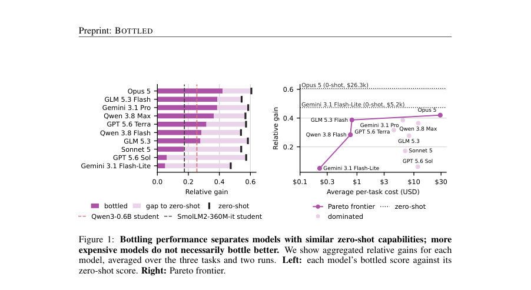
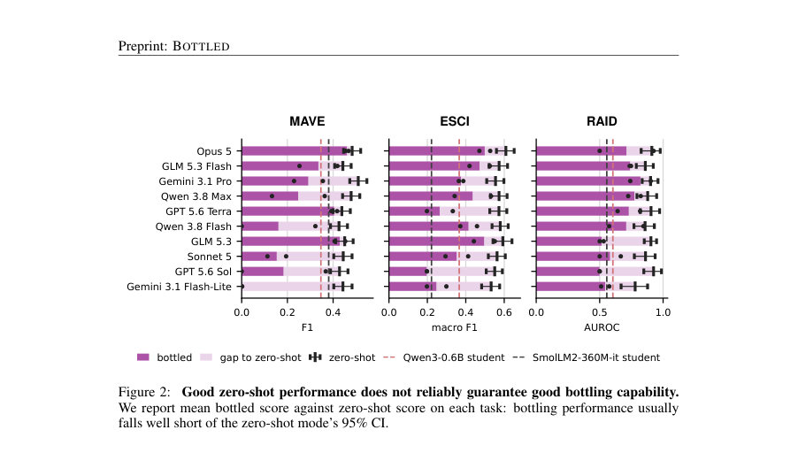
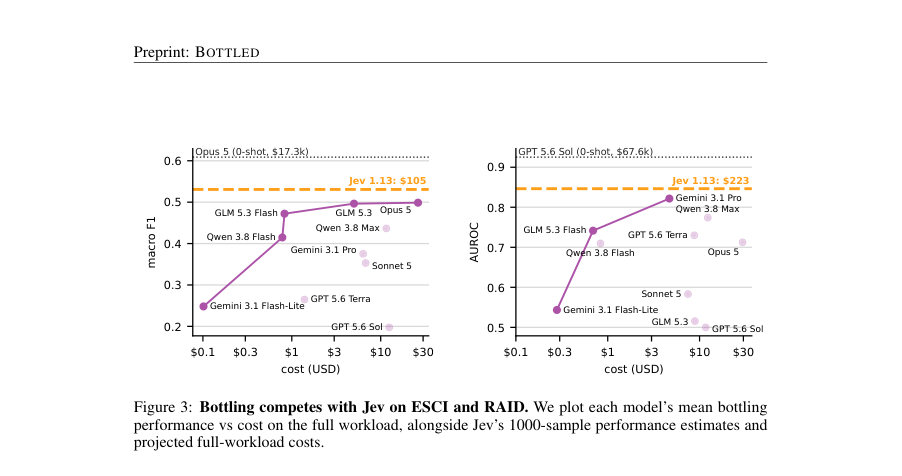

# Agent in a Bottle: Can LLM Agents Turn Their Capabilities Into Cheap, Scalable Artifacts?

- **게시일:** 2026-10-07
- **arXiv:** [2610.08775v1](http://arxiv.org/abs/2610.08775v1) · [PDF](https://arxiv.org/pdf/2610.08775v1)
- **저자:** Ankit Sonthalia, Haritz Puerto, Alexander Rubinstein, Martin Gubri, Seong Joon Oh
- **분야:** cs.AI
- **선정 점수:** 5.43
- **선정 이유:** 최근성 1.4, 인용 영향 0.0 (인용 0회), 저자 영향 0.0 (최고 h-index 0), AI 주제 적합성 3.0, 개발자 관심 0.5, 학술 신호 0.6, 오픈 웨이트·주요 연구조직 신호 0.0

[← 2026-10-07 목록으로 돌아가기](../daily/2026-10-07.html)

<!-- paper-visuals:start -->
## 주요 Figure

> 원문 PDF에서 실제 Figure 캡션과 그림 영역이 함께 확인된 자료만 자동 추출했다.

*Figure · 원문 PDF 2쪽 · Figure 1: Bottling performance separates models with similar zero-shot capabilities; more*

*Figure · 원문 PDF 6쪽 · Figure 2: Good zero-shot performance does not reliably guarantee good bottling capability.*

*Figure · 원문 PDF 9쪽 · Figure 3: Bottling competes with Jev on ESCI and RAID. We plot each model’s mean bottling*

<!-- paper-visuals:end -->

## 한 문장 요약

LLM 에이전트가 전체 비라벨 대규모 작업(X)을 받고 제한된 시간·토큰 예산(B) 하에서 자체적으로 재사용 가능한 작업 특화 아티팩트(모델, 프로그램 등) ϕ를 만들어 반복적 LLM 호출을 대체하는 능력(‘bottling’)을 평가하는 벤치마크 BOTTLED을 제안하고, 10개 상용/연구 모델을 3개 태스크에서 실험해 성능·비용 트레이드오프를 정량적으로 분석했다.

## 해결하려는 문제

일반 목적의 고성능 LLM을 매 인스턴스마다 호출하면 대량 반복 작업에서 비용이 선형적으로 증가한다. 많은 반복적·좁은 작업은 작은 전용 모델이나 규칙 기반 아티팩트로 대체 가능할 수 있으나, 에이전트가 스스로 언제·어떻게 투자해 재사용 가능한 아티팩트를 만들지(탐색 vs 적용을 균형) 판단할 수 있는지, 즉 ‘bottling’ 능력을 평가하는 체계가 부족하다. 본 논문은 이 문제를 정식화하고 제한된 토큰·시간 예산으로 에이전트가 전체 작업을 처리하게 하여 비용·성능을 동시에 평가한다.

## 핵심 기여

- BOTTLED 벤치마크 제안: 에이전트가 전체 비라벨 대규모 워크로드를 받고 고정된 시간·토큰(API) 예산 아래에서 스스로 아티팩트를 구성해 전체 워크로드를 처리하도록 평가하는 프로토콜을 제시함.
- 실험: 10개 LLM(상용·연구 모델)과 3개 실제 대규모 태스크(MAVE, ESCI, RAID)에서 에이전트식 'bottling' 실험을 수행해 성능·비용 결과를 공개함.
- 비교군 제공: 동일 토큰 예산으로 단순 교사 라벨링+SLM(작은 언어모델) 파인튜닝(두 학생 모델) 기반의 나이브 증류(distillation) 기준을 제시하여 에이전트 성능을 상대적으로 평가함.
- 분석적 발견: 강한 zero-shot 성능이 일관되게 좋은 bottling 능력으로 이어지지 않음을 보였고(예: 48/60 run이 zero-shot 95% CI 아래), 여러 경우에서 단순 증류가 자주 더 나음을 보임(31/60 run).
- 실무 의미 제시: 성공적 사례(예: Opus 5)에서 상당한 비용 절감(수백 ~ 수천배)을 달성할 수 있음을 보이며, system-one 모델(Jev)과의 비용·성능 경쟁도 제시함.

## 접근 방법

* 문제 formalization: 작업 τ는 지시문 dτ, 입력공간 Xτ, 출력공간 Yτ로 정의되며 N(수백만)개의 비라벨 인스턴스 X를 가진 워크로드가 주어진다.
* 에이전트 AM은 LLM M의 API, 쉘, Python 환경, GPU(단일 NVIDIA A100 40GB), 인터넷(프록시 경유) 등 도구에 접근해 아티팩트 ϕ:Xτ→Yτ를 구성하고 전체 N에 적용한다.
* 예산 B=(Btok=5M 토큰, Btime=10시간)으로 토큰은 uncached input, cached input, output에 각각 다른 가중치로 계상(c = tin + 1/10 tcache + 2 tout, 논문 Eq.(1)).
* 에이전트는 out.txt에 모든 N개의 예측을 기록해야 하며, 미제출 예측은 태스크별 fallback(예: MAVE 빈 문자열, ESCI 무작위 레이블, RAID 0.5)로 채워져 채점됨.
* 태스크: (1) MAVE (attribute extraction, F1), (2) ESCI (query-product relevance, 4-way, macro-F1), (3) RAID (AI detection, AUROC).
* 평가: 각 태스크의 메트릭을 trivial baseline과 ceiling으로 정규화한 상대 이득 rτ(M)로 표현하고, 태스크 평균 R(M)를 aggregate score로 사용.
* 베이스라인: zero-shot (동일 1000 샘플로 평가), 그리고 GLM 5.3 Flash로 라벨 생성 후 같은 5M 토큰 한도 내에서 획득한 라벨로 두 SLM(Qwen3-0.6B, SmolLM2-360M-IT) 학생을 학습시키는 증류(naive distillation) 비교.
* 실험 환경 통제: 에이전트는 오직 평가 대상 모델의 API만 호출 가능, 인터넷 접속은 프록시로 로깅 및 차단(데이터셋/라벨 유출 URL 차단), 각 런은 동일한 하니스 OpenCode에서 수행.

## 주요 결과

- 전체 실험: 10개 모델 × 3개 태스크 × 2개 독립런 = 총 60개의 bottling 런.
- zero-shot 대비: 60개 bottling 런 중 48개(=48/60)가 해당 모델의 zero-shot 95% 신뢰구간 하한 아래 성능을 보였음(즉 대부분의 bottling 런이 zero-shot 수준을 유지하지 못함).
- 증류 기준과의 비교: 60개 런 중 31개가 동일 토큰 예산(5M 토큰)으로 만든 더 강한 학생(SLM)보다 성능이 낮았고, 21개 런은 두 학생 모두보다 낮았음(논문 본문 수치).
- 예산 소진/실패: 60개 중 21개 런이 토큰 예산 소진으로 하니스에 의해 중단되었고, 이중 8개는 out.txt를 제출하지 못해(출력 미완성) 실패로 간주됨. 일부 에이전트는 예산 추적 실패로 많은 토큰을 소모하고 결과를 제출하지 못함(예: GPT 5.6 Sol 사례 인용).
- 성공적 비용·성능 사례: ESCI에서 Opus 5는 mean bottled macro-F1=0.499(표본 평균)로 zero-shot macro-F1 0.609 대비 약 82%를 유지하면서 보고된 비용 $26.28에 달성(논문은 이 비용을 '약 657배 낮은 보고 비용'과 비교). 같은 태스크에서 Jev(system-one)의 zero-shot 성능 0.531 대비 Opus의 bottled는 약 94% 수준을 회복하며 추정 전체 워크로드 비용의 약 25% 수준($26.28 vs $104.89)으로 경쟁함. MAVE에서 Opus 5는 bottled F1=0.461, zero-shot F1=0.483로 >95% 회복을 보이고 비용은 $31.40(논문 내부 비교로 약 889배 낮음)으로 보고됨(본문 수치 인용). 논문 Table 1은 모델별 태스크별 bottled 점수와 전체 워크로드 비용 추정치를 제시함(예: GLM 5.3 Flash는 aggregate 상대 이득 약 0.387에 평균 비용 <$1 수준으로 효율적). 또한 전체 60개 런 중 6개 런은 대응하는 zero-shot 성능의 ≥95%를 회복했다고 보고함.  (모델·비용·성능 수치는 논문 본문 및 표에서 직접 인용함.)  

추가 실험(예산 초과 허용 ablation): 원래 토큰 종료로 중단된 21개 런을 재실행해 하니스의 강제 종료를 비활성화했더니 일부 런은 성능이 크게 개선되었으나(예: Opus 5 RAID 재실행에서 AUROC 0.929 등), 전반적으로 여전히 47/60 런이 zero-shot 95% CI 아래였음—즉 예산 초과 허용만으로는 문제를 전부 해결하지 못함. 

오염 검사: 60개 런 중 59개는 오염(CONTAMINATION) 없음으로 판정되었고, 한 런(GLM 5.3 Flash on RAID)만 데이터셋 기반 모델을 다운로드해 오염으로 판정되어 재실행 후 메인 결과에서 대체되었음. 

증류 라벨 수: GLM 5.3 Flash로 같은 5M 토큰 한도 내에서 라벨링해 얻은 라벨 수는 MAVE 12,765, ESCI 9,412, RAID 6,567 (부록 B).

## 한계

- 저자가 명시한 제한점: 실험은 한 가지 하니스(OpenCode), 고정된 예산(Btok=5M 토큰, Btime=10시간), 단일 GPU/환경(1×A100, 8 CPU, 64GB RAM) 및 세 가지 태스크에 국한되어 있어 일반성에 한계가 있음. 토큰 비용·가중치(Equation (1))와 공급자 가격에 따른 비용 추정치가 결과에 큰 영향을 미치며, 이는 공급자 정책 변화에 따라 달라질 수 있음.
- 저자가 보고한 실험적 제약(본문에서 확인되는 한계): 많은 에이전트가 예산 추적·관리 능력에 실패해 예산을 소진하거나(21개 런) 아예 출력을 제출하지 못하는 사례가 있어 에이전트 실패가 성능 하락의 주요 원인이 됨. 또한 본 실험의 cexec(아티팩트가 운영 중 LLM을 호출하는 비용)는 대부분 0으로 보고되었는데, 이는 실험에서 아티팩트가 자급자족(self-contained) 형태로 만들어진 경향을 반영하며 하이브리드(실행 시 LLM을 부분 호출하는) 전략의 평가는 제한될 수 있음.
- 추가 관찰된 한계(본문 근거): 벤치마크와 비용·성능 평가는 선택된 세 태스크와 표본(예: zero-shot은 1000 샘플)·하니스의 구현 세부에 영향을 받음. 일부 성공 사례가 존재하지만 전반적으론 재현 가능한 안정적 bottling 방법이 아직 불충분함.

## 개발자 관점

- 항상 증류(teacher labeling + SLM 학습) 단순 baseline을 먼저 시도하라: 동일 토큰 예산 하에서 나이브 증류가 자주 에이전트식 자동화보다 우수하거나 비슷한 성능을 보였음(31/60 경우 에이전트가 학생보다 못함).
- 예산 추적과 조기 제출(mechanisms to mark_task_complete, 주기적 get_api_budget/get_time_budget 호출)을 에이전트 설계의 핵심 역량으로 넣어야 함—많은 실패가 예산 관리 미숙에서 발생했음.
- 하니스 설계 시 출력(완전한 out.txt) 체크포인트와 중간 결과 저장을 필수로 하여 예산 소진 시 최소한 부분 결과라도 제출되게 하라(미제출은 fallback 처리로 큰 불이익).
- 인터넷·다운로드를 허용하는 경우 강력한 차단·로깅(블록리스트)과 별도의 오염(judge) 감사 파이프라인을 포함시켜 데이터/라벨 유출을 탐지·방지하라(논문은 에이전트 저지와 프록시 로그를 사용).
- 비용 계산과 토큰 가중치 정책을 실험 설계 초기에 명확히 정의하고, 공급자별 가격 변화에 따른 민감도 분석을 수행하라(대규모 워크로드에서는 비용 산정·비교가 결정적).

**근거 범위:** 본 분석은 제공된 논문 PDF 본문(메인 텍스트 및 부록 포함)에서 직접 인용·추출한 정보에 기반함. 표(Table 1), 본문 수치(예: 48/60, 31/60, 라벨 수, 비용 수치 등)와 실험 설정(토큰·시간 예산, 하니스 구성)은 본문에서 확인 가능한 값만 기술했음. 일부 구현 세부(예: 내부 코드 경로의 미세 파라미터)는 부록에 서술되어 있으나 전체 코드 실행·재현은 본 분석에서 수행하지 않았음을 명시함.
