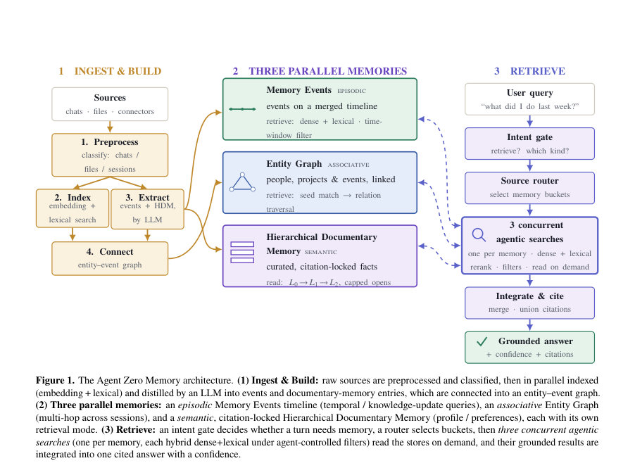
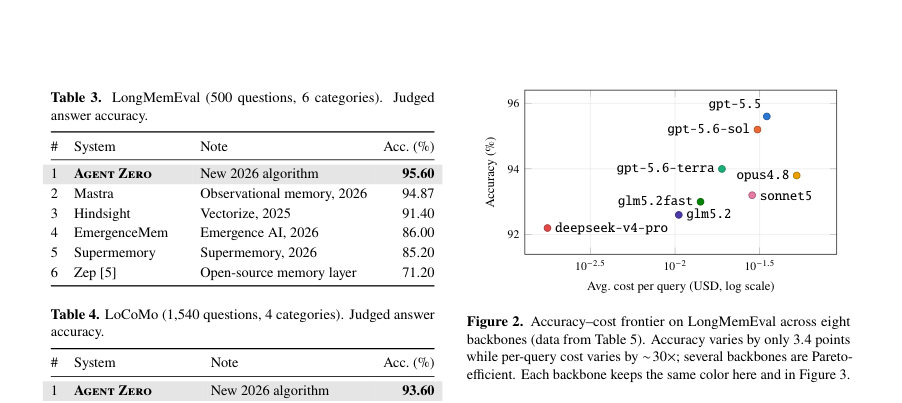
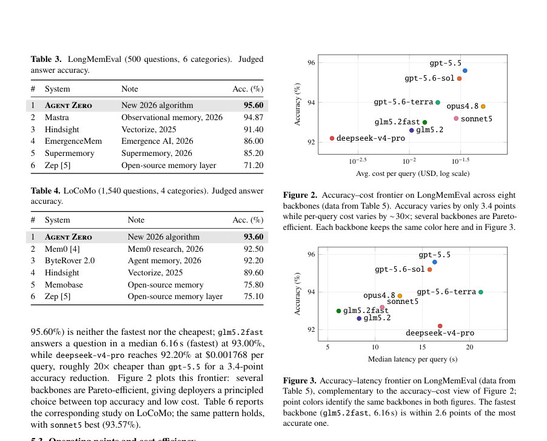

# Agent Zero Memory: Provenance-Aware Long-Term Memory for LLM Agents

- **게시일:** 2026-09-01
- **arXiv:** [2608.29606v1](http://arxiv.org/abs/2608.29606v1) · [PDF](https://arxiv.org/pdf/2608.29606v1)
- **저자:** Ming Wu, Pengyuan Zhu
- **분야:** cs.CL
- **선정 점수:** 4.66
- **선정 이유:** 최근성 0.6, 인용 영향 0.0 (인용 0회), 저자 영향 0.0 (최고 h-index 0), AI 주제 적합성 3.0, 개발자 관심 0.8, 학술 신호 0.3, 오픈 웨이트·주요 연구조직 신호 0.0

[← 2026-09-01 목록으로 돌아가기](../daily/2026-09-01.html)

<!-- paper-visuals:start -->
## 주요 Figure

> 원문 PDF에서 실제 Figure 캡션과 그림 영역이 함께 확인된 자료만 자동 추출했다.

*Figure · 원문 PDF 5쪽 · Figure 1. The Agent Zero Memory architecture. (1) Ingest & Build: raw sources are preprocessed and classified, then in parallel indexed*

*Figure · 원문 PDF 7쪽 · Figure 2. Accuracy–cost frontier on LongMemEval across eight*

*Figure · 원문 PDF 7쪽 · Figure 3. Accuracy–latency frontier on LongMemEval (data from*

<!-- paper-visuals:end -->

## 한 문장 요약

사용자 대화·파일·커넥터를 배경에서 증류해(이벤트 타임라인, 엔티티–이벤트 그래프, 계층적 문서 메모리) 출처-고정(citation-locked)된 병렬 메모리로 저장하고, 의도 게이트·소스 라우터·세 개의 동시 에이전트 검색을 통해 근거 있는 인용 답변을 반환하는 근거·출처 인식 장기 메모리 설계

## 해결하려는 문제

기존 LLM 에이전트 메모리는 단일 구조(플랫 사실 저장소, 벡터 인덱스, 지식 그래프 등)에 의존해(1) 업데이트 시 정정 내역의 근거와 타임라인을 잃거나 덮어써서 지식-업데이트·시간적 질의에 취약하고, (2) 읽기·쓰기 비용이 역사 길이에 따라 비효율적으로 증가하거나(핫패스에서 매 메시지 LLM 호출 등), (3) 출처·증거(프로베넌스)가 부재하거나 불투명해 생성(허위)과정이 통제되지 않는다는 한계가 있어 ‘무엇을 언제 왜 믿는가’를 쿨하게 유지·질의할 수 있는 구조적 해법이 필요하다.

## 핵심 기여

- 세 가지 병렬 메모리(시점 중심 Memory Events 타임라인, 엔티티–이벤트 연관 그래프, 인용-고정 계층적 문서 메모리 HDM)를 배경 파이프라인(전처리·인덱스·추출·연결)으로 구축하고 의도 게이트와 소스 라우터, 세 동시 에이전트 검색으로 조회하는 전체 아키텍처 제안 (§3).
- 읽기 규율을 형식화하여 모든 학습 항목을 출처·타임스탬프·증거 포인터를 갖는 provenanced item으로 정의하고, 읽기 시 오직 실제로 열어본 항목만 인용할 수 있게 하는 citation-locked answer 규칙을 제시하여 구조적으로 허위 생성을 배제 (§3.1).
- 각 검색을 에이전트-제어 필터 하의 하이브리드(임베딩+렉시컬) 검색을 도구 루프로 구성하고, 세 검색의 근거화된 인용 결과를 통합해 단일 신뢰도와 인용집합을 반환하는 의도-게이트·라우팅·병렬 검색 소자 설계 (§3.3).
- 공개 벤치마크에서의 성능(새로운 SOTA): LongMemEval 95.60%, LoCoMo 93.60%로 기존 최고 시스템 대비 각각 +0.73, +1.10 포인트 향상 보고 (§5).
- 백본 모델 8종 비교에서 정확도는 3.4포인트 범위에 안정적이지만(92.20→95.60) 쿼리당 비용은 약 30배 변동해 메모리-구조 중심의 품질·비용-지연 트레이드오프를 실증한 운영 연구 제공 (§5).

## 접근 방법

* 전체 시스템 M = (T, G_E, D)를 배경의 Memory Build와 쿼리-시의 Memory Injection으로 분리해 구성한다.
* Memory Build는 (1) Preprocess & classify로 원자료(A)를 채팅·파일·에이전트 세그먼트로 정리, (2) Index로 모든 항목에 3072차원 임베딩(pgvector)과 렉시컬(BM25+퍼지 매칭) 색인 생성, (3) Extract에서 LLM 분석으로 Memory Events 타임라인(사건 단위 요약)과 HDM(계층적, L0→L1→L2)를 추출, (4) Connect에서 에이전트 기반 프로세스로 엔티티–이벤트 온톨로지 그래프를 연결한다(비가역적 생성 타임스탬프와 ev 포인터 포함).
* Memory Injection(알고리즘 1)은 (i) Intent Gate(빠른 분류기)로 메모리 필요 여부와 종류 판정(자급자족 턴은 무지연 패스), (ii) Source Router로 관련 소스 버킷 선택, (iii) 세 개의 병렬 AgenticSearch(각각 Events, Graph, HDM)에 의한 검색을 실행한다.
* 각 AgenticSearch는 임베딩 + 렉시컬 채널에서 top-K를 뽑아 reciprocal rank fusion(k=60)으로 결합하고, 에이전트가 시간창·태그·소스·화자 필터를 제어하며 필요시 원문 청크를 열어 증거를 확보해 citation-locked partial answer( a_m, C_m, κ_m )를 만든다.
* Integrate 단계는 세 검색의 인용집합의 합집합(∪ C_m)과 집계 신뢰도로 단일 답변을 반환한다.
* Provenanced item은 origin∈{scan,infer,doc,dialogue,manual}, 생성 타임스탬프 t(x), 증거 포인터 ev(x)를 기록한다.
* HDM은 사용자가 직접 큐레이션한 노트로부터 결정론적으로 맵핑되어 발명/변질 불가하며 L0/L1/L2 계층과 전체 열람(cap)이 있어 저비용 오리엔테이션을 허용한다.
* 전체 설계의 핵심 규율은 (P1) 계층화된 메모리, (P2) 증거 기반 신념과 citation-lock, (P3) 구조 인식·에이전트 제어 검색이다.

## 주요 결과

- LongMemEval(500문제): Agent Zero 95.60%로 Mastra(94.87%) 대비 +0.73포인트, 기존 강력한 시스템들(Zep 등)보다 유의미한 개선(논문 Table 3) (§5.1).
- LoCoMo(1,540문제): Agent Zero 93.60%로 Mem0(92.50%)·ByteRover 2.0(92.20%) 대비 우수(논문 Table 4) (§5.1).
- 백본 스터디(8개 모델): LongMemEval 상 정확도 범위 92.20%→95.60%로 3.4포인트 차이지만 쿼리당 평균 비용은 약 30× 변동(예: gpt-5.5 비용 0.034788 USD/쿼리, deepseek-v4-pro 비용 0.001768 USD/쿼리)과 지연 차이를 보이며 다수 백본이 파레토 효율적(논문 Table 5, Figures 2–3) (§5.2–5.3).
- 응답 지연·비용 구체값 예시: glm5.2fast는 median latency 6.158 s(가장 빠름)에서 93.00% 정확도, gpt-5.5는 median 16.311 s에서 최고 정확도 95.60%(논문 Table 5) (§5.2).
- 검색 채널 절단 실험(백본 gpt-5.6-sol): 하이브리드(임베딩+렉시컬) 95.20% 기준, 임베딩만 94.00%(-1.20), grep 스타일 93.60%(-1.60), 렉시컬만 93.40%(-1.80)로 두 채널의 상보성이 실증됨(논문 Table 7) (§5.4).

## 한계

- 저자가 명시한 한계: (i) 평가가 벤치마크의 LLM-저지 프로토콜을 따르며(재현 시 저지·프롬프트 차이 영향), (ii) 백본 식별자는 평가 시점의 모델 라인업을 반영하고 변할 수 있음, (iii) 세 메모리 구성요소와 의도 게이트의 개별 기여를 정량화하는 구성 요소-레벨 절제(ablation)는 향후 작업으로 계획되어 있음(논문 §6·Conclusion).
- 저자가 언급한 타당성 위협: 경쟁 시스템 수치는 공개 보고치 중 최고치를 사용했으며 각 시스템의 평가 하니스, 저지 모델, 프롬프트, 검색 예산 차이로 인해 완전한 일대일 비교는 아니라고 명시(논문 §6 Threats to validity).
- 본문과 실험 범위에서 확인되는 제약: (i) 평가가 LongMemEval·LoCoMo 두 벤치마크에 한정되어 있어 다른 도메인·대규모 실세계 코퍼스 일반화는 추가 검증 필요, (ii) 비용 수치는 평가 시점 공급자 리스트 가격과 캐시율에 의존하므로 시간이 지나면 달라짐(논문 명시), (iii) 배경의 distillation(LLM 기반 추출) 비용·지연의 정량적 오버헤드는 설계상 '배경 처리'로 완화되지만 실제 고빈도 입력·대규모 조직 데이터에서의 쓰기 비용·지연·확장성(예: 전체 재색인 주기 등)은 논문에서 완전하게 정량화되지 않음.

## 개발자 관점

- 구현 스택과 지표: 이벤트·그래프·HDM을 관계형 DB에 저장하고 pgvector(3072-d)로 임베딩 검색, 렉시컬은 BM25+퍼지 매칭, 상호결합은 reciprocal rank fusion(k=60)을 사용한 점은 재현 가능한 구현 세부사항이다(논문 §4.4).
- 운영·비용 최적화: 답변 입력의 캐시율(cached-input) 비율이 비용에 큰 영향을 미치므로 프롬프트 캐싱을 적극 활용하라(논문 §5.3).
- 지연 절감: 의도 게이트를 통해 자기완결(self-contained) 턴은 메모리 경로를 우회해 무지연 패스 가능하므로 대화 응답성 개선에 효과적(논문 §3.3).
- 안전성·감사성: 모든 메모리 항목에 origin/timestamp/ev 포인터를 보관하고 'citation-lock' 규율로 읽을 때 실제 연 자료만 인용하도록 인터페이스 수준에서 강제하면 허위 생성(hallucination)을 구조적으로 차단하고 감사 가능한 출력을 보장할 수 있음(논문 §3.1).
- 검색 설계: 임베딩과 렉시컬 채널은 상보적이므로 둘 다 유지하는 것이 최종 정확도에 기여하며(절단 실험), 각 검색이 시간창·태그·화자 필터를 에이전트가 제어하도록 하면 시간·멀티홉 질문에서 성능이 개선된다(논문 §3.3, §5.4).

**근거 범위:** 이 분석은 제공된 논문 PDF 본문(페이지 1–10)의 내용만을 근거로 작성되었다. 성능 수치·표는 본문에 명시된 값들을 그대로 인용했으며(예: LongMemEval 95.60%, LoCoMo 93.60%, 백본별 비용·지연 표), 논문이 명시하지 않은 내부 하이퍼파라미터(예: 일부 top-K 값의 정확한 채널별 설정 등)나 운영적 세부사항은 본문에 근거가 없으면 추정하지 않았다. 경쟁 시스템의 수치는 논문이 인용한 '공개 보고치 최고값'을 사용한 것으로, 서로 다른 평가 하니스 때문에 완전한 일대일 비교는 아니라고 저자도 명시하고 있다.
