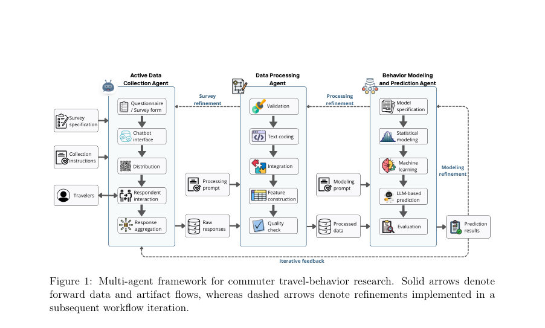
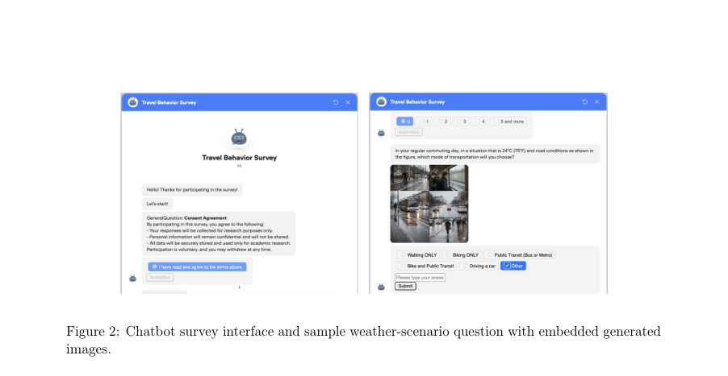
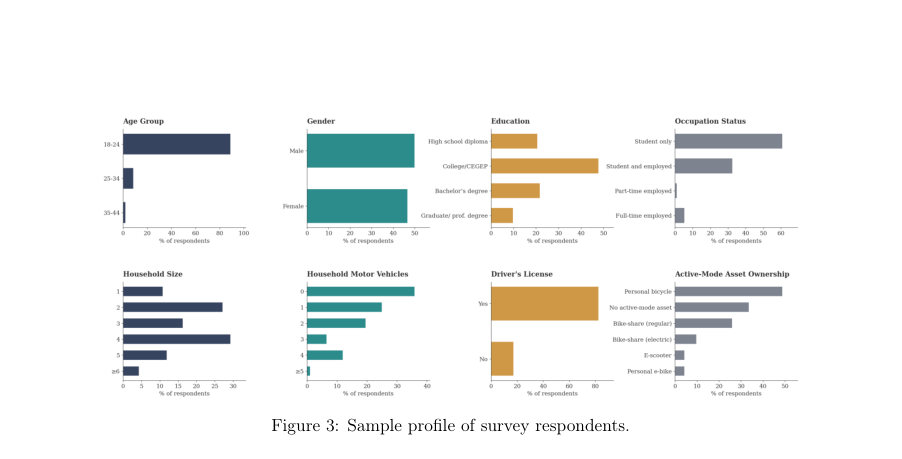

# An Agentic Approach for Active Data Collection, Travel Behavior Modeling, and Weather-Sensitive Demand Prediction

- **게시일:** 2026-08-22
- **arXiv:** [2608.20320v1](http://arxiv.org/abs/2608.20320v1) · [PDF](https://arxiv.org/pdf/2608.20320v1)
- **저자:** Narges Ahmadi, Yubo Jiao, Jônatas Augusto Manzolli, Jiangbo Yu, Luis Miranda-Moreno
- **분야:** cs.AI, cs.CL
- **선정 점수:** 5.68
- **선정 이유:** 최근성 0.5, 인용 영향 0.0 (인용 0회), 저자 영향 1.6 (최고 h-index 16), AI 주제 적합성 3.0, 개발자 관심 0.2, 학술 신호 0.3, 오픈 웨이트·주요 연구조직 신호 0.0

[← 2026-08-22 목록으로 돌아가기](../daily/2026-08-22.html)

<!-- paper-visuals:start -->
## 주요 Figure

> 원문 PDF에서 실제 Figure 캡션과 그림 영역이 함께 확인된 자료만 자동 추출했다.

*Figure · 원문 PDF 6쪽 · Figure 1: Multi-agent framework for commuter travel-behavior research. Solid arrows denote*

*Figure · 원문 PDF 14쪽 · Figure 2: Chatbot survey interface and sample weather-scenario question with embedded generated*

*Figure · 원문 PDF 15쪽 · Figure 3: Sample profile of survey respondents.*

<!-- paper-visuals:end -->

## 한 문장 요약

대화형, 이미지 보강된 설문(챗봇)으로 기상 시나리오별 통근자 모드 선택 데이터를 수집하고, 이를 3-에이전트(수집·처리·모델링) 워크플로에서 MNL·ML 벤치마크와 다양한 프롬프트·비전 구성을 가진 로컬 LLM들(2–35B)을 이용해 비교·평가한 연구이다.

## 해결하려는 문제

기존 연구는 (1) 기상 등 맥락이 다른 상황에서의 여행 행태를 일관되게 수집하기 어렵고(정적·텍스트 중심의 SP 한계), (2) 데이터 수집·처리·예측 단계가 분리되어 있어 통합적·감사가능한 워크플로가 부족하며, (3) LLM을 포함한 다양한 입력(문맥·페르소나·비전)·프롬프트 전략이 모드 선택 예측 성능에 미치는 체계적 비교가 부족하다는 점을 해결하려 한다.

## 핵심 기여

- 대화형(챗봇)·이미지 보강된 stated-preference 설문을 통해 동일 응답자에 대해 5개 기상 시나리오(Sunny, Hot–humid, Rainy, Foggy/cold, Snowy)별 모드 선택을 수집(92명, 5시나리오 → 454 유효 관측치)하고 이 원자료를 에이전트 기반 워크플로로 처리·관리한 점.
- 기상에 따른 모드 선택의 행동적 변화(예: 사이클링 급감, Snowy에서 대중교통 증가)를 MNL로 해석 가능한 방식으로 실증한 점(확장 사양에서 기상 지표 유의).
- 다양한 로컬 LLM(총 9개; 모델 규모 2B–35B)을 EXP/RP(Expert vs Role-Play)×BC/RC(Base vs Richer Context) 제로샷 설정과 페르소나·few-shot·비전 확장으로 체계적으로 비교하고 전통적 MNL·로지스틱·랜덤포레스트와 벤치마크 비교를 수행한 점.
- 세 에이전트(Data Collection, Data Processing, Data Modeling)를 명시적 입력·출력 인터페이스로 연결하는 멀티에이전트 워크플로를 제시하고 구현·시연한 점(데이터·처리·모델링의 추적가능성·불변원자료 보존 등).

## 접근 방법

* 세 에이전트 아키텍처로 구성된 워크플로를 구현했다.
* Data Collection Agent는 Voiceflow로 구현한 웹 챗봇(Travel-BehaviorSurveyBot)을 통해 연구자가 정의한 질문지(Q)를 대화형으로 배포하고 각 시나리오에 대해 동일하게 생성된 포토리얼리스틱 이미지 5장을 제시하여 응답자의 모드 선택을 수집(응답자당 5개 시나리오).
* Data Processing Agent는 챗봇의 JSON 원자료를 비식별·검증·재코딩·유도변수 생성·품질플래그 부여 절차로 분석 가능 데이터셋(Dpro, 454 관측치)으로 변환(불변 원자료 보존, 검토용 미해결 레코드 분리).
* Data Modeling Agent는 병렬로 전통적 모델(Multinomial Logit in Biogeme), 머신러닝(로지스틱 회귀, 랜덤포레스트)과 LLM 기반 예측을 수행했다.
* LLM 실험은 9개 로컬 모델(Gemma·Llama·Qwen 계열, 세부 명칭: Gemma 4:e2B, Llama 3.2:3B, Gemma 3:4B, Gemma 4:e4B, Gemma 4:12B, Gemma 4:26B, Gemma 3:27B, Gemma 4:31B, Qwen 3.6:35B)에서 EXP(전문가)·RP(역할극) 프레이밍을 BC(기본문맥: 인구·자원·중요도 등)와 RC(추가 habitual travel 정보를 포함)로 교차한 제로샷 설정을 기본으로, (1) 페르소나(3개 잠재계층으로 추출된 행동 페르소나) 추가, (2) k-shot(여러 k값, 예: 소수(≈10) 예시로 성능 안정화 관찰) few-shot in-context 학습, (3) 비전 입력(설문에 제시된 동일 이미지 직접 입력) 실험을 확장하여 수행했다.
* 평가 설계는 응답자 수준으로 교차검증을 분할(뚜렷한 응답자 분할로 정보누수 방지)하여 다중 클래스(5-클래스 모드)와 이진(Active vs Non-active) 정확도를 보고함.

## 주요 결과

- 데이터: 92명의 McGill 학생 통근자, 5개 기상 시나리오에서 총 460가능 관측치 중 6개 결측 제외하여 454 유효 respondent–scenario 관측치 사용.
- 행동적 발견(기술): 여름→겨울로 사이클링 비중(주요 통근 모드) 감소(예: 본문에 계절별 비율 기재), Snowy에서 Public Transit 점유율이 Sunny 대비 크게 증가(예: Sunny 17.6% → Snowy 45.1%).
- MNL(해석): 확장 명세에 기상 지표 포함 시 모델 적합 개선(LR = 53.92, df = 8, p < 0.0001). 사이클링은 Rainy/Foggy/Snowy에서 유의하게 감소(예: Snowy β = −1.820, p = 0.009). Public Transit과 Driving은 악천후에서 상대적 효용 증가(다수의 유의 계수).
- 머신러닝 벤치마크: 랜덤포레스트가 5-클래스 정확도 69.6%를 달성(교차검증, 응답자 단위 분할). 로지스틱 회귀는 60.2%, MNL은 44.7%의 5-클래스 정확도를 보였음. 이진(Active vs Non-active) 정확도: 랜덤포레스트 88.8%, 로지스틱 85.1%, MNL 81.2%.
- LLM 결과(주요 포인트): 제로샷 텍스트 전용에서 최고 점 추정치는 Gemma 4:12B의 69.9% 5-클래스 정확도(별도 학습 없이). 문맥 확장(RC; 습관적 이동정보 포함)은 일관된 성능 향상을 가져왔고(EXP-RC가 일반적 우세), Expert 프레이밍이 Role-Play보다 대체로 우수했고(특히 작은 모델에서), 페르소나는 습관정보가 없을 때 가장 유용했음. Few-shot은 여러 모델에서 추가 개선을 제공했으며 대체로 약 10개 예시 이후로 성능이 안정화됨. 비전 입력(설문에 제시된 동일 이미지)을 도입한 최상위 비전 기반 구성은 71.5% 5-클래스 정확도를 기록하여(점추정) 시각적 문맥이 일부 모델에 추가적 예측 신호를 제공할 수 있음을 시사함.

## 한계

- 저자 명시: 표본이 작고 비대표적(92명 McGill 학생)이며 결과는 진짜 관측된(revealed-preference) 여행 행동이 아닌 stated-preference에 근거함.
- 저자 명시: 기상 조건당 한 장의 고정 이미지만 사용되어 이미지 고유 효과와 기상 효과를 분리할 수 없음(이미지 내 통제되지 않은 시각적 요소가 응답자·모델에게 영향을 미쳤을 가능성 있음).
- 저자 명시: 데이터셋이 작고 불균형하여 소수 모드·여러 하위집단에 대한 상세 분석 한계가 있음; 워크플로 자체는 전통적 절차와 실험적 비교를 거치지 않았음(통합·추적가능성 제시는 했으나 비용·효율 개선이 정량적으론 검증되지 않음).
- 검증 가능한 실험 제약(논문 본문 관찰): 평가에서 여러 모델·프롬프트 조합을 동일 표본에 적용했으므로 '최고 점추정치'가 다중 비교·탐색적 설정의 산물일 가능성이 있음(본문도 유사한 주의 표기). 또한 비전 실험의 일반화성은 확보되지 않음(동일 이미지 사용으로 새로운 시각환경 일반화 불확실).

## 개발자 관점

- 재현성·감사성: 원자료(Draw)는 불변으로 취급하고 처리·재코딩은 별도 연산으로 기록하는 설계는 감사·재현에 유리함(프로비넌스·버전 정보 저장 권장).
- 모듈화 구현: 데이터 수집(Voiceflow 챗봇), 처리(구조화·코딩·품질 플래그), 모델링(Biogeme·ML·LLM)으로 명확히 분리한 인터페이스는 오류 원인 추적과 부분교체(예: 다른 LLM 교체)를 쉽게 함.
- 데이터 분할 규칙: 동일 응답자의 여러 시나리오가 있으면 학습/검증/시험 분할을 '응답자 단위'로 수행해야 정보 누수 방지(논문에서 준수).
- 프롬프트 설계·입력 공학: 습관적 이동경력 정보가 가장 일관된 성능 개선을 가져왔고(우선적으로 포함), Expert 프레이밍이 Role-Play보다 안정적이며 페르소나는 습관 정보가 없을 때만 유용하므로 실제 적용 시 어떤 피처를 텍스트로 제공할지 우선순위를 정할 것.
- few-shot과 비용-효율: 작은 수(≈10) 내외의 예시로 대부분의 성능 향상이 확보되어, 대규모 추가 라벨링 없이도 in-context 학습을 활용 가능함(작은 모델일수록 상대적 이득 큼). 그러나 few-shot은 반복 실행 시 무작위성이 있으므로 R 반복 평균화 필요. 또한 비전 입력은 모델·구성에 따라 이득/손실이 갈리므로 멀티모달 모델 도입 전 소규모 파일럿을 권장함(이미지 품질·표준화 중요).

**근거 범위:** 본 분석은 제출된 논문 PDF 본문(페이지 1–25)을 근거로 작성되었음. 표본·정량 결과(예: 92명, 454관측, 랜덤포레스트 69.6% 등)와 모델명·숫자(Gemma·Llama·Qwen 계열 및 파라미터표기)는 본문 표와 본문 서술에서 직접 발췌함. PDF에 표기되지 않은 세부 구현비용(추론 비용, 하드웨어 스펙), 일부 내부 파라미터(예: few-shot에서 정확한 k 값 분포)는 명시적 언급이 없어 유추하지 않았음을 밝힘.
