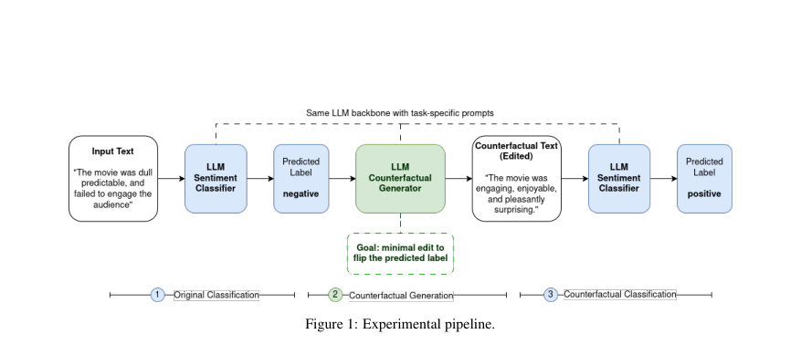
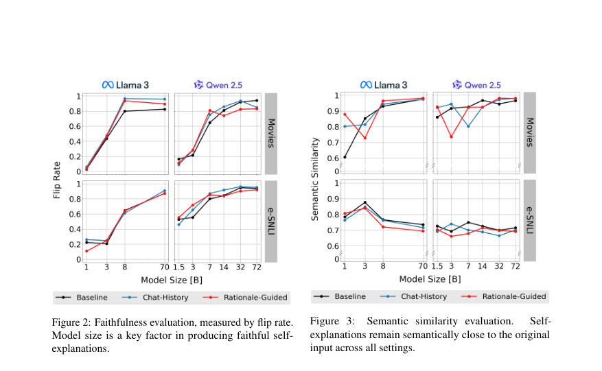
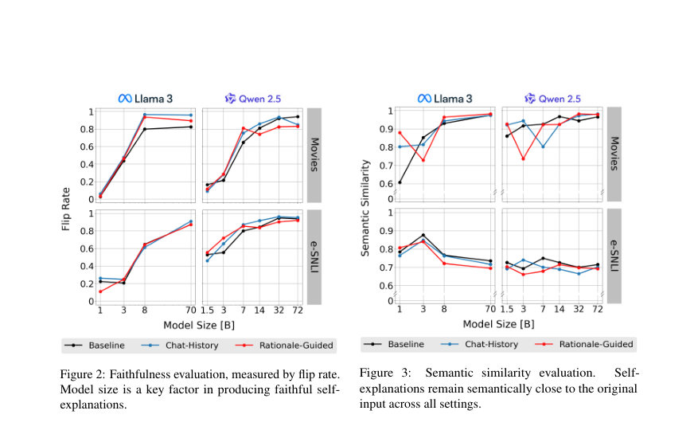

# An Empirical Study of Counterfactual Self-Explanations in LLMs

- **게시일:** 2026-09-16
- **arXiv:** [2609.17119v1](http://arxiv.org/abs/2609.17119v1) · [PDF](https://arxiv.org/pdf/2609.17119v1)
- **저자:** Giannis Kalyvas, Giorgos Filandrianos, Orfeas Menis Mastromichalakis, Vassilis Lyberatos, Giorgos Stamou
- **분야:** cs.CL
- **선정 점수:** 6.64
- **선정 이유:** 최근성 1.2, 인용 영향 0.0 (인용 0회), 저자 영향 0.0 (최고 h-index 0), AI 주제 적합성 2.4, 개발자 관심 0.2, 학술 신호 0.3, 오픈 웨이트·주요 연구조직 신호 2.5

[← 2026-09-16 목록으로 돌아가기](../daily/2026-09-16.html)

<!-- paper-visuals:start -->
## 주요 Figure

> 원문 PDF에서 실제 Figure 캡션과 그림 영역이 함께 확인된 자료만 자동 추출했다.

*Figure · 원문 PDF 3쪽 · Figure 1: Experimental pipeline.*

*Figure · 원문 PDF 4쪽 · Figure 2: Faithfulness evaluation, measured by flip rate.*

*Figure · 원문 PDF 4쪽 · Figure 3: Semantic similarity evaluation.*

<!-- paper-visuals:end -->

## 한 문장 요약

LLM에 자기 예시(counterfactual) 설명을 생성하게 하고, 생성된 편집이 실제로 자신의 예측을 뒤집는지(신뢰성), 최소 편집성(근접성), 그리고 인간 주석 근거와의 정렬(ESMP)을 LLaMA-3·Qwen-2.5 계열 모델들에서 실험적으로 평가하여 모델 용량과 프롬프트가 자기-설명 신뢰성에 미치는 영향을 규명한다.

## 해결하려는 문제

대형 언어모델이 자체 출력에 대해 유창한 설명을 생성할 수는 있으나, 그 설명이 실제로 모델의 결정 근거를 반영(faithful)하는지는 불분명하다. 기존 연구들은 자기-설명 또는 카운터팩추얼 설명의 신뢰성 문제를 다루었지만, 한편으로는 행동적 신뢰성(생성된 편집이 실제로 예측을 뒤집는가)과 인간-근거 정렬을 함께 체계적으로 비교·평가한 연구가 부족했다. 본문은 ‘자체 생성된 카운터팩추얼이 모델 행동을 얼마나 잘 드러내는가’와 ‘그 편집이 인간 주석과 얼마나 일치하는가’를 규명하려 한다.

## 핵심 기여

- 카운터팩추얼 자기-설명 평가 프레임워크 제시: 동일 모델로(역할별 프롬프트) 원래 예측→최소 편집 생성→편집 재분류의 3단계 파이프라인을 사용하여 행동적 신뢰성 측정(논문 섹션 2.1).
- 새로운 인간-정렬 지표 ESMP(Evidence-Supported Modification Precision) 제안: 인간 주석 증거(span) 내부에서 발생한 편집 비율(정밀도)로, 최소성 목표와 충돌하지 않도록 설계(논문 섹션 2.3 및 식(4)).
- 규모·프롬프트의 체계적 실험: LLaMA-3 및 Qwen-2.5 계열의 10개 instruction-tuned 모델(1B–72B/70B+)을 사용해 영화 감성(Movies)과 e-SNLI(NLI)에서 신뢰성·근접성·인간정렬을 비교(논문 섹션 2, Appendix A).
- 프롬프트 조건 비교: Baseline, Chat-History(대화 연속성 유지), Rationale-Guided(핵심 근거 식별 후 편집) 세 가지 전략을 도입·비교하여 신뢰성 및 인간정렬에 미치는 상이한 효과 발견(논문 섹션 2.2, 결과 섹션 3).
- 규모의 정량적 영향 규명: 모델 규모와 신뢰성(플립률) 및 ESMP 사이의 강한 양의 상관, 로그2(size) 대비 회귀계수 제시(논문 섹션 3 및 Appendix D).

## 접근 방법

* 데이터·모델: ERASER 벤치마크의 Movie Reviews(영화 감성)와 e-SNLI(NLI) 테스트셋과, LLaMA-3·Qwen-2.5 계열의 instruction-tuned 모델들(1B, 3B, 7–8B, 14B, 32–72B/70B 등)을 로컬(단일 NVIDIA H200, 140GB)에서 실행(Appendix A).
* 인퍼런스 설정: temperature=0, top-p=1, top-k=0, max_new_tokens=4096, sampling 비활성화(Appendix A).
* 파이프라인: 동일 LLM을 역할별 프롬프트로 사용해 (1) 원래 분류 수행·라벨 생성, (2) 목표 라벨(원래 라벨의 반대)을 조건으로 최소 편집(counterfactual) 생성, (3) 편집된 입력 재분류로 플립 여부 확인(섹션 2.1, Figure 1).
* 프롬프트 변형: Baseline(단순 반대라벨 지시), Chat-History(1·2단계 대화 컨텍스트 유지), Rationale-Guided(모델이 먼저 핵심 근거 토큰을 식별한 뒤 해당 토큰만 최소 편집하도록 유도) 사용(섹션 2.2, Appendix B에 프롬프트 전문).
* 평가 지표: Faithfulness(플립률, 식(2)), Closeness(정규화 편집거리 기반 보존도 식(3)), Semantic Similarity(MPNet 임베딩 코사인), ESMP(인간 주석 증거 스팬 내 편집의 정밀도, 식(4))를 적용(섹션 2.3).

## 주요 결과

- 모델 규모와 신뢰성(플립률)의 강한 양의 상관: Spearman ρ=0.87, p<0.001(논문 본문·Appendix D 및 표 6).
- 규모와 ESMP의 양의 상관: Spearman ρ=0.78, p<0.001(표 6).
- 규모와 근접성·의미적 유사성 연관은 약함: Closeness ρ=0.32 (p=0.013), Semantic Similarity ρ=0.16 (p=0.23)로 상대적으로 낮음(표 6).
- 회귀 분석(로그2(size) 통제 포함): 모델 크기(두 배 증가)가 신뢰성(faithfulness)에 미치는 계수 β=0.119(95% CI [0.092,0.147], p<0.001), ESMP에 대한 β=0.032(95% CI [0.023,0.042], p<0.001)(표 6, 섹션 3·Appendix D).
- 분수-로지스틱 보완분석: 모델 크기 두 배마다 신뢰성에서 승산비(odds ratio) ≈ 2.00, 95% CI [1.68,2.40], p<0.001(본문 결과).」「작은 모델에서 큰 모델로의 변화(표 7): Movies LLaMA faithfulness 0.042 → 0.893, ESMP 0.334 → 0.500; Movies Qwen 0.124 → 0.873, ESMP 0.298 → 0.585; e-SNLI LLaMA 0.198 → 0.885, ESMP 0.257 → 0.505; e-SNLI Qwen 0.514 → 0.936, ESMP 0.341 → 0.498(표 7).

## 한계

- 저자가 명시한 한계: 분석 대상을 이진 분류 태스크로 제한했으며(영화 감성·e-SNLI), 다중선택 또는 생성형(open-ended) 설정으로의 일반화가 제한적이라고 명시(섹션 'Limitations'). 또한 사용된 평가지표(신뢰성·최소성 등)가 인간 이해 가능성·유용성의 전부를 포착하지 못할 수 있다고 저자가 언급함.
- 본문에서 확인 가능한 실험적 제약(합리적 추론으로 구분): 실험은 두 개의 모델 계열(LLaMA-3, Qwen-2.5)과 instruction-tuned 변형에 한정되어 있어 다른 아키텍처·사전학습·튜닝 방식에 대한 일반화가 제한된다(섹션 2·Appendix A). 모든 실험은 로컬 단일 GPU(H200, 140GB) 환경 및 특정 디코딩 하이퍼파라미터로 수행되어, 분산 환경·다른 디코딩 설정에서 결과가 달라질 가능성이 존재한다(Appendix A). 또한 ESMP는 편집이 인간 주석 스팬에 '발생했는가'만 측정하는 정밀도 지표로, 편집의 품질·문장 문법성·실제 해석 가능성 등은 별도로 평가하지 않음(섹션 2.3).

## 개발자 관점

- 재현성: 본문에 사용된 정확한 모델 식별자(예: Qwen/Qwen2.5-1.5B-Instruct … meta-llama/Llama-3.1-70B-Instruct)와 프롬프트 전문이 Appendix A·B에 제공되어 있어 동일 파이프라인 재현이 비교적 용이함. 코드 저장소(논문 첫 페이지 주석)도 제공되어 있음(본문).
- 하드웨어·추론 설정: 실험은 단일 NVIDIA H200(140GB)에서 temperature=0, top-p=1, top-k=0, max_new_tokens=4096, sampling 비활성화로 수행되었으므로, 대규모 모델(≥70B) 로컬 운용을 위해 유사한 메모리·연산 자원이 필요함(Appendix A).
- 검증 권고: 자체 생성된 카운터팩추얼은 모델 용량에 크게 의존하므로(규모가 신뢰성·ESMP를 증가) 작은 모델에 대해서는 자기-설명을 즉시 신뢰하지 말고 행동적 검증(편집 후 재분류)을 수행해야 함(결론·논의).
- 프롬프트 설계 주의: Rationale-Guided는 인간정렬(ESMP)과 근접성은 개선시키나 신뢰성은 낮출 수 있어(프롬프트 구조가 모델의 편집을 유도), 프롬프트가 '설명처럼 보이게' 만드는지 또는 실제 모델 의사결정을 드러내는지를 분리해 평가해야 함(결과 섹션).
- 지표 활용: ESMP는 최소성 목표와 충돌하지 않으면서 편집이 인간 주석과 겹치는지를 측정하므로, 설명의 '증거 타깃팅'을 평가할 때 유용하게 사용할 수 있음(섹션 2.3).

**근거 범위:** 본 분석은 제공된 논문 PDF 본문(표, 본문 기술, Appendices A–D 포함)에 근거하여 작성되었다. 수치(상관계수, 회귀계수, 표의 per-model 값), 프롬프트 전문 및 하드웨어·디코딩 설정은 PDF에서 직접 추출하였다. 그림(도표 캡션)과 표의 텍스트 기반 수치를 사용했으며, PDF에서 보이지 않거나 명시되지 않은 내부 구현·학습 세부사항(예: 정확한 토크나이저 설정, 학습 시드 등)은 본문에 없으므로 포함하지 않았다.
