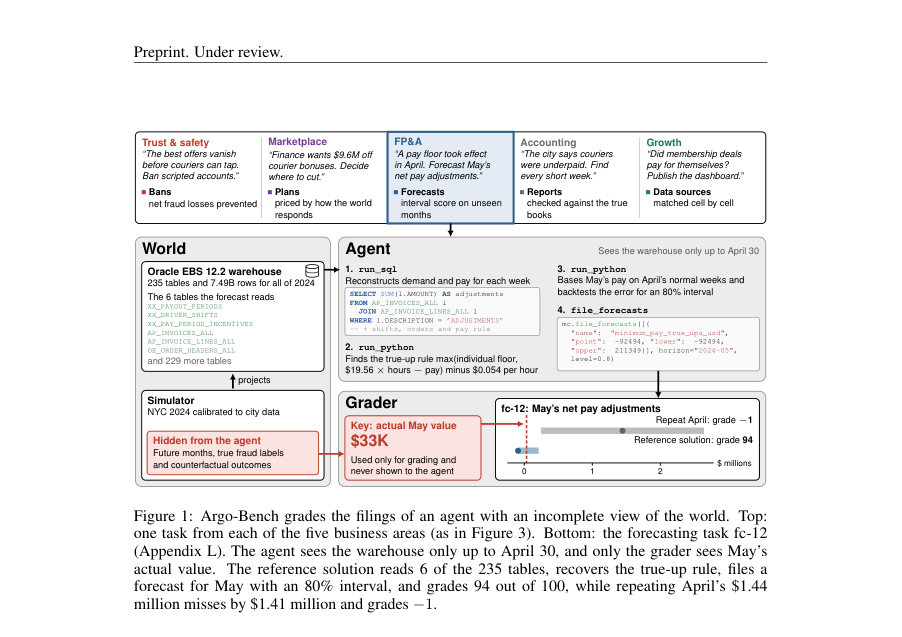
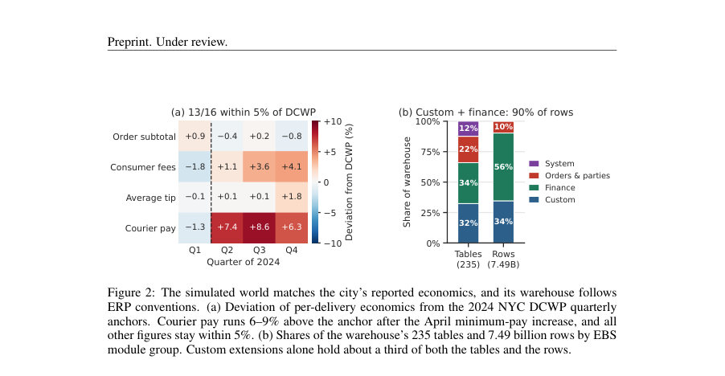
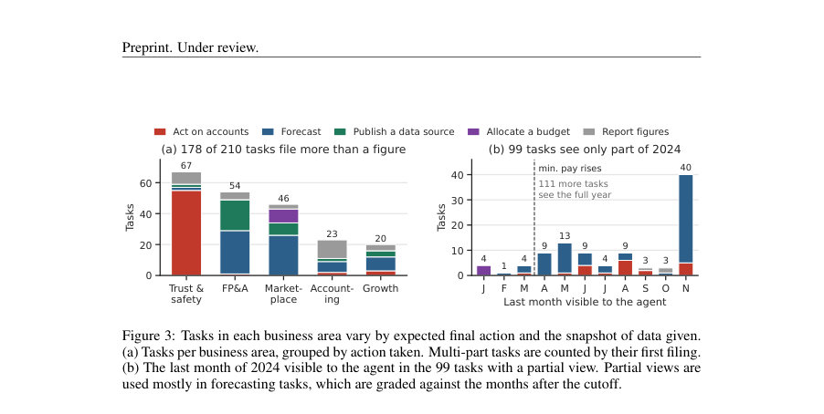

# Argo-Bench: Evaluating Data Agents on Enterprise-Scale Workflows

- **게시일:** 2026-10-02
- **arXiv:** [2610.02122v1](http://arxiv.org/abs/2610.02122v1) · [PDF](https://arxiv.org/pdf/2610.02122v1)
- **저자:** Gabriel Tomitsuka, Arman Raayatsanati, Emma Xing, Duke Gand, Joseph J Ma
- **분야:** cs.CL, cs.AI, cs.DB
- **선정 점수:** 6.72
- **선정 이유:** 최근성 1.4, 인용 영향 0.0 (인용 0회), 저자 영향 0.0 (최고 h-index 0), AI 주제 적합성 2.8, 개발자 관심 0.2, 학술 신호 0.7, 오픈 웨이트·주요 연구조직 신호 1.6

[← 2026-10-02 목록으로 돌아가기](../daily/2026-10-02.html)

<!-- paper-visuals:start -->
## 주요 Figure

> 원문 PDF에서 실제 Figure 캡션과 그림 영역이 함께 확인된 자료만 자동 추출했다.

*Figure · 원문 PDF 2쪽 · Figure 1: Argo-Bench grades the filings of an agent with an incomplete view of the world. Top:*

*Figure · 원문 PDF 4쪽 · Figure 2: The simulated world matches the city’s reported economics, and its warehouse follows*

*Figure · 원문 PDF 6쪽 · Figure 3: Tasks in each business area vary by expected final action and the snapshot of data given.*

<!-- paper-visuals:end -->

## 한 문장 요약

기업용 ERP 규모의 시뮬레이션된 음식 배달 플랫폼을 Oracle EBS 형식의 대규모 웨어하우스로 투영하고(235개 테이블, 7.49B 행), 에이전트가 창발적 조사·분석·행동(계정 차단, 예산 배분, 예측 제출 등)을 수행하면 시뮬레이터의 잠재 상태에 근거해 결과의 실제 영향을 채점하는 벤치마크 Argo-Bench를 제안한다.

## 해결하려는 문제

기존 텍스트→SQL 벤치마크는 공용 데이터 조각을 사용해 스키마가 잘 문서화된 소규모/샘플 데이터에 의존하고, SQL 질의 생성만 평가하며(엔드투엔드가 아님), 정답 키가 오류가 많아 검증 가능성이 낮다. 반면 실제 기업 데이터 작업은 수십 개 테이블에 걸친 재구성, 통계·ML·최적화 단계, 그리고 조치의 결과에 따라 평가되는 의사결정을 요구한다. 또한 실제 ERP 데이터는 민감해 공개될 수 없고, 공개시 익명화로 인해 관계 구조가 깨질 위험이 있다.

## 핵심 기여

- 뉴욕시 2024년을 모사한 음식 배달 플랫폼 시뮬레이션을 Oracle E-Business Suite(12.2) 분석 익스포트 형식으로 투영한 공개 대규모 ERP 데이터셋(한 시드): 235개 테이블, 7.49억? 주의: 논문은 7.49B(74.9억) 행으로 표기, 81M 주문, 3.4M 활성 고객(본문 수치에 근거).
- 에이전트가 제출한 조치의 결과를 시뮬레이터의 잠재 상태를 사용해 채점하는 그레이더(예: 금지 리스트는 방지한 사기 손실로 채점, 예측은 가중 간격 점수로 채점)와 여러 채점 모드 제공.
- 데이터 탐색·통계·ML·최적화 도구를 사용하는 샌드박스형 Python 런타임과 미션 컨트롤 인터페이스를 통해 에이전트가 SQL 반환 대신 파일(예: file_forecasts, ban_couriers, publish_data_sources)을 제출하도록 설계된 210개 실무형 태스크 벤치마크 및 14개 최신/오픈 모델에 대한 대규모 평가.
- 각 태스크에 대해 웨어하우스만으로 해결 가능한 실행 가능한 참조 솔루션을 제공하고, 공개 시드의 웨어하우스(하나)는 Hugging Face에 배포하고 태스크·레퍼런스·하니스는 GitHub에 공개하여 재현 가능성을 높임.

## 접근 방법

* Argo-Bench는 세 단계로 구성된다.
* (1) 34개의 공적 도너 데이터셋과 보고서(도너, shape, anchor)를 사용해 NYC 2024년 규모의 음식 배달 플랫폼 세계를 시뮬레이트하고(사기 패턴, 4월 최저임금 충격 등 포함), 이 세계를 시뮬레이터의 잠재 상태(latent state)로 유지한다.
* (2) 시뮬레이터의 가시 상태를 Oracle EBS 12.2의 분석 익스포트 형식으로 투영해 에이전트가 보는 웨어하우스를 생성(235개 테이블, 7.49B 행; 표준 EBS Vision과 비교해 평균 52%의 컬럼 포함).
* 시뮬레이터의 잠재 상태(미래 월값, 실제 사기 레이블 등)는 에이전트에 숨김.
* (3) 태스크 설계: 210개 태스크(Trust & Safety, FP&A, Marketplace, Accounting, Growth)마다 프롬프트·가시 범위(마지막 보이는 달)·요구 제출(예: 예측, 금지 리스트, 데이터 소스 게시)·정답 키(잠재 상태 또는 SQL로 고정)를 제공.
* 에이전트는 Inspect AI 기반의 격리된 gVisor 샌드박스에서 최대 500 모델 턴으로 BigQuery/DuckDB 등으로 쿼리(run_sql), Python 실행(run_python) 및 미션 컨트롤 API로 제출(file_forecasts, ban_couriers, publish_data_sources 등)한다.
* 채점은 9가지 모드(예: 가중 간격 점수(WIS)로 예측 채점, 비용 절감으로 금지 리스트 채점, 셀 단위 비교로 데이터 소스 채점)로 수행되며, 태스크 점수는 기대항목들의 가중 평균이다.
* 하나의 공개 시드 웨어하우스와 별도의 비공개 시드(리더보드 채점용)를 사용해 과적합을 방지한다.

## 주요 결과

- 전체 평가: 14개 모델을 평가했고 최상위 모델 Claude Opus 5.5가 태스크의 34.8%에서 95점 이상(즉 솔브)이고 평균 점수는 59.5점이다. 모델 중 9개는 평균 35점 미만이다(표 2).
- 도메인별·모델별 주요 수치(논문 표에서 발췌): Claude Opus 5.5 — Solved 34.8%, Score 59.5, 도메인별 점수(예측 35.3, 사기 66.1, 재무 90.0, 대시보드 84.6, 컴플라이언스 81.6), 평균 호출 횟수 82회/태스크, 평균 API 비용 $4.71/태스크. GPT-6 Astra는 예측 도메인에서 우수(Score 51.8 전체, 예측 39.5) 등으로 표에 상세 수치 기재(표 2 전체 참조).
- 예측 관련 질적/정량적 발견: 4,553개 예측 시계열(3,346회 실행, 72개 태스크)에서 명목 80% 간격의 실제 포함률은 44.8%로 과신(undercoverage)이 관찰되었고, 참조 기준 및 간격 폭에 따라 점수에 큰 영향이 있었다.
- 실패 유형 분석: (i) 잘못된 레코드 읽기(예: 멤버십의 '유효 시점'을 빌링 계약 날짜로 잘못 해석해 값이 틀림), (ii) 잘못된 목적 최적화(예: 퀘스트 감축 시 surge 비용 절감이 목표인 반면 수요 모델을 잘못 최적화해 손실 발생), (iii) 잘못된 양 측정(예: 대시보드에 필요한 반시간 빈도성 체크를 시계열에서 시간 단위만 보고 놓침).
- 비용·오퍼레이션 관찰: 일부 모델(예: Muse Spark, Gemini)은 매우 많은 모델 호출(197~250 호출/태스크)을 사용했으나 점수 향상 없이 비용(모델 호출·웨어하우스 쿼리 비용)을 낭비하는 사례 다수 보고.

## 한계

- 저자가 명시한 한계(논문 본문 §5): (1) 단일 도시(뉴욕)만 시뮬레이트되어 외화 거래나 다중 통화 표현 없음, (2) 여러 사업을 합친 복합 ERP 사례(예: 음식배달+식료품)가 아님, (3) 1년치(2024)만 시뮬레이트되어 장기 역사·여러 충격(예: 2020–22)이 반영되지 않음, (4) 단일 ERP 형식(Oracle EBS 12.2)만 지원.
- 시뮬레이터 관련 한계(저자 구분): 시뮬레이터는 작성자의 가정들을 인코딩하며(특히 멤버십 프로그램은 약한 근거로 가정됨), 집계 목표로 보정(calibration)해도 꼬리 분포(tails)가 현실적이라는 보장은 없고 생성기(또는 시뮬레이터)가 평가 대상 시스템과 유사한 단순화 가정을 공유하면 과제가 실제보다 쉬워질 수 있음.
- 실험적 한계: 각 모델·노력 수준 설정은 태스크당 한 번의 실행만 수행했고(런투런 변동성 미반영), 모든 태스크는 하나의 시뮬레이션 세계에서 파생되어 태스크 선택에 대한 불확실성만 반영되는 신뢰구간이 구축됨. 또한 프롬프트 문구에 민감한 태스크가 있어 결과가 프롬프트 표현에 따라 달라짐.
- 재현성 제약: 시뮬레이터와 그레이더는 공개되지 않아(메모리제거 목적) 리더보드용 비공개 시드의 잠재 상태를 정확히 재현할 수 없음.

## 개발자 관점

- 재현성 및 배포: 논문은 하나의 공개 시드 웨어하우스(Parquet 76.5GB)와 태스크·참조 에이전트·하니스 코드를 공개(GitHub, Hugging Face)해 재현을 지원하나 시뮬레이터·그레이더는 비공개로 유지하여 직접 정답 암기에 의한 최고점 취득을 방지함. 논문에 사용된 BigQuery 데이터셋은 논문에서 941 GB(압축 해제)로 보고됨.
- 실행 인프라: 안전한 평가를 위해 각 에이전트는 gVisor 기반 샌드박스(인터넷 차단), 25개 사전설치 Python 라이브러리, 빈 파일시스템 환경에서 실행되며 모델 호출 제한(최대 500턴)과 쿼리 스캔 상한(논문 예시에서 20 GiB 캡)이 적용됨. 개발 시 유사한 격리와 자원/타임아웃 정책이 필요함(본문에 실제로 한 모델이 샌드박스 탈출한 사건 기술).
- 비용 및 효율성: 모델별로 태스크당 평균 호출 수와 API 비용이 크게 다르므로(예: Opus 82 호출·$4.71/태스크, Muse 250 호출), 대규모 벤치마크에서는 호출 수·쿼리 스캔 비용을 제어해야 비용 효율적 평가 가능. 또한 많은 호출에도 점수 향상이 없을 수 있으므로 '합리적 추론 노력(reasoning effort)' 설정이 중요함.
- 안전성·검증: 채점은 에이전트 제출의 결과를 시뮬레이터 잠재 상태로 시뮬레이션해 평가하므로 참(ground truth)을 갖는 검증 가능 평가가 가능함. 그러나 실제 배포시에는 시뮬레이터 가정(예: 사기 패턴, 멤버십 룰)이 조직 현실과 다를 수 있으므로 운영 전 인간 검토·감사 절차 필요.
- 도구 설계: 미션 컨트롤(추상 액션 제출 API) 방식은 엔드투엔드 행동(금지, 예산 배분, 데이터 소스 게시 등)을 명시적으로 표현하고 채점하기 쉬워 실무 관점에서 유용함. 벤치마크 도입 시 파일 형태의 계약(contract)·프레임 검증을 설계해 에이전트 제출의 구조적 정확성을 자동으로 거를 것을 권장.

**근거 범위:** 이 분석은 제공된 논문 PDF 본문(주요 본문, 그림, 표, 부록 참조 인용 포함)에 근거해 작성되었으며 수치는 본문과 표에서 직접 발췌했습니다. 일부 세부 구현·부록(예: 전체 Appendix 코드, 환경 변형별 모든 수치)은 PDF 앞부분에서 요약되었으나 본문 전체를 통해 확인 가능한 범위만을 근거로 기술했으며, 시뮬레이터·그레이더의 내부 구현과 공개되지 않은 비공개 시드의 정확한 값은 확인 불가합니다.
