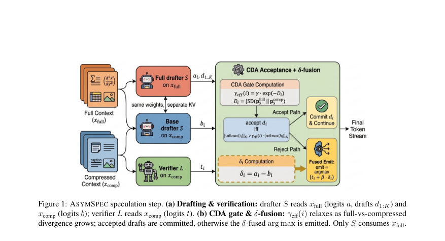

# AsymSpec: Context-Asymmetric Speculative Decoding for Agentic LLMs

- **게시일:** 2026-08-27
- **arXiv:** [2608.26004v1](http://arxiv.org/abs/2608.26004v1) · [PDF](https://arxiv.org/pdf/2608.26004v1)
- **저자:** Sheng Liang, Yongyue Zhang, Nathanael Brian, Hang Lv, Hao Wang, Chen Zhang, Yong Liu
- **분야:** cs.AI, cs.CL
- **선정 점수:** 5.63
- **선정 이유:** 최근성 1.2, 인용 영향 0.0 (인용 0회), 저자 영향 0.0 (최고 h-index 0), AI 주제 적합성 3.0, 개발자 관심 1.1, 학술 신호 0.3, 오픈 웨이트·주요 연구조직 신호 0.0

[← 2026-08-27 목록으로 돌아가기](../daily/2026-08-27.html)

<!-- paper-visuals:start -->
## 주요 Figure

> 원문 PDF에서 실제 Figure 캡션과 그림 영역이 함께 확인된 자료만 자동 추출했다.

*Figure · 원문 PDF 4쪽 · Figure 1: ASYMSPEC speculation step. (a) Drafting & verification: drafter S reads xfull (logits a, drafts d1:K) and*

<!-- paper-visuals:end -->

## 한 문장 요약

긴 컨텍스트가 압축된 상황에서, 경량 drafter가 전체 입력을 읽고 압축된 대형 verifier를 대조적(δ) 로짓 융합과 divergence-민감 수용 게이트로 조종해 거의 전체 문맥 정확도를 저비용으로 회복하는 비대칭 speculative decoding 프레임워크를 제안한다.

## 해결하려는 문제

대형 LLM 기반 에이전트 파이프라인은 검색, 툴 호출, 다중 턴 누적으로 컨텍스트가 길어지며 추론 비용이 급증한다. 실제 배포에서는 입력을 압축해 지연을 제어하지만 압축은 정확도를 크게 저하시킨다. 기존의 speculative decoding(SD)은 drafter와 verifier가 동일한 컨텍스트를 전제로 하므로, 압축으로 손실된 정보를 복구하지 못해 정확도–오버헤드 간 트레이드오프를 해결하지 못한다.

## 핵심 기여

- 비대칭 컨텍스트 접근을 허용하는 ASYMSPEC 프레임워크 제안: verifier는 압축된 뷰(x_comp)만 읽고, 경량 drafter는 전체 입력(x_full)을 읽어 verifier를 steer함으로써 압축된 비용에서 거의 최고 성능에 접근하는 운영점을 연다.
- same-model cross-context δ-fusion (δ = a − b) 제안: 동일 drafter의 full/comp 뷰에서의 로짓 차이를 이용해 drafter 고유의 편향을 상쇄하고 압축으로부터 얻는 정보 이득(context-gain)을 분리한다.
- Context-Divergence Acceptance(CDA) 게이트 제안: per-position Jensen–Shannon divergence(D_i)를 사용해 수용 임계값 γ_eff(i)=γ·exp(−D_i)를 동적으로 완화하여 검증 안정성과 높은 draft 수용율을 유지한다. 이 설계는 파라미터 불필요(스케일 튜닝 불필요)를 목표로 한다.
- 방법론의 범용성 실증: 텍스트 기반 다중-홉 QA, 다중턴 지시 이행, 툴 사용, 멀티모달 추론 및 두 개의 end-to-end 에이전트 벤치마크에서 평가하여, 평균적으로 전체 문맥 정확도의 ≈90%를 회복하고 텍스트 능력에서 1.3–1.7× 처리량 향상 및 0.2–0.3× FLOPs를 달성함을 보였다.
- 크로스-모달 확장과 교체-가족(모델간) 이식성 실험 수행: 비전–언어 drafter가 픽셀을 보고 텍스트 전용 verifier를 조종하는 등 모달리티 차이를 허용하며, Qwen–Llama 같은 이종 조합에서도 일부 회복 가능성을 보였다.

## 접근 방법

* 문제 설정: 큰 verifier L(예: Qwen3-32B)은 비용의 대부분을 차지하고, 작은 drafter S(예: Qwen3-4B)는 추가 전방비용이 미미하다는 구조적 비대칭을 이용한다.
* 한 스텝의 추론 루프(기본 K=2)는 다음 세 전방패스로 구성된다: (1) Augmented drafter: S(x_full) → 로짓 a를 계산하고 K 초안 토큰 d_{1:K}를 샘플링, (2) Base drafter: S(x_comp) → 로짓 b를 동일한 위치에서 계산, (3) Verifier: L(x_comp) → 모든 K 초안에 대한 로짓 t를 병렬로 계산.
* δ-fusion: 각 위치 i에서 δ_i = a_i − b_i로 정의하여 drafter의 컨텍스트 의존 변화를 분리한다.
* 거부 발생 시 verifier의 로짓에 β·δ_i를 더해 d'_i = argmax( t_i + β δ_i )로 융합(β ∈ [0,1], 기본 β=1.0).
* CDA: per-position divergence D_i를 JSD(softmax(a_i) ∥ softmax(b_i))로 계산하고 γ_eff(i)=γ·exp(−D_i)(기본 γ=0.5)로 수용 기준을 완화한다.
* 수용 판정은 softmax(t_i)[d_i] > γ_eff(i)·softmax(b_i)[d_i]이면 초안을 수용하고, 첫 거부 지점에서 δ-융합 후보를 방출한다.
* 크로스-모달: drafter가 픽셀/이미지를 입력받아 δ와 γ_eff를 동일한 출력 어휘 V에서 계산하므로 drafter 입력 모달리티가 달라도 동작한다.
* 구현상 vLLM 코드 경로에 대한 다섯 가지 패치(픽셀 캐시, vision-tower 전방·임베딩 캐시, M-RoPE 핸드컴퓨트, mm_embed_inputs 경로, aug-substitution gate 완화)가 필요함을 보고한다.
* 디코딩은 결정적(τ=0) 그리디 방식을 기본으로 삼는다.

## 주요 결과

- 주요 벤치마크: LongBench(장문 멀티홉 QA: hotpotQA/2WikiMQA/MuSiQue), MultiChallenge(다중턴), API-Bank(툴 사용), MathVista(멀티모달), GAIA 및 SimpleQA(엔드투엔드 에이전트).
- 텍스트 능력(격리된 벤치마크)에서 ASYMSPEC은 평균적으로 전체 문맥(Ceiling)의 약 87–99% 범위를 달성하여 대략 ≈90% 회복을 보고함(논문 요약 수치).
- 효율성: 격리된 텍스트 능력에서 처리량은 1.3–1.7× 향상, 전단계(FLOPs)는 0.2–0.3× 수준으로 절감(압축 정도에 따라 0.19–0.80× 범위, Table 5).
- LongBench(각 서브셋): Floor(압축된 verifier 단독)→AsymSpec 성능 예: hotpotQA Floor 49.4 → AsymSpec 64.0; 2WikiMQA Floor 52.8 → AsymSpec 66.8; MuSiQue Floor 32.7 → AsymSpec 48.4 (Ceiling 각각 64.9/76.5/55.0). ASYMSPEC은 Floor–Ceiling 갭의 약 59–94%를 회복함.
- 압축 심각도에 따른 회복(Truncation sweep): LongBench에서 verifier 토큰 예산 500일 때 Floor 25.8 → AsymSpec 52.5(+26.7), 1500→32.6→53.7(+21.1), 12000→63.1→63.9(+0.8)로 압축이 심할수록 회복 폭이 커짐(Table 2).”, 

## 한계

- 저자가 명시한 한계: (1) 복구 성능은 근본적으로 압축된 뷰가 보유한 정보와 drafter의 용량에 의해 제한된다. 압축이 거의 무손실인 작업에서는 개입이 거의 없음. (2) 크로스-모달 설정에서 복구 상한은 이미지→캡션 변환의 충실도에 의해 제한되며, 픽셀을 직접 처리하는 더 풍부한 멀티모달 drafter 통합이 필요하다. (3) 교차-패밀리 δ-융합은 명시적 어휘 및 로짓 정렬을 요구하며, 일반 이식성은 모델 페어에 따라 달라진다. (4) verifier의 로짓 접근이 필요하므로 로짓을 노출하지 않는 상용 API에는 적용 불가. (5) 평가와 설계는 결정적 그리디(τ=0) 디코딩에 집중되어 있으며 확률적 샘플링(τ>0)으로 일반화되지 않음.
- 실험 범위에서 확인되는 제약(본문 근거): (1) 방법은 엄밀한 손실 없음(lossless) SD가 아니며, greedy emission을 목표로 하는 'speculative-style steering'로서 목표 분포 보존을 보장하지 않는다(§3.3). (2) 드래프터 용량 하한: ≤0.6B 모델은 신뢰할 수 있는 context-gain 신호를 추출하지 못했고 ≥1.7B가 실용적 최소치로 확인되었다(§6.4). (3) 크로스-패밀리 전송 회복은 페어마다 상이—Qwen-4B→Qwen-32B 조합이 가장 높은 회복을 보였고 이종 조합은 더 낮은 회복을 보였다(표 D).

## 개발자 관점

- 재현·구현: 기본 환경은 vLLM 기반이며 크로스-모달을 위해 원문에 명시된 5개 패치(픽셀 캐시, vision-tower 임베딩 캐시, M-RoPE 핸드컴퓨트, mm_embed_inputs 경로, aug-substitution gate 완화)를 적용해야 한다(섹션 E).
- 하이퍼파라미터·설정: 기본값은 K=2, β=1.0, γ=0.5, 결정적 그리디 디코딩(τ=0), Qwen3-32B verifier와 drafter는 4B가 기본(실험에서는 0.6/1.7/4B 탐색). CDA는 JSD 기반으로 파라미터 보정 불필요하며 γ∈[0.4,0.7]과 β∈[1.0,2.0]에서 민감도가 낮게 보고되었다.
- 운영·배포: 비용 절감 효과은 verifier에 대한 압축 여유(token-ratio)에 직접적으로 비례함(Table 5). 따라서 시스템에 적용 전 압축 비율을 평가해 회복 대비 비용 이득을 예측하면 유용하다. 라이브 에이전트 루프에서는 온라인 재압축을 사용해도 수용률(AR≈0.78–0.92)이 안정적으로 유지되어 실서비스에 적용 가능하다(표 13).
- 제약·호환성: verifier 로그잇 접근이 필수이므로 사내 모델 또는 로그잇을 제공하는 배포 환경에서만 적용 가능하다. 상용 black-box 텍스트 API(로짓 비공개)엔 직접 적용 불가.
- 안전성과 신뢰성: ASYMSPEC은 근손실(near-lossless) 작업에서 최소 개입을 보이며 과잉 개입으로 인한 허위 생성(hallucination)을 의도적으로 유발하지 않도록 설계되었다. 그러나 비결정적(샘플링) 디코딩과의 결합 등 추가 범위에서는 보수적 검증이 필요하다.

**근거 범위:** 이 분석은 제공된 논문 PDF 본문(페이지 1–20 및 부록 A–G) 기반으로 작성되었다. 본문에서 직접 명시된 알고리즘(δ-fusion, CDA 수식, Algorithm 1), 하이퍼파라미터(K, β, γ), 실험 결과 표(Table 1–21), 구현 패치(섹션 E) 및 저자가 명시한 한계들을 근거로 정리했다. PDF에 포함되지 않았거나 본문에서 상세히 기술되지 않은 미세한 구현 세부사항(예: 특정 런타임 커널 최적화, 하드웨어별 배치 전략)은 재구성하지 않았으며 그 부분은 원저자 구현 저장소를 참조해야 한다.
