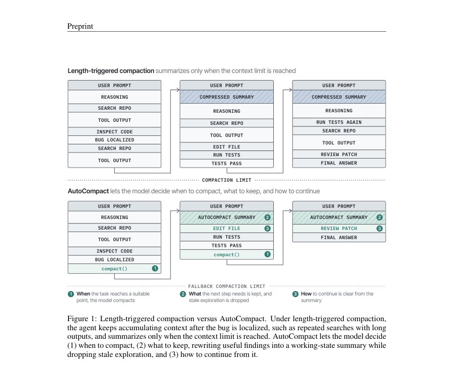
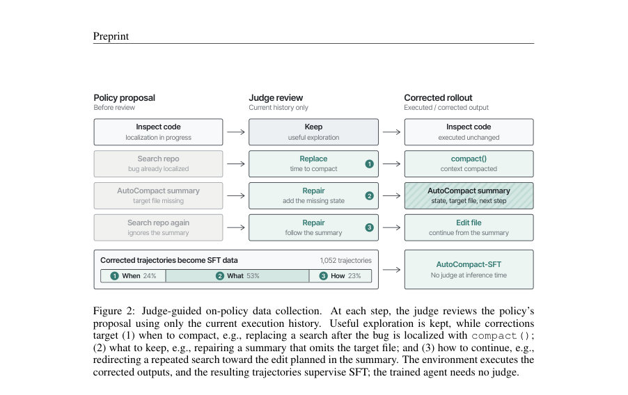
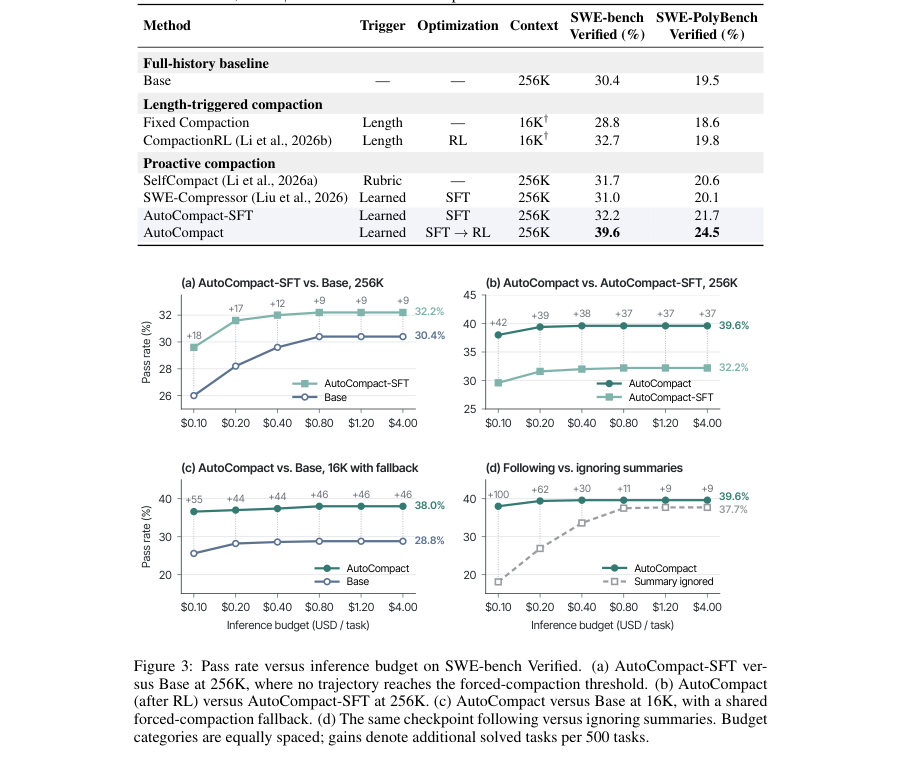

# AutoCompact: Learning When to Compact Context in Long-Horizon Coding Agents

- **게시일:** 2026-10-03
- **arXiv:** [2610.02163v1](http://arxiv.org/abs/2610.02163v1) · [PDF](https://arxiv.org/pdf/2610.02163v1)
- **저자:** Xuan Zhang, Longtao Zheng, Cunxiao Du, Bo An, Xin Dong
- **분야:** cs.CL
- **선정 점수:** 6.81
- **선정 이유:** 최근성 0.8, 인용 영향 0.5 (인용 2회), 저자 영향 1.5 (최고 h-index 12), AI 주제 적합성 2.7, 개발자 관심 1.1, 학술 신호 0.3, 오픈 웨이트·주요 연구조직 신호 0.0

[← 2026-10-03 목록으로 돌아가기](../daily/2026-10-03.html)

<!-- paper-visuals:start -->
## 주요 Figure

> 원문 PDF에서 실제 Figure 캡션과 그림 영역이 함께 확인된 자료만 자동 추출했다.

*Figure · 원문 PDF 2쪽 · Figure 1: Length-triggered compaction versus AutoCompact. Under length-triggered compaction,*

*Figure · 원문 PDF 3쪽 · Figure 2: Judge-guided on-policy data collection. At each step, the judge reviews the policy’s*

*Figure · 원문 PDF 6쪽 · Figure 3: Pass rate versus inference budget on SWE-bench Verified. (a) AutoCompact-SFT ver-*

<!-- paper-visuals:end -->

## 한 문장 요약

AutoCompact은 에이전트에게 compact() 행동을 부여하고, 온라인 판정자(judge)가 보정한 온-폴리시 궤적으로 SFT를 초기화한 뒤 최종 성공 보상으로 컴팩션 시점, 요약(working state) 작성, 및 요약 이후의 연속 행동을 공동으로 학습시켜 장기 소프트웨어 엔지니어링 작업의 성공률을 높인다.

## 해결하려는 문제

레포지토리 수준의 코딩 에이전트는 긴 탐색·편집·테스트 궤적을 쌓는 동안 초기 탐색 정보가 오래되어 구식(=stale)이 되므로 단순히 컨텍스트 오버플로를 피하는 것을 넘어서 '언제(compact 시점)', '무엇을(작업 상태로 보존할 정보)', '어떻게(요약 이후 연속 행동)'를 결정해야 한다. 기존 방법들의 한계는 다음과 같다. 길이 기반(length-triggered) 컴팩션은 컨텍스트 용량에만 의존해 작업 진행 중에 불필요한 탐색이 누적되도록 방치할 수 있고, 룰/루브릭 기반의 추론시(compaction at inference-time)에는 그 결정에 대한 학습 신호가 없어 요약 품질이나 요약에 따른 후속 행동을 개선할 수 없다. 오프라인 삽입 방식(SFT로 컴팩션 콜을 삽입)은 삽입 이후의 실제 실행 행동을 감독하지 못해 요약 이후 행동의 실패를 바로잡지 못한다.

## 핵심 기여

- AutoCompact 설계: 모델이 언제 compact()를 호출할지, 어떤 정보를 '# Auto Context Summary'로 남길지, 요약 이후 어떻게 계속할지를 정책의 일부로 학습하도록 하는 메커니즘을 제안함.
- 판정자(critic/judge) 기반 온-폴리시 데이터 수집: 기본 에이전트의 실행을 판정자가 현재 히스토리만 보고 검토해 (1) compaction 트리거, (2) 작업 상태 요약, (3) 요약 이후의 연속 행동을 보정하고 보정된 출력을 환경에서 즉시 실행하여 총 1,052개의 보정된 궤적을 수집함.
- 두 단계 학습 파이프라인: 보정된 궤적으로 표준 다음-토큰 예측 SFT(2 epoch)로 초기화한 뒤, 결과 기반(outcome-based) RL(GRPO)을 통해 단일 이진 작업 성공 보상만으로 코딩과 컴팩션을 공동 최적화함.
- 실험적 효능 증명: SWE-bench Verified와 SWE-PolyBench Verified에서 AutoCompact는 베이스 모델 대비 절대 9.2%와 5.0%의 패스률 향상을 달성하고(각각 39.6% 및 24.5%), 다양한 추론 예산과 컨텍스트 설정(256K와 16K with fallback)에서 이득이 유지됨.
- 행동 기여 분해: 학습된 정책 자체의 개선뿐 아니라 실제로 compact()를 실행하는 것이 성능 향상에 기여함을 보여줌(같은 체크포인트에서 compact()를 무시하면 성능 하락).

## 접근 방법

* AutoCompact은 REPL 기반 스캐폴드에 모델-호출형 행동 compact()를 추가한다.
* compact()는 이전 상호작용 히스토리를 '# Auto Context Summary' 헤딩의 작업 상태 요약으로 대체하고 최근 토큰·원래 작업(task) 등은 보존한 채 실행을 이어가도록 한다.
* 데이터 수집 단계에서는 기본 모델을 실행하는 동안 GPT-5.5-Codex 판정자가 현재 이용 가능한 히스토리만 보고 제안된 출력(컴팩션 호출, 생성된 요약, 요약 이후 첫 행동 등)을 판정한다.
* 판정자는 세 종류의 보정을 수행한다: 트리거 보정(언제 compact할지), 작업 상태 보정(요약이 보존해야 할 결론·관련 코드·남은 액션을 포함하는지), 연속성 보정(요약 이후 첫 행동이 요약과 일치하는지).
* 판정자가 불만족 출력은 수정된 출력으로 대체하고 그 수정된 출력을 환경이 즉시 실행하므로 보정은 이후 궤적에 영향을 준다.
* 이렇게 얻은 1,052개의 보정 궤적으로 SFT(다음-토큰 예측, 2 epoch, lr=5e-7, batch=8)를 수행해 AutoCompact-SFT를 얻는다.
* 이후 SWE-Gym에서 GRPO 기반의 outcome-based RL로 추가 학습을 진행한다.
* RL은 각 작업당 8개 롤아웃을 샘플링하고 최종 패치가 테스트를 통과하면 이진 보상을 부여하며, 롤아웃 그룹 내에서 상대적 이득(advantages)을 계산해 모든 토큰(컴팩션 결정·요약·후속 행동 포함)에 동일한 결과 기반 신호를 전달한다.
* 컴팩션 콜로 인한 컨텍스트 재작성 때문에 하나의 궤적은 컴팩션 지점마다 세그먼트로 나누어 토큰 수준 손실을 평균화해 학습한다.
* RL 하이퍼파라미터로는 lr=1e-6, batch=64, 롤아웃 상한 50 환경 단계 및 32K 토큰 등이 사용되었다.
* 베이스 모델은 Qwen3-Coder-30B-A3B-Instruct이고 판정자·훈련·평가는 논문에 명시된 SWE-rebench/SWE-Gym·SWE-bench Verified·SWE-PolyBench Verified 벤치마크에서 수행되었다.

## 주요 결과

- 전체 실행(무제한 비용)에서 주요 패스율: Base는 SWE-bench Verified 30.4% 및 SWE-PolyBench Verified 19.5%를 기록했고, AutoCompact-SFT는 각각 32.2% 및 21.7%를 기록했으며, AutoCompact(SFT→RL)는 각각 39.6% 및 24.5%를 기록해 Base 대비 절대 9.2% 및 5.0%의 향상을 보였다.
- 동일한 베이스 모델·스캐폴드 비교에서 Fixed Compaction(길이 기반)은 28.8%/18.6%, CompactionRL(길이 기반+RL)은 32.7%/19.8%, SelfCompact(룰 기반)은 31.7%/20.6%, SWE-Compressor(SFT 기반)는 31.0%/20.1%를 기록해 AutoCompact 계열이 우수했다(표 1).
- 온-폴리시 판정자 수집 통계: 379개의 SWE-rebench 작업에서 1,052개의 판정자 보정 궤적을 수집했고 이 중 24%가 트리거 보정, 53%가 작업 상태 보정, 23%가 연속성 보정에 해당했다.
- 컴팩션 행동 및 요약 품질 변화: Base는 거의 컴팩션을 사용하지 않았고 AutoCompact-SFT는 전체 작업의 44.3%에서 컴팩션을 호출했으며 AutoCompact는 58.5%로 증가했다. 키 상태 누락(요약이 관련 상태를 누락)의 비율은 SFT 이후 3.1%에서 RL 후 0.2%로, 다음 동작 누락은 8.2%에서 2.2%로 감소했다(500개 SWE-bench Verified 작업에 대한 키워드 기반 선별 및 무작위 실사로 계산).
- 컴팩션 실행의 기여: 동일 체크포인트에서 compact() 호출을 건너뛰면 성능이 떨어지며, 특히 저비용(추론 예산) 상황에서 차이가 큼. 예컨대 $0.10 예산에서 실행 시 우위는 19.9%였고 $4.00에서 1.9%의 이득이 유지되었다(그림 3(d)).

## 한계

- 저자 명시 제한: RL 학습은 32K 토큰 시퀀스 제한으로 수행되었는데, 평가에서는 256K 컨텍스트 윈도우를 사용하므로 학습 시퀀스 길이가 평가 컨텍스트보다 짧다는 점을 저자가 한계로 명시함.
- 저자 명시 제한: 연구는 단일 스캐폴드(REPL 기반)에서의 모델-하니스(co-design) 설정을 다루며, 다른 에이전트 하니스(예: Codex나 Claude Code의 자동 길이 기반 컴팩션)와의 결합성은 향후 작업으로 남김.
- 실험적 제약(본문에서 확인 가능한 범위): 판정자(데이터 수집 시)는 GPT-5.5-Codex로 자동화되어 있으며, 판정자의 설계·정확도에 대한 상세한 인간 검증·오류 분석은 본문에 제한적으로 제시되어 있어 판정자 편향이나 오류가 수집 데이터에 미친 영향은 추가 분석이 필요함.
- 재현 관련 제약: 학습에 사용된 컴퓨팅 규모, RL 학습 안정성 세부(예: GRPO 그룹 크기 외의 인프라·시간 비용)는 본문에 일부 하이퍼파라미터만 제시되어 있어 완전한 재현을 위해 추가 정보가 필요함.

## 개발자 관점

- 구성요소 재현: AutoCompact를 구현하려면 REPL 스캐폴드에 모델-호출형 compact() API를 노출하고 compact()가 '# Auto Context Summary' 헤더로 이전 히스토리를 요약해 대체하도록 해야 한다.
- 데이터 수집 팁: 판정자 기반 온-폴리시 보정은 SFT 초기화를 위해 중요하다. 본 논문은 GPT-5.5-Codex를 판정자로 사용해 379개 작업으로부터 1,052개 보정 궤적을 수집했고, 수집 중 보정 유형(트리거/작업 상태/연속성)을 분류해 비율을 제시함(24%/53%/23%).
- 학습 파이프라인: 보정 궤적으로 SFT(다음-토큰 예측)로 행동 초기화를 수행한 뒤 outcome-based RL(GRPO)로 단일 이진 작업 성공 보상만으로 컴팩션·코딩을 공동 최적화하는 것이 효과적이었다. RL 단계의 구현상 주의점은 컴팩션 시 컨텍스트 재작성으로 궤적을 세그먼트로 나누어 각 세그먼트에 동일한 우수성 신호(advantage)를 전달해야 한다는 점이다.
- 운영·배포 시 이점: 컴팩션은 큰 컨텍스트 윈도우(256K)에서도 유용하며, 특히 추론 비용 제약(저비용 예산)에서 비용 효율을 크게 개선한다. 따라서 실제 배포에서는 proactive compact()를 도입하되 기존의 길이 기반 강제(compaction fallback)와 병용하는 전략이 권장된다.
- 비용·측정: 논문은 추론 비용을 토큰 사용량과 클라우드 요금(Alibaba Cloud Model Studio 가격 기준, 프리픽스 캐싱 토큰은 20% 가격)을 사용해 평가했으므로 유사한 비용 평가를 하려면 사용 중인 인프라의 토큰 요금·캐싱 정책을 반영해야 한다(재현 시 유의).

**근거 범위:** 논문 PDF 본문(제공된 페이지 1–11) 기반 분석이다. 핵심 수치(패스율, 수집된 궤적 수 등), 학습 절차, 하이퍼파라미터, 판정자 사용 등은 본문에서 직접 인용하였다. 다만 판정자의 내부 규약 세부사항, 전체 컴퓨팅 비용·학습 시간, RL 학습 안정성 등 일부 구현 세부는 본문에 한정적으로만 제시되어 있어 해당 부분의 완전한 재현을 위해서는 추가 정보(저자 코드/보조 자료)가 필요할 수 있다.
