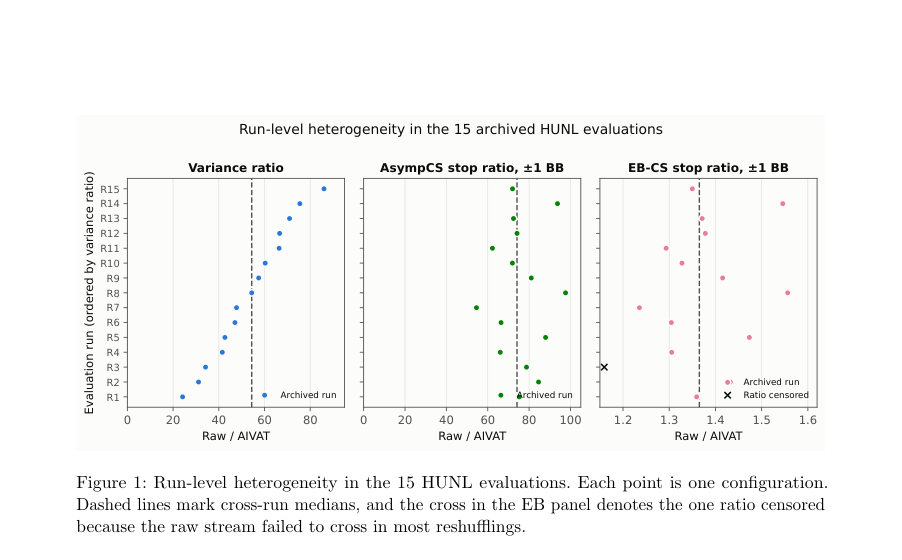
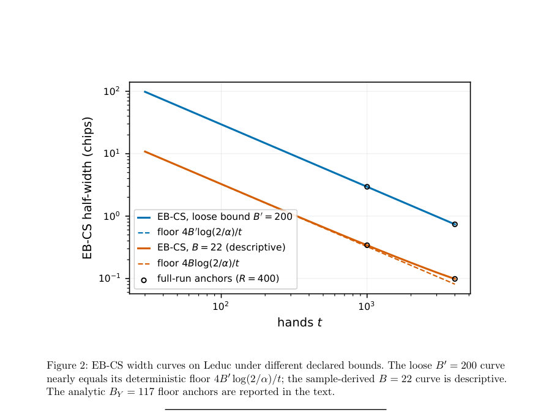
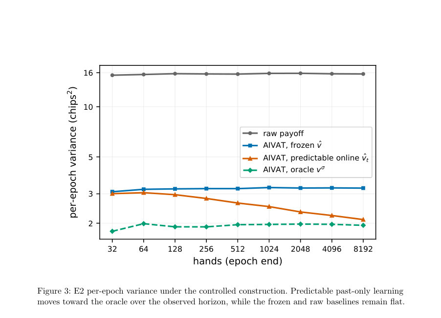

# AV-AIVAT: 74x Cheaper Agent Evaluation with Certified Anytime-Valid Stopping in Imperfect-Information Games

- **게시일:** 2026-08-08
- **arXiv:** [2608.06362v1](http://arxiv.org/abs/2608.06362v1) · [PDF](https://arxiv.org/pdf/2608.06362v1)
- **저자:** Boning Li, Yu Chen, Longbo Huang
- **분야:** cs.GT, cs.AI, cs.CL, cs.LG, cs.MA
- **선정 점수:** 5.00
- **선정 이유:** 최근성 0.7, 인용 영향 0.0 (인용 0회), 저자 영향 0.0 (최고 h-index 0), AI 주제 적합성 3.0, 개발자 관심 0.8, 학술 신호 0.5, 오픈 웨이트·주요 연구조직 신호 0.0

[← 2026-08-08 목록으로 돌아가기](../daily/2026-08-08.html)

<!-- paper-visuals:start -->
## 주요 Figure

> 원문 PDF에서 실제 Figure 캡션과 그림 영역이 함께 확인된 자료만 자동 추출했다.

*Figure · 원문 PDF 14쪽 · Figure 1: Run-level heterogeneity in the 15 HUNL evaluations. Each point is one configuration.*

*Figure · 원문 PDF 15쪽 · Figure 2: EB-CS width curves on Leduc under different declared bounds. The loose B′ = 200 curve*

*Figure · 원문 PDF 16쪽 · Figure 3: E2 per-epoch variance under the controlled construction. Predictable past-only learning*

<!-- paper-visuals:end -->

## 한 문장 요약

비교 평가에서 AIVAT의 분산감소를 시간일관적(언제든지 유효한) 신뢰구간(Confidence Sequences)과 결합해 평가를 증거가 충분할 때 즉시 중단하면서도 유효성을 보장하는 AV-AIVAT를 제안한다.

## 해결하려는 문제

대응 과제는 두 에이전트의 평균 성능 차이를 검증하는 데 필요한 게임 수가 불확실하고, 매 게임마다 비용이 발생하는 상황에서 '충분한 증거가 쌓이는 즉시' 중단하되 통계적 보장을 유지하는 것이다. 고정 표본(fixed-sample) 간격을 반복 관찰하며 선택적으로 중단하면 표준 신뢰구간의 공신력이 깨져 거짓양성이 증가한다. 기존 AIVAT는 불완전정보 게임에서 분산을 크게 줄이지만 언제 중단해야 하는지는 제공하지 않는다. 따라서 (1) 평가 도중 가치모델을 업데이트해도 각 손이 자기 자신의 보정을 사용하지 않도록 보장할 수 있는가, (2) 분산 감소가 실제로 필요 게임 수 감소로 이어지는가, (3) 제3자가 조기 중단 주장을 재검증할 수 있도록 어떤 정보를 공개해야 하는가가 핵심 연구 질문이다.

## 핵심 기여

- AV-AIVAT: 예측 가능(predictable) AIVAT 인터페이스를 제시하여, 각 보정에서 조건부 행동 커널과 보정 사용 여부를 사전에 고정하고 과거만을 이용한 가치업데이트를 허용함으로써 보정의 조건부 평균영(0) 성질을 보존함.
- 이론적 분리 및 증명: 과거-전용(value predictable) 업데이트가 보정의 무편향성을 유지함을 보이고(Proposition 1), AsympCS(비대칭적 시간균일 CLT 기반)와 EB-CS(예측가능한 empirical-Bernstein CS)의 서로 다른 가정과 보장을 엄밀히 분리함(Proposition 2, Theorem 1).
- 범위-유도 폭(floor) 분석: EB-CS에 적용되는 베트 캡(λ≤1/2)에 의해 선언된 보상 범위 B가 결정적인 반너비(floor)를 유발함을 보이고( Lemma 1), 이로써 분산감소가 조기중단으로 얼마나 전환되는지를 세-구간(order-level) 설계 지표로 정형화함.
- 실험적 결과: HUNL(71,439 paired hands, 15 구성)에서는 AIVAT가 중앙값 54× 분산감소를 달성하고, AsympCS를 사용하면 ±1 BB 목표에서 raw 대비 중앙 손수요비율이 74×로 감소함을 보였음(문헌 표기).
- 재현성 규약 제안: 조기중단 주장을 제3자가 동일한 정지시점에서 재확인할 수 있도록 보정된 접두(prefix) Y1:t, 정지규칙·지정 경계·보정에 대한 근거·커널/활성화 메타데이터 등을 공개하는 프로토콜을 제시함.

## 접근 방법

* 전체 접근은 AIVAT 보정과 시간일관 신뢰구간(CS)을 결합한 프로토콜(Algorithm 1)이다.
* 구성요소는 다음과 같다.
* 1) AIVAT 보정: 유한한 보정노드 집합 Hc에서, 각 보정노드 h에 대해 보정 사용 여부 St,h는 액션 관찰 전에 Ft−1(과 그 노드 직전 정보)로 확정되고, 알려진 조건부 행동커널 pt,h이 주어지면 보정 Ct는 기대값을 빼는 형태로 정의되어 Ct의 Ft−1 조건부 기댓값은 0이 된다(식(3)).
* 2) 예측가능한 가치함수(vt): 평가중 vt는 반드시 손 t가 관찰되기 이전의 정보 Ft−1만 사용하여 고정되어야 하며, 이후 손은 vt+1을 만들 때 사용될 수 있다.
* 이 조건이 보정의 무편향성을 보장한다(Prop.1).
* 3) 두 종류의 CS를 병행: (a) EB-CS(예측가능한 empirical-Bernstein, λt∈[0,1/2] 캡 포함)는 관찰 스트림이 선언된 범위 [−B,B]를 갖고 그 범위가 독립적으로 정당화될 때 유한표본에서 시간일관(exact) 보장을 제공한다(식(4)); (b) AsympCS(시간균일 CLT 기반, 식(5))는 실현 분산을 추적해 효율적 폭을 제공하지만 가정은 비대칭적·점근적 조건(마팅게일 Lindeberg 등)을 요구한다.
* 4) 운영 프로토콜(Algorithm 1): 각 손 t에서 수행자는 (i) 보정 커널과 St,h를 사전기록(보정 활성화는 사전확정), (ii) 손을 플레이해 Xt 관찰, (iii) Yt = Xt + Ct 계산, (iv) AsympCS(및 BY가 독립적으로 정당화되면 EB-CS) 업데이트, (v) vt+1은 Ft만을 사용해 재적합 가능.
* 5) 공개·재현 규약: 조기중단 주장을 재현하려면 Y1:t, 정지규칙·정지인덱스·first-look·검열 메타데이터, 선언된 BY와 CS 설정, 그리고 보정 커널과 활성화 근거를 공개하면 충분함.

## 주요 결과

- HUNL(P0, 15 PokerSkill/LLM 구성, 71,439 paired hands): AIVAT가 per-hand 분산을 중앙값 54.4× 감소시킴(범위 [24.2,86.0]). AsympCS에서 목표 ±1 BB일 때 raw 대비 AIVAT의 중앙 정지시간 비율은 74.17×(범위 [54.53,97.62])로 보고됨. EB-CS(묘사적 실행, n=14)는 동일 목표에서 정지시간 비율 중앙값 1.365×(범위 [1.235,1.556])를 보임(한 run은 교차 검열로 제외). AIVAT AsympCS의 ±0.5 BB 목표에서 각 run 내 200번 섞음의 중앙 정지 시간의 중간값은 56.5 hands(범위 42.5–71); 동일 목표에서 모든 raw AsympCS는 주어진 런 길이(4,028–5,000)에서 검열됨.
- A2(연속 모니터링 시뮬레이션, H0 constructed pool, 2,000 entries of 5,000 hands): 고정표본(일반 CI)을 첫 긍정적 관찰 시 중단하면 1,227/2,000(61.35%)의 허위 주장 발생(중앙 주장 정지 59 hands). 동일한 선택된 접두(prefix)에 대해 EB-CS는 1,227/1,227에서 0을 포함했고 AsympCS는 1,226/1,227에서 0을 포함하여(검증 시점에서) 대다수 조기주장을 차단함. EB-CS의 독립실행(최대 길이 5,000) 탐지율은 0/2,000, AsympCS는 208/2,000.
- Leduc(완전 트리·구조적 경계 사례): 원시 |X|≤13, |v|≤13이며 보정된 Y는 구조적으로 |Y|≤117이라는 분석적 경계 산출. E1(400 replications × 4,000 hands): raw 표준편차 3.96, AIVAT 1.39 → 분산비 8.08×. AsympCS 정지비율은 ±0.5 chips에서 중앙 5.29×, ±0.2에서 7.91×; ±0.1에서는 모든 raw 스트림이 검열되는 반면 AIVAT는 중앙 1,789 hands에서 멈춤. EB-CS(분석적 BY=117)에서 raw는 400중 2번, AIVAT는 0번으로 진짜 평균을 제외(보증과 일치).
- E2(대조 실험, 100 세트 각 8,192 hands): 표준편차(원시/고정값/예측업데이트/오라클) = 3.97, 1.80, 1.49, 1.40. AsympCS 중앙 정지시간 τ(±0.5) = raw 607, frozen 164.5, predictable 156, oracle 118.5; τ(±0.2) = raw 3759.5, frozen 754, predictable 649, oracle 473; τ(±0.1) = raw 검열, frozen 3078, predictable 2280, oracle 1786. 예측적 온라인 학습은 두 mismatch 프로필에서 frozen→oracle 분산격차의 77–79%를 회복함.
- 유효성·교정 요약: EB-CS는 베트 캡으로 인해 반너비 하한 w≥4B log(2/α)/t을 갖는다는 이론적Lemma(1)를 확인함. P0에서는 원시 스트림의 B=200 BB가 구조적으로 정당화되었으나 보정스트림에 대해선 독립적 경계가 제공되지 않아 EB-CS는 서술적(explanatory)으로 실행됨. AsympCS의 경험적 finite-horizon 탈락률(예: P0 평균 7.1067% over 30 conditions)과 E2의 보정된 교정(held-out) 절차가 보고됨.

## 한계

- 저자 명시 한계: EB-CS의 정확한(유한표본) 보장은 corrected payoff에 대해 데이터-독립적으로 정당화된 거의-확실 경계(BY)가 있을 때만 성립함. HUNL에서는 corrected stream에 대한 독립적 B를 제공하지 못해 EB-CS 실행이 묘사적(descriptive)임을 저자가 명확히 밝힘.
- 비교 방법의 한계(저자·실험에서 드러남): AsympCS 보장은 점근적이며 마팅게일 Lindeberg·비퇴화된 평균 조건 등 가정을 필요로 하므로 유한표본에서의 엄밀한 보장은 경험적 보정/교차검증으로 평가해야 함.
- 실험 범위 제약: HUNL 실험은 15개 구성, 71,439 paired hands에 한정되며(플랫폼·상대·구성 다양성 제한), A2의 연속모니터링 시뮬레이션은 개별 손을 재샘플링해 시간의존성과 런-레벨 군집을 보존하지 않음.
- 구현·데이터 의존성: AIVAT 보정의 타당성은 알려진 조건부 행동커널과 보정 활성화의 사전고정(예측가능성)에 의존하므로 실제 플랫폼에서 이 정보를 정확히 기록·공개하지 못하면 보장 불가.

## 개발자 관점

- 재현성: 조기중단 주장을 공개 가능한 방식으로 재현하려면 보정된 접두 Y1:ˆt, 정지규칙·정지인덱스, 선언된 BY와 그 근거(분석적 또는 데이터독립적 증명), CS 설정(α, burn-in, topt, bet cap 등), 그리고 각 보정노드의 조건부 행동커널과 보정 활성화 여부(St,h) 로그를 함께 공개해야 한다(Section 8).
- 구현주의: 보정이 유효하려면 vt는 손 t가 관찰되기 전에 고정되어야 하므로 모델 학습·튜닝·하이퍼파라미터 선택 기록은 모두 Ft−1에 의해 결정되었음을 증명가능하게 저장해야 한다(예: 시간스탬프, seed, 학습데이터 인덱스).
- 운영·비용: HUNL 실험에서 AsympCS 기준 ±1 BB 목표일 때 raw 대비 중앙 정지시간이 74× 감소했으므로(문헌), 손당 $0.07–$0.30의 비용을 고려하면 평가 비용·지연을 크게 줄일 수 있음. 단 EB-CS를 쓸 경우 선언경계 BY의 타이트함이 실제 비용절감에 결정적임(베트캡으로 인한 폭 바닥).
- 안전성·검증: 운영 모니터는 고정표본 CI를 반복 검사해 조기 중단하면 허위양성이 크게 늘어나므로(시뮬레이션에서 61% 허위 주장), 실무에서는 시간일관 CS(AsympCS 또는 적절히 정당화된 EB-CS)를 사용하고 AsympCS에 대한 유한표본 보정을 보유하는 것이 권장됨.
- 설계 지침: EB-CS의 λ 캡(≤1/2)과 선언 B가 폭의 결정적 하한을 만들므로, 정확 인증을 원하면 게임 구조에서 추론 가능한 경계(BY) 또는 범위-적응형 수법(미래 연구)을 확보해야 함. AsympCS 튜닝은 복제 수준의 분할(held-out calibration)에서 사전 고정해야 함.

**근거 범위:** 본 분석은 제출된 논문 PDF 본문 전체(본문, 표, 알고리즘, 부록에서 명시된 수치와 정리)를 근거로 작성되었다. 표기된 수치(예: 분산비 54.4×, AsympCS 정지비 74.17×, HUNL 총 71,439 paired hands, Leduc BY=117 등)는 논문 본문/표/캡션에서 직접 추출한 값이다. 다만 일부 EB-CS 실행은 논문에서 저자가 밝힌 대로 '자료의 관측 최대치에 근거한 서술적(descriptive) 실행'으로 표기되어 있어 그 경우 유한표본의 '정확한' 보증이 적용되지 않음을 본문에서 확인했다. 코드·시드·플랫폼 구현의 세부(예: 로그 포맷, 실제 데이터 파이프라인)는 부록에 일부 기록되어 있으나 이 메모는 PDF에 기술된 설명과 수치를 기반으로 한 문서 분석이며, 실제 재현은 공개된 원자료와 로그·코드 검증을 통해서만 완전히 확인 가능하다.
