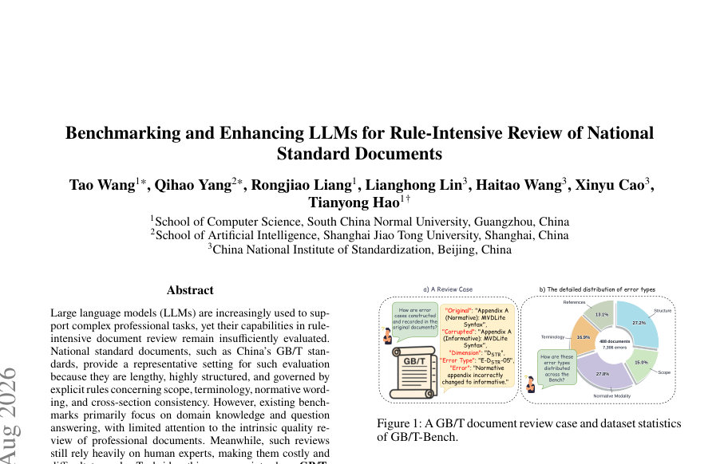
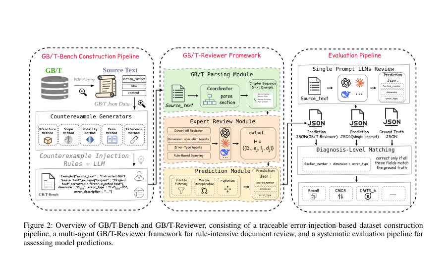
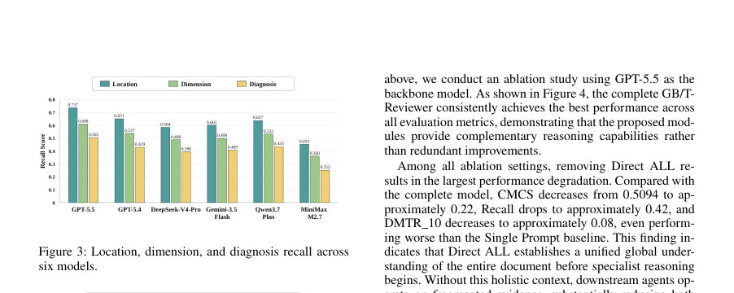

# Benchmarking and Enhancing LLMs for Rule-Intensive Review of National Standard Documents

- **게시일:** 2026-08-08
- **arXiv:** [2608.06312v1](http://arxiv.org/abs/2608.06312v1) · [PDF](https://arxiv.org/pdf/2608.06312v1)
- **저자:** Tao Wang, Qihao Yang, Rongjiao Liang, Lianghong Lin, Haitao Wang, Xinyu Cao, Tianyong Hao
- **분야:** cs.CL
- **선정 점수:** 4.74
- **선정 이유:** 최근성 0.7, 인용 영향 0.0 (인용 0회), 저자 영향 0.0 (최고 h-index 0), AI 주제 적합성 3.0, 개발자 관심 0.2, 학술 신호 0.8, 오픈 웨이트·주요 연구조직 신호 0.0

[← 2026-08-08 목록으로 돌아가기](../daily/2026-08-08.html)

<!-- paper-visuals:start -->
## 주요 Figure

> 원문 PDF에서 실제 Figure 캡션과 그림 영역이 함께 확인된 자료만 자동 추출했다.

*Figure · 원문 PDF 1쪽 · Figure 1: A GB/T document review case and dataset statistics*

*Figure · 원문 PDF 4쪽 · Figure 2: Overview of GB/T-Bench and GB/T-Reviewer, consisting of a traceable error-injection-based dataset construction*

*Figure · 원문 PDF 7쪽 · Figure 3: Location, dimension, and diagnosis recall across*

<!-- paper-visuals:end -->

## 한 문장 요약

국가 표준(GB/T) 문서의 규칙집중적 품질검토를 위해 5차원·25세부 오류로 구성된 GB/T-Bench를 제안하고, 오류 주입 기반의 추적가능한 벤치마크와 규칙지향 다중 에이전트 GB/T-Reviewer를 통해 LLM 성능을 평가·향상시킨다.

## 해결하려는 문제

국가 표준 문서는 길고 구조화되어 있으며 문서 자체에 엄격한 제정 규칙(구조, 적용범위, 규범적 조동사, 용어 일관성, 규범참조 등)을 포함하나 기존 벤치마크는 주로 도메인 지식·질문응답에 집중되어 문서 내재적 품질검토(결함 위치·분류·교차검증)를 진단·평가하기에 부족하다. 또한 실제 오류 수집·주석은 비용이 높아 확장이 어렵다. 주요 연구 질문은 LLM이 이러한 규칙집중적 표준 문서 검토를 정확히 수행할 수 있는지, 그리고 이를 향상시킬 수 있는 구조(다중 에이전트·규칙 스캐너 등)는 무엇인가이다.

## 핵심 기여

- GB/T Review Taxonomy: 문서구조, 적용범위, 규범적 조동사, 용어 일관성, 규범참조의 5개 차원과 25개의 세부 진단오류를 포함하는 계층적 검토 분류체계 제시.
- GB/T-Bench: 488개 GB/T 문서를 처리해 규칙기반·제한된 LLM 재작성 혼합 방식으로 7,306개의 추적가능한 오류 인스턴스를 생성한 최초의 국가표준 문서 검토 벤치마크(64,991개 섹션, 평균 오류 14.97/문서).
- 진단지향 평가 프로토콜: (section_number, dimension, error_type)의 정확한 일치가 정답으로 간주되는 엄격한 진단 레벨 매칭과 DMTR_k, Recall, CMCS 등의 지표 도입.
- GB/T-Reviewer: 파싱, Direct-All(전체스캔), Dimension Specialist, Error-Type Agent, 규칙/로컬 스캐너, 예측 모듈로 구성된 다중 에이전트 프레임워크로 검토 지식을 전문화·조정하여 진단 성능 향상.
- 광범위한 실험: 14개 주류 LLM(폐쇄·오픈)과 인간 검토자 비교를 통해 성능 한계를 규명하고 GB/T-Reviewer가 여러 백본에서 전반적 성능과 세부 진단 능력을 일관되게 개선함을 실증.

## 접근 방법

* 데이터 및 평가: 원문 파싱 모듈로 문서를 섹션 시퀀스(번호·제목·본문)로 분해하고, 계층적 GB/T 리뷰 분류체계(DSTR, DSCP, DNMS, DTER, DNREF)를 근거로 오류 주입을 수행한다.
* 구조·포맷 오류는 결정론적 규칙으로 생성하고, 의미적 오류는 규칙 제약 하의 LLM 재작성으로 생성하여 각 인스턴스에 (원본문, 오염본문, 에러위치, 차원, 에러타입, 설명)을 보존한다.
* 품질관리는 3명의 대학원생이 후보 제거·검증을 수행하고, 최종 데이터의 30%를 전문가·대학원생이 독립 재검증해 차원·에러타입 일치율(≈96%)과 Cohen's κ(≈0.95)를 보고함.
* GB/T-Reviewer 아키텍처: (1) 파싱 모듈: 문서 구조·위치 보존; (2) 전문가 리뷰 모듈: Direct-All(전체문서 포괄 스캔), Dimension Specialists(각 차원별 심층 검사), Error-Type Agents(고위험 세부 오류 타깃), 그리고 규칙/로컬 스캐너(정형화된 결정론적 검사)를 병렬·보완적으로 운용해 후보 에러 집합 H를 생성; (3) 예측 모듈: 후보의 분류 유효성 검사, 신뢰도 기반 융합·중복제거·근접유형 탐색을 통해 최종 구조화된 진단 결과(섹션, 차원, 에러타입, 설명) 출력.
* 프롬프트·로컬 규칙·스캐너 규칙은 부록에 구체적으로 제시되어 있으며, 평가 시 모델은 문서만 입력으로 받아 오류 생성 절차와 독립적으로 동작함.
* 평가: 진단 수준의 정확 일치를 요구하는 DMTR_k(DMTR_8–10), 전체 항목 회수율(Recall), 누락·과잉 예측을 함께 고려하는 CMCS를 사용.
* 실험은 단일 프롬프트 LLM 검토와 GB/T-Reviewer를 백본으로 한 설정을 비교하여 성능 향상 효과를 측정함.

## 주요 결과

- 데이터셋: 488개 문서, 64,991개 섹션, 7,306개 오류 인스턴스(평균 14.97 오류/문서, 중간값 15, 오류 범위 10–18).
- 휴먼(전문가) 성능: CMCS = 0.6640(휴먼 리뷰, 별도 50% 샘플에 수행).
- 단일 프롬프트 LLM 성능(최고 성능 예): GPT-5.6-sol CMCS = 0.3280, Recall = 0.5203, DMTR_10 = 0.2174; 전체 폐쇄형 LLM 평균 CMCS = 0.2504, 오픈소스 평균 CMCS = 0.1671.
- GB/T-Reviewer 효과: GB/T-Reviewer를 적용하면 모든 백본 모델이 일관되게 향상. GPT-5.5 기반 GB/T-Reviewer가 최고 CMCS = 0.5094(단일 프롬프트 대비 절대 +0.1909) 및 DMTR_10 = 0.7860으로 대폭 향상. 폐쇄형 모델 평균 CMCS는 0.2504 → 0.4160, 오픈소스 평균 CMCS는 0.1671 → 0.3186으로 상승.
- 차원별 관찰: 모델들은 DSTR(문서구조)와 DSCP(범위일치)에서 상대적으로 강하나 DNMS(규범적 조동사), DTER(용어 일관성), DNREF(규범참조)에서 성능이 크게 저하됨(세부 수치 표 3에 제시됨). 예: GPT-5.6-sol의 차원별 진단 Recall은 DSTR 0.7581, DSCP 0.7596, DNMS 0.4150, DTER 0.2294, DNREF 0.3407 등으로 비대칭적 성능 분포를 보임(Table 3).  
Ablation: GB/T-Reviewer 구성요소별 제거 실험에서 Direct-All 제거가 가장 큰 성능 저하를 일으킴(완전 모델 CMCS=0.5094 → 약 0.22 수준, Recall·DMTR_10도 큰 폭 하락으로 보고됨). Dimension Specialists·Error-Type Agents·Rule Scanners 모두 성능에 유의미한 기여를 함.

## 한계

- 저자 명시 한계: 본문에서 저자들이 직접 '제한'으로 명시한 항목은 별도로 자세히 기술하지 않았음. 대신 본문은 벤치마크가 GB/T 규칙과 오류 주입 파이프라인에 기반한다고 설명함.
- 본문 기반으로 확인되는 제약 — 합리적·검증 가능한 한계: GB/T-Bench는 주요 실험 도메인이 중국 GB/T 표준에 국한되며(데이터는 GB/T 문서 488건), 이로 인해 다른 국가·프레임워크(예: ISO, IEC, 법규 텍스트)로의 직접 일반화는 보장되지 않음.
- 오류들은 대부분 '통제된(규칙+제한된 LLM 재작성)' 방식으로 주입된 인위적(counterexample) 샘플이며, 자연발생 오류 분포와의 차이가 있을 수 있어 실제 현업 오류 분포에 대한 일반화는 추가 검증이 필요함(논문은 주입 방법과 추적 가능성을 장점으로 제시함).
- 평가 기준이 매우 엄격한(섹션번호·차원·에러타입의 정확 일치) 점이 실무적 유연성을 반영하지 못할 수 있음 — 이는 진단 정확성을 요구하지만 부분적으로 의미적으로 맞는 답변이 오차로 처리될 수 있음(의도된 설계이자 평가 한계).  
추가 제약으로 본 프레임워크는 프롬프트·다중 에이전트 호출·규칙 스캐너로 인한 높은 토큰·연산 비용이 발생하며(본문의 토큰 분석 참조), 배포 시 비용·지연·엔지니어링 복잡성 문제가 있음.

## 개발자 관점

- 재현을 위해 부록에 전체 프롬프트(Direct-All, Dimension Specialists, Error-Type Agents, Scanners)와 결정론적 규칙이 공개되어 있어 해당 프롬프트·규칙을 그대로 적용하면 기본 파이프라인 재현 가능. 단, 외부 LLM API 비용·지연 고려 필요.
- 데이터 파이프라인: PDF 파싱으로 섹션 단위(번호·제목·본문)를 보존하는 것이 핵심이며, 오류 인젝션은 구조적 오류는 규칙, 의미적 오류는 제약된 LLM 재작성으로 구현. 각 인스턴스에 원본·오염본·위치·레이블을 보존해야 엄격한 진단 평가가 가능함.
- 모델 아키텍처: 글로벌 컨텍스트를 잡는 Direct-All 에이전트가 필수적이며, 차원별 전문가(분해) 및 에러타입별 세부 에이전트, 그리고 결정론적 스캐너의 조합이 상호 보완적으로 성능을 끌어올림 — 따라서 시스템 설계 시 모듈화·에이전트 간 정보 표준화(공통 JSON 스키마)가 중요함.
- 평가·라벨링 정책: 평가 기준이 (section_number, dimension, error_type) 정확 일치를 요구하므로 섹션 식별·정규화(예: unnumbered → null, 부록 표기 유지)와 라벨링 일관성이 재현 성공의 핵심임. 품질관리로 인간 검증(30% 샘플) 및 다중 주석자 합의 프로세스를 권장(논문은 Cohen's κ ≈ 0.95 보고).
- 운영·비용 고려: 토큰 소모가 크며(모델별 평균 입력+출력 토큰 수 표에 제시, 예: 모델별 평균 총 토큰 대략 13k–32k 범위), 실서비스에선 비용-성능 균형을 위해 모델 선택·에이전트 호출 전략(예: 먼저 규칙스캐너로 후보 추출, 필요 시 고성능 LLM 호출)을 설계해야 함. 또한 규칙 스캐너는 결정론적이고 해석 가능하므로 신뢰성 확보용으로 유용함.

**근거 범위:** 이 분석은 제공된 논문 PDF 본문(주요 본문 및 부록)에 근거해 작성되었음. 데이터셋 통계(488 문서, 7,306 오류 등), 평가 지표 정의, 실험 수치(휴먼 CMCS=0.6640, GPT-5.6-sol CMCS=0.3280, GB/T-Reviewer 최고 CMCS=0.5094) 및 아키텍처·프롬프트 관련 내용은 본문·표·부록에서 직접 확인한 수치와 설명을 사용함. 다만 논문에 명시되지 않은 내부 구현 세부(예: 에이전트 간 통신 대기시간, 실제 배포 비용 산정, 일부 파라미터의 세부 튜닝 절차)는 PDF에서 확인하기 어려워 본문에 확인 가능한 정보만을 보고 기술했음.
