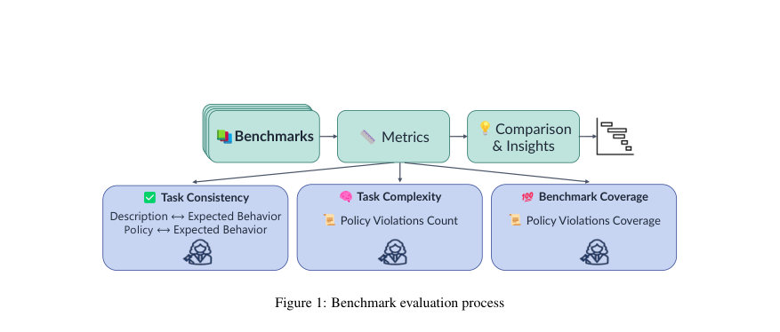
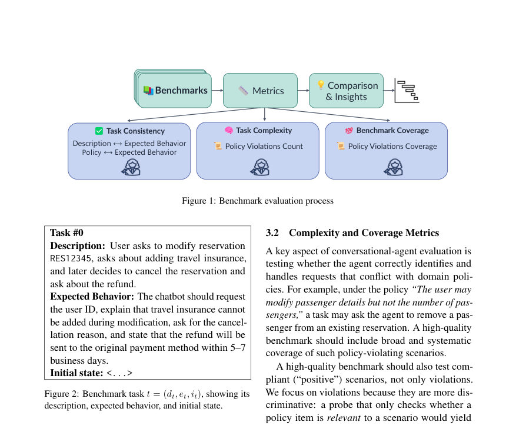
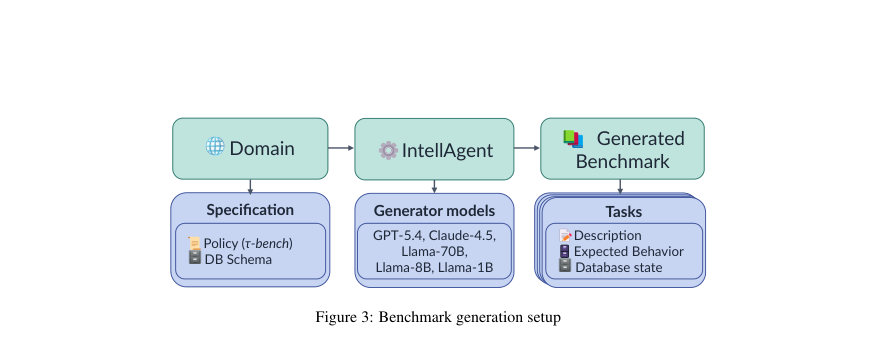

# Benchmarking the Benchmarks: Evaluating Benchmarks for Conversational Agents

- **게시일:** 2026-08-08
- **arXiv:** [2608.06329v1](http://arxiv.org/abs/2608.06329v1) · [PDF](https://arxiv.org/pdf/2608.06329v1)
- **저자:** Noam Koren, Roy Bar-Haim, Abigail Goldsteen
- **분야:** cs.CL, cs.AI
- **선정 점수:** 4.54
- **선정 이유:** 최근성 0.7, 인용 영향 0.0 (인용 0회), 저자 영향 0.0 (최고 h-index 0), AI 주제 적합성 3.0, 개발자 관심 0.2, 학술 신호 0.6, 오픈 웨이트·주요 연구조직 신호 0.0

[← 2026-08-08 목록으로 돌아가기](../daily/2026-08-08.html)

<!-- paper-visuals:start -->
## 주요 Figure

> 원문 PDF에서 실제 Figure 캡션과 그림 영역이 함께 확인된 자료만 자동 추출했다.

*Figure · 원문 PDF 3쪽 · Figure 1: Benchmark evaluation process*

*Figure · 원문 PDF 3쪽 · Figure 2: Benchmark task t = (dt, et, it), showing its*

*Figure · 원문 PDF 5쪽 · Figure 3: Benchmark generation setup*

<!-- paper-visuals:end -->

## 한 문장 요약

LLM 판정을 이용한 레퍼런스-프리(framework) 평가법을 제안하여 대화형 에이전트 벤치마크의 일관성, 난이도(정책 위반 수) 및 정책 커버리지를 정량화하고 약점을 진단한다.

## 해결하려는 문제

기존의 태스크 지향 대화형 에이전트 벤치마크는 수작업으로 신중히 제작된 경우에도 구성 타당성 문제(모호성, 모순 등)가 빈번하며, 자동 생성된 합성 벤치마크는 일관성 부족, 단순한 시나리오, 제한된 정책 커버리지 등으로 평가 신뢰도를 떨어뜨릴 수 있다. 기존 평가 방법은 보통 레퍼런스 데이터나 다수의 에이전트를 필요로 하며, 정책 기반의 벤치마크 품질을 직접 검증하는 방법이 부족하다. 이 논문은 벤치마크 자체의 품질을 레퍼런스 없이 측정할 수 있는 절차와 지표를 제시한다.

## 핵심 기여

- 대화형(태스크 지향) 에이전트 벤치마크의 품질(일관성·난이도·정책 커버리지)을 평가하는 문제를 정식화하고 연구함.
- LLM-판사(judge)를 활용한 레퍼런스-프리 4개 지표(설명↔예상행동 정렬, 정책↔예상행동 정렬, 정책 위반 수, 정책 위반 커버리지)와 진단적 출력(위반된 정책 ID, 판사의 근거)을 정의함.
- INTELLAGENT로 합성 벤치마크를 생성하고(생성기 LLM을 다양화) 제어된 품질 저하(예: 예상행동 교체, 도메인 정책 교체) 실험을 통해 지표의 민감도와 판별력을 검증함.
- LLM-판사 점수와 독립적 인간 평가(50개 작업, Kendall’s τb) 간의 유의미한 상관관계를 보고하여 LLM-판사들의 결과를 인간 판단과 검증함.
- 제안 기법을 수작업으로 구성된 τ 3-BENCH(항공 도메인)에 적용해 실무적 유용성과 한계(예: 기대행동의 상세도 영향)를 분석함.

## 접근 방법

* 벤치마크 B = (P, t1..tn) (정책 문서 P와 작업 집합) 구조를 전제로, 각 작업 t = (dt, et, it)에서 dt는 설명(사용자 요청 등), et는 기대되는 에이전트 동작(정책에 부합해야 함), it은 초기 DB 상태다.
* LLM 판사 Jm을 사용해 작업 수준에서 1–10 점으로 정렬/정합을 평가한다.
* 구체적 지표는 다음과 같다: (1) Description–Expected Behavior Alignment: Jdesc(dt, et)로 설명과 기대행동의 일관성(모순·발명된 사실·필수 결과 포함 여부 등) 판단, (2) Policy–Expected Behavior Alignment: Jpol(dt, et, P)로 기대행동이 정책 P에 위배되는 발명된 행위 또는 누락된 의무적 단계가 있는지 판단, (3) Policy Violations Count Sv_count: 각 작업이 위반하는 정책 항목 수 \|V(t)\|의 평균, (4) Policy Violations Coverage Sv_cov: 정책 항목들 중 적어도 K(실험에서는 K=3)개 작업에서 위반되는 항목의 비율.
* 정책 항목 LP는 TOOLGUARD로 반자동 추출 후 저자가 검토·수정.
* 벤치마크 생성은 INTELLAGENT 파이프라인을 사용하되 생성에 쓰이는 LLM을 GPT-5.4, Claude-4.5-Sonnet, Llama-3.3-70B, Llama-3.1-8B, Llama-3.2-1B로 교체해 품질 수준을 조절.
* 검증 절차로는 (a) 벤치마크 순서화(meta-metric인 Benchmark Ordering Score: 상정된 우선순위 제약 만족 비율) (b) 제어된 섭동(예상행동 스왑 비율 증가, 도메인 정책 스왑) 분석 (c) 인간 평가와의 Kendall's τb 상관 비교를 수행.
* 판사 프롬프트와 출력 형식은 부록(App.
* A,B)에 구체적으로 제시되어 있으며, 정책 위반 판사는 위반된 정책 ID 목록(JSON)과 근거를 출력하도록 설계됨.

## 주요 결과

- 합성 실험: 항공(Airline) 도메인에서 각 벤치마크는 100개 작업, 소매(Retail) 도메인은 각 95개 작업으로, 전체 합성 작업 수는 975개(5 생성 모델 × 2 도메인).
- 사용한 LLM-판사: GPT-5.4, Claude-4.5-Sonnet, Gemini-2-Flash.
- Benchmark Ordering(생성기 능력 기반의 세 티어: Top(GPT-5.4, Claude-4.5), Medium(Llama-70B, Llama-8B), Small(Llama-1B)) 결과: 항공 도메인에서 모든 지표와 판사에 대해 완전한 순서화(Benchmark Ordering Score = 1.0)를 달성; 소매 도메인 평균은 0.92 (부록 Table 2에 세부 수치), 전체 평균(판사·도메인 합산)은 약 0.96으로 보고됨. 특히 Policy Violations Count 지표는 모든 판사·도메인에서 완전한 순서화를 보였음.
- 제어된 섭동 검증: (1) 예상행동 스왑 비율(0%,20%,40%,60%,80%) 증가에 따라 Description–Expected Alignment 점수가 일관되게 감소(모든 생성기·도메인에서 관찰), (2) 도메인 정책 스왑(항공↔소매) 시 Policy–Expected Alignment, Policy Violations Count, Policy Violations Coverage 점수 모두 현저히 감소하여 정책-기반 지표들이 정책 불일치를 감지함(그림과 수치로 보고).
- 인간 검증: 생성 모델들로부터 샘플한 50개 작업에 대해 한 명의 인간(저자 중 한 명)이 평가. 세 지표 × 3 판사에 대해 Kendall’s τb 상관계수를 계산한 결과 모든 조합에서 유의미한 양의 상관(τb ∈ [0.32, 0.67], p값들 < 0.011에서 <1e-6까지), Policy Violations Count가 가장 높은 일치도(τb 0.55–0.67)를 보였음(부록 Table 3). 참고: 인간 평가자는 논문에 따르면 저자 중 한 명임(부록 E).  
    
    

## 한계

- 저자 명시 한계: 본 연구는 τ-BENCH 및 INTELLAGENT 유형의 대화형 벤치마크 구조(정책 문서·도구·데이터베이스를 갖춘 시나리오)에 초점을 맞추며, 제안 지표는 주로 작업 일관성·정책 정렬·정책 기반 난이도·커버리지를 평가함. 합성 실험은 INTELLAGENT 파이프라인에 의존하므로 다른 생성 전략(tool-driven 등)은 다른 분포를 만들 수 있어 추가 평가가 필요함. 비대화형(예: 코드 생성, GUI 상호작용) 설정은 다루지 않음(저자 언급).
- 본문·부록에서 확인되는 추가 제약(분리): (1) 인간 검증은 50개 작업·단일 평가자(저자 중 한 명)에 의존해 표본 규모와 평가자 편향 측면에서 제약이 있음(부록 E에서 명시). (2) 도메인은 항공·소매 두 개로 제한되어 있어 도메인 일반화 가능성은 제한적임. (3) 성능 가정: 생성기 LLM 능력을 벤치마크 품질의 대리 지표로 사용했는데, 이는 논문이 명시적으로 사용하는 합리적 가정이나(§4.1) 성능-품질 관계가 항상 보장되지는 않음. (4) LLM-판사 자체의 편향·오류 가능성이 있으며 판사에 따라 점수 편차가 존재할 수 있음(논문에서 서로 다른 판사 간 평균 차이를 보고). (5) 정책 항목 추출은 TOOLGUARD로 반자동 수행 후 수동 검토가 필요해 실무에서 추가 인적 비용이 듬.

## 개발자 관점

- 재현/구현: 필요한 입력은 (a) 도메인 정책 문서(P)와 정책 항목에 대한 span 주석(LP), (b) 각 작업의 설명(dt), 기대행동(et), 초기 DB 상태(it)이다. 정책 항목은 TOOLGUARD 같은 도구로 반자동 추출 후 도메인 전문가가 검토해야 한다(논문 절차). 판사 프롬프트(설명·정책 정렬, 정책 위반 판정)는 부록 App. A,B에 구체적으로 제공되어 있어 이를 그대로 사용해 재현 가능하다.
- 판사 구성: 여러 판사 모델(GPT-5.4, Claude-4.5-Sonnet, Gemini-2-Flash 등)을 동시에 사용해 점수의 견고성(판사별 편차)을 확인하는 것이 권장된다. 단일 판사에 의존하면 판사 편향에 취약할 수 있다.
- 메트릭 세부: Policy Violations Coverage의 K 값은 논문에서 K=3으로 설정되어 있으므로 사용 목적에 맞게 K를 조정할 수 있다(작업 수·정책 항목 수에 따라). 집계는 작업별 점수의 평균으로 수행하며 중앙값·표준편차 등도 함께 보고하면 진단에 유용하다.
- 검증/디버깅: 제어된 섭동(예상행동 스왑, 정책 스왑 등)을 적용해 지표 민감도를 점검하라. 저점(low score) 작업에 대해 판사의 근거(reasoning)와 정책 위반 ID를 분석하면 '발명된 단계', '필수 정보 누락', '명시적 확인 누락', '보상 처리 오류', '금지 행위' 등 구체적 결함 유형을 찾아낼 수 있다(논문 정성 분석에서 5종류로 분류됨).
- 실무적 주의사항(배포·비용·안전): 대규모 벤치마크(수백~천 작업)를 여러 판사 모델로 평가하면 API 호출 비용·추론 비용이 커질 수 있으므로 예산을 고려해야 한다. 또한 수작업으로 제작된 벤치마크는 기대행동의 상세도(최종 결과 수준인지 워크플로우 수준인지)에 따라 정책 정렬 점수가 낮게 나올 수 있으므로 평가 전에 기대행동의 상세도 표준을 정해야 한다(τ 3-BENCH 사례).

**근거 범위:** 이 분석은 제공된 논문 PDF 본문(페이지 1–15, 부록 포함)의 텍스트를 근거로 작성되었다. 본문에 명시된 수치(작업 수 975, 판사·생성기 모델 목록, 부록의 표 및 수치, τb 상관값 등)는 PDF에서 직접 추출하였다. 인간 평가자가 논문 저자 중 한 명이라는 사실과 정책 항목 추출 절차(TOOLGUARD + 검토) 등 세부 구현은 부록에 명시되어 있어 이를 반영했다. PDF에 자세히 기술되지 않았거나 외부 구현 세부사항(예: 실제 API 비용, 내부 파이프라인 코드)은 본문에 근거하지 않고 추정하지 않았다.
