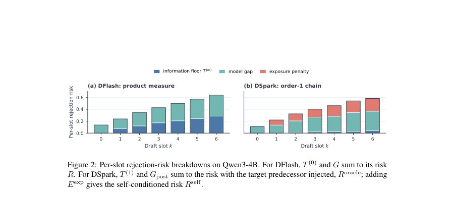

# Beyond Parallel Blindness: Information Floors and Model Gaps in Block Drafting

- **게시일:** 2026-08-29
- **arXiv:** [2608.27339v1](http://arxiv.org/abs/2608.27339v1) · [PDF](https://arxiv.org/pdf/2608.27339v1)
- **저자:** Xinwei Qiang, Xiang Fang, Chang Chen, Yue Guan, Yufei Ding
- **분야:** cs.LG, cs.CL, cs.IT
- **선정 점수:** 4.10
- **선정 이유:** 최근성 0.7, 인용 영향 0.0 (인용 0회), 저자 영향 0.0 (최고 h-index 0), AI 주제 적합성 1.5, 개발자 관심 0.0, 학술 신호 0.3, 오픈 웨이트·주요 연구조직 신호 1.6

[← 2026-08-29 목록으로 돌아가기](../daily/2026-08-29.html)

<!-- paper-visuals:start -->
## 주요 Figure

> 원문 PDF에서 실제 Figure 캡션과 그림 영역이 함께 확인된 자료만 자동 추출했다.

*Figure · 원문 PDF 7쪽 · Figure 2: Per-slot rejection-risk breakdowns on Qwen3-4B. For DFlash, T (0) and G sum to its risk*

<!-- paper-visuals:end -->

## 한 문장 요약

블록 단위 병렬 초안(블록 드래프팅)의 검증 거부를 '정보적 한계(정보 플로어)'와 그 위의 '모델 갭'으로 분해해, 목표 모델 롤아웃으로 두 성분을 추정하고 병렬 무지(parallel blindness)와 제안 품질의 기여를 정량화했다.

## 해결하려는 문제

블록 드래프팅은 한 번의 포워드로 블록 내 여러 토큰을 제안하므로 블록 내 앞쪽의 실제 실현 토큰을 알 수 없는 정보 제약이 존재한다. 기존 평가는 단순히 관측된 거부율(accepted length 또는 per-slot rejection)을 보고할 뿐, 그 거부가 ‘이 정보 제약으로 필연적인 손실’인지(정보 플로어) 아니면 ‘드래프터가 관측 가능한 정보를 잘 모델링하지 못한 손실’(모델 갭)인지 구분하지 못해 병렬화의 근본적 한계와 개선 가능성을 분리할 수 없다.

## 핵심 기여

- 정보 플로어 T^(m)_k와 모델 갭 G_k라는 엄밀한 분해(관찰된 거부 = 정보 플로어 + 모델 갭)를 정의하고, order-m(최대 m개의 바로 이전 실현 토큰을 조건)으로 정식화함.
- 대상 모델의 자유 롤아웃(샘플링)만으로 정보 플로어를 추정하는 실험적 측정 프레임워크를 제시함(토큰별 총변이(TV) 기반의 수치화·TV 바리센터 해법 포함).
- 다양한 도메인·대상( Qwen3-4B, Qwen3-8B, Qwen3-14B, Gemma-4-12B, frontier API DeepSeek-V4-Pro)과 공개 드래프터(DFlash, DSpark)에 대해 플로어와 갭을 측정해 세 가지 주요 발견을 제공: (1) 병렬 무지가 큰 플로어를 만든다, (2) 한 토큰의 실현이 대부분 플로어를 제거한다, (3) 현재 드래프터는 여전히 플로어 위에 큰 모델 갭을 유지한다.
- 실무적 진단 도구 제공: 드래프터의 정보 구조(order-0 vs order-1)에 맞춘 분해를 통해 어느 부분(정보·모델) 개선이 우선인지를 판단할 수 있게 함.

## 접근 방법

* 정의 및 측정 프레임워크: 각 블록 슬롯 k에서 제안 분포 q와 목표 조건부 분포 p_Z 간의 거부 확률을 TV(p,q)=1−α(p,q)로 취급하고, 주어진 정보 상태 Im=(X, Z_{k-m: k-1}) 하에서 가능한 모든 제안 q로 기대 TV를 최소화한 값을 정보 플로어 T^(m)_k로 정의했다.
* 드래프터의 실제 위험 R_k와의 차이를 모델 갭 G_k := R_k − T^(m)_k로 정의.
* 추정 절차: 각 앵커(프롬프트·위치)에서 목표 모델로 M개의 자유 롤아웃을 수집해 슬롯별 조건부 분포 집합 {p_i}를 구성하고, 이들에 대해 TV 바리센터 문제(좌표별 가중 β-분위수 성질을 이용한 solver)를 풀어 경험적 T^(m)_k를 계산.
* Order-1(직전 토큰 조건) 플로어는 롤아웃을 선별해 전·후반으로 나누어 split-half 방식 또는 중요도 재표집(SNIS)으로 추정.
* 드래프터 위험 R_k는 동일 롤아웃들에서 드래프터가 해당 정보로 제시한 제안과 목표 분포의 TV를 평균해 추정.
* 결과는 H´ajek 가중으로 앵커 풀을 집계하고 프롬프트-레벨 부트스트랩으로 신뢰구간을 산출.
* 추가 분석: 조건부 상호정보(I)로 경로 정보의 국소성 검증, K-프로토타입(oracle-routing) 군집성 검사, serving 시 생존 가중치(W_{k-1})로 free-rollout과 serving 위험 재가중 비교, 단일 슬롯 오라클(∆τ_BR_k)으로 우선순위 평가.

## 주요 결과

- 주요 정보 플로어(모든 도메인 풀링, Qwen3-4B, full-vocab, M=256): T^(0)_k = [k=0..6] = [0.0000, 0.0776, 0.1211, 0.1724, 0.2060, 0.2458, 0.2861]. (Table 2) — 즉 마지막 슬롯(6)에서 플로어는 0.286으로, 최선의 전-병렬 제안도 슬롯당 최대 약 71% 수용 한계를 가짐.
- Order-1(직전 토큰 조건) 플로어(동일 롤아웃): T^(1)_k (k=1..6) = [0, 0.0048, 0.0210, 0.0256, 0.0287, 0.0413]로, 한 실현 토큰이 86–100%의 order-0 플로어를 제거함(대부분 슬롯에서 잔여 플로어 ≤0.041). (Table 3)
- 상호정보 관점(대상 측면)에서도 직전 토큰이 누락 경로 정보의 약 92.2–95.3%를 회복(슬롯 2–6), 2토큰은 98.8–99.4% 회복: 정보의 국소성 검증(표 6).
- 실제 공개 드래프터 비교(Qwen3-4B): DFlash(순수 product-measure)에서는 모델 갭이 슬롯1–6에서 전체 수용 손실의 55–67%를 차지(예: 슬롯6에서 R6=0.636, T^(0)_6=0.286 → G6≈0.350, G/R≈55.0%). DSpark(order-1 Markov head, 목표 predecessor 주입한 oracle-conditioned R_oracle): G_post가 oracle-conditioned 위험의 89–100%를 차지(슬롯6에서 R_oracle≈0.367, T^(1)_6≈0.041 → G_post≈0.325, Gpost/Roracle≈88.7%). (Fig.2, Tables 7–8)
- 스케일·타깃 다양성: Qwen3-8B/Qwen3-14B/Gemma-4-12B에서도 DFlash의 슬롯6 모델 갭 비율은 43.1%/46.1%/64.2% 범위, DSpark의 Gpost 비율은 84.9%/86.4%/92.2%로 모델 갭이 계속 지배적(Section 6, 표). 또한 frontier API(DeepSeek-V4-Pro)에서 측정한 플로어: T^(0)_6=0.245, T^(1)_6=0.032; 한 토큰으로 86–90% 제거. (Sec.6)  ','서빙(실제 서비스) 재가중: free-rollout 평균 위험은 서빙 시 도달한 경로에 대해 재가중하면 크게 감소 — DFlash 슬롯6 위험: free 0.635 → serve 0.211, DSpark 슬롯6: 0.366 → 0.158; free-rollout이 서빙에서의 체감 위험을 과대평가함(Section 7).','단일 슬롯 오라클(∆τ_BR_k)으로 보면 슬롯0 개선의 accepted-length 기여가 가장 큼(DFlash slot0: +0.221 토큰, slot6: +0.056), 슬롯별 우선순위와 생존 효과가 상반되는 현상 관찰(F.5).

## 한계

- 저자가 명시한 한계: 모델 갭은 '정보 제약으로 강제된 손실'이 아니나, 특정 아키텍처·제한된 제안 클래스(Q_arch)에 대해서는 그 갭 중 일부만 회복 가능하다(아키텍처적 여유 slack 존재; App. G.1).
- 평균화·샘플법 관련: 모든 수치는 자유 롤아웃(목표의 무조건 샘플링 법)에 대한 평균이며, 서빙 과정에서는 이전 슬롯의 거부로 인해 경로 분포가 바뀌므로 free-rollout 평균이 서빙 상황을 그대로 반영하지 않음(저자도 재가중을 별도 측정).
- 실험 범위 제약: 측정은 블록 길이 γ=7, 특정 4개 도메인, 주로 Qwen·Gemma 계열과 공개 DFlash/DSpark 체크포인트에 국한됨 — 다른 블록 길이·도메인·드래프터 설계로 일반화할 때 추가 검증 필요.
- 추정·수치 한계: order-1 슬롯1의 추정치(이론적 0)에 대해 수치적 잔차 0.0010 존재(수치 해상도), 일부 estimator(예: split-half 대 재표집)는 보수적 편향을 줄 수 있음(App. C). 또한 frontier API는 top-K(20) 확률만 제공하므로 어절 외부 질량 보정(omitted mass) 필요(오차 밴드 보고).

## 개발자 관점

- 아키텍처 설계: 블록 내 직전 실현 토큰을 조건(order-1, Markov head)하도록 만드는 간단한 구조 변경이 정보 플로어 대부분을 제거하므로, 병렬성 유지하면서도 한 토큰의 조건화를 허용하는 설계(예: Markov head, parent-conditioned 출력)는 높은 효과 대비 구현 비용이 낮음.
- 개선 우선순위: 측정 결과 모델 갭이 여전히 주요 손실이므로 단순히 더 많은 within-block conditioning을 추가하기보다 드래프터의 조건부 분포 모델링(헤드 용량·학습·목적함수 개선)에 투자하는 것이 실효적일 가능성이 큼.
- 평가·진단 도구: 제안한 플로어/갭 분해(목표 롤아웃을 통한 T^(m)_k 추정, 동일 앵커에서 R_k 측정)로 병렬화 설계 변경의 정보적 가치와 모델 품질 여지를 수치적으로 분리해 검증할 것.
- 서빙 고려: free-rollout에서 측정된 per-slot 위험이 서빙에서 과대평가됨 — 실서비스 성능 예측 시에는 생존 가중치(W_{k-1})로 재가중(rerweight)해야 함.
- 오라클·프로토타입 활용: 타깃 조건부 분포들이 소수의 모드(K=2~4)로 잘 근사되므로(소수 프로토타입이 플로어의 큰 부분 제거), multi-candidate 제안·모드 기반 라우팅 또는 후보 트리(parent-conditioned) 같은 실용적 전략이 높은 수용률을 만들 수 있음(단, 라우팅 검증 비용·검증 규칙 고려).

**근거 범위:** 이 분석은 제공된 논문 PDF 본문(본문, 표, 부록)을 근거로 작성함. 본문에 표기된 수치(예: Table 2,3,7–8, Sec.6–7, App. C/F 등)를 직접 인용·요약했으며, 표·부록의 추정·부트스트랩 신뢰구간과 수치적 제한(예: 수치 해상도 0.001 등)도 본문에서 확인한 대로 반영함. PDF에 제시된 수치·방법 외의 미확인 구현 세부사항이나 외삽(다른 블록 길이·다른 데이터셋 일반화 등)은 명시적으로 만들지 않았음.
