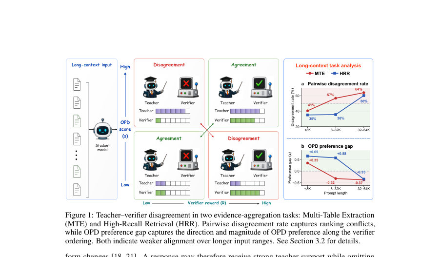
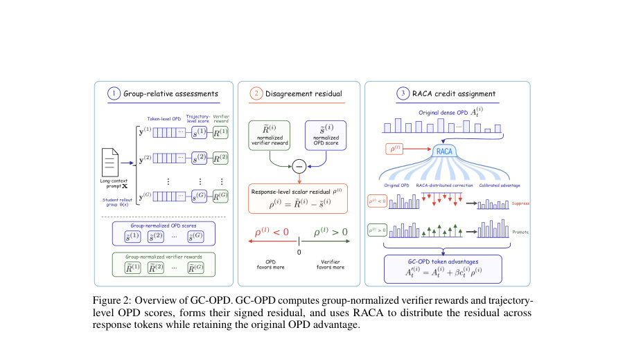
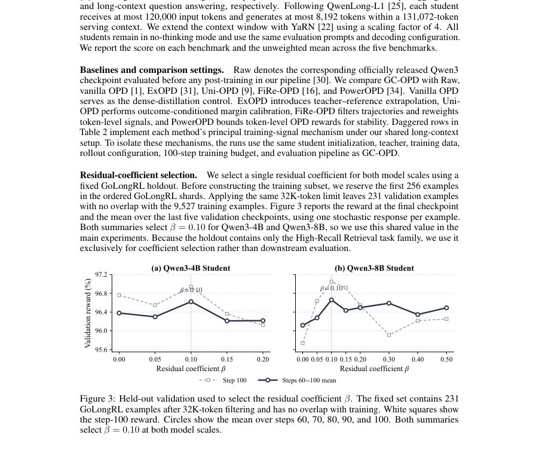

# Beyond Teacher Likelihood: Group-Calibrated On-Policy Distillation for Long-Context Reasoning

- **게시일:** 2026-08-20
- **arXiv:** [2608.19181v1](http://arxiv.org/abs/2608.19181v1) · [PDF](https://arxiv.org/pdf/2608.19181v1)
- **저자:** Zhu Zhang, Jixun Wang, Xiaoang Xu, Xiaorong Wang, Zihan Zhou, Zhiyuan Wang, Shuo Wang, Chaojun Xiao, Yuezhi Zhou
- **분야:** cs.LG, cs.AI, cs.CL
- **선정 점수:** 6.08
- **선정 이유:** 최근성 0.8, 인용 영향 0.0 (인용 0회), 저자 영향 1.8 (최고 h-index 24), AI 주제 적합성 2.1, 개발자 관심 0.2, 학술 신호 0.6, 오픈 웨이트·주요 연구조직 신호 0.6

[← 2026-08-20 목록으로 돌아가기](../daily/2026-08-20.html)

<!-- paper-visuals:start -->
## 주요 Figure

> 원문 PDF에서 실제 Figure 캡션과 그림 영역이 함께 확인된 자료만 자동 추출했다.

*Figure · 원문 PDF 2쪽 · Figure 1: Teacher–verifier disagreement in two evidence-aggregation tasks: Multi-Table Extraction*

*Figure · 원문 PDF 3쪽 · Figure 2: Overview of GC-OPD. GC-OPD computes group-normalized verifier rewards and trajectory-*

*Figure · 원문 PDF 8쪽 · Figure 3: Held-out validation used to select the residual coefficient β. The fixed set contains 231*

<!-- paper-visuals:end -->

## 한 문장 요약

긴 문맥 증거 집계 과제에서 토큰 수준 교사 우선도를 응답 수준 검증자 결과와 그룹 정규화 잔여(residual)로 보정하고, 그 잔여를 토큰별 상대 OPD 이점으로 분배하는 GC-OPD 방법을 제안해 교사-검증자 불일치 문제를 완화한다.

## 해결하려는 문제

온-폴리시 증류(OPD)는 학생이 생성한 토큰들에 대해 교사의 토큰 수준 우도를 밀도 있게 제공하지만, 긴 문맥(task)에서는 토큰별 교사 신호가 국소적으로 그럴듯하나 입력 전체에 분포한 증거를 누락하거나 전역 제약을 위반하는 응답을 선호할 수 있다. 반면 태스크별 검증자(verifier)는 응답 단위의 성공 여부(및 부분 성공)를 평가하므로, 토큰 수준 OPD 점수와 검증자 보상 간 불일치(teacher–verifier disagreement)가 발생하면 OPD 기반 업데이트가 잘못된 응답 선호를 강화할 수 있다. 본문은 이 불일치의 진단, 그리고 이를 보정하는 효과적인 인터페이스 설계 문제를 다룬다.

## 핵심 기여

- 긴 문맥 증거 집계 과제들에서 토큰 수준 OPD 점수와 응답 수준 검증자 보상 간의 불일치(teacher–verifier disagreement)가 입력 길이에 따라 증가함을 진단하고 정량화함(예: Multi-Table Extraction에서 불일치율이 <8K에서 40.6%→32–64K에서 64.0%로 증가, OPD preference gap +0.35→−0.37 등).
- 그룹 정규화된 검증자 보상과 그룹 정규화된 궤적(OPD) 점수의 차이를 signed residual로 정의하고, 이를 토큰 수준 OPD에 보정항으로 추가하는 Group-Calibrated On-Policy Distillation (GC-OPD)를 제안함.
- 잔여를 응답 내 상대 OPD 이점(relative OPD advantage)에 따라 분배하는 RACA(relative-advantage-based credit assignment)를 도입하여 원래 OPD 신호를 보존하면서 토큰별 보정을 수행함.
- Qwen3-4B/8B 학생 모델과 Qwen3-30B 교사, 9,527개 GoLongRL(≤32K) 훈련 서브셋, 다섯 장기 문맥 벤치마크(문항별 세부평가)를 사용한 실험에서 GC-OPD가 평균 성능을 향상시킴을 보임(예: Qwen3-4B 평균 39.31→40.47, Qwen3-8B 43.56→44.65; Raw 대비도 유의미한 향상).
- 대조 및 소거(ablation) 실험으로 signed residual이 단순한 OPD 기반 항 추가나 그룹 정규화 보상 직접 추가보다 효과적이며, RACA가 균등 분배나 부호를 잃는 절대값 기반 분배보다 우수함을 확인함.

## 접근 방법

* GC-OPD의 주요 구성은 다음과 같다.
* (1) 롤아웃 그룹 G(x) 내 각 응답 y(i)에 대해 토큰 수준 vanilla OPD 이점 A(i)_t를 교사 로그우도와 고정된 학생(πθold) 로그우도의 차로 계산하고, 응답 평균을 통해 궤적 점수 s(i)= (1/T) Σ_t A(i)_t 를 얻는다.
* (2) 같은 그룹 내에서 검증자 보상 R(i)과 궤적 OPD 점수 s(i)를 각각 z-정규화하여 ˜R(i), ˜s(i)를 얻고, signed residual ρ(i)=˜R(i)−˜s(i)를 정의한다.
* (3) 토큰별 상대 OPD 이점을 u(i)_t = (A(i)_t − s(i)) / σ_A(i)로 표준화한 뒤, c(i)_t = 1 + tanh(u(i)_t / 2)로 양의 유계 크레딧으로 매핑(RACA).
* (4) 보정된 토큰 이점은 A'(i)_t = A(i)_t + β · c(i)_t · ρ(i)이며, β는 잔여 계수(선택된 값 β=0.10).
* (5) A'를 기존 OPD의 클리핑된 토큰 이점으로 대체하여 동일한 클립된 정책 목적(clipped surrogate)으로 업데이트한다.
* 구현상 그룹/토큰 표준편차가 너무 작으면(τ_G, τ_T) residual 또는 상대이점을 0으로 처리하여 GC-OPD가 해당 그룹에서는 vanilla OPD로 환원되도록 안전장치를 둔다.
* 전체 알고리즘은 추가 교사/학생 전달(forward) 없이 그룹 집계·정규화·원소별 변환만 추가한다.

## 주요 결과

- 훈련·평가 설정: Qwen3-4B 및 Qwen3-8B 학생, Qwen3-30B-A3B-Thinking-2507 교사, GoLongRL에서 32K 이하 9,527개 프롬프트로 100스텝 포스트트레이닝(배치 32, 롤아웃당 8 응답), 응답 길이 캡 10,240토큰, YaRN으로 문맥 확장(4배).
- 주요 정량 성능(5개 장기벤치 평균): Qwen3-4B Raw 29.08 → OPD 39.31 → GC-OPD 40.47. Qwen3-8B Raw 35.12 → OPD 43.56 → GC-OPD 44.65. (표 2 전 항목에서 각 벤치별 세부 점수 제공).
- 벤치마크별 특징: GC-OPD는 구조적 추론 및 증거 집계 성격이 강한 DocMath, MRCR, CorpusQA에서 OPD 대비 일관된 개선을 보였고(특히 CorpusQA에서 큰 폭의 개선), Frames와 LBv1QA에서는 변화가 작거나 모델 스케일에 따라 다름.
- 잔여 신호·토큰 분배 소거 실험: 동일 β=0.10과 RACA를 쓰는 조건에서 추가 OPD 항(β c A_t)은 평균 +0.04 개선, 그룹 정규화 보상 직접 추가는 +0.63 개선, signed residual(GC-OPD)은 +1.10 개선으로 residualizing이 가장 효과적(Table 3). 토큰 배분에서는 균등 분배이 +0.72, Absolute OPD(절대값 기반) +0.38, RACA +1.10으로 RACA가 최상(Table 4).
- 진단적 관찰: 고정된 학생 응답 집합에서 입력 길이가 길어질수록 교사-검증자 순위 불일치가 증가함을 보였음(예: Multi-Table Extraction 불일치율 40.6%→64.0%; HRR 35.2%→60.2%), OPD preference gap도 양(agreement)→음(disagreement)으로 변화함(본문 Fig.1).

## 한계

- 저자가 명시한 한계: 그룹 내 신호(검증자 보상 또는 궤적 OPD 점수)의 분산이 거의 0이면 GC-OPD는 해당 그룹에서 residual을 0으로 처리하여 vanilla OPD로 환원되므로 그룹 통계가 정보적이지 않을 때 보정 효과를 얻지 못한다(본문 및 구현 설명).
- 저자가 명시적으로 언급하지 않았으나 본문에서 확인되는 실험적 제약(추론된 한계): 모든 실험이 특정 공유 설정(교사 Qwen3-30B, 학생 Qwen3-4B/8B, GoLongRL ≤32K 서브셋, 100스텝 포스트트레이닝, 롤아웃 그룹 크기 8)에 한정되어 있어 다른 교사/학생·데이터·예산 조합에서 민감도(예: β, 그룹 크기 G, 응답 길이 분포)에 대해 추가 검증이 필요하다.
- 성능 향상이 특정 task family(증거 집계·구조적 추론)에 집중되는 경향이 있어 모든 장기문맥 과제에 보편적으로 동일한 이득을 기대하기 어렵다(본문 결과와 부록의 task-conditioned 진단).
- GC-OPD는 검증자(verifier)에 의존하므로 검증자의 품질·정의(이진 vs graded)에 따라 보정 신호의 유용성이 달라질 수 있다.

## 개발자 관점

- 재현·구현: GC-OPD는 추가 교사/학생 포워드가 필요 없고 기존 OPD 파이프라인에서 그룹 집계, z-정규화, 토큰별 변환만 추가하면 되므로 기존 OPD 코드베이스에 비교적 적은 변경으로 통합 가능하다.
- 핵심 구현 세부값(논문 본문·부록 기준): 롤아웃 그룹 크기 G=8, 배치 32, 응답당 8 샘플, 잔여 계수 β는 홀드아웃(231개 예제)으로 선택해 β=0.10 사용, 그룹 토큰 표준편차 문턱 τ_G=τ_T=1e-6, 최종 이점 클리핑 범위 a_max=[−10, 10], RACA 매핑 c = 1 + tanh(u/2).
- 훈련 비용·인프라: 논문은 각 실험이 8×80GB GPU(H800/H100)에서 수행되었음을 명시하므로 대형 모델·긴 문맥 롤아웃(최대 10,240 토큰 응답, 최대 32K 프롬프트) 환경에서의 비용을 고려해야 함.
- 검증자 설계·안전성: GC-OPD는 검증자 보상에 의존하므로 생산 환경에서 검증자의 신뢰도와 공격(예: 검증자 조작 또는 편향)에 주의해야 하며, 이진 보상과 graded 보상에 대해 다르게 동작함을 확인해야 함.
- 배포 고려사항: GC-OPD는 원래 OPD 신호를 보존하므로 토큰 수준 교사 지식의 이득을 유지하면서 응답 수준 검증자 선호를 반영한다. 따라서 실제 응용에서는 적절한 검증자(특히 장기 증거 집계가 필요한 태스크)를 확보한 뒤 β·그룹크기·표준화 처리 등을 현장 데이터로 재튜닝하는 것이 권장됨.

**근거 범위:** 이 분석은 제공된 논문 PDF 본문(주 텍스트 및 부록)을 기반으로 작성되었음. 모든 수치·설정(예: 표의 점수, β=0.10, τG/τT=1e-6, amax=[-10,10], 훈련 구성)은 본문과 부록에서 직접 확인한 내용을 사용했다. 코드·추가 구현 세부사항은 논문이 링크한 저장소(저자 제공)를 참조해야 하며, 일부 미세한 엔지니어링·하이퍼파라미터 튜닝 관행은 본문에 상세히 기술되지 않아 재현 시 추가 조정이 필요할 수 있다.
