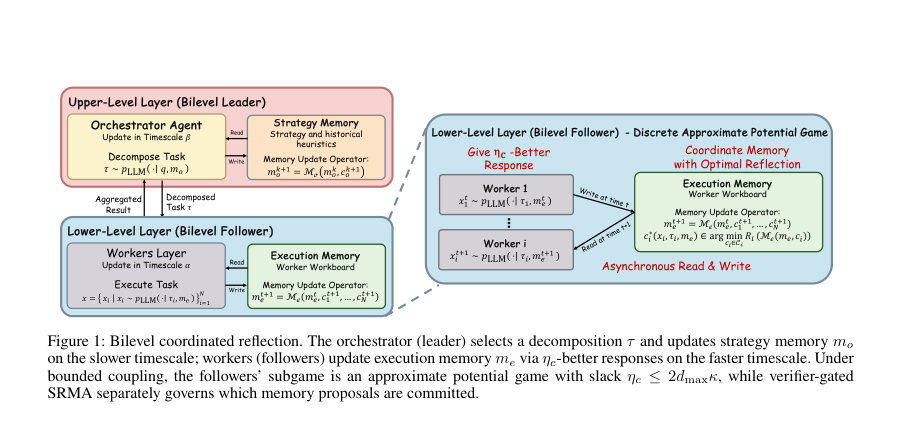

# Bilevel Coordinated Reflection: A Game-Theoretic Approach to Multi-Agent LLM Systems

- **게시일:** 2026-09-04
- **arXiv:** [2609.02750v1](http://arxiv.org/abs/2609.02750v1) · [PDF](https://arxiv.org/pdf/2609.02750v1)
- **저자:** Yihang Chen, Yuxiang Chen, Yuxuan Huang, Meng Fang, Weilin Luo, Jun Wang
- **분야:** cs.AI
- **선정 점수:** 6.53
- **선정 이유:** 최근성 0.7, 인용 영향 0.0 (인용 0회), 저자 영향 0.0 (최고 h-index 0), AI 주제 적합성 3.0, 개발자 관심 0.7, 학술 신호 0.5, 오픈 웨이트·주요 연구조직 신호 1.6

[← 2026-09-04 목록으로 돌아가기](../daily/2026-09-04.html)

<!-- paper-visuals:start -->
## 주요 Figure

> 원문 PDF에서 실제 Figure 캡션과 그림 영역이 함께 확인된 자료만 자동 추출했다.

*Figure · 원문 PDF 2쪽 · Figure 1: Bilevel coordinated reflection. The orchestrator (leader) selects a decomposition τ and updates strategy memory mo*

<!-- paper-visuals:end -->

## 한 문장 요약

오케스트레이터가 분해한 과제를 다수의 LLM 워커가 해결하고 텍스트 메모리를 반영·편집하는 과정을 게임이론적(바이레벨 조정 게임)·확률적 메모리 드리프트 분석으로 정식화하고, 환경-검증기(grounded verifier)로 보강한 SRMA 알고리즘을 제안해 수렴성과 속도 보장을 제시하며 실험으로 검증한다.

## 해결하려는 문제

기존의 다중 에이전트 LLM 시스템은 오케스트레이터가 과제를 분해하고 워커들이 반영(reflection)으로 메모리를 편집하는 절차는 기술하지만, (1) 오케스트레이터의 분해 품질이 워커 간 조정성과 어떻게 연결되는지, (2) 자유형 반영이 언제 수렴하지 않고 정체(plateau)·영구적 오류(floor)를 만드는지, (3) 왜 텍스트만 보는 자체 평가(LLM-as-judge)로는 외부 상태(시뮬레이터·테스트 허니스 등)에 의존하는 진실 여부를 보장할 수 없는지를 통일된 이론으로 설명하지 못함. 또한 편집된 메모리를 언제 수용할지에 대한 정보·확률적 절차와 수렴성과 속도 보장이 결여되어 있음.

## 핵심 기여

- 바이레벨 조정 게임(bilevel coordination game) 정식화: 약한 결합(weakly coupled decomposability) 하에서 워커 서브게임이 기대 전체 효용을 퍼텐셜로 갖는 η_c-근사 퍼텐셜 게임이며 η_c ≤ 2 d_max κ로 분해 품질(결합 강도와 이웃수)이 균형 슬랙을 결정함(섹션 3.1).
- 자유형 반영을 의미론적(이산 상태) 메모리 드리프트로 모델링하고, 한쪽(drfit) 조건으로 유한시한 상한(upper bound)을 도출·최악의 경우의 타이트성(worst-case tightness)을 보이며, 'Persistent Harm' 조건을 추가하면 보편적 하한을 확보함(섹션 3.2).
- 텍스트만 관찰하는 모든(확률·히스토리 종속) 게이트는 텍스트-구별 불능(text-indistinguishable) 환경 쌍에 대해 균일 개선 불가능하다는 정보론적 불가능성 정리와, 환경-접근(grounded) 게이트는 이를 구분하고 기하급수적 수렴을 회복할 수 있음을 증명(섹션 3.3).
- Stochastic Reflective Memory Ascent (SRMA) 제안: 후보 메모리를 환경-근거(verifier)로 평가해 리스크가 엄격히 감소할 때만 수용하도록 하고, 보정(calibration) 및 비퇴화(corrective mass) 조건 하에서 정확한 수렴과 기하/다항 속도 보장을 제시하며(속도는 order-tight) 확률적 평가를 위한 신뢰도(Confidence)-게이팅과 조각적 정상성(piecewise-stationary)에서의 재정착(re-anchoring) 보장 제공(섹션 3.4).
- 이론-메커니즘 수준 실험 검증: Resource Contest, Overcooked(정확 BFS 검증기 사용), SWE-bench(500 인스턴스)에서 분해·메모리·검증의 효과와 이론적 예측(조정 법칙, 드리프트 지수 등)을 관찰하고 정량적 성능 개선을 보고(섹션 4).

## 접근 방법

* 아키텍처: 오케스트레이터(리더)가 질의 q로부터 분해 τ=(τ1,...,τN)을 생성하고 각 워커(i)는 할당 τi와 실행 메모리 m_e를 조건으로 LLM 샘플링으로 지역 해 xi를 생성해 전체 출력 x=(x1,...,xN)를 만든다.
* 분해로 유도된 상호작용 그래프의 에지함수 ψ_ij로 전역 효용 U를 표현(식(2)), 결합 강도 κ와 최대 이웃수 d_max으로 분해 품질을 정량화한다.
* 알고리즘/절차: (1) 워커-서브게임은 기대 전역효용 E[U(x)]를 퍼텐셜로 하는 η_c-근사 퍼텐셜 게임이고, 워커는 η_c-better-response(기댓값 기준 개선)가 없을 때 η_c-근사 내시 균형에 정지함(정리1).
* (2) 메모리는 실행 메모 m_e(워커 공유)와 전략 메모 m_o(오케스트레이터)로 이중 메모리 구조를 갖고, 자유형 반영은 one-sided drift 가정(식(7))으로 모델링해 유한시한 상한(정리2)과 최악 케이스 타이트성(명제1)을 보임; persistent harmful commitment(식(10))을 추가하면 하한(정리3)을 얻음.
* (3) 게이팅: self-contained gate(텍스트만 관찰)와 grounded gate(환경 신호 관찰)를 구분하고, 텍스트-구별 불능 환경 쌍을 구성해 self-gating의 불가능성 정리(정리4)를 증명.
* (4) SRMA: 고정된 검증기(V,ρ)와 평가 프로토콜 g_i을 사용해 후보 메모리를 평가하고 Ri(·)=ρ(V(g_i(τ_i,m_e),τ_i))가 엄격히 감소할 때만 수용(정의3).
* 검증기 보정(calibration, 식(17))과 비퇴화 질량(식(18)), 수용시 비례 감소(식(19)) 가정 하에 Rt(검증 리스크)가 거의확실히 0으로 수렴하고 β에 따라 기하 또는 다항 속도를 확보(정리5).
* 확률적 평가시 Hoeffding 기반 신뢰구간(식(25))으로 confidence-gating을 적용.
* 학습/추론 관점: 오케스트레이터는 느린 시계열(타임스케일 β), 워커는 빠른 시계열(타임스케일 α)로 이중 시간척도 업데이트를 수행하며(Sec.3.1, Fig.1), 실제 구현은 고정 평가 프로토콜로 후보 재생성→평가→조건부 커밋 루프(Alg.1).

## 주요 결과

- 데이터셋/환경: Resource Contest(비공개 caps 설정들), Overcooked(3 레이아웃, 정확 BFS verifier), SWE-bench(500 GitHub 이슈, 공식 테스트 허니스가 grounded verifier). 실험은 주로 얼개별 5개 시드로 집계됨(섹션 4).
- Resource Contest: SRMA는 오라클 누적 보상의 98.5%–99.5%에 도달. 실행 메모리 추가로 평균 보상 2.6 포인트 향상 및 평균 후회(regret)를 4.33→1.70으로 60.8% 감소(본문). 다양한 설정(easy/hard/many/drift)에서 SRMA가 높은 성능을 보임(Table 2).
- Overcooked(점수 = delivery × 20, 5시드): 레이아웃별 평균 점수(평균±표준편차): cramped_room: Greedy 120±40, No memory 180±40, Free-form 240±60, Self-gated 280±40, Grounded SRMA 320±20; asymmetric_advantages: 80±40,140±40,180±40,220±40,280±20; centre_pots: 40±0,100±40,160±60,200±40,260±20. Grounded SRMA가 모든 레이아웃에서 최고 성능(테이블1).
- Gate 선택성과 리스크(5시드, Table 3): No reflection 최종 리스크 0.65±0.05. Free-form: 유해·유익 제안 모두 100% 수용, 최종 리스크 0.42±0.12. Self-gate: 유해 수용 34.5±4.2%, 유익 수용 72.8±5.1%, 리스크 0.28±0.08. Grounded SRMA: 유해 6.2±1.8%, 유익 85.4±3.6%, 리스크 0.14±0.03. Grounded SRMA가 유해 제안 수용률을 현저히 낮춤.
- 검증기 기반 드리프트 캘리브레이션(412 gate 이벤트, 5시드; 3시드로 캘리브레이션, 2시드 홀드아웃): 부트스트랩 결과 bβ = 0.52±0.04, bc1 = 1.25, bc2 = 0.38; acceptance 확률 p_acc(R) ≈ min{1, bc1 R^bβ}. 플러그인 예측은 홀드아웃에서 Pearson r = 0.94, RMSE = 0.032로 트랙했고, 관측 범위에서 리스크 감쇠가 대략 O(T^-1.92) 수준으로 관찰됨(섹션 4). 1-샷 확률적 검증기는 악화 제안을 거짓으로 수용 28.4±5.2%였고(K=5 고정으로 6.8±1.5%로 낮춤, 225 검증기 호출), 적응적 게이트는 유사 신뢰도(7.1±1.8%)를 82±14 호출로 달성(본문).」、「SWE-bench(500 인스턴스): 바이레벨 SRMA(Kimi K2.5) 최종 해결율 72.2% vs 같은 백본의 Free-form MA 58.4% (동일 백본·버짓에서 비교). 공개 mini-SWE-agent v2 레퍼런스(공개 리더보드) 70.8%와 비교해 SRMA가 72.2%로 높음(표4). 통제된 DeepSeek 백본 실험에서도 mini-SWE v2 68.2% 대비 Bilevel SRMA 71.4%로 향상 보고(섹션 4).

## 한계

- (저자 명시) 이론적 보장은 조건부임: bounded coupling(약한 결합), 유한 행동집합(X_i 유한), 검증기 보정(calibration), 비퇴화 corrective mass 가 실제 오픈 엔드 작업에서 성립하지 않을 수 있음(섹션 5, Limitations).
- (저자 명시) 드리프트 파라미터(γ, ν 등)는 관측 가능한 궤적에서만 검증되었고 보편적 성질을 보장하지 않음; 불완전한 테스트 스위트는 검증기 리스크에 대해 단조성을 보장할 뿐 실제 작업 효용에 대해서는 보장하지 않음. 재-앵커링은 구간별 수렴을 보장하나 일반적 전환후 후회(switching-regret) 경계는 제공하지 않음.
- (실험적 제약) 여러 실험에서 고정된 검증기/평가 프로토콜(예: 정확 BFS, 테스트 허니스)과 프리징된 에이전트(MiniMax-M2.7 등) 사용: 결과는 이러한 grounded 신호의 가용성에 크게 의존하며, 실제 배포 환경에서 동일한 수준의 검증기·테스트 허니스가 없다면 성능·보증이 약화될 수 있음.
- (실제 비용·지연) 멀티 에이전트 조정과 검증기 기반 게이팅은 추가 LLM 호출과 외부 검증 호출(시뮬레이터·테스트 등)을 요구해 토큰·시간·컴퓨트 비용이 증가함(본문 언급 및 실험상 다수 검증기 호출).

## 개발자 관점

- 실행 전제: 유효한 환경-근거(grounded) 검증기(정확 값표, 시뮬레이터, 테스트 허니스, 포멀체커 등)를 확보해야 SRMA의 이론·실무적 이점이 발휘됨. 검증기가 불완전하면 검증기 리스크와 실제 효용의 편차를 모니터링해야 함.
- 평가 프로토콜 고정성: SRMA는 평가 프로토콜 gi를 결정론적(또는 기대값 계산 가능)으로 고정해 후보와 현행을 동일 프로토콜로 비교하는 것이 필요함. 확률적 샘플링 검증 시에는 K_t와 δ_t 스케줄(예: Hoeffding 기반)을 설계해 신뢰구간을 확보해야 함(PRop.4 참조).
- 메모리·분해 설계: 분해 품질(κ, d_max)을 낮추는 과제 분할 전략이 팔로워(워커) 서브게임의 η_c 슬랙을 줄여 더 나은 근사평형을 유도하므로 오케스트레이터 설계 시 분해-결합 트레이드오프를 모니터링해야 함(Corollary 1).
- 운영·모니터링: 수용 빈도, 수용 시 평균 리스크 감소량(예: c1,c2), β 지수(로그-로그/로그-선형 회귀로 관측)를 추정해 속도(기하 vs 다항)를 실험적으로 진단하고 게이트·예산을 조정할 것(본문의 캘리브레이션 절차 권장).
- 비용·지연 고려: SRMA는 반복적 LLM 호출과 외부 검증 호출을 늘리므로 예산·지연 제약이 있는 실무 환경에서는 검증 샘플 수 K_t, 평가 빈도, 워커 수 N, 라운드 수 등 예산-민감적 설계가 필요함. 토큰 비용·레이턴시를 측정하고 re-anchoring 빈도를 조정할 것. 또한 텍스트만 보는 'self-gate'는 특정 환경에서 비용이 낮지만 불가능성 결과(정리4)를 고려해 위험을 수용할지 판단해야 함.

**근거 범위:** 이 분석은 논문 PDF 본문(제공된 페이지 1–9)의 텍스트를 기반으로 작성되었음. 보조 수식 전개·긴 증명·추가 실험 설정의 세부치는 부록(보충자료)에 위임되어 있으며 본문에 명시된 수치·정리·표·알고리즘·가정(Assumptions 1–6)과 실험 결과(테이블1–4, 본문 수치)를 직접 인용·요약함. 구현 상세(프롬프트, 하이퍼파라미터, 정확한 랜덤시드 초깃값 등)는 보충자료와 공개 코드 저장소를 참고해야 정확히 재현 가능하다.
