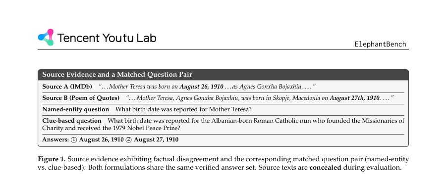
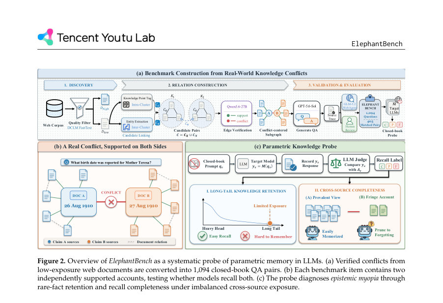
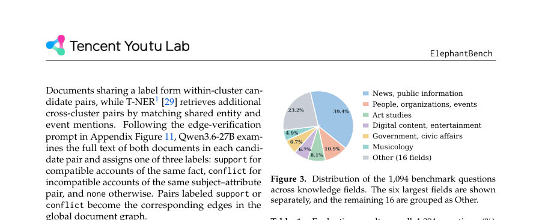

# Blind Men and the Elephant: Probing the Epistemic Myopia of LLMs under Long-Tail Divergent Knowledge

- **게시일:** 2026-08-31
- **arXiv:** [2608.28478v1](http://arxiv.org/abs/2608.28478v1) · [PDF](https://arxiv.org/pdf/2608.28478v1)
- **저자:** Zhuoshi Pan, Junru Lu, Yan Qian, H. Vicky Zhao, Di Yin, Xing Sun
- **분야:** cs.CL
- **선정 점수:** 4.57
- **선정 이유:** 최근성 0.5, 인용 영향 0.0 (인용 0회), 저자 영향 0.0 (최고 h-index 0), AI 주제 적합성 2.6, 개발자 관심 0.9, 학술 신호 0.6, 오픈 웨이트·주요 연구조직 신호 0.0

[← 2026-08-31 목록으로 돌아가기](../daily/2026-08-31.html)

<!-- paper-visuals:start -->
## 주요 Figure

> 원문 PDF에서 실제 Figure 캡션과 그림 영역이 함께 확인된 자료만 자동 추출했다.

*Figure · 원문 PDF 2쪽 · Figure 1. Source evidence exhibiting factual disagreement and the corresponding matched question pair (named-entity*

*Figure · 원문 PDF 3쪽 · Figure 2. Overview of ElephantBench as a systematic probe of parametric memory in LLMs. (a) Verified conflicts from*

*Figure · 원문 PDF 6쪽 · Figure 3. Distribution of the 1,094 benchmark questions*

<!-- paper-visuals:end -->

## 한 문장 요약

장기 꼬리(low-exposure) 웹 문서에서 자연 발생하는 출처 간 불일치를 그래프 기반 파이프라인으로 추출해 1,094개의 폐쇄형(closed-book) 다중정답 QA 벤치마크(ElephantBench)를 만들고, 32개 LLM이 동일 사실의 서로 다른 검증된 진술(계정)을 파라메트릭 메모리에서 얼마나 완전하게 회상하는지(‘epistemic myopia’)를 진단했다.

## 해결하려는 문제

기존 사실 질의응답 평가는 보통 단일 정답을 전제로 해 LLM이 장기 꼬리(long-tail) 사실에 대해 서로 다른(출처별로 검증된) 진술들을 공존시켜 기억하는지를 평가하지 못한다. 또한 지식 충돌 관련 벤치들은 대부분 오픈북 설정(증거 제공)으로, 파라메트릭 메모리가 서로 다른 계정을 독립적으로 보유하는지의 폐쇄형 검증을 제공하지 않는다. 따라서 연구 질문은 'LLM이 저노출 문서들에 기반한 장기 꼬리 사실을 파라메트릭 메모리에서 얼마나 완전하게(모든 검증된 계정을) 회상하는가'이다.

## 핵심 기여

- 장기 꼬리의 출처 불일치를 이용한 폐쇄형 지식 프로브 ElephantBench(1,094문항, 405 매칭 쌍)를 제안하여 ‘기억의 완전성(completeness)’을 별도 측정 항목으로 진단함.
- 저노출(Dlow) 웹 코퍼스에서 그래프 기반 파이프라인(지식점 라벨링 → 엔티티 기반 크로스클러스터 페어링 → LLM 기반 support/conflict 판정 → 분기 중심 서브그래프 → LLM 질의/정답 생성)을 설계·구현하여 출처 추적 가능하고 감사 가능한 벤치 구성 절차를 제시함.
- 각 생성 QA 레코드에 대해 (1) LLM에 의한 문서 내부 증거 검증, (2) 웹 에이전트(GLM-5.2 기반)의 외부 공신력 있는 소스(예: 위키피디아) 검증, (3) 인간 리뷰의 삼중 검증 파이프라인을 도입하여 정답 집합의 신뢰도를 확보함.
- 32개 모델(오픈 소스 및 상용 포함)을 폐쇄형 설정으로 평가하고, 스케일링과 추론 시간 동안의 ‘reasoning’ 설정이 완전 회상에 미치는 영향을 분석함.
- 코퍼스 수준의 노출(지원 문서 수) 불균형과 회상 완전성 간의 관계를 정량적으로 분석하여 다수견(majority)과 소수견(minority) 노출의 비대칭적 영향(+1σ 변화에 대한 C/P/F 변화량)을 제시함.

## 접근 방법

* 파이프라인 개요: (1) 원시 웹 코퍼스 D_all에 품질 분류기(DCLM fastText)를 적용해 상·하위(D_high, D_low)로 분할하고 D_low를 대상으로 삼아 저노출 사실을 발굴한다.
* (2) 각 문서에 대해 LLM(Qwen3.6-27B)을 이용해 SuperGPQA 기반의 지식-포인트 레이블 K(d)를 부여하여 동일 라벨 내 문서들에 대해 조합(CK)을 만든다.
* (3) NER(T-NER)로 정규화된 엔티티/이벤트 멘션이 겹치는 크로스-클러스터 페어(CN)를 추가해 후보 쌍 집합 C = C_K ∪ C_N으로 후보를 축소한다.
* (4) 후보 쌍 각각에 대해 LLM 기반 엣지 분류기 f_ζ(예: Qwen3.6-27B 프로프트)를 호출해 관계 {none, support, conflict}를 예측하여 문서 그래프 G_D = (V_D, E_sup, E_conf)를 유도한다.
* (5) conflict 엣지 e마다 그 주변의 support 이웃을 포함하는 충돌 중심 서브그래프 H_e를 구성하고, 모든 노드의 전체 본문을 LLM(GPT-5.6-Sol 사용)에게 주어 질의 q_e와 검증된 정답 집합 A_e를 생성(명시형(named-entity)과 힌트형(clue-based) 질문의 매치된 쌍 생성).
* (6) 생성된 레코드에 대해 (i) LLM 내부 검증(모든 정답이 서브그래프 문서에서 명시적으로 지원되는지), (ii) 웹 에이전트(GLM-5.2 기반)의 외부 공신력 검증(위키피디아 등), (iii) 인간 리뷰를 차례로 수행하여 인증·거부한다.
* (7) 평가: 대상 모델에는 질문만 폐쇄형으로 제공하고 모델이 생성한 응답 y_e를 LLM 판정자(GPT-5.6-Sol)에 의해 세 범주(complete/partial/failed)로 자동 채점하며 지표로 C/P/F와 조건부 완전성 K=C/(C+P)를 사용한다.

## 주요 결과

- 데이터·구성: RePro 유기적 데이터에서 DCLM fastText로 저점수(D_low)를 추출해 후보 충돌 엣지를 샘플링·확장하고 GPT-5.6-Sol로 QA 생성·검증·휴먼 리뷰 후 최종 1,094문항(22개 지식 분야, 405 매칭 쌍)을 확보함.
- 모델 풀: 32개 구성(26개 오픈·6개 상용), 기본적으로 추론 시 reasoning 활성화. 자동 판정자는 GPT-5.6-Sol, 인간 판정자와의 정확도 90.13–93.36%, Cohen’s κ 0.815–0.877로 신뢰성 검증됨(Table 2).
- 주요 정량 결과: 최고 성능 모델(Kimi-K3, 오픈·>100B) 완전 회상 C=52.38%, Gemini-3.1-Pro C=50.37%, GPT-5.5 C=50.18%로 '가장 강한 모델들조차 모든 검증된 계정을 모두 회상하는 비율이 약 절반 수준'임(Table 1). 실패(F) 비율은 상위 모델에서 매우 낮아 2–3% 수준이지만 부분 회상(P)이 높아(약 45–57%) 불완전한 회상이 지배적임.
- 스케일 효과: 모델 규모 증가에 따라 완전 회상 C는 크게 향상(예: Qwen3.5: 2B→397B에서 C 1.65%→32.27%), 그러나 부분 회상도 동시에 증가하는 경향을 보이며 완전성 문제는 남음(Fig.4).
- 추론(reasoning) 효과: reasoning 활성화는 일부 최첨단 모델에서 완전 회상 개선을 크게 유도(예: GPT-5.6-Sol +13.99 pp, GPT-OSS-120B +12.89 pp)하나 일관적이지 않음(Fig.5,6) — 소형 모델에서는 오히려 완전성 감소 사례 관찰됨(사례 분석 Fig.14).」「오라클 조합: 모델들을 그리디하게 합칠 때 완전 회상은 단일 모델 52.4%에서 전체 32구성 시 81.2%까지 증가하지만(완전 회상이 포화되는 지점 약 23개 구성), 여전히 18.8%(206문항)는 어떤 구성에서도 '모든 계정'을 회복하지 못함(즉, 모델 간 보완성은 있으나 공통적 한계 존재)(Fig.9).」「코퍼스 노출 분석: 각 충돌에 대해 다수측·소수측을 지지하는 문서수 N_maj, N_min을 세고 로그표준화한 뒤 회귀분석 수행. 결과는 비대칭적 영향: +1σ 다수측 노출은 부분 회상(P) +14.18pp와 실패(F) −10.17pp와 연관되어 '기억 여부'를 증가시키는 반면, +1σ 소수측 노출은 완전 회상(C) +15.13pp 및 P −15.41pp와 연관되어 '완전성'을 더 강하게 촉진함(Table 4, Fig.7).」「지식 분야·갈등 메커니즘: 분야별 편차 존재(예: People/Orgs C=38.7%, Digital content C=32.1% vs. Government C=12.0%, Consumer products C=6.2%)(Fig.8). 갈등 메커니즘별로는 측정/추정 관련 갈등이 가장 쉬워 C=38.9%이고, 시간적·보고 불일치(temporal/reporting)는 어려워 C≈18% 수준(Fig.15).」「효율적 대안 지표: 조건부 정답(verified answers)에 대한 PPL은 생성평가 결과와 정렬되어(높은 PPL은 실패/부분 회상과 연관) 저비용 대체 평가 지표로 활용 가능함(Fig.10,17).

## 한계

- 저자가 명시한 한계: 1) 평가에 사용한 공개 코퍼스(RePro D_low)를 노출의 관찰적 프록시로 사용했으나 개별 모델의 사전학습 데이터·샘플링 정책은 공개되지 않아 노출 관련 연관성은 인과관계가 아닌 관찰적 연관성으로 해석해야 함(논문 본문·Limitations 섹션). 2) 벤치의 규모(1,094문항·22분야)는 광범위한 장기 꼬리 지식과 불일치 유형 전체를 포괄하지 못하므로 확장 필요(저자 진술). 3) 평가에 포함된 32개 모델은 대표적이나 모든 최신·후속 모델, 모든 규모·추론 설정을 포함하지 못함(저자 진술).
- 논문 본문에서 합리적으로 확인되는 추가 제약: 4) 벤치 생성·검증 과정에서 인간 리뷰어가 저자(내부 연구자)로 한정되어 외부 주석자 편향 가능성 존재(본문 L항), 5) 계산 자원·세부 인프라(가속기 사용 시간 등)는 인프라 제공자의 정책상 비공개여서 전체 비용·시간 소요의 재현 가능성에 제약이 있음(본문 M항·API 비용 약 USD 295 명시).

## 개발자 관점

- 재현성: 코드·데이터·데모 링크(프로젝트 페이지, GitHub, HuggingFace 데이터셋)가 공개되어 있어 파이프라인 따라하기가 가능함. 다만 원시 D_low 코퍼스(저노출 샘플)와 내부 인프라·API 키 등은 필요함.
- 구현·비용: 그래프 구성에서 지식-포인트 클러스터링과 엔티티 인덱싱으로 후보 쌍을 크게 줄여 LLM 판별 호출 수를 15.2× 이상 절감함(Appendix B). 그러나 LLM(여러 모델) 호출, 외부 웹 검증, 인간 리뷰가 포함되어 실제 구축에는 상당한 API·연산·인간 비용이 듦(본문 M, API 비용 약 USD 295 표기, 가속기 시간 비공개).
- 평가·설정 주의: 폐쇄형(질문만) 설정과 판정자(GPT-5.6-Sol) 사용을 엄격히 재현해야 동일한 C/P/F 해석이 가능함. reasoning(추론) 모드·샘플링 온도 등의 메타파라미터가 완전성에 영향을 줄 수 있으므로 실험 조건을 명확히 고정·기록할 것(Appendix C,E).
- 데이터 큐레이션: 불균형한 출처 노출이 불완전 회상을 유발하므로(다수측 노출은 '기억'을 돕고 소수측 노출은 '완전성'을 높임) 데이터 보강·업샘플링 전략 수립 시 소수측(덜 노출된 계정)의 문서 노출을 고의로 늘리는 것이 중요함(분석 §5.1, Table 4).
- 안전성·윤리: 공개 검증 단계에서 위키피디아 등 공신력 출처로 교차검증하고 인간 리뷰로 민감·해로운 콘텐츠를 제거했으나, 데이터는 여전히 출처 오류·허위정보를 포함할 수 있으므로 배포·활용시 연구 목적 외 사용(감시·프로파일링 등)을 금지하고 접근 제어·사용 목적 고지를 권장함(본문 Ethics Statement, Appendix K/L).

**근거 범위:** 이 분석은 제공된 논문 PDF 본문(전체)에 기반해 작성되었으며 주요 수치와 방법·실험 결과는 본문 표·도표·부록에서 직접 추출했습니다. 저자가 명시적으로 공개하지 않은 항목(예: 개별 모델의 내부 사전학습 코퍼스, 상세 인프라 사용 시간)은 문헌에서 확인 불가하여 만들지 않았습니다. 본문 외부의 후속 작업이나 모델 업데이트(논문 발표 이후 공개된 모델)는 반영되어 있지 않습니다.
