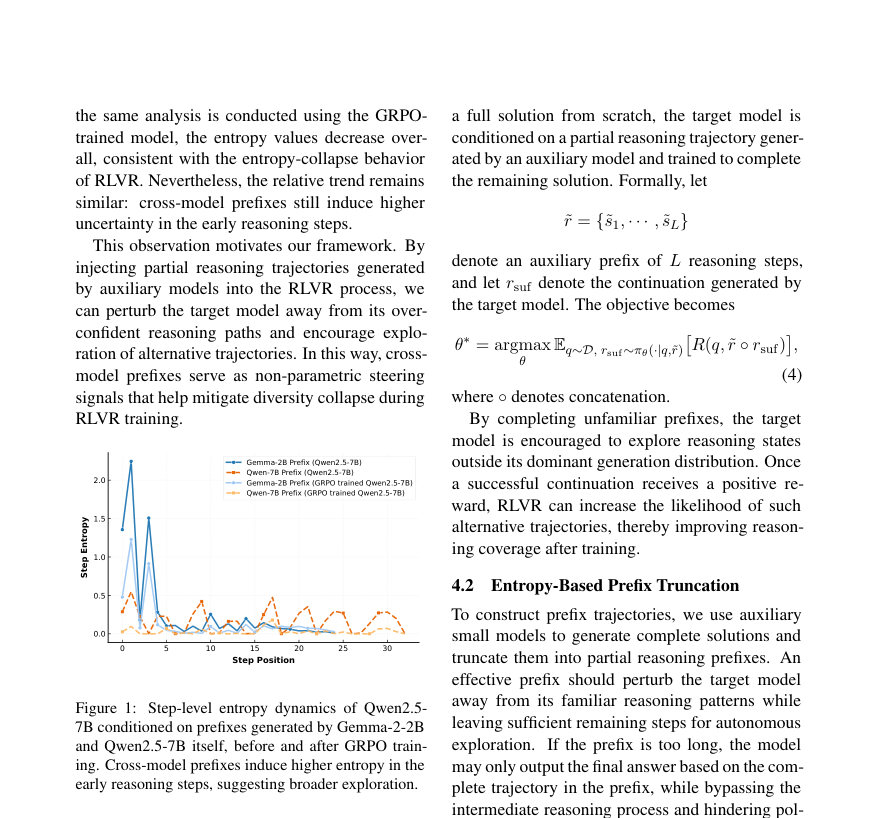
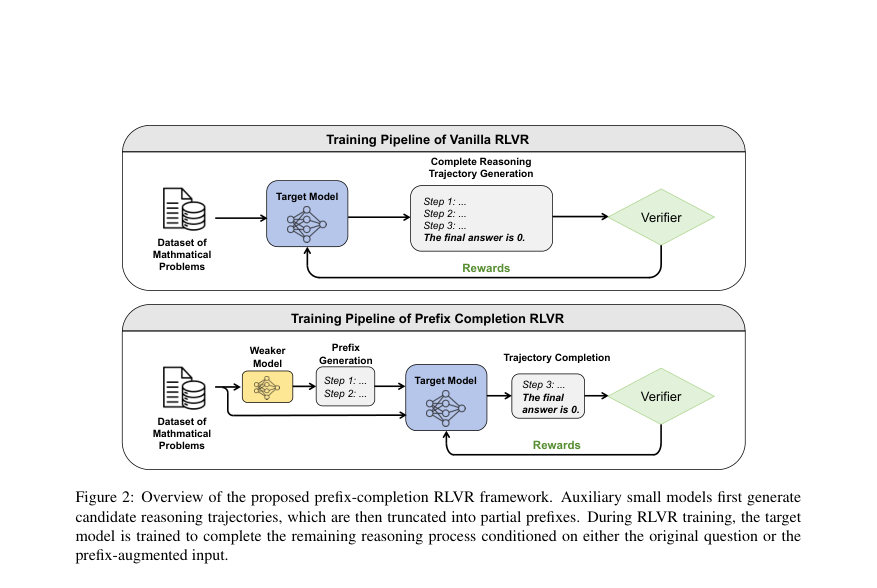
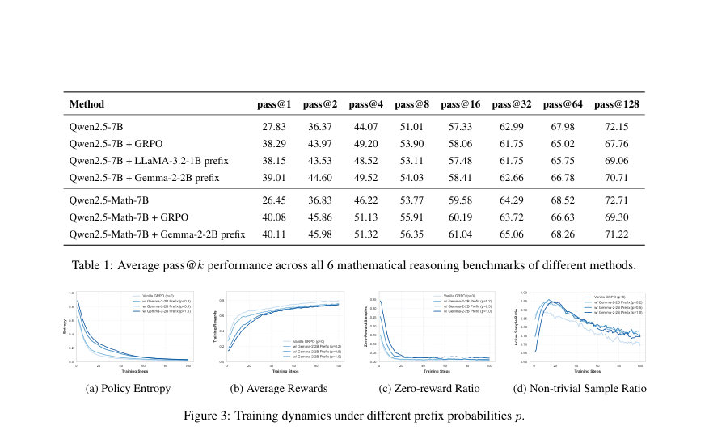

# Boosting LLM Exploration via Weak-Model Guidance in RLVR

- **게시일:** 2026-08-30
- **arXiv:** [2608.27420v1](http://arxiv.org/abs/2608.27420v1) · [PDF](https://arxiv.org/pdf/2608.27420v1)
- **저자:** Xingyu Shen, Huishuai Zhang, Peng Li, Yinchun Wang, Dongyan Zhao
- **분야:** cs.CL
- **선정 점수:** 3.68
- **선정 이유:** 최근성 0.5, 인용 영향 0.0 (인용 0회), 저자 영향 0.0 (최고 h-index 0), AI 주제 적합성 2.9, 개발자 관심 0.0, 학술 신호 0.3, 오픈 웨이트·주요 연구조직 신호 0.0

[← 2026-08-30 목록으로 돌아가기](../daily/2026-08-30.html)

<!-- paper-visuals:start -->
## 주요 Figure

> 원문 PDF에서 실제 Figure 캡션과 그림 영역이 함께 확인된 자료만 자동 추출했다.

*Figure · 원문 PDF 4쪽 · Figure 1: Step-level entropy dynamics of Qwen2.5-*

*Figure · 원문 PDF 5쪽 · Figure 2: Overview of the proposed prefix-completion RLVR framework. Auxiliary small models first generate*

*Figure · 원문 PDF 7쪽 · Figure 3: Training dynamics under different prefix probabilities p.*

<!-- paper-visuals:end -->

## 한 문장 요약

약한(소형) 보조 모델이 생성한 부분적 추론(prefix)을 타겟 LLM에 조건으로 주어 완성하도록 RLVR(GRPO) 훈련을 수행함으로써 엔트로피 붕괴를 완화하고 높은 k에서의 pass@k(추론 커버리지)를 개선한다.

## 해결하려는 문제

기존 RLVR(특히 GRPO)로 LLM의 추론 성능을 높일 수 있으나 훈련 초기 정책 엔트로피가 급감(엔트로피 붕괴)하여 생성 다양성이 좁아지고, 그 결과 pass@k에서 k가 클 때 성능이 떨어지는 문제가 있음. 기존의 알고리즘적 정규화(엔트로피 정규화, 보상 설계 등)는 내부 탐색을 조절하지만, 서로 다른 모델 간의 생성 분포 차이를 이용한 외부(non-parametric) 교란은 간과되어 왔음. 본 연구는 외부(약한) 모델의 부분적 추론 경로로 타겟 모델을 조건화하면 탐색이 확장될지, 그 메커니즘과 실효성을 묻는다.

## 핵심 기여

- 서로 다른 언어모델(대·중·소) 간 생성 분포 차이를 체계적으로 분석하고, 이러한 교란이 RLVR의 탐색 역학에 미치는 영향을 규명함.
- 약한(auxiliary) 모델이 생성한 부분적 추론(prefix)을 타겟 모델이 완성하도록 하는 prefix-completion RLVR 프레임워크를 제안함(엔트로피 기반 truncation과 혼합 학습 전략 포함).
- 수학 추론 벤치마크(AIME 2024/2025, AMC 2023, MATH 500, Minerva, Olympiad Bench)의 평균 pass@k에서 vanilla GRPO 대비 일관된 개선을 보였고, k가 커질수록 성능 향상이 뚜렷함을 실험적으로 입증함.
- 심층 분석을 통해 약한 모델의 prefix는 종종 정확하지 않더라도(심지어 오도성도 있음) 타겟 모델의 초기 단계 불확실성을 증가시켜 탐색을 촉진하고, 엔트로피 붕괴를 지연시키는 메커니즘을 제시함.

## 접근 방법

* 기본 알고리즘은 GRPO 기반의 RLVR이다.
* 핵심 아이디어는 다음과 같음: (1) 보조(작은) 모델들(예: Gemma-2-2B, LLaMA-3.2-1B)이 동일한 문제에 대해 완전한 추론을 생성한 뒤 이를 단계(step) 단위로 분할하여 부분적 prefix ˜r을 얻는다.
* (2) 타겟 모델은 원래 질문만으로 답을 생성하는 표준 GRPO 예제와, 확률 p로 auxiliary prefix를 질문 뒤에 붙여 그 이후를 완성하게 하는 prefix-completion 예제를 혼합하여 학습한다(혼합 확률 p는 본문에서 주로 0.2로 설정).
* (3) prefix 길이 결정은 타겟의 step-level 엔트로피 ¯Hθ0(sj)를 사전에 계산하여 인접 단계 간 엔트로피 하강이 가장 큰 지점 L*를 찾아 그 이전까지를 보존하는 '엔트로피 기반 절단'을 사용한다(절단은 훈련 전 베이스 모델로 한 번 계산).
* (4) 학습 설정: 학습률 1e-6, 배치 1024, PPO 미니배치 256, 각 질문당 8 샘플(온도 1.0)로 롤아웃, GRPO에서 본 실험에서는 안정화를 위해 KL 페널티는 사용하지 않음.
* 평가 시 vLLM을 사용해 온도 0.6·top-p 0.95 등으로 다수 샘플(문제별 128 또는 200 샘플)을 생성해 pass@k를 계산함.

## 주요 결과

- 평균 pass@k(6개 수학 벤치마크 통합) 요약(본문 Table 1): Qwen2.5-7B: (원본 모델, 학습 전) pass@1=27.83 → GRPO baseline: pass@1=38.29, pass@128=67.76. Qwen2.5-7B + Gemma-2-2B prefix: pass@1=39.01, pass@128=70.71(=GRPO 대비 특히 큰 k에서 향상). Qwen2.5-7B + LLaMA-3.2-1B prefix: pass@1=38.15, pass@128=69.06. Qwen2.5-Math-7B: 원본 pass@1=26.45 → GRPO baseline pass@1=40.08, pass@128=69.30; Qwen2.5-Math-7B + Gemma-2-2B prefix: pass@1=40.11, pass@128=71.22.
- 학습 역학(본문 Figure 3): prefix 주입(p>0)은 초기 학습 단계에서 정책 엔트로피를 일관되게 상승시켜(엔트로피 붕괴 지연) 탐색 기회를 늘림. prefix 비율 p를 키우면(예: p=0.2→0.5→1.0) 엔트로피 궤적이 위로 이동하나, p가 너무 크면(예: p=1.0) 학습·평가 불일치로 성능 저하 가능성이 있음(본문 Table 2에서 p=0.2가 균형적).
- 탐색의 비용: prefix 모델 때문에 평균 보상은 초기 낮아질 수 있으나(탐색 비용), 샘플 사이의 보상 이질성이 커져 유의미한 상대적 어드밴티지 신호가 증가함(제로 보상 샘플 비율 감소, 활동 샘플 비율 증가).
- prefix 품질 분석(본문 §6.2): DeepSeek-V4-Flash로 평가한 결과 대부분의 보조 모델 prefix는 '유의미한 안내 없음' 또는 '완전히 잘못된/오도적'인 경우가 많음. 그럼에도 불구하고 prefix-completion 학습은 성능 향상에 기여하므로 '정확한 교사 신호'로서가 아니라 '분포적 교란(perturbation)'으로서의 가치가 핵심임.
- 소거(ablation) 결과(본문 Table 2): 엔트로피 기반 절단이 임의 절단보다 우수. p=0.2가 pass@128 개선(67.76→70.71)과 pass@1 보존/개선(38.29→39.01)에 균형적. 동족(homologous) 모델(Qwen 계열) prefix는 분포적 교란 효과가 작아 성능 이득이 미미하거나 없음.

## 한계

- 저자 명시 한계: (1) 성능 향상이 하이퍼파라미터(특히 prefix 삽입 확률 p, 절단 전략 등)에 민감하며 사전 설정된 값에 의존적이다. (2) 본 연구는 수학적 추론(task domain)에 집중되어 있으며 논리·코드 생성 등 다른 도메인에서는 효과가 검증되지 않음.
- 본문과 실험에서 합리적으로 확인되는 제약(분리 기술): (1) prefix 생성을 위한 추가 소형 모델이 필요하므로 데이터 준비·전처리 단계가 추가되며(특히 다수 문제에 대해 prefix를 생성·절단·저장해야 함) 평가 시 높은 샘플 수(문제당 128/200)를 요구하므로 계산 비용이 큼. (2) prefix 자체의 낮은 품질(많은 경우 오도적)이 학습 초기 보상·학습 안정성에 부정적 영향을 줄 수 있으므로 모니터링과 적절한 p 조절이 필요함. (3) GRPO 구현 세부(예: 클리핑 계수 ϵ, 베타 등)와 일부 설계 선택은 본문에 완전한 범위로 공개되지 않아, 정확한 재현에는 추가 정보가 필요할 수 있음.

## 개발자 관점

- 재현 핵심 포인트: 사용한 타겟·보조 모델(본문 예: Qwen2.5-7B/Qwen2.5-Math-7B 타겟, Gemma-2-2B·LLaMA-3.2-1B 보조), GRPO 기반 훈련 파이프라인(본문은 VeRL 기반 구현), 엔트로피 기반 절단 L* 계산(사전 베이스 모델로 step-level 엔트로피 계산 후 최대 하강점 선택), 혼합 학습 비율 p=0.2(주요 실험) 등을 일치시켜야 함.
- 하이퍼파라미터 권장: 본문 결과에 따르면 p는 과도하게 클 경우(=1.0) 역효과 가능성이 있으므로 0.2 수준으로 시작해 검증에서 pass@k(특히 큰 k)와 평균 보상을 관찰하며 조정할 것.
- 성능·비용 고려: 평가에서 문제당 128~200 샘플을 사용하므로 pass@k 향상을 입증하려면 상당한 생성 비용이 들며, 실서비스에서는 평가 비용 최적화(샘플수 조절·캐싱 등)가 필요함.
- 안정성·품질 관찰: 보조 prefix는 종종 오도적일 수 있으므로 학습 초기에 평균 보상 및 제로 보상 비율을 모니터링하고 필요 시 prefix 비율 p를 동적으로 줄이는 정책을 고려할 것.
- 통합 가능성: 본 접근법은 모델 입력 수준의 데이터 교란(data-level perturbation)이므로 엔트로피 정규화·보상 재설계 같은 기존 알고리즘적 방법과 병행하여 시너지를 낼 가능성이 높음(저자 제안).

**근거 범위:** 이 분석은 제공된 논문 PDF 본문(전체 페이지에서 추출된 텍스트)을 기반으로 작성되었음. 표와 본문에 제시된 주요 수치(예: Table 1, Table 2, Figure 3 관련 값)는 본문에 명시된 값을 그대로 인용함. 다만 Figure 4의 prefix 품질 분포에 표기된 일부 세부 퍼센트 수치는 PDF에서 시각적으로 추출된 부분이 있어 정확한 자리수는 본문 텍스트로 완전히 분해하기 어려워 '대다수가 낮은 품질'이라는 정성적 진술로 대신했고, GRPO의 일부 하이퍼파라미터(예: 클리핑 ϵ, β의 값 등)는 본문에 상세 수치로 표기되어 있지 않아 재현 시 추가 정보 확인이 필요함.
