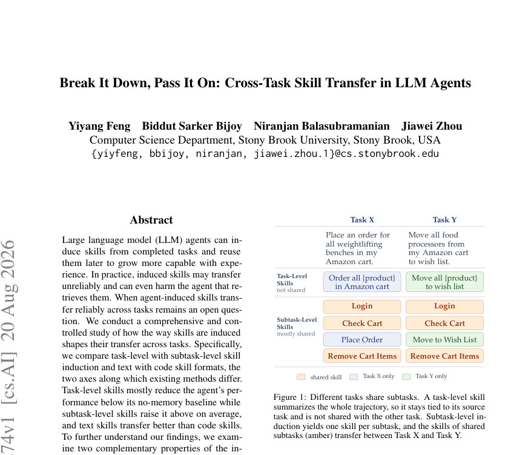
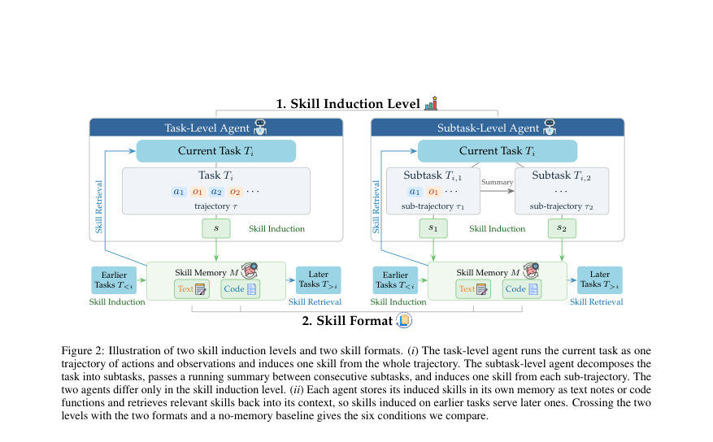
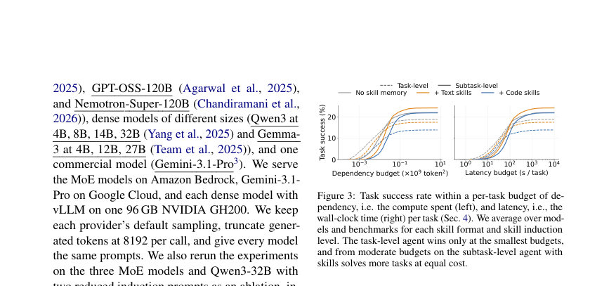

# Break It Down, Pass It On: Cross-Task Skill Transfer in LLM Agents

- **게시일:** 2026-08-22
- **arXiv:** [2608.20274v1](http://arxiv.org/abs/2608.20274v1) · [PDF](https://arxiv.org/pdf/2608.20274v1)
- **저자:** Yiyang Feng, Biddut Sarker Bijoy, Niranjan Balasubramanian, Jiawei Zhou
- **분야:** cs.AI, cs.CL
- **선정 점수:** 5.96
- **선정 이유:** 최근성 0.5, 인용 영향 0.0 (인용 0회), 저자 영향 1.2 (최고 h-index 5), AI 주제 적합성 3.0, 개발자 관심 0.7, 학술 신호 0.6, 오픈 웨이트·주요 연구조직 신호 0.0

[← 2026-08-22 목록으로 돌아가기](../daily/2026-08-22.html)

<!-- paper-visuals:start -->
## 주요 Figure

> 원문 PDF에서 실제 Figure 캡션과 그림 영역이 함께 확인된 자료만 자동 추출했다.

*Figure · 원문 PDF 1쪽 · Figure 1: Different tasks share subtasks. A task-level skill*

*Figure · 원문 PDF 4쪽 · Figure 2: Illustration of two skill induction levels and two skill formats. (i) The task-level agent runs the current task as one*

*Figure · 원문 PDF 5쪽 · Figure 3: Task success rate within a per-task budget of de-*

<!-- paper-visuals:end -->

## 한 문장 요약

LLM 에이전트가 완료한 작업에서 유도한 스킬을 저장·재사용할 때, 전체-궤적(task-level) 대 서브태스크(subtask-level) 유도와 텍스트 대 코드 형식의 차이가 전이 성능에 큰 영향을 미치며, 스킬의 'specificity'와 'abstractness' 곱으로 정의한 스킬 유틸리티가 전이 성공을 예측한다.

## 해결하려는 문제

기존 스킬 메모리 방법은 보통 전체 작업 궤적을 요약해 스킬로 저장하는데, 이렇게 유도된 스킬은 출처 작업에 과도하게 특화되어 다른 작업으로 전이될 때 무관한 맥락이 되어 성능을 저해하거나 오류를 전파한다. 따라서 에이전트가 유도한 스킬이 언제, 어떤 방식으로 다른 작업에 안정적으로 전이되는지가 미해결 문제이다.

## 핵심 기여

- task-level(전체 궤적) vs subtask-level(하위 절차) 스킬 유도와 text vs code 두 스킬 형식을 동일한 유도 프롬프트·검색·평가 조건에서 체계적으로 교차비교하여 전이 효과를 평가함.
- 광범위한 실험: 3개 장기-호라이즌 벤치마크(AppWorld, OfficeBench, KramaBench)와 11개 모델(오픈·상용 포함)에서 6가지 조건(Task/Task+Text/Task+Code/Subtask/Subtask+Text/Subtask+Code)을 비교함.
- 스킬의 두 성질(specificity, abstractness)을 정의하고 이들의 곱을 스킬 유틸리티로 제안하여, 실행 없이(스킬과 작업 설명만으로) 해당 스킬 메모리가 향후 작업에 유용할지를 예측할 수 있음을 보임.
- 경험적 결과: (i) subtask-level 유도로 생성한 스킬은 평균적으로 에이전트 성능을 향상시키고, task-level 유도는 대체로 성능을 저하시킴; (ii) 텍스트 스킬이 코드 스킬보다 전이 성능이 좋음.
- 스킬 유틸리티 점수는 실제 작업 스트림에서의 재사용 밀도와 상관관계를 보이고, 라이브러리를 유틸리티 기준으로 분할했을 때 높은 유틸리티 절반이 더 높은 성공률을 낸다는 인과적 증거 제시.

## 접근 방법

* 구성요소: (1) 두 종류의 에이전트 아키텍처: task-level 에이전트(전체 작업을 단일 ReAct 루프로 처리)와 subtask-level 에이전트(플래너/실행기/요약기 사이클로 작업을 하위태스크로 분해).
* (2) 스킬 메모리: 완료된(전체)궤적 또는 각 서브궤적을 하나의 스킬로 유도(induction)해 저장.
* 각 스킬은 짧은 설명(검색용)과 본문(텍스트 워크플로 노트 혹은 파이썬 함수 코드)으로 구성된다.
* (3) 검색: 스킬 설명과 작업(또는 서브태스크) 쿼리를 all-MiniLM-L6-v2 임베더로 임베딩해 코사인 유사도 상위 항목을 검색해 컨텍스트로 주입.
* 코드 스킬은 네임스페이스에 로드되어 호출 가능하며, 실패하는 코드 스킬은 제거.
* (4) 실험 설정: 3개 벤치마크(AppWorld: 417 test-challenge, OfficeBench: 300, KramaBench: 92), 모델군(다중 MoE 및 dense, Gemin i-3.1-Pro 포함), 동일한 프롬프트(유도 프롬프트는 App.
* A에 있음), 비교 조건 6가지, 각 에이전트는 동일한 no-memory 대비로 측정.
* 실행 제약: task-level 최대 50 ReAct 스텝, subtask-level 최대 15 서브태스크(공유 50-step executor 예산).
* 평가: 각 벤치마크의 공식 평가자로 산출된 작업 성공률(0–1)을 평균으로 보고하며, 효율성으로 지연(latency)과 dependency(늘어나는 컨텍스트에 소비된 계산량)를 측정.

## 주요 결과

- 전반적 비교(모델·벤치마크 평균, 11개 모델 포함): task-level 에이전트 no-memory 평균 성공률 22.1% → Task+Text 20.9%(-1.2pp), Task+Code 18.0%(-4.1pp)로 스킬이 오히려 해를 끼침. subtask-level 에이전트 no-memory 24.8% → Subtask+Text 26.7%(+1.9pp), Subtask+Code 25.3%(+0.5pp)로 평균적으로 이득 발생 (Table 2, 하단 Average 행).
- 형식 비교: 동일한 유도 레벨에서 텍스트 스킬이 코드 스킬보다 더 좋음(논문 본문: subtask-level에서 평균 2.9pp 우위, task-level에서 1.4pp 우위로 기술됨).
- 예산(의존도·지연) 대비 성능: 작은 예산에서는 task-level 에이전트가 유리하나(간단한 작업을 저비용으로 해결), 중간 이상의 예산에서는 subtask-level 에이전트가 추월하고 더 높은 포화 성공률을 보임(Fig.3, Fig.28).
- 스킬 유틸리티 예측력: 각 작업에 검색된 스킬들의 평균 유틸리티로 작업들을 정렬해 동일 크기 bin으로 나누면, 유틸리티가 높은 bin일수록 성공률이 증가(예: task-level: 14.0%→24.5%, subtask-level: 22.8%→31.0% across bins; Fig.5a).
- 유틸리티 구성·거래관계: specificity 또는 abstractness 단독으로는 성공을 예측하지 못하고(각각 증가 후 감소하는 패턴), 두 값을 곱한 utility가 성공과 일관된 상관을 보임(Fig.5b, Fig.27). 유도 레벨·형식별 중앙값: subtask-level 및 Text 스킬이 더 높은 median utility를 가짐(Fig.5c–e).」「실제 재사용과의 일치: 스트림을 50개 구간으로 나눈 전이 밀도(ordered bin pairs 중 재사용이 발생한 비율)에서 subtask-level 재사용 밀도가 더 높음(AppWorld 31% vs 20%, OfficeBench 40% vs 28%, KramaBench 17% vs 6%; Fig.6).」「인과적 검증: 동일한 스킬 라이브러리를 유틸리티 중앙값으로 반으로 나눠(low/high) 각각만 메모리에 넣고 재실행한 결과, 높은 유틸리티 절반이 더 높은 성공률을 보였음(예: KramaBench, task-level 라이브러리: 44.0% vs 42.9%; subtask-level: 48.4% vs 47.0%; Table 4).

## 한계

- 저자 명시: (1) 실험 도메인 한정 — 연구는 AppWorld(멀티앱 도구), OfficeBench(오피스 워크플로), KramaBench(데이터 사이언스 파이프라인) 세 벤치마크에 국한되며, 컴퓨터 사용 전반, 코드 에이전트, 웹 검색 등 다른 에이전트 환경에서는 결과가 달라질 수 있음. (2) 고정된 메모리 운영 — 본 연구는 고정(induction/retrieval/deduplication) 규칙을 따르는 메모리를 사용; 메모리의 수정·업데이트(저자들이 언급한 진화하는 메모리)는 별도 연구가 필요함. (3) 평가 해상도 — 작업 성공을 최종 상태로만 채점하였으며, 스텝별(중간 결정) 분석을 위해선 추가적인 스텝-레벨 그라운드트루스나 심판 모델이 필요함. 또한 대규모 실험에서 Docker 루트 접근 등 인프라 제약이 있어 일부 환경 실험이 어렵다고 언급됨.
- 본문에서 확인되는 추가 제약(추정 아님, 본문 근거 기반): (4) 스킬 유도·검색은 동일한 프롬프트와 all-MiniLM-L6-v2 임베더를 사용해 결과가 이 임베더·프롬프트에 의존할 수 있음(본문에서 검증을 일부 제시하나 완전한 일반화는 추가 검증 필요). (5) 코드 스킬은 네임스페이스 로드 단계에서 실패할 수 있으며, 본 실험은 실패한 코드 스킬을 제거함 — 실제 생산 환경에서는 코드 안전성·의존성 문제가 추가로 발생할 수 있음. (6) 재현 관련: 프롬프트 상세(App. A), 프롬프트 약화(Ablation L1–L3) 등은 부록에 있으나 본문만으로는 일부 구현 세부(예: 검색 k값, 임베딩 정규화 세부)가 생략될 수 있음.

## 개발자 관점

- 스킬을 저장·재사용하려면 전체-궤적 단위보다 서브태스크 단위로 분해해 각 서브태스크별 스킬을 유도하라 — 평균적으로 교차-작업 전이 성능이 개선됨.
- 스킬 형식은 텍스트 워크플로(자연어 노트)를 우선 고려하라 — 코드 함수형으로 저장하면 실행 편의성은 있으나 전이 성능(특히 일반성)에서 텍스트가 더 유리한 경우가 많음.
- 스킬 유틸리티(특이성·추상성의 곱)를 배포 전 진단 지표로 사용하라 — 스킬 라이브러리와 작업 설명만으로 실행 없이도 유용성을 평가할 수 있어 위험한(해로운) 스킬 집합을 사전 선별 가능함.
- 재현·운영 팁: (i) 검색은 스킬 설명만으로 수행했으므로 스킬 설명을 잘 설계(핵심 절차·키워드 포함)하면 검색 품질 향상에 도움됨; (ii) 코드 스킬은 로드 실패 대비 프로세스(안전 검사·샌드박스)와 의존성 관리를 마련해야 함; (iii) 리소스/지연 고려 시 subtask-level은 중간 이상의 예산에서 비용 대비 더 큰 이득을 보이므로, 제한된 비용 환경에서는 task-level(또는 no-memory) 접근을 우선 고려할 것.
- 안전성: 스킬 메모리가 악성 절차를 전이할 수 있으므로, 권한·출처 검증, 서명, 신뢰성(유틸리티 외 신뢰 지표) 검증 절차가 필요함 — 논문도 악성 스킬 주입 위험을 경고함.

**근거 범위:** 이 분석은 제공된 논문 PDF 본문(주요 본문 및 부록에 수록된 표·그림·수치)을 기반으로 작성되었다. 본문에 직접 표기된 수치(예: Table 2, Fig.3–6, Table 4, Fig.27 등)를 인용했으며, 프롬프트 상세나 일부 구현 파라미터(예: 검색 k값, 임베딩 정규화 세부)는 본문/부록에 일부 언급되나 PDF 텍스트 추출 과정에서 완전한 원문 프롬프트나 코드 조각이 누락될 수 있어 그 부분은 원문 부록(App. A–C 등)을 함께 참조해야 한다.
