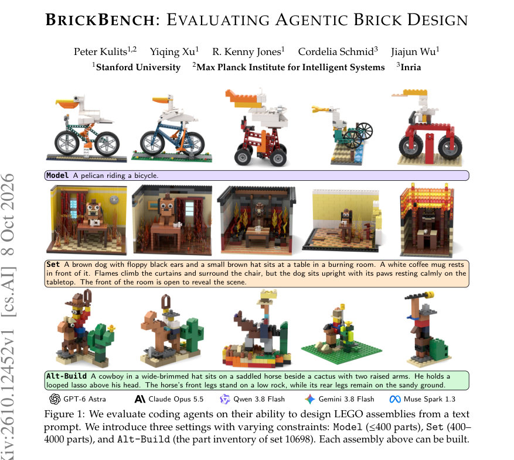
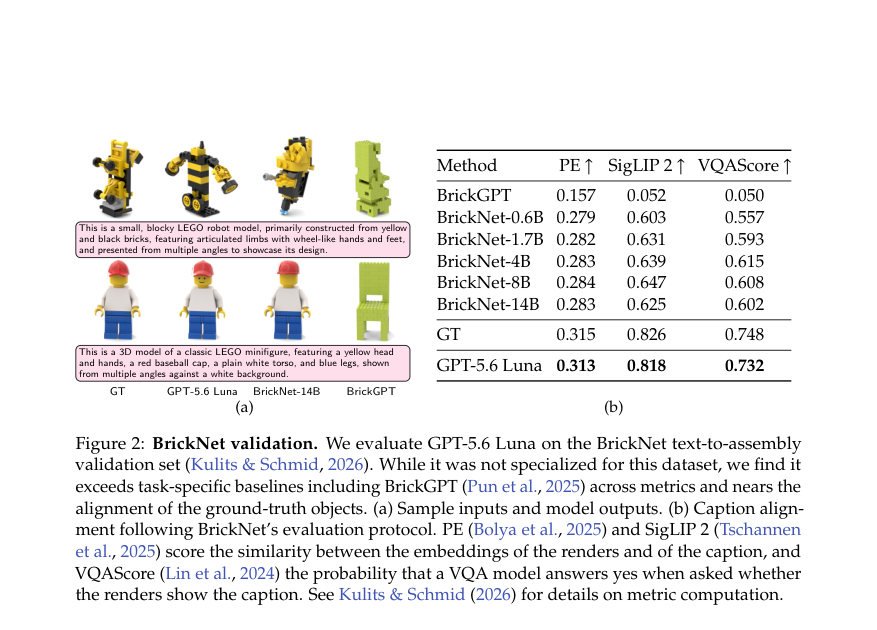
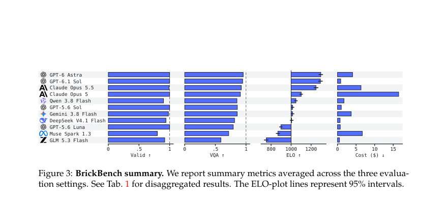

# BrickBench: Evaluating Agentic Brick Design

- **게시일:** 2026-10-10
- **arXiv:** [2610.12452v1](http://arxiv.org/abs/2610.12452v1) · [PDF](https://arxiv.org/pdf/2610.12452v1)
- **저자:** Peter Kulits, Yiqing Xu, R. Kenny Jones, Cordelia Schmid, Jiajun Wu
- **분야:** cs.AI, cs.CV, cs.GR
- **선정 점수:** 5.83
- **선정 이유:** 최근성 0.7, 인용 영향 0.0 (인용 0회), 저자 영향 2.0 (최고 h-index 40), AI 주제 적합성 2.6, 개발자 관심 0.2, 학술 신호 0.2, 오픈 웨이트·주요 연구조직 신호 0.0

[← 2026-10-10 목록으로 돌아가기](../daily/2026-10-10.html)

<!-- paper-visuals:start -->
## 주요 Figure

> 원문 PDF에서 실제 Figure 캡션과 그림 영역이 함께 확인된 자료만 자동 추출했다.

*Figure · 원문 PDF 1쪽 · Figure 1: We evaluate coding agents on their ability to design LEGO assemblies from a text*

*Figure · 원문 PDF 4쪽 · Figure 2: BrickNet validation. We evaluate GPT-5.6 Luna on the BrickNet text-to-assembly*

*Figure · 원문 PDF 8쪽 · Figure 3: BrickBench summary. We report summary metrics averaged across the three evalua-*

<!-- paper-visuals:end -->

## 한 문장 요약

텍스트 프롬프트로부터 물리적으로 제작 가능한 LEGO 조립품을 설계하는 코딩 에이전트를 평가하기 위해, LDraw 파트 라이브러리·연결자 검사·충돌·중력 시뮬레이션과 VLM 기반 VQA·쌍별 심사(ELO)를 결합한 벤치마크 BrickBench와 실행 환경 BrickAgent를 제안했다.

## 해결하려는 문제

기존의 텍스트→레고 생성 연구는 (1) 비교적 작은 객체(≤100 부품)나 특수 모델에 치중되어 있어 실제 세트 규모(수백~수천 부품)와 재고 제약을 다루지 못했고, (2) 물리적 구축 가능성(연결·충돌·구조적 강도)과 인간 수준의 '좋은' 설계(파트 활용, 비례, 표면 디테일)를 동시에 평가하지 못한다는 한계가 있다. 본 연구는 코딩 에이전트가 주어진 텍스트 요구사항을 만족하면서도 실제로 조립 가능한 설계를 만들고, 그 설계의 '디자인 품질'까지 평가할 수 있는지 검증하는 것을 연구 질문으로 제시한다.

## 핵심 기여

- BrickBench: Model(≤400 부품), Set(400–4000 부품), Alt-Build(실제 소매 세트 10698의 783개 부품) 총 300개의 텍스트 프롬프트와 물리·정렬·디자인 지표로 구성된 벤치마크.
- BrickAgent: LDraw 파트 라이브러리와 BrickNet 연결자 체계, 부품 검색·연결 기반 배치·서브어셈블리·렌더링·충돌·연결·안정성 검사(실패한 부품 식별 포함)를 제공하는 실행 환경.
- 평가 지표와 프로토콜: 물리적 유효성(연결·충돌·PyBullet 기반 안정성), VQA(프롬프트를 원자 질문 그래프로 분해한 뒤 Gemma 4로 답함), ELO(쌍별 비교 판정에 대한 Bradley–Terry 모델)로 설계 품질을 수량화하고 VLM 판정자를 인간 평가로 검증.
- 대형 실험: 11개 최전선 에이전트와 2개 데이터 기반 베이스라인의 체계적 비교를 통해, 에이전트들이 물리적·의미적 요구사항은 대체로 만족시키지만 인간 설계와는 여전히 큰 격차가 있음을 실증.
- 환경 중요성 분석: BrickAgent 도구가 없을 경우(단순 LDraw만 제공) 최첨단 에이전트의 유효성이 크게 저하됨을 보여주어 실행 환경·검증기의 중요성을 규명.

## 접근 방법

* 시스템은 LDraw 텍스트 형식으로 어셈블리를 생성한다.
* 부품 간 연결 판정은 BrickNet의 커넥터 어노테이션(타입·서브타입·극성·프레임)에 따라 호환 커넥터 정렬 허용오차로 결정된다.
* 충돌은 기하학 중첩 기반으로 판정하며 중첩 허용오차가 넘으면 무효로 본다.
* 안정성은 각 연결 컴포넌트를 균일 밀도의 단일 강체로 PyBullet에서 시뮬레이션해, 어느 지점이라도 3 LDraw Unit(=3 LDU, 스터드 높이의 3/4) 이상 이동하면 실패로 처리한다.
* 프롬프트는 DSG 스타일의 질문 그래프로 분해해 엔티티·속성·관계별 원자적 Yes/No 질문으로 구성하고, 렌더(8뷰)를 Gemma 4 31B에 넘겨 VQA 점수를 계산한다.
* 디자인 평가는 각 프롬프트에서 시스템 간 모든 쌍을 구성해 4뷰씩을 보여주고(두 질문: 정렬·디자인) VLM 판정으로 승패를 수집한 뒤 Bradley–Terry 모델로 ELO를 추정한다.
* 에이전트는 BrickAgent의 부품 검색·연결 배치 API와 검증기를 이용해 반복적으로 프로그램(최대 300 턴) 실행·검사·수정할 수 있다.
* 세 가지 평가 설정(Model/Set/Alt-Build)은 각각 부품 사용량과 재고 제약을 다르게 둬 다른 설계 능력을 시험한다.

## 주요 결과

- 유효성(Valid): BrickAgent 환경 하에서 상위 에이전트 다수는 거의 모든 프롬프트에서 유효한 어셈블리를 생성함. 예: GPT-6 Astra 전체 Valid = 1.00, GPT-6.1 Sol = 1.00, Claude Opus 5.5 = 0.99. 전체 참조 집합에서 유효하지 않은 137개 어셈블리 중 44개는 결과물을 제출하지 않은 경우, 나머지는 안정성(41), 충돌(31), 부품 요구 위반(21)으로 실패.
- 의미 정렬(VQA): 상위 에이전트는 높은 정렬 점수를 보임. 예: Astra VQA = 0.954, GPT-6.1 Sol = 0.945, Claude Opus 5.5 = 0.923. 약한 모델은 낮음(예: BrickNet-14B VQA = 0.180, BrickGPT VQA = 0.024). 색상 관련 질문은 대부분(≥91%) 잘 만족되나 텍스처·객체 타입·상태 질문은 더 취약.
- 디자인(ELO): 디자인 품질에서 큰 격차 존재. 전체 ELO 기준 상위는 GPT-6 Astra ELO = 1297 ±22, GPT-6.1 Sol = 1293 ±23, Claude Opus 5.5 = 1249 ±23. GLM 5.3 Flash는 752 ±23으로 큰 차이(참조 집합 내 Astra와 약 545 ELO 차이).
- 환경 의존성(ablations): BrickAgent 없이 동일 에이전트가 수행하면 유효성이 급감. 예: GPT-6 Astra valid 1.00 → 0.40(충돌 평균 0 → 7.19, 연결 컴포넌트 2.21 → 6.12). GPT-5.6 Luna valid 1.00 → <0.01(충돌 0 → 평균 155.51, 연결 컴포넌트 4.6 → 83.0).
- 디자인 판정자·인간 검증: VLM 기반 Design ELO는 인간 평가와 높은 일관성(에이전트 쌍 36중 34일치, Kendall τ = 0.89). 인간-대-에이전트 식별 실험에서는, 파트 수로 매칭한 인간 설계와 비교해 심사자가 인간 설계를 323/360회 선택해(≈90%), 에이전트와 인간 설계 사이에 뚜렷한 디자인 격차 존재.

## 한계

- 저자가 명시한 시뮬레이터 한계: PyBullet에서 각 연결을 강도로 평가하지 않으며 부품의 응력·변형을 모델링하지 않음. 따라서 엄밀한 구조적 안정성(힘-하중 기반)은 평가되지 않으며 인쇄된 어셈블리가 실제로 사전 균형·강도를 만족할지 보장하지 못함.
- 비용·효율성 제약: 최첨단 에이전트(예: Astra)는 한 빌드 당 수 달러의 API 비용이 들며, 데이터 기반 모델(BrickNet-14B)은 훨씬 저렴(표 예: BrickNet-14B cost ≈ $0.0006)하나 성능이 낮음. 논문은 비용 증가(900–6,800배)를 지적함.
- 실험적 범위 제약: 두 베이스라인(BrickNet, BrickGPT)은 Model 설정에만 적용 가능했고, 일부 신형 에이전트(GPT-6.1 Sol, Opus 5.5)는 인간 평가 이후에 출시되어 인간 연구에 포함되지 않음(자동지표로만 평가).
- 프롬프트-매칭 인간 비교의 한계: 인간 대조군은 파트 수로만 매칭했고 프롬프트 자체는 매칭하지 않아(저자가 명시) 디자인 격차의 원인 해석에 제약이 있음.

## 개발자 관점

- 재현·구현: LDraw 포맷과 BrickNet 커넥터 어노테이션을 사용하면 부품 수준의 연결성 판단이 가능하며, 실패한 연결·충돌 부품까지 식별해 에이전트로 피드백을 줄 수 있으므로 디버깅과 반복 개선에 유용하다.
- 검증자 중요성: 물리적 검증 기능(충돌·연결·시뮬레이션 안정성)을 실행 환경에 통합하지 않으면 에이전트가 고품질이지만 비구성 가능한(비빌드 가능한) 설계를 만들 가능성이 높으므로, 배포용 설계 파이프라인에는 반드시 자동 검증기가 포함되어야 한다.
- 평가 파이프라인: 텍스트→질문 그래프(DSG)로 원자적 VQA를 구성하고 VLM(예: Gemma 4)을 통해 자동으로 답하게 하는 방식은 정량적 정렬 측정에 실용적이며, 쌍별 판정과 Bradley–Terry 기반 ELO는 디자인 품질의 상대 평가에 적합하다. 다만 VLM 판정은 인간 검증이 필요하므로 상시 인간 검토나 보정 절차를 고려해야 한다.
- 비용·실행 예산: 에이전트별 비용 편차가 크므로(표에 따르면 평균 빌드당 $0.31–$18.80), 대규모 평가 또는 서비스형 배포 시 API 비용·토큰 예산·턴 제한(논문은 프롬프트당 300 턴)을 설계 단계에서 명확히 설정해야 한다.
- 향후 개선 포인트: 실제 빌드 가능성을 높이려면 접합부 힘 모델이나 FEM 기반의 구조 시뮬레이터 통합이 필요하지만, 이는 파트 카탈로그 범위를 제한할 수 있으므로 엔지니어링 트레이드오프를 계획해야 한다.

**근거 범위:** 이 분석은 제공된 논문 PDF 본문 텍스트(페이지 1–22 및 부록)를 기반으로 작성했다. 표와 본문에서 명시된 수치(예: Valid, VQA, ELO, 비용, ablation 결과, 인간 평가 결과)는 PDF의 표와 본문에서 직접 인용했다. 논문에 명시되지 않은 구현 세부(내부 하이퍼파라미터, VLM 프롬프트 문자열 등)는 유추하지 않았으며, 일부 최신 에이전트(예: GPT-6.1 Sol, Opus 5.5)는 인간 실험에 포함되지 않았다는 점은 본문에서 확인된 내용이다.
