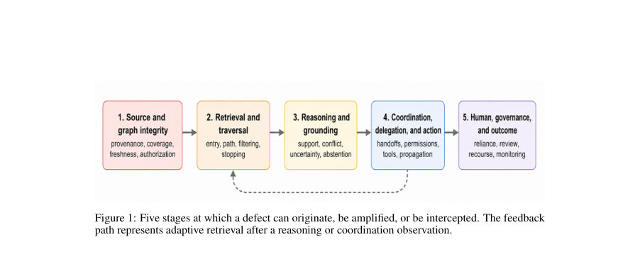
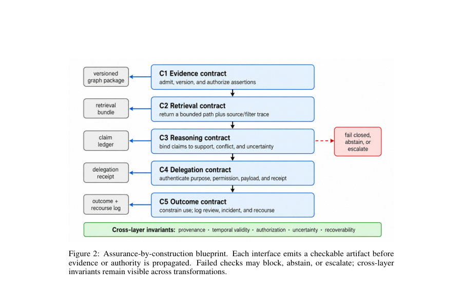

# Building Trustworthy Graph-Agentic RAG for Social Good: Architectures, Failure Propagation, and Assurance by Construction

- **게시일:** 2026-09-09
- **arXiv:** [2609.06391v1](http://arxiv.org/abs/2609.06391v1) · [PDF](https://arxiv.org/pdf/2609.06391v1)
- **저자:** Vijay Bommireddy, Raviteja Bommireddy
- **분야:** cs.AI, cs.CL
- **선정 점수:** 4.13
- **선정 이유:** 최근성 0.4, 인용 영향 0.0 (인용 0회), 저자 영향 0.0 (최고 h-index 0), AI 주제 적합성 3.0, 개발자 관심 0.2, 학술 신호 0.5, 오픈 웨이트·주요 연구조직 신호 0.0

[← 2026-09-09 목록으로 돌아가기](../daily/2026-09-09.html)

<!-- paper-visuals:start -->
## 주요 Figure

> 원문 PDF에서 실제 Figure 캡션과 그림 영역이 함께 확인된 자료만 자동 추출했다.

*Figure · 원문 PDF 5쪽 · Figure 1: Five stages at which a defect can originate, be amplified, or be intercepted. The feedback*

*Figure · 원문 PDF 6쪽 · Figure 2: Assurance-by-construction blueprint. Each interface emits a checkable artifact before*

<!-- paper-visuals:end -->

## 한 문장 요약

관계형 증거를 사용하는 그래프 기반 RAG에 적응형 에이전트 제어를 더한 시스템이 사회적 영향이 큰 환경에서 어떻게 실패가 전파되는지 분석하고, 증거·검색·추론·위임·결과의 다섯 인터페이스 계약을 통해 ‘설계 시 보증(assurance-by-construction)’을 제안한다.

## 해결하려는 문제

기존 RAG·GraphRAG·에이전틱 RAG 문헌은 그래프 구성·검색·에이전트 계획 각각을 다루지만, 그래프 기반 증거가 적응형 제어를 거치며 사람의 결정이나 자동화된 결과로 이어질 때 발생하는 결함의 연쇄(증거가 검색되어 제어결정을 바꾸고 위임·도구 호출을 통해 최종 결과로 전파되는 경로)를 종합적으로 추적·검증하는 프레임워크가 부족하다. 사회적 효용(예: 복지 안내, 보건, 행정)에선 신선도, 권한, 추적성, 감독성, 구제 가능성 등이 정확도 외에 배치·평가되어야 한다는 문제가 존재한다.

## 핵심 기여

- 메커니즘 중심으로 그래프 기질(graph substrate), 그래프 수명주기, 적응형 에이전트 기능, 조정(코디네이션) 패턴, 권한 경계라는 설계 공간을 정리하고 각 항목의 보증적 함의를 연결했다.
- 증거→행동(evidence-to-action) 실패 연쇄를 제시하여 그래프 구성·검색·추론·위임·인간·거버넌스 단계에서 결함이 어떻게 발생·증폭·관찰 불능으로 이어지는지 체계화했다.
- 증거, 검색, 추론, 위임(능력), 결과의 다섯 인터페이스 계약(C1–C5)을 포함하는 ‘assurance-by-construction’ 청사진을 제안하여 경계별로 관찰 가능성·검증·실패 대응을 명시했다.
- 공익 정보(공적 급여 안내)를 사례로 들어 청사진이 그래프 설계, 권한 제한, 검증·기권·운영 권한 선택에 어떤 구체적 영향을 미치는지 보였다.
- 그래프·궤적·청구·조정·결과 수준에서 측정·평가할 최소 보고 항목과 스트레스·전파 중심의 평가 의제를 제시했다.

## 접근 방법

* 논문은 문헌검토와 구조화된 설계 합성으로 접근한다.
* (1) 2020년~2026년 관련 문헌을 검색·선별하여 그래프·에이전트·보증 관련 결과를 수집했다(범위·제외 기준은 본문에 명시).
* (2) 메커니즘 중심 설계공간을 다섯 차원(그래프 기질, 그래프 수명주기, 에이전트 기능, 조정 패턴, 권한 경계)으로 정리하고 대표 시스템 사례를 표로 분류했다.
* (3) 그래프→검색→추론→위임→인간·거버넌스의 다섯 단계로 이루어진 '증거-행동 실패 연쇄'를 모델링하고, 이를 기반으로 경계별 계약 수식(Ci=(Ii,Pi,Oi,Vi,Fi))을 정의했다.
* (4) 각 계약별로 산출물(관찰 가능한 아티팩트), 검증 절차, 실패 시 폐쇄형(fail-closed) 대응을 제시하고 다섯 불변항(출처/증거(provenance), 시간 유효성, 권한, 불확실성, 복구 가능성)을 규정했다.
* (5) 공익 정보 보조 사례에 계약을 적용해 설계 결정을 구체화하고, 표준화된 평가 증거(표6)를 제안했다.

## 주요 결과

- 본 논문은 통합적 설계·평가 프레임워크(실험적 수치나 모델 학습 결과가 아니라)와 다섯 계약(C1–C5)을 제안한다. 각 계약은 요구 아티팩트와 검증·실패 대응을 표(Table 4)에 정리했으며 핵심 내용은 다음과 같다: C1(증거) — 버전·출처·유효기간·추출방법·접근라벨을 포함하는 노드/엣지 기록과 신선도·권한 검사, 실패 시 격리·소스 검토; C2(검색) — 질의·그래프 버전·입구 노드·경로·점수·중지사유 기록과 경로 적법성/범위 검사, 부족 시 재시도·확대·기권; C3(추론) — 주장 원장(claim ledger)에 지지·충돌 증거·시간·상태·인용근거 포함, 충돌 노출·수정·기권; C4(위임·능력) — 목적·범위·유효기간·수령증명 포함한 인증된 권한 부여, 최소권한 검증, 실패 시 거부·권한회수; C5(결과) — 의도된 사용·권한 레벨·검토·수정·구제 로그 포함, 허용되지 않는 자동화 차단·책임 소유자에 경로 제공.
- 논문은 또한 최소 평가 증거 표(Table 6)를 제시하여 그래프(주장 지원·소스 커버리지·시간 유효성 등), 궤적(경로 커버리지·중지 정확도 등), 주장(인용 정확성·모순 처리), 조정(권한위반·전파), 결과(검토·수정·소요 시간) 수준에서 보고할 항목을 명시했다.
- 전파 중심 스트레스 테스트 설계(기원 감지, 전파 깊이, 봉쇄 비율, 복구 완전성 등)와 간단한 설계 우선순위(가능하면 단순 RAG 우선, 그래프/에이전트는 필요시 도입)를 제안했다.

## 한계

- 저자가 명시한 한계: 단일 주검토자(및 일관성 감사) 기반의 문헌 선별을 사용했으며 독립적 이중 스크리닝·교차검증을 거치지 않았다.
- 검색이 영어·색인 문헌 편향을 가지며 비공개 운영 경험을 놓쳤을 가능성이 있고 일부 관련 연구는 빠르게 발전하는 분야의 사전 인쇄물(preprints)을 포함하여 상태가 변할 수 있다.
- 이론적·설계 합성으로서 제안된 계약과 사례는 문헌근거에 기반한 설계안이며, 실제 배포·검증된 표준이나 법적 판단이 아니고 도입 비용과 유용성은 도메인 실무자·영향 집단과의 실증적 시험이 필요하다고 저자가 명시함.
- 다양한 작업·그래프·모델·메트릭 때문에 점수 풀링이 불가능하여 정량적 우열을 제공하지 않음(즉 실험적 성능 수치는 본문에 없음).

## 개발자 관점

- 단순 설계 우선: 권한 있는 근거가 한정되고 적응적 제어가 필요없다면 플랫 RAG나 하이브리드 RAG로 시작하라. 그래프·에이전트 조합은 관계 증거와 실행 중 관찰 의존적 그래프 조작이 모두 필수일 때만 도입하라.
- 계약 기반 경계 설계: 각 시스템 경계에서 C1–C5에 명시된 관찰 가능한 아티팩트(예: 버전화된 노드/엣지, 검색 경로 로그, 주장 원장, 권한 전송 토큰, 결과 검토 로그)를 강제하여 downstream이 불완전한 증거를 수용하지 못하게 하라.
- 불변항 보존: 아티팩트 변환 과정에서 출처(provenance), 시간적 유효성, 권한, 불확실성 표기, 복구 가능성 정보를 손실하지 말라. 이들 정보가 삭제되면 시스템이 위반된 것으로 간주되어야 한다.
- 권한 최소화·명시적 위임: 에이전트는 내부 또는 타 에이전트/도구에 권한을 암묵적으로 전파하지 못하게 하고, 위임은 인증된 목적·범위·만료를 포함하는 토큰으로 관리하라.
- 기술적·운영적 평가: 배포 전 그래프·궤적·주장·조정·결과 수준의 증거를 수집·보고하라. 스트레스 테스트로 기원 감지, 전파 깊이, 봉쇄 비율, 복구 완전성 등의 지표를 측정하라. 또한 동일 자원·예산에서 비에이전트·비그래프 기반 베이스라인과 비교하라(추가 실패 표면과 비용 정당화).

**근거 범위:** 이 분석은 제공된 논문 PDF 본문을 근거로 작성되었으며 초록은 보조로만 사용했다. 본문에 제시된 설계·계약·평가 제안과 저자 명시의 한계들을 그대로 요약·정리했다. 논문은 주로 설계·문헌 합성 논문으로 정량적 실험 결과나 구현 세부사항(성능 수치·학습 세부 파라미터 등)을 제공하지 않으므로 그러한 수치는 포함하지 않았다. 일부 인용된 관련 연구는 본문에서 preprint로 표기되어 있으며 해당 연구의 상태 변경 여부는 별도 확인이 필요하다.
