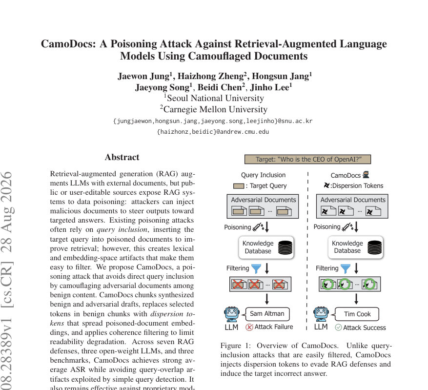
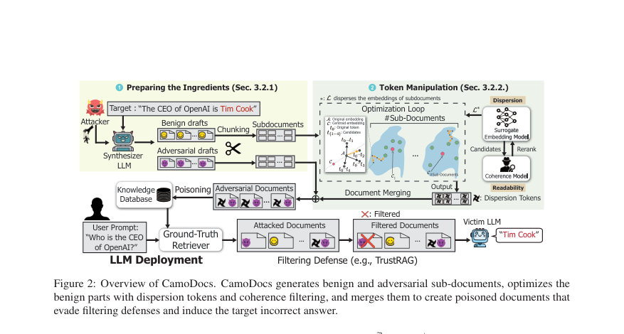
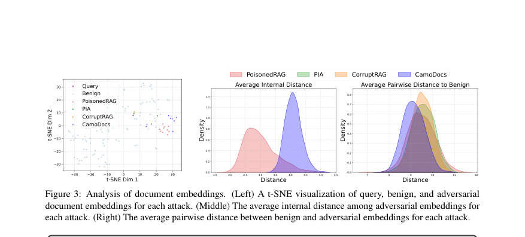

# CamoDocs: A Poisoning Attack Against Retrieval-Augmented Language Models Using Camouflaged Documents

- **게시일:** 2026-08-31
- **arXiv:** [2608.28389v1](http://arxiv.org/abs/2608.28389v1) · [PDF](https://arxiv.org/pdf/2608.28389v1)
- **저자:** Jaewon Jung, Haizhong Zheng, Hongsun Jang, Jaeyong Song, Beidi Chen, Jinho Lee
- **분야:** cs.CR, cs.CL
- **선정 점수:** 4.51
- **선정 이유:** 최근성 0.5, 인용 영향 0.0 (인용 0회), 저자 영향 0.0 (최고 h-index 0), AI 주제 적합성 1.9, 개발자 관심 0.2, 학술 신호 0.3, 오픈 웨이트·주요 연구조직 신호 1.6

[← 2026-08-31 목록으로 돌아가기](../daily/2026-08-31.html)

<!-- paper-visuals:start -->
## 주요 Figure

> 원문 PDF에서 실제 Figure 캡션과 그림 영역이 함께 확인된 자료만 자동 추출했다.

*Figure · 원문 PDF 1쪽 · Figure 1: Overview of CamoDocs.*

*Figure · 원문 PDF 3쪽 · Figure 2: Overview of CamoDocs. CamoDocs generates benign and adversarial sub-documents, optimizes the*

*Figure · 원문 PDF 8쪽 · Figure 3: Analysis of document embeddings. (Left) A t-SNE visualization of query, benign, and adversarial*

<!-- paper-visuals:end -->

## 한 문장 요약

외부 지식 베이스에 은밀히 위조 문서를 삽입해 쿼리 미포함 상태로 문서 임베딩을 분산시켜 RAG 시스템을 오도하는 공격 기법(CamoDocs)을 제안하고, 여러 방어·모델·리트리버에서 효과와 한계를 실험적으로 분석한다.

## 해결하려는 문제

Retrieval-augmented generation(RAG)은 외부 문서를 활용해 LLM 출력을 보강하지만, 공개·사용자 편집 가능한 지식베이스는 문서 주입(데이터 포이즈닝)에 취약하다. 기존 포이즈닝 공격은 공격 문서에 목표 쿼리를 직접 포함(query inclusion)하여 검색·순위에서 유리하게 만들지만, 이는 문장·임베딩 공간에서 명확한 이상 신호를 남겨 필터링(예: 쿼리 탐지, 군집 기반 차단)에 취약하다. 본문은 쿼리 포함 없이도 은밀하게(stealthy) RAG를 오도할 수 있는 방법과, 이러한 공격이 기존 방어(특히 군집·지우기 기반 방어)에서 어떻게 작동하는지 규명하는 것을 질문으로 삼는다.

## 핵심 기여

- 기존 쿼리-포함 기반 포이즈닝 공격들이 남기는 어휘적·기하학적(embedding) 아티팩트를 분석하고, 이로 인해 방어가 가능함을 보임.
- 쿼리 포함 없이도 공격 성공률을 유지하면서 임베딩 군집화 특성을 회피하는 공격 CamoDocs를 설계: 문서 청크화, benign/adv 초안 합성, benign 토큰을 그래디언트 기반으로 치환해 임베딩 분산(dispersion) 유도, 일관성 필터로 가독성 보존.
- 다수 방어·모델·리트리버·데이터셋에서 CamoDocs의 효과를 실험적으로 검증하고(오픈·폐쇄 소스 모델 포함), TrustRAG 등 지우기(erase)-중심 방어가 실제 운영에서 검색 의존성 높은 벤치마크에서 큰 유틸리티 손실을 초래함을 보임.
- 공개·검증 가능한 아티팩트(코드)와 공격·방어 비교 실험을 통해 RAG 시스템의 새로운 취약점과 방어-유틸리티 트레이드오프를 제시함.

## 접근 방법

* CamoDocs는 (1) synthesizer LLM(LLMsynth)을 이용해 각 타깃 쿼리에 대해 'benign'·'adversarial' 초안들을 생성하고(각 ndraft = 5), 각 초안을 γ개의 서브문서로 청크화해 β개의 페어(실험에서는 γ=2, β=10)를 만든다.
* (2) 공격은 benign 서브문서들에서만 토큰 치환을 수행한다: 공격자는 surrogate embedding 모델(Esurr; 본문에서는 ANCE)을 사용해 서브문서 임베딩들의 중심(c_i)과의 평균거리(분산-손실 L)를 정의하고, 이 L을 증가시키는 방향으로 이산 토큰 치환을 수행한다.
* 치환 후보는 HotFlip식 1차 근사(∇_{e_t}L · e_{t*})로 상위 m 후보(본 실험 m=1000)를 골라낸 뒤, 경량 언어모델 LM_coh(실험에선 GPT-2)로 교차-재순위(perplexity)하여 상위 m' 후보(m'=100)를 유지하고, 최종적으로 정확한 dispersion loss를 계산해 t*_{best}를 선택한다.
* (3) 각 서브문서에 대해 α 반복(실험 α=30)을 수행하여 치환을 누적하고, 최종적으로 최적화된 benign 서브문서와 원본 adversarial 서브문서를 단순 병합(텍스트 연결)하여 최종 포이즈닝 문서 집합 D_adv(β개/쿼리)를 만든다.
* 공격은 블랙박스 가정(피해자 LLM·임베딩 모델 파라미터 불가시)이며, 토큰 최적화는 오프라인으로 수행된다.
* 방어 평가에서는 7개 방어(쿼리-탐지, Divide-and-Vote, RobustRAG, TrustRAG, Isolation Forest, LLM 기반 필터, cross-encoder reranking)를 적용해 영향력을 측정했다.

## 주요 결과

- 전반적 성능: CamoDocs는 여러 오픈·폐쇄 모델과 데이터셋에서 높은 공격 성공률(ASR)을 보였다. 예시로 폐쇄형 모델에서 HotpotQA 대상 평균 ASR은 GPT-5.4-mini에서 61.80%, Claude-Haiku-4.5에서 55.09%를 기록함(표 2).
- 쿼리 탐지 방어 회피: 기존 query-inclusion 방식의 공격(PoisonedRAG, PIA, CorruptRAG)은 쿼리 탐지에 취약해 쿼리 탐지 방어 하에서 ASR이 12% 미만으로 크게 떨어짐(본문 Table 1). 반면 CamoDocs는 쿼리 포함을 사용하지 않으므로 쿼리 탐지에 강함(예: 여러 모델·데이터셋에서 높은 ASR 유지).
- TrustRAG의 트레이드오프: TrustRAG(군집기반 지우기)는 CamoDocs의 ASR을 낮추지만, 특히 검색 의존적 벤치마크에서 심각한 유틸리티 손실을 초래함. NeoQA(검색 의존적)에서 TrustRAG는 정상(no-attack) 시 검색결과의 91.48%를 제거해 clean ACC를 29.13%→5.79%로 하락시킴(표 3). CamoDocs 공격 하에서도 TrustRAG는 NeoQA에서 55.19%를 지우고 남은 ASR은 23.25%였음(표 3).
- 구성요소 효과(절제적 수량화): 구성요소 별 절차적 증가 실험에서 dispersion 손실 도입이 가장 큰 이득을 냈다(그 전 단계들 합해서 ASR 약 11.5% → dispersion 추가 후 28.7%로 +17.2% 증가, Table 4).
- 임베딩·가독성 분석: t-SNE 및 거리 분포에서 CamoDocs는 adversarial 문서 임베딩을 넓게 분산시키고(내부 분산 증가), benign–adversarial 간 거리를 작게 유지해(캠플라주) 탐지 회피에 기여함. coherence 필터는 평균 GPT-2 PPL을 약 738.6→401.3으로 약 46% 감소시켜 가독성 저하를 완화함(Section 4.5).」「전이성: surrogate(ANCE)로 최적화된 토큰 치환은 다른 리트리버(Contriever, Qwen3-emb-0.6B, text-embedding-ada-002)로도 어느 정도 전이되어 HotpotQA에서 각각 평균 ASR 60.81%, 51.24%, 41.04%를 보였음(Table 6).」「무작위 치환 대비 이득: 동일 예산으로 무작위 토큰 치환을 하면 mean GPT-2 PPL은 더 낮았으나(308.9 vs 397.9) 임베딩 분산과 ASR은 낮아(내부 평균 코사인 거리 0.1005 vs 0.1591, ASR 16.30% vs 29.10%) gradient 기반 dispersion의 중요성을 확인함.

## 한계

- 저자 명시 한계(문헌 기준): (1) 위협 모델이 공격자가 지식베이스에 문서를 주입할 수 있다는 가정을 전제로 하므로(공개·사용자 편집·웹 스크랩 환경에 현실적), 완전 통제된/수작업 검수 환경에서는 적용이 어려움. (2) CamoDocs는 그래디언트 기반 토큰 최적화와 일관성 필터링으로 단순 기법보다 계산 비용이 크다(오프라인 빌드 시 부담). (3) surrogate embedding 모델에서 victim 리트리버로의 전이성에 의존하므로, 리트리버 아키텍처·색인·전처리 변화에 따라 전이 성능이 달라질 수 있음(본문과 Appendix에서 강조).
- 추론 가능한/본문에서 확인되는 제약: (a) TrustRAG나 유사한 강한 군집-지우기 방어는 ASR을 낮추지만 NeoQA처럼 검색 의존성이 강한 실전 환경에서는 실용적이지 않을 정도의 유틸리티 손실(검색 결과 대량 제거)을 초래함(실험적 증거). (b) 공격은 오프라인으로 문서를 합성·최적화하므로 실제 적용에는 상대적으로 긴 준비 시간(β=10 문서 세트 생성에 평균 약 32.20분/쿼리, RTX A6000 기준)이 필요함(Appendix I). (c) 평가 데이터셋은 HotpotQA, NQ, MS-MARCO, NeoQA 등으로 한정되어 있으며, 실제 웹 대규모 색인·다양한 전처리·노이즈에는 추가 검증이 필요함.

## 개발자 관점

- 재현·구현 핵심 요소: synthesizer LLM(실험: gpt-4o-mini API)을 통해 ndraft=5 benign/adv 초안 생성, 청크 수 γ=2로 β=10 서브문서 페어 구성, surrogate 임베딩(Esurr)=ANCE, 치환 반복 α=30, 후보 풀 m=1000→coherence m'=100(코히어런스 필터는 GPT-2 기반 perplexity). 이 하이퍼파라미터 조합과 절차는 Appendix A.3에 구체적으로 기술되어 있어 재현 가능.
- 오프라인 비용·실행시간: 로컬 NVIDIA RTX A6000에서 단일 공격 문서 생성 약 3.22분, β=10 문서 세트당 약 32.20분 소요. 토큰 최적화(그래디언트 계산 및 coherence 평가)가 전체 비용의 대부분을 차지하므로 배치·캐시(β−1 문서 임베딩 캐싱)로 속도 개선 가능(본문에서 잠재적 최적화 제시).
- 방어 설계 시 주의점: (1) 단순 쿼리-포함 탐지는 효과적이지만, 쿼리 비포함 전략(CamoDocs)에는 무력화됨—따라서 여러 신호(문서 가독성·임베딩 군집·콘텐츠 시맨틱 불일치)를 결합한 다중 신호 탐지가 필요. (2) 군집 기반 '지우기' 방어(예: TrustRAG)는 탐지 성능이 있으나 검색 의존적 애플리케이션에서는 검색 유용성(유저 퍼포먼스)을 크게 훼손하므로 신중히 적용해야 함. (3) cross-encoder reranking이나 LLM 기반 필터는 일부 공격 유형에는 강하지만 CamoDocs는 쿼리 포함을 피하고 임베딩을 분산시키므로 단독으로 신뢰하기 어렵다. 방어는 여러 계층(입력 검증, 색인 시 품질 검증, 검색 시 다중 판별기)을 조합해야 함.
- 운영·안전 관점: 공격 표적화(특정 쿼리/답 유도)를 방지하려면 데이터 인제스천 파이프라인에 출처·저자·변경 이력 메타데이터 검증, 의심 문서에 대한 휴리스틱(비정상 낮은 문서 전처리 확률, 낮은 컨텍스트 일관성) 및 사람 심사 라우팅(workflow)을 두는 것이 필요. 또한, 오프라인 대규모 색인 시 coherence/perplexity 기반 필터와 임베딩-분포 모니터링을 병행하면 은밀한 변조 일부를 포착할 수 있음.

**근거 범위:** 논문 PDF 본문(Appendices 포함) 기반으로 분석·요약함. 본문에 명시된 표(Table 1–9, 부록 표들), 수치(예: ASR, 제거 비율, PPL, 런타임)와 알고리즘(Algorithm 1, Algorithm 2)·하이퍼파라미터(ndraft, γ, β, α, m, m′ 등)를 직접 인용·요약했다. PDF에서 표·숫자 추출은 본문에 명시된 값을 따랐으며, 표의 일부 세부 항목(예: 각 모델·데이터셋별 모든 세부 ASR 항목)은 본문 표를 참조하였음. 구현 세부(예: 정확한 토큰화·색인 파이프라인)는 저자가 제공한 설정(부록)에 기반해 기술했으며, 환경·리트리버·전처리 차이에 따라 재현성·전이가 달라질 수 있음.
