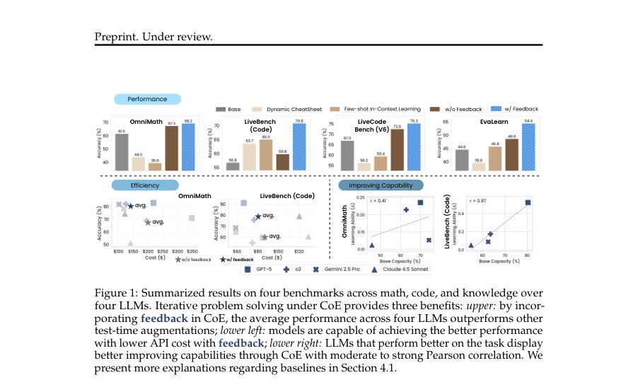
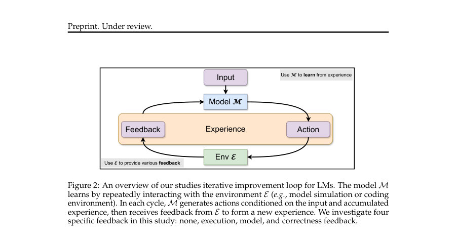
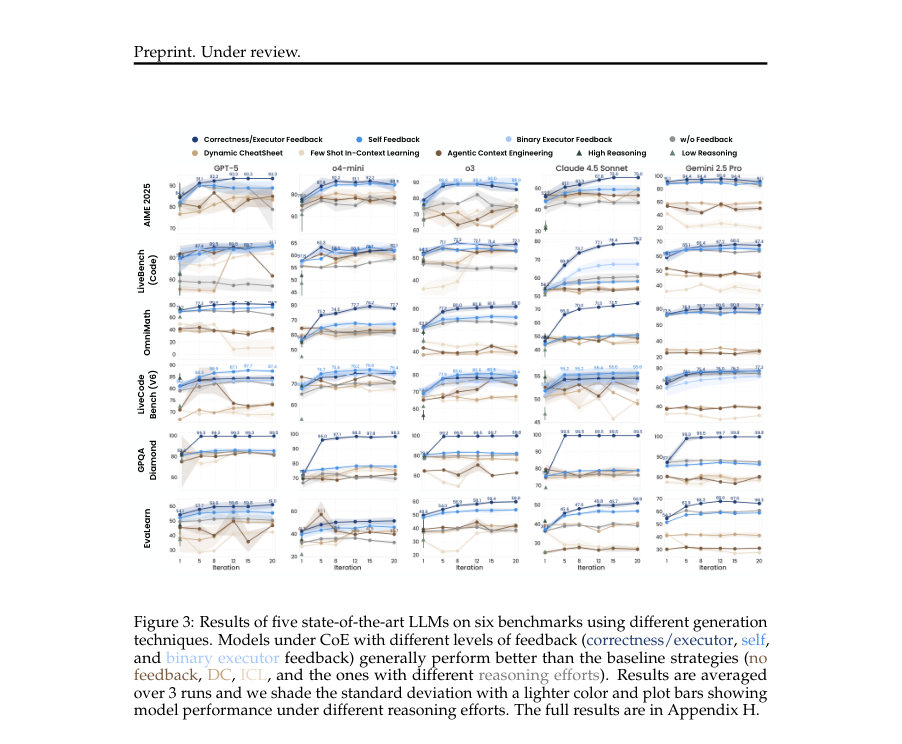

# Chain-of-Experience for Continual LLM Improvement

- **게시일:** 2026-08-19
- **arXiv:** [2608.18027v1](http://arxiv.org/abs/2608.18027v1) · [PDF](https://arxiv.org/pdf/2608.18027v1)
- **저자:** Haoqin Tu, Yunhao Fang, Yizhong Wang, Cihang Xie, Shen Yan
- **분야:** cs.CL
- **선정 점수:** 5.91
- **선정 이유:** 최근성 0.8, 인용 영향 0.0 (인용 0회), 저자 영향 1.6 (최고 h-index 14), AI 주제 적합성 3.0, 개발자 관심 0.2, 학술 신호 0.3, 오픈 웨이트·주요 연구조직 신호 0.0

[← 2026-08-19 목록으로 돌아가기](../daily/2026-08-19.html)

<!-- paper-visuals:start -->
## 주요 Figure

> 원문 PDF에서 실제 Figure 캡션과 그림 영역이 함께 확인된 자료만 자동 추출했다.

*Figure · 원문 PDF 2쪽 · Figure 1: Summarized results on four benchmarks across math, code, and knowledge over*

*Figure · 원문 PDF 4쪽 · Figure 2: An overview of our studies iterative improvement loop for LMs. The model M*

*Figure · 원문 PDF 6쪽 · Figure 3: Results of five state-of-the-art LLMs on six benchmarks using different generation*

<!-- paper-visuals:end -->

## 한 문장 요약

Chain-of-Experience(CoE)를 제안하여 LLM이 테스트 시점에 반복적 상호작용과 다양한 피드백(자기비판·실행·정확성 등)을 누적해 스스로 성능을 향상하도록 하고, 이를 8개 최신 LLM과 수학/코드/지식 벤치마크에서 체계적으로 검증했다.

## 해결하려는 문제

기존 LLM 평가와 테스트-타임 전략들은 대부분 단일 추론 또는 임시적 후처리(verifier·병렬 생성에서 선택 등)에 머물러, 모델이 추론 시간에 환경·자기 피드백을 누적해 지속적으로 개선하는 능력(learning-from-experience)을 무시한다. 본 논문은 '테스트 시점에 반복적 상호작용을 통해 경험을 축적하면 모델이 어떻게 개선되는가'라는 질문을 다루며, 기존 self-refinement·검색·메모리 기반 방법들이 경험을 일시적으로만 활용하거나 중간 추론 단계를 손실할 수 있다는 한계를 지적한다.

## 핵심 기여

- Chain-of-Experience(CoE) 개념화: 반복적 시도와 환경/모델 피드백을 경험으로 누적해 테스트 시점에 모델이 자체적으로 개선되도록 하는 통합 프레임워크 제시.
- 피드백 스펙트럼 정의 및 구현: 네 가지 피드백 유형(없음, 실행(executor), 모델(self/auxiliary judge), 정확성(binary correctness))을 체계적으로 규정하고 CoE에 적용.
- 대규모 실험평가: GPT-5, GPT-5-mini, o4-mini, o3, o3-mini, Gemini-2.5 Pro, Claude-4.5 Sonnet 등 8개 모델과 AIME 2025, OmniMath, LiveCodeBench(V6), LiveBench(Code), EvaLearn, GPQA Diamond 등 수학·코드·지식 벤치에서 CoE의 성능·효율성·강건성 분석.
- 행동·제한 분석: 자기 피드백·실행·정확성 결합(dual feedback), 스푸리어스(feedback 항상 '정답'/'오답') 실험, 경험 선택(메모리 압축) 실험, 개선 원인 분류(Feedback Fidelity, Self Reflection, Specification Recall, Random) 및 개선이 주로 초기 반복에서 발생함을 밝힘.
- 실용성 관찰: 피드백 기반 CoE가 대부분의 벤치에서 피드백 없는 반복보다 더 높은 정확도와 토큰/API 비용 효율을 보였고(예: self feedback으로 평균 ≈5.6% 향상, executor/correctness로 ≈11.1% 향상; 전 범위에서 19% API 비용 절감 보고)

## 접근 방법

* CoE는 질의 Q에 대해 t번째 시도 at을 이전 시도·피드백 이력 e0..et-1(각 ei=(ai, fi))에 조건화하여 생성하는 순차적 생성 프로세스로 정의된다: at ∼ P(at \| Q, (a0,f0),...,(at-1,ft-1)).
* 본 연구에서 사용한 피드백 유형은 (1) No feedback: fi=∅ (반복은 반성·내적 추론만으로 진행), (2) Execution feedback: 코드 실행 결과(에러·테스트 통과 등)를 환경 E에서 반환, (3) Model feedback: 보조 LLM M_fb가 텍스트 비평·점수 등 형태로 제공, (4) Correctness feedback: 도메인 검증기가 제공하는 이진 정답 신호.
* 구현적으로 각 문제에 대해 최대 20회(확장 실험은 최대 50회) 반복을 수행하고, 각 반복에서 모델이 이전 히스토리와 피드백을 컨텍스트로 받아 다음 출력을 생성한다.
* 추가적으로 (i) Dual feedback(모델 피드백 + 정확성/실행) 조합, (ii) SelMV(처음 n번의 유효 시도에 대한 다수결)로 스푸리어스 피드백에 대응, (iii) 메모리 기반 압축 기법(DC, SimpleMem)을 동일 태스크 내에서 적용해 전체 경험 트레일(full trail)과 비교하는 평가를 수행했다.
* 실험은 8개 LLM에 대해 3회 반복 실행(평균·표준편차 보고), 일부 태스크는 LLM-as-a-judge(OmniMath)나 파이썬 인터프리터(코드)로 정답 판정.

## 주요 결과

- 전반적 개선: self feedback 또는 executor/correctness feedback 사용 시 8개 모델 평균에서 self feedback은 평균 +5.6% 개선, executor/correctness는 평균 +11.1% 개선(각각 no-feedback 대비).
- 벤치마크별 성능 예시(평균·표3): AIME 2025: ICL 71.83%, DC 73.33%, w/o feedback 77.78%, Self 82.22%, Correctness 89.05%. LiveCodeBench(V6): w/o feedback 72.57%, Self 75.69%, Correctness/Executor 74.50% (테이블에서 집계).
- 코드 태스크: 공개 테스트케이스 기반 executor feedback이 평균 8.6% 포인트(예: 66.4%→75.0%)의 큰 향상을 유도했고, self-judgement도 평균 +7.0% 향상 제공.
- 효율성: CoE(피드백 포함)는 동일 또는 더 낮은 API 비용에서 더 높은 정확도를 달성함. 논문은 전 범위에서 평균 19% API 비용 감소(피드백 기반이 비용-성능 균형에서 유리)와 토큰당 정확도 향상을 보고(예: AIME 2025에서 Correctness Feedback 84.6% @108,734 tokens, DC는 74.7% @11,233 tokens이지만 전반적 토큰-정확도 균형은 CoE가 유리).
- 베이스 능력과 학습능력 상관: 모델의 초기(무피드백) 성능(Base Capacity)과 CoE로 얻는 개선능력 간에 평균 Pearson 상관 ≈ +0.50(벤치마크별로 LiveBench r=0.97, LiveCodeBench r=0.83 등) 관측—성능이 더 좋은 모델이 경험에서 더 잘 학습함을 시사함. 35%~97% 범위의 r값이 보고됨(벤치마다 상이).  

(수치 출처: 본문 Fig.5, Section 4.2 및 Table 3·5·1·2·표현된 문장들.)

## 한계

- [저자언급] 도메인·태스크 범위 제한: 평가가 주로 수학·코드·지식(벤치마크 6종)에 한정되어 있어 상호작용이 매우 긴 실제 환경이나 다른 도메인으로 일반화가 불확실하다고 저자들이 명시함.
- [저자언급] 파라미터 업데이트 미실시: 본 연구는 모델 가중치 업데이트 없이 컨텍스트 재사용으로 개선을 유도하였으므로 '진짜 학습'(persistent weight updates)과는 구분됨—따라서 개선은 컨텍스트 기반 적응이지 영구적 모델 학습이 아님.
- [확인가능] 피드백 품질 의존성: 모델이 생성한 판정(모델-as-judge)은 판정 모델의 능력에 크게 의존한다(높은 검증기능 모델일 때만 correctness supervision과 경쟁 가능). 본문 F.3에서 GPT-5가 mini를 도울 때 성능향상이 있지만, 역은 성립하지 않는 사례가 보고됨.
- [확인가능] 스푸리어스 피드백 위험: 항상 '정답' 또는 항상 '오답' 같은 잘못된 피드백은 성능 저하를 유발(예: AIME 평균 -7.6%, GPQA -2.6%)하며 모델·설정에 따라 성능 하락 폭이 상이함(본문 실험 수치 참조). SelMV 같은 후처리로 일부 완화 가능하나 위험 존재함이 실험에서 확인됨(Section F.1·Table 2).  

[확인가능] 메모리 압축(요약/선별) 방법의 한계: Dynamic CheatSheet(DC)나 SimpleMem처럼 경험을 요약·압축하는 방법들이 동일 태스크 내에서 전체 경험 트레일보다 성능이 낮게 나와(본문 Table 1·J), 과도한 압축이 중간 추론 정보를 잃을 위험이 있음.

## 개발자 관점

- 재현/구현: CoE는 별도 파라미터 업데이트 없이도 구현 가능하므로(모델 API + 환경/판정자 + 반복 루프) 접근성이 높음. 다만 반복 수(논문 기준 기본 20회)·프롬프트 설계·피드백 포맷이 성능에 민감하므로 Appendix A의 프롬프트 설정을 참고해 재현해야 함.
- 비용·토큰 관리: 피드백 기반 CoE는 적절히 설계하면 API 비용 대비 정확도가 더 높음(논문 평균 19% 비용 절감 보고). 그러나 전체 경험 트레일을 컨텍스트로 유지하면 토큰 사용량이 증가하므로 토큰 한도·비용을 모니터링하고 필요시 SelMV·부분적 경험 보존 전략을 고려해야 함.
- 피드백 설계 우선순위: 가능하다면 executor(실행·테스트) 또는 정확성 신호를 도입하라(가장 강한 신호). 모델-생성 피드백은 판정 모델의 역량에 따라 실용성이 결정되므로 '검증자' 모델의 성능을 사전에 평가할 것.
- 스푸리어스 피드백 대비책: 운영 환경에서 피드백이 왜곡될 가능성을 가정하고 SelMV(초기 n회 답안 다수결) 같은 앙상블적 안전장치 및 피드백 신뢰도 모니터링을 도입하라.
- 메모리 압축 주의: 경험을 요약·압축해 재사용하는 메커니즘(DC, SimpleMem)은 편리하지만 중간 추론 정보를 잃어 오히려 성능을 떨어뜨릴 수 있으므로, 압축 임계치·요약 정책을 신중히 설계하고 검사(예: 중요한 추론 스텝 보존)를 수행하라.

**근거 범위:** 이 분석은 제공된 논문 PDF 본문(본문·표·그림·부록 언급 포함)을 근거로 작성하였다. 수치와 실험 결과는 본문 및 표·그림에서 직접 확인 가능한 값만 인용했다. 프롬프트·구체적 하이퍼파라미터와 일부 세부 구현(부록 A·D 등)은 PDF 본문에 요약되어 있으나 전체 프롬프트 텍스트·코드 수준의 재현세부는 부록 참조가 필요하므로, 그 부분에 대해서는 본문 텍스트를 기반으로 요약·해석하였다.
