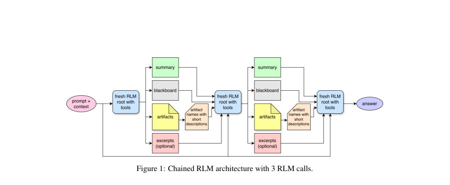

# Chained Recursive Language Models for Multi-Iteration Reasoning

- **게시일:** 2026-08-06
- **arXiv:** [2608.05124v1](http://arxiv.org/abs/2608.05124v1) · [PDF](https://arxiv.org/pdf/2608.05124v1)
- **저자:** Purbesh Mitra, Sennur Ulukus
- **분야:** cs.CL, cs.AI, cs.IT, cs.LG, eess.SP
- **선정 점수:** 10.36
- **선정 이유:** 최근성 1.5, 핵심어: llm, 핵심어: reasoning, 핵심어: inference, 분야 가중치 2.0

[← 2026-08-06 목록으로 돌아가기](../daily/2026-08-06.md)

## 한 문장 요약

긴 컨텍스트 추론 문제에서 동일한 LLM을 여러 번 '신선한' 루트로 호출하고 평문(summary, blackboard, artifacts)을 통해 중간 산출물을 인계하면서 단계별로 검사·수정해 최종 응답 정확도를 높이는 추론-시스템 설계(Chained RLM)를 제안한다.

## 해결하려는 문제

단일 LLM 호출로 긴 문서나 다중 단계 추론을 수행하면 모델이 증거 추출·중간 상태 관리·검증·최종 응답 생성을 하나의 추론 궤적에서 동시에 처리해야 하므로 초기의 추출·집계 실수가 이후 단계로 전파되어 성능이 저하되는 문제(예: counting, ordering, multi-hop). 기존 기법(코드-오브-사고, self-consistency, RLM 등)은 중간 상태를 내부 궤적으로 유지하거나 도구 호출을 섞지만, 단일 궤적의 stale한 내부 상태로 인해 오류가 고착화될 수 있다는 한계가 있다. 연구 질문은 '동일 모델을 여러 번의 fresh root로 호출하고 중간 산출물을 평문으로 전달하면(artifact continuation) 직접 답변이나 재귀적 도구 호출보다 정확도가 개선되는가'이다.

## 핵심 기여

- Chained RLM: 동일한 LLM을 연속된 fresh root로 호출하고 각 루트는 원문(q,c)과 단순 평문 연속성 상태만 받아 추론을 이어가는 선형 추론-아키텍처를 제안.
- 간단한 인계(handoff) 메커니즘 정의: plain-text SUMMARY / BLACKBOARD / NEXT(옵션으로 recent-work excerpt) 형식을 엄격히 규정하여 JSON 등 구조화 포맷을 사용하지 않음.
- 평문 기반의 artifact 작업공간 도입: 후보 원장, 추출 테이블, 도출·감사 노트 등 루트들 간에 지속되는 작업 산출물을 생성·수정·감사하도록 설계.
- 시스템 모델(체인 상태 구성 요소 Br, Ar, Hr, Er), 루트 실행 규칙(각 루트는 적어도 하나의 artifact를 생성/업데이트해야 함), 전체 알고리즘(Algorithm 1)과 평가 프로토콜을 정의.
- 동일한 기본 모델(GPT-5-mini)을 사용해 여러 장기-컨텍스트 벤치마크에서 Chained RLM이 정규 LLM 대비 개선되는 조건과 비용-정확도 트레이드오프를 실험적으로 제시.

## 접근 방법

* 아키텍처: 질의 q와 원문 컨텍스트 c는 모든 루트가 항상 입력으로 받는다.
* 체인 상태 sr = (Br, Ar, Hr, Er)만 루트 간 연속성으로 전달한다.
* Br은 짧은 plain-text blackboard(최고 답안, 검증된 사실, 가정, 열려있는 질문 등), Ar은 디스크에 저장되는 durable plain-text artifacts(후속 루트가 보존·수정·감사해야 하는 후보 ledgers·표·검증 목록 등), Hr은 predecessor handoff 요약, Er은 최근 작업 발췌(선택적)이다.
* 루트(root)는 fresh LLM 호출로서 Python REPL 스타일 도구 집합 T에 접근 가능하며 코드 실행, 부-LLM 호출, artifact 읽기/쓰기, intermediate 출력 등을 한다.
* 인계(HANDOFF)는 엄격한 세 섹션(SUMMARY, BLACKBOARD, NEXT)으로 작성하거나 FINAL: <answer>를 제출한다.
* 시스템 프롬프트에는 '각 루트는 반드시 하나의 plain-text artifact를 생성/업데이트해야 한다', 'Root0가 artifact 구조를 정하고 이후 루트는 구조를 보존해야 한다', 'FINAL 전에는 관련 엔터티 매핑·카운트·정의 등을 감사하라' 등 규칙이 포함된다.
* 알고리즘 흐름: 각 루트는 체인 상태를 읽고 bounded한 유용한 단계를 수행한 뒤 artifact를 작성/수정하고 HANDOFF 또는 FINAL을 제출한다.
* 전체 원리는 artifact-매개 인계로 중간 산출물을 외부화하고, 이후 fresh root가 이를 재검토·수정·집계하도록 하여 장기 상태 관리의 안정성을 높이는 것이다.
* 학습은 포함되지 않으며(무학습·무RL), 동일 모델을 여러 번 호출하는 추론-시간 아키텍처이다.

## 주요 결과

- 사용 모델 및 지표: 모든 비교는 동일한 기본 모델 GPT-5-mini로 수행됐고, 주지표는 pass@1 정확도(첫 시도 정답 비율)이다.
- 벤치마크: RULER, BABILong, LongBench v2, OOLONG-real.
- 정확도(테이블 1): RULER - Regular 87% → Chained 92%; BABILong - 44% → 59%; LongBench v2 - 41% → 52%; OOLONG-real - 14% → 38%. 평균 절대 향상은 논문에서 '평균 13.75 percentage points'로 보고됨.
- 리소스·토큰·비용(테이블 2): 평균 루트 호출 수 Regular 1.0 vs Chained 2.6; 평균 handoff 수 0.0 vs 1.6; 평균 입력 토큰 수 48.8k vs 98.8k; 평균 출력 토큰 수 5.8k vs 21.8k; 평균 비용(task당) $0.125 vs $0.315. (벤치마크별 예: OOLONG-real의 경우 비용이 Regular $0.14 → Chained $0.44로 증가)
- 분석 결과: Chained RLM은 장기 컨텍스트에서 증거 보존·집계·감사 필요성이 큰 과제에서 큰 정확도 개선을 보였고(RULER보다 BABILong/LongBench/OOLONG-real에서 개선 폭 큼), 그 대가로 루트 호출·토큰·비용이 증가함을 보임.

## 한계

- 저자 명시 한계(논문 본문): (1) 호스트가 루트가 artifact를 반드시 읽도록 강제하지 않으므로 조기 종결이나 잘못된 흐름이 발생할 수 있음, (2) artifact 품질은 모델에 의존하므로 Root0가 잘못된 이벤트 정의를 작성하면 이후 루트들이 그 구조를 보존해 오류가 지속될 수 있음, (3) 체인 전체가 drift할 수 있어 나중 루트가 좋은 artifact를 무시하고 더 나쁜 상태로 재시작할 위험이 있음, (4) 계산 비용 증가 — Chained는 더 많은 모델 호출을 사용함.
- 실험적·범위 한계(본문에서 합리적으로 확인되는 제약): (1) 모든 실험은 GPT-5-mini 단일 모델에 대해 수행되어 모델 일반화성(다른 크기/계열)에 대한 증거가 제한적임, (2) 논문은 '공정 비교를 위한 compute-matched 설정'을 언급하지만 첫 버전에서는 직접 LLM baseline을 'clean lower-complexity reference'로 사용해 계산 매칭 세부사항이 제공되지 않음, (3) 통계적 유의성, 랜덤 시드·샘플링/출력 수 등 실험 재현에 필요한 상세 하이퍼파라미터가 본문에 명확히 기재되어 있지 않음, (4) 체인 길이 R, 각 루트의 최대 반복·서브-LLM 호출 상한 등 실험별 하이퍼파라미터 설정이 명확히 표기되지 않아 재현성 제약이 있음.

## 개발자 관점

- 구현·재현: 시스템은 루트 오케스트레이터, 평문 blackboard와 artifact 파일시스템, 그리고 엄격한 handoff 포맷 파서를 필요로 한다. 각 루트 호출에서 chain_state를 조립하고 raw trajectory를 디스크에 저장해야 한다.
- 프롬프트·규칙 설계: 루트 프롬프트(논문에 제시된 'Chained RLM Root Instruction')에서 '각 루트는 반드시 하나 이상의 artifact를 생성/업데이트' 등 규칙을 강제해야 하며, 실전에서는 호스트 수준에서 '루트가 artifact를 읽었는지/수정했는지'를 검증하는 추가 검사 로직을 두는 것이 중요하다.
- 아티팩트 설계·버전관리: Root0가 artifact 구조를 선택하므로 구조 설계·이력관리(구조 변경 시 superseding artifact를 만들고 마이그레이션 로그를 남기는 규칙)가 필요하다. artifact는 plain .txt/.tsv 권장이며 JSON/마크다운/코드 펜스 사용을 제한한다는 설계 결정을 구현해야 한다.
- 비용·성능 트레이드오프: 평균 토큰·루트 호출·비용이 크게 증가하므로 실제 배포시 체인 길이 R, 루트별 최대 연산, 캐싱(디스크 artifact/중간 결과) 등을 튜닝해 정확도/비용 균형을 맞춰야 한다. 비용 민감한 환경에서는 compute-matched baseline 비교나 적응형 중단(early stop) 규칙을 고려하라.
- 안전성·검증: artifact가 잘못되면 이후 루트가 이를 보존할 위험이 있으므로 호스트 수준에서 추가 검증(예: 자동 체크리스트, 간단한 규칙 기반 검사기 또는 별도 검증 루트)을 도입하거나 마지막 루트에 엄격한 감사를 요구하는 것이 필요하다.

<!-- paper-visuals:start -->
## 주요 Figure

> 원문 PDF에서 실제 Figure 캡션과 그림 영역이 함께 확인된 자료만 자동 추출했다.

*Figure · 원문 PDF 2쪽 · Figure 1: Chained RLM architecture with 3 RLM calls.*

<!-- paper-visuals:end -->

**근거 범위:** 논문 PDF 본문(제공된 페이지 1–9)을 근거로 분석을 작성했다. 표와 알고리즘, 시스템 프롬프트 등 본문에 명시된 내용에 기반해 수치와 절차를 보고했다. 다만 일부 실험 세부(랜덤 시드, 샘플링 파라미터, 체인 길이/루트별 상한의 구체적 실험 설정, compute-matched 비교의 상세 구성 등)는 본문에 자세히 기재되어 있지 않아 해당 항목에 대해서는 명시적 숫자를 재구성하지 않았다.
