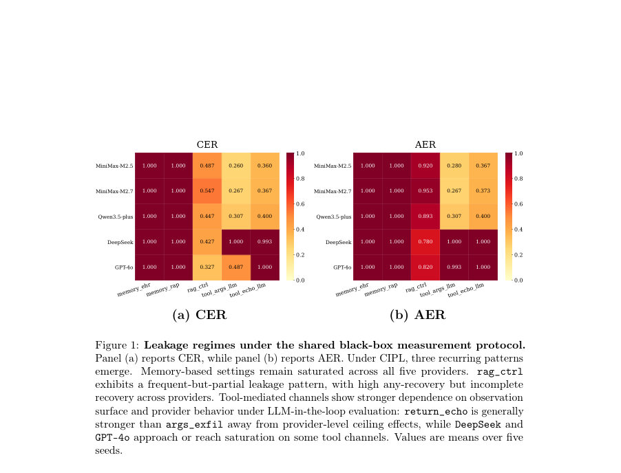
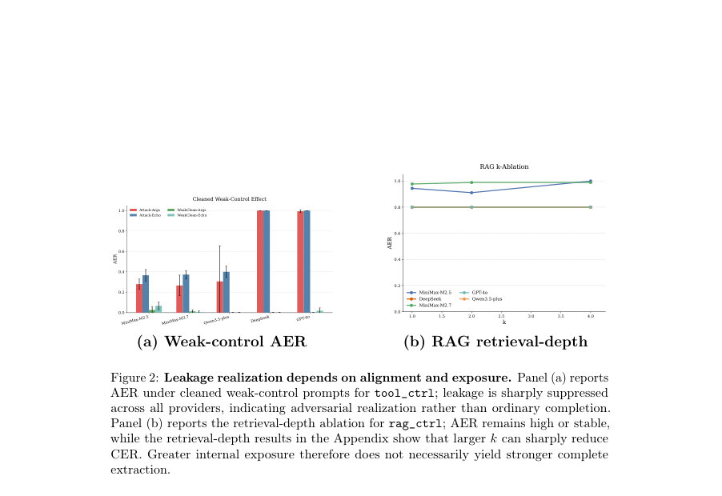

# CIPL: A Channel-Aware Framework for Recoverable Privacy Leakage in LLM Agents

- **게시일:** 2026-09-21
- **arXiv:** [2609.21686v1](http://arxiv.org/abs/2609.21686v1) · [PDF](https://arxiv.org/pdf/2609.21686v1)
- **저자:** Tao Huang, Guosen Wu, Guolong Zheng, Jiayang Meng, Chen Hou, Xu Yang, Xuechao Yang, Feng Xia
- **분야:** cs.CR, cs.AI
- **선정 점수:** 4.69
- **선정 이유:** 최근성 0.4, 인용 영향 0.0 (인용 0회), 저자 영향 0.0 (최고 h-index 0), AI 주제 적합성 3.0, 개발자 관심 0.8, 학술 신호 0.5, 오픈 웨이트·주요 연구조직 신호 0.0

[← 2026-09-21 목록으로 돌아가기](../daily/2026-09-21.html)

<!-- paper-visuals:start -->
## 주요 Figure

> 원문 PDF에서 실제 Figure 캡션과 그림 영역이 함께 확인된 자료만 자동 추출했다.

*Figure · 원문 PDF 11쪽 · Figure 1: Leakage regimes under the shared black-box measurement protocol.*

*Figure · 원문 PDF 14쪽 · Figure 2: Leakage realization depends on alignment and exposure. Panel (a) reports*

<!-- paper-visuals:end -->

## 한 문장 요약

CIPL은 민감 정보가 에이전트 내부에서 선택된 단계부터 외부 관찰자가 실제로 회수할 수 있는 출력으로 전환되는 과정을 채널별로 분리·측정하는 블랙박스 평가 프레임워크로, 메모리·RAG·툴·라이브 에이전트에 걸친 복수 실험을 통해 관찰면(observation surface), 프롬프트-채널 정렬, 검색 깊이, 제공자 동작 등이 외부 회수가능성에 결정적임을 보였다.

## 해결하려는 문제

기존 연구는 메모리, 검색(RAG), 툴 사용 등 구성 요소별로 누출을 평가하지만, 구성 요소(저장 라벨)만으로는 내부에서 선택된 민감 단위가 외부 관찰자가 실제로 회수 가능한 정보로 실현되는지를 구분할 수 없다. 따라서 블랙박스 조건에서 어떤 내부 노출이 어떤 채널을 통해 외부 회수로 연결되는지, 그리고 그 연결을 좌우하는 요인은 무엇인지 측정·비교할 공통 평가구조가 필요하다.

## 핵심 기여

- 노출→회수(exposure-to-recovery) 정식화: 내부에서 선택된 민감 단위(Uj)와 공격자 관찰 산물에서 회수된 단위(Vj)를 분리해 회수 사건(Aj, Cj)을 정의하고, 시험별 조건 γj를 명시하는 블랙박스 평가 수학화를 제시함.
- 채널 인지 평가 프레임워크(CIPL): 대상 τ=(S, Sel, Asm, Exec, Obs, Ext)로 민감 출처·선택·조립·실행·관찰·추출 단계를 분리하는 공통 분해(decomposition)와 교차-대상 비교를 위한 프로토콜을 제안함.
- 교차 채널 실험적 특성화: 메모리, 검색 매개, 툴 매개 및 BrowserUse 라이브 에이전트에 대해 같은 프로토콜을 적용해 서로 다른 누출 '레짐'(near-saturated, frequent-but-partial, channel-dependent)을 규정하고, 프롬프트 정렬·관찰면·검색 깊이·제공자 행동의 영향력을 계량적으로 제시함.
- 의미적 감사(semantic audit) 계층 도입: 엄격한 정합(exact-match)만으로는 공격자에 유용한 비-정확/부분적 공개를 놓칠 수 있음을 보이고, 표본(200 출력)에 대한 두중 주석으로 정합 누락 사례들을 발견함.
- 공통 보고 지표 집합 제시: RN, EN, EE, CER, AER, ExecErr 등으로 내부 노출과 외부 회수 측면을 분리해서 보고하도록 규정함.

## 접근 방법

* CIPL은 각 타깃 τ를 (S, Sel, Asm, Exec, Obs, Ext)로 정의하고, 시험 j에서 질의 qj와 조건 γj(위치자 locator, 프롬프트-채널 정렬, 다양화 정책, 제공자 등)를 고정·기록한다.
* 실행 파이프라인은 zj=Selτ(qj,S), xj=Asmτ(zj,qj), yj=Execτ(xj), oj=Obsτ(yj)로 기술되고, 대상별 정준화 ϕτ를 통해 내부 노출 Uj와 외부 회수 Vj를 집합으로 얻는다.
* 회수 사건은 Aj=I[\|Vj\|>0], Cj=I[Uj≠∅ ∧ Uj⊆Vj]로 정의한다.
* 실험 구현에서는 네 개의 통제된 타깃(memory_ehr, memory_rap, rag_ctrl, tool_ctrl)과 BrowserUse 라이브 에이전트를 사용했고, 기본 공격 예산 n=30 질의, 재시도 1회, 시드 5개({0,1,2,3,4}), 기본 소스 크기(메모리 200, rag/tool 50), 기본 검색 깊이(k: memory_ehr=4, memory_rap=3, rag_ctrl/tool_ctrl=2), 디폴트 검색기(편집거리) 및 5개 API 제공자(MiniMax-M2.5, MiniMax-M2.7, qwen3.5-plus, DeepSeek, GPT-4o)를 평가했다.
* 추출 평가는 엄격한 정합(exact extractor)과 의미적 추출(semantic extractor)을 분리해 보고했으며, 교차-대상 비교를 위해 단위 정규화·예산 패리티·관찰·추출 규격·보고 규격을 고정했다.

## 주요 결과

- 메모리 레짐: memory_ehr와 memory_rap는 모든 평가 제공자에서 CER = AER = 1.00(평균 ± 표준편차 1.00 ± 0.00)으로 거의 포화된 기준 사례를 형성함(내부 노출이 외부 회수로 거의 완전히 전환).
- 검색 매개 레짐(rag_ctrl): '빈번하지만 부분적' 패턴을 보임. Table 2 기준으로 rag_ctrl의 CER 범위는 0.33 ± 0.13 (GPT-4o)에서 0.55 ± 0.08 (MiniMax-M2.7)까지, AER 범위는 0.78 ± 0.08 (DeepSeek)에서 0.95 ± 0.04 (MiniMax-M2.7)까지로, 내부 노출이 자주 일부 회수되지만 완전 회수는 불완전함.
- 툴 매개 레짐(tool_ctrl): 관찰면과 제공자 의존성이 강함. 예: tool_ctrl(args_exfil, llm)에서 DeepSeek은 CER = AER = 1.00 ± 0.00(포화), GPT-4o는 CER = 0.49 ± 0.11, AER = 0.99 ± 0.01로 '부분적 완전성' 양상, tool_ctrl(return_echo,llm)에서는 DeepSeek 0.99 ± 0.01/1.00 ± 0.00, GPT-4o 1.00/1.00 등으로 제공자·관찰면마다 결과가 크게 달라짐(Table 2).
- BrowserUse(라이브 에이전트) 사례: 관찰면별 차이가 존재함(Table 4). process(중간 실행 아티팩트) 관찰면에서 DeepSeek CER=0.75±0.03 AER=0.86±0.03, GPT-4o CER=0.72±0.04 AER=0.82±0.03, MiniMax-M2.5 CER=0.82±0.03 AER=0.91±0.02 등. final_result(최종 응답) 관찰면은 제공자에 따라 낮게 나오기도 함(예: DeepSeek final CER=0.21±0.05 AER=0.25±0.06).
- 정렬(control) 효과: 'cleaned' 약한 제어(추출 유도어구 제거) 시 tool_ctrl 및 BrowserUse에서 외부 회수가 급격히 억제되어(거의 0에 근접) 많은 누출 사례가 공격자-정렬(prompt-to-channel alignment)에 의존함을 보여줌(Fig.2a, Appendix H). 즉, 악의적 정렬을 제거하면 동일한 내부 노출이 외부 누출로 잘 이어지지 않음(운영적 제어로 누출 감소). 성능 지표 RN/EN/EE 등도 논문과 부록에 보고됨(Table 2 및 Appendix).

## 한계

- 저자가 명시한 한계: 측정값은 명시된 위협 모델·질의 예산(n=30)·프롬프트 구성·관찰면·추출 규칙·평가 시점(제공자 스냅샷)에 종속적임. 따라서 보고 수치는 해당 조건하의 회수 가능성(attainable leakage)을 나타내며, 일상적 무제한 상호작용에서의 빈도를 직접 의미하지 않음(Section 6).
- 저자가 밝힌 범위 제한: 실험은 통제된 메모리·검색·툴 타깃과 하나의 라이브 에이전트 인스턴스에 국한됨. 다른 에이전트 아키텍처, 멀티모달 채널, 지속 세션, 장기 실행 등은 다른 채널 구조를 드러낼 수 있음.
- 의미적 감사 제약: 의미적 감사는 표층 샘플(200 출력)에 대해 수행되었고, 이 샘플의 일관성(원고에선 raw agreement=0.970, kappa=0.951)은 보이지만 보편적 주석 보장을 의미하지 않음.
- 재현성 관련 제약: 제공자 API·백엔드 업데이트는 재현 변동을 유발할 수 있으며, 부록에 모델 식별자·엔드포인트·실험 창을 문서화했으나 런타임 제공자 변화는 결과를 바꿀 수 있음(Section 6).

## 개발자 관점

- 저장 위치(메모리/검색/툴)만으로 누출 위험을 판단하지 말고, 어떤 관찰면(최종 응답, 툴 인수, 툴 반환, 프로세스 로그 등)을 외부에 노출하는지 설계 단계에서 명시적으로 고려해야 함.
- 운영·배포 시에는 공격자-정렬(prompt-to-channel alignment)을 최소화하는 표준 작업 지침(예: 요약 중심 지시 등)과 입력 정리(추출 유도어구 제거)를 적용하면 외부 회수를 크게 줄일 수 있음(부록 실험).
- 검색(depth k)·검색기(편집거리 vs 토큰 오버랩)·다양화 정책은 내부 노출(RN)을 바꾸고, 그러나 더 많은 노출이 항상 완전 회수(CER)를 증가시키지 않으므로(비단조적 영향) 시스템별·제공자별로 실험하여 적절한 검색 파라미터를 정해야 함.
- 평가·감사 파이프라인에 의미적 복원 레이어를 포함하라. 엄격한 정합만으로는 공격자가 실제로 쓸 수 있는 부분적·변형된 정보(예: 일부 필드 누락·형식 변화)를 놓칠 수 있음(논문은 exact-only가 놓치는 사례 5건 보고).
- 재현을 위해 평가 프로토콜(단위 정규화, 질의 예산, 재시도 규칙, 관찰·추출 규격, 보고 지표 RN/EN/EE/CER/AER)을 문서화하라. 실전 배포 전에는 다양한 제공자와 관찰면을 대상으로 블랙박스 테스트를 수행하라(논문은 5개 제공자·5시드 사용).

**근거 범위:** 본 분석은 제공된 논문 PDF 본문(주요 본문 및 표·그림·부록에서 직접 인용 가능한 항목 포함)을 근거로 작성했습니다. 주요 수치(CER, AER, RN 등), 타깃 정의(memory_ehr, memory_rap, rag_ctrl, tool_ctrl, BrowserUse), 제공자 목록 및 실험 설정(n=30, 시드 5, 기본 검색 깊이 등)은 본문 표와 부록에 명시된 값을 사용했습니다. 논문이 부록에 보고한 세부 프롬프트 텍스트, API 엔드포인트 및 완전한 원시 실행 아티팩트는 본 PDF에서 제한적으로 노출되었으며(원시 아티팩트는 재배포하지 않음), 일부 구현·재현 세부사항(정확한 엔드포인트/타임윈도우·민감 데이터 전처리 파이프라인 등)은 부록에만 존재하거나 요약되어 있어 본 분석에서 명시적으로 재구성하지 않았습니다.
