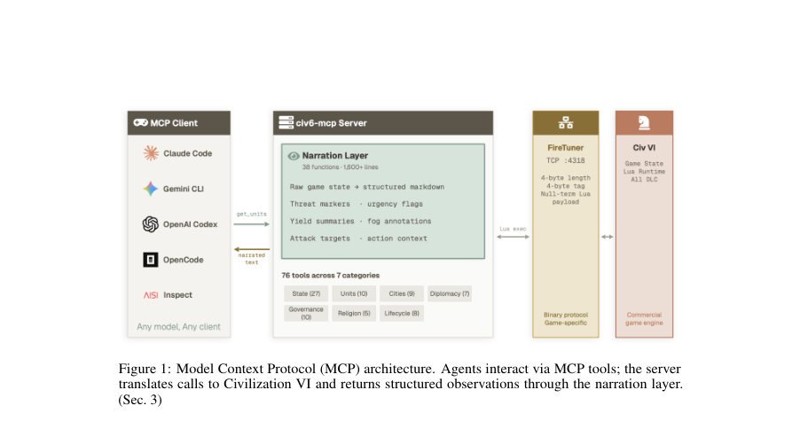
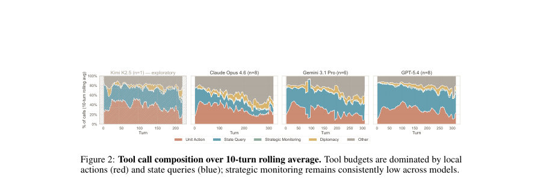
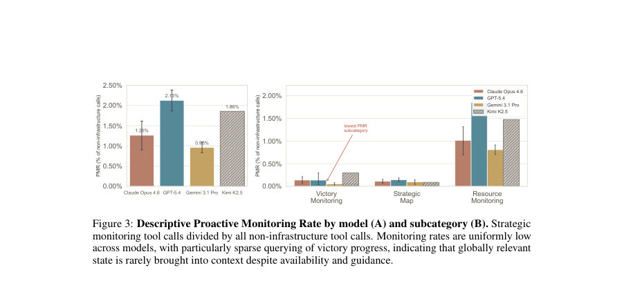

# CivBench: A Long-Horizon Benchmark for Tool-Mediated Agents in Civilization VI

- **게시일:** 2026-09-03
- **arXiv:** [2609.02459v1](http://arxiv.org/abs/2609.02459v1) · [PDF](https://arxiv.org/pdf/2609.02459v1)
- **저자:** Austin Tudor David Andrews, Liam Wilkinson, Jamie Heagerty, Harry Coppock, Jakob Nicolaus Foerster, Rui Ponte Costa
- **분야:** cs.AI
- **선정 점수:** 4.96
- **선정 이유:** 최근성 1.2, 인용 영향 0.0 (인용 0회), 저자 영향 0.0 (최고 h-index 0), AI 주제 적합성 2.6, 개발자 관심 0.7, 학술 신호 0.6, 오픈 웨이트·주요 연구조직 신호 0.0

[← 2026-09-03 목록으로 돌아가기](../daily/2026-09-03.html)

<!-- paper-visuals:start -->
## 주요 Figure

> 원문 PDF에서 실제 Figure 캡션과 그림 영역이 함께 확인된 자료만 자동 추출했다.

*Figure · 원문 PDF 3쪽 · Figure 1: Model Context Protocol (MCP) architecture. Agents interact via MCP tools; the server*

*Figure · 원문 PDF 6쪽 · Figure 2: Tool call composition over 10-turn rolling average. Tool budgets are dominated by local*

*Figure · 원문 PDF 7쪽 · Figure 3: Descriptive Proactive Monitoring Rate by model (A) and subcategory (B). Strategic*

<!-- paper-visuals:end -->

## 한 문장 요약

CivBench는 Model Context Protocol(MCP)와 내레이션 레이어를 통해 장기(300+턴), 도구 호출이 많은 환경에서 언어모델 에이전트의 주의 할당(정보 조회)과 계획 실행을 추적·정량화하기 위한 오픈소스 벤치마크이다.

## 해결하려는 문제

기존 평가들은 추론, 단기 계획, 혹은 도구 사용을 분리해서 측정하는 경향이 있어 장기간의 도구 매개 상호작용(부분 관찰, 대규모 행동 공간, 수백 턴에 걸친 의사결정)에서 에이전트가 관련 상태를 유지하고 진술한 계획을 실제 행동으로 옮기는지를 직접 관찰·측정하기 어렵다. CivBench는 ‘정보가 사용 가능한가’와 ‘정보가 문맥으로 불러와졌는가’를 분리해 도구 호출 로그에서 주의 할당과 계획 실행 충실도를 측정하는 것을 연구 문제로 삼는다.

## 핵심 기여

- CivBench 벤치마크 환경: Civilization VI에 연결된 MCP 서버와 76개의 MCP 툴, 고정 시나리오(예: Ground Control, Snowflake 등), 완전한 도구호출 로그와 재생/분석 파이프라인을 공개함.
- 내레이션 프로토콜: 시각적 게임 상태를 29개 함수로 구성된 구조화된 텍스트 관찰로 변환하고, 비지역(글로벌) 상태는 명시적 쿼리 없이는 제공하지 않아 가용성(availability)과 문맥화(retrieval)를 분리함.
- 행동 지표 정의: Proactive Monitoring Rate(PMR)를 도입해 전략적 모니터링 툴 호출 비중을 측정하고, RAG@K(Reflection–Action Gap)를 도입해 다이얼리에서 명시한 근시일(기본 K=10턴) 약속의 실행 여부를 정량화함.
- 파일럿 실험과 행동적 특징 규명: 4개 모델 계열에 대한 23개 적격 게임 실행을 공개·분석하여 'sensorium effect'(정보는 가용하지만 에이전트가 쿼리하지 않는 현상)와 'reflection–action gap'(자기 진술 약속의 불이행)을 계측 가능한 실패 모드로 제시함.
- 아티팩트 공개: 시나리오, 로그, 메트릭스 산출 스크립트, 분석 파이프라인을 공개해 재현 가능하게 함.

## 접근 방법

* 구성요소와 절차는 다음과 같다.
* CivBench 서버는 FireTuner/TCP를 통해 Civilization VI와 연결되며 외부 에이전트는 76개 MCP 툴(상태 쿼리, 유닛 행동, 도시 관리, 외교, 연구 등)을 호출해 구조화된 텍스트 관찰(내레이션 함수 29개)을 받는다.
* 핵심 설계는 모든 비지역 글로벌 상태를 명시적 쿼리로만 반환하도록 하여 정보의 '가용성'과 '문맥화'를 분리하는 것이다.
* 에이전트가 매 턴 호출해야 하는 구조를 표준화한 버전된 플레이북(턴 구조, 5필드 다이어리: tactical, strategic, tooling, planning, hypothesis)을 제공해 일관된 일지와 계획 진술을 유도한다.
* 실험은 고정 맵/시드(19 Ground Control, 4 Snowflake; Cry Havoc 제외)에서 23개의 적격(=admissible) 게임을 실행했고, 평가 대상 모델군은 Claude Opus 4.6, GPT-5.4, Gemini 3.1 Pro, Kimi K2.5(탐색적 1회)이다.
* 측정 지표: PMR = 전략적 모니터링 툴 호출 / 모든 비인프라 호출(예: end_turn 제외)로 정의했고, RAG@K = (Y + 0.5P) / total_commitments (K=10)로 정의하여 다이어리에서 추출된 약속을 10턴 내 실행 여부(실행·부분·미실행)로 라벨링한다.
* 약속 추출·라벨링 파이프라인에는 Claude Haiku 4.5가 사용되었고, 휴먼 검증에서 Cohen's κ=0.879으로 보고되었다.
* 로그·메트릭스 재계산 스크립트와 핀된 게임 버전·시나리오 설정을 함께 공개했다.

## 주요 결과

- 데이터셋·실험 규모: 총 23개의 적격 실행(19 Ground Control, 4 Snowflake). 전체 승리 수는 3회(모두 Ground Control)로 표본 규모가 작아 모델 순위화에 유의미하지 않음(Fisher's exact test p=0.488).
- 집계 성과 불충분: 정규화 점수(normalised_score)에 대한 Kruskal–Wallis 검정에서 H=1.90, p=0.594로 모델 간 구분력이 약함.
- Proactive Monitoring Rate(PMR): 모든 모델에서 PMR가 매우 낮고 분포는 0.96%–2.13% (비인프라 호출 대비) 범위였음. 특히 승리 모니터링(get_victory_progress)은 전체 호출의 0.05%–0.29%에 해당하여 한 게임당 약 3.7–10.0회의 호출에 불과했고, 플레이북 권고(20턴마다 확인)에도 불구하고 실제 쿼리는 30–75턴에 한 번 발생함.
- 감지 가능한 패배의 미조회(Missed-warning): defeat 중 get_victory_progress가 20턴 이전에 위협을 노출했어야 하는 경우 총 20건이 감지되었고, 그 중 13건은 20턴 창에서 쿼리가 존재했으나 7건은 해당 경고창에서 쿼리가 전혀 없었음(모델별 분해는 Table 2에 제시됨: Claude 3/6 missed, Gemini 1/5 missed, GPT-5.4 4/8 missed, Kimi 0/1 missed).
- Reflection–Action Gap (RAG@10): 다이어리에서 추출한 근시일 약속의 10턴 내 실행 비율(RAG@10)은 모델 간 48.2%에서 65.8% 범위였고(부트스트랩 95% CI 표기), 상당수 약속이 10턴 내 불완전 혹은 미실행으로 남아 있음(부분·미실행 포함). 관련 표본 크기는 그림·본문에서 n=55, n=19, n=68 등으로 보고됨(모델별 약속 수가 불균형).」「도구 호출 구성: 턴당 5–15개 호출이 일반적이며 전체 도구 예산은 지역적 행동(unit action)과 상태 쿼리로 지배되고 전략적 모니터링은 일관되게 작은 비중으로 유지됨(Fig.2, Fig.3). PMR은 종료국면으로 갈수록 증가하지 않았음(Fig.11).」「구별 가능한 지표 판별력: Ground Control에서 탐사(exploration) 지표(T100)는 ICC=0.717로 판별력이 있었으나 최종 점수·도시수·경제 산출 등 다수의 집계 지표는 ICC 근처 0 또는 음수로 나타나 표본 내 변동이 모델 간 차이를 압도함(Table 5).

## 한계

- 저자 명시 한계(본문에서 보고): 샘플 크기와 통계력 제한(23회는 큰 효과만 검출 가능), 플레이북 혼선(공유 플레이북으로 인해 행동이 '모델 능력'과 '지침 준수'의 결합 결과로 해석되어야 함), 무작위 혹은 스크립트 기반 베이스라인 부재(하향 경계 불명), 환경적 제약(Civilization VI 상업 라이선스, FireTuner의 단일 연결 제한), 측정 범위의 한계(PMR·RAG는 정의된 모니터링 툴과 약속 라벨링 절차에 의존함).
- 추가 본문에서 합리적으로 확인되는 한계(저자 구분): 모델 커버리지 불균형(한 모델은 탐색적 단일 실행), 약속 추출·라벨링에 LLM(Claude Haiku 4.5)을 사용한 자동화 의존성과 잠재적 편향(라벨러가 평가 대상 계열과 같은 가족에 속함), 비용·시간 제약(한 게임 실행당 약 $31–229의 API 비용, 로컬에서 2–8시간 소요), 결과의 일반화 제한(맵 타입·난이도·시나리오에 따라 행동이 달라질 가능성), 멀티에이전트 실험 제약(FireTuner 단일 연결).

## 개발자 관점

- 재현성·구현: 저자들은 MCP 서버, 시나리오 정의, 핀된 게임 저장파일 메타데이터, 원시 로그 및 분석 스크립트를 공개해 동일 구성으로 재현 가능함(단, Civilization VI 자체는 별도 구매 필요). 재현 시 게임 버전·DLC·시드·플레이북 버전·모델 접근 시점 등을 고정해야 함(저자 제공 구성 포함).
- 운영 비용·인프라: 전체 실험은 API 비용과 장시간 실행(2–8시간/게임)을 요구하므로 대규모 평가를 계획할 때 비용·시간·체크포인트(중단 복구)·로깅을 고려해야 함. 저자들이 사용한 'harness'는 완료율을 크게 개선했음(사전 하니스 실행은 21%만 자연 종료).
- 인터페이스 설계 시사점: 임의의 모니터링을 기대하기보다 모니터링을 강제하거나 우선순위 부여(예: 고빈도 체크 스케줄, 모니터링 툴 우선 슬롯, 관측 신호를 자동으로 푸시하는 인터페이스)를 설계하는 것이 장기 신뢰성에 중요함.
- 계획 실행 보장 메커니즘: 다이어리로 약속을 유도하는 것만으로는 실행을 보장하지 않으므로 구조화된 메모리, 작업 큐, 약속 강제화(예: 약속이 남아있으면 우선 작업으로 재삽입) 같은 지속적 약속 추적 장치를 도입하면 RAG를 개선할 수 있음.
- 평가 파이프라인 개선: RAG 라벨링 파이프라인이 LLM에 의존하므로 휴먼-라벨 검증·아블레이션(다이어리 제거, 약속 추적 도입), 무작위/스크립티드 베이스라인 추가, 더 많은 반복·균등한 모델표본을 통한 통계적 검증이 필요함.

**근거 범위:** 이 분석은 제공된 논문 PDF 본문 전체에서 직접 인용·요약한 내용에 기반한다. 모든 정량 값(예: PMR 비율, RAG@10 범위, 통계검정 결과, 샘플 크기, 비용·시간 견적, Table·Figure 수치 등)은 본문·표·그림에서 보고된 수치를 그대로 옮겼다. 본문에 명시되지 않은 구현 세부(예: 내부 하이퍼파라미터, LLM 호출 파라미터의 세부 설정)는 생성하지 않았으며, 라벨링 편향 가능성 등은 본문 근거에 따라 '합리적 추정'으로 구분해 기술했다.
