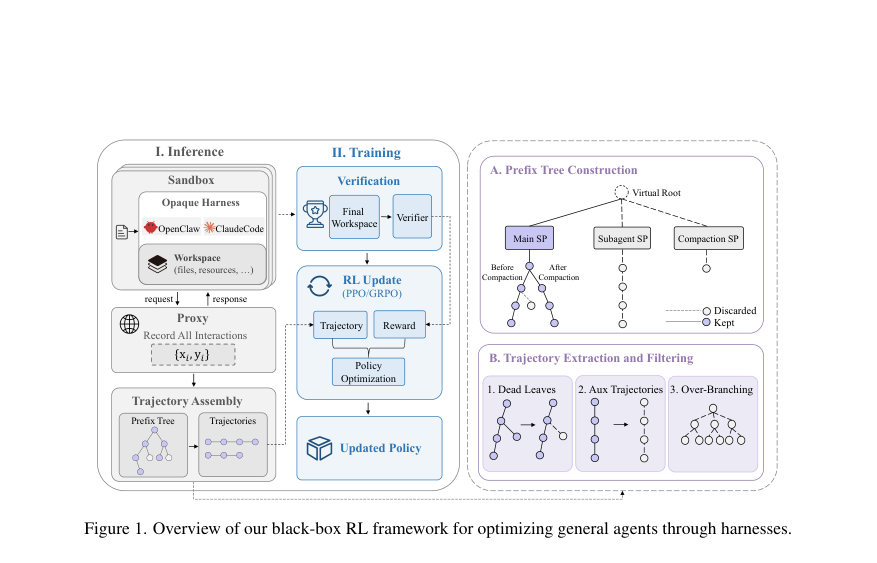
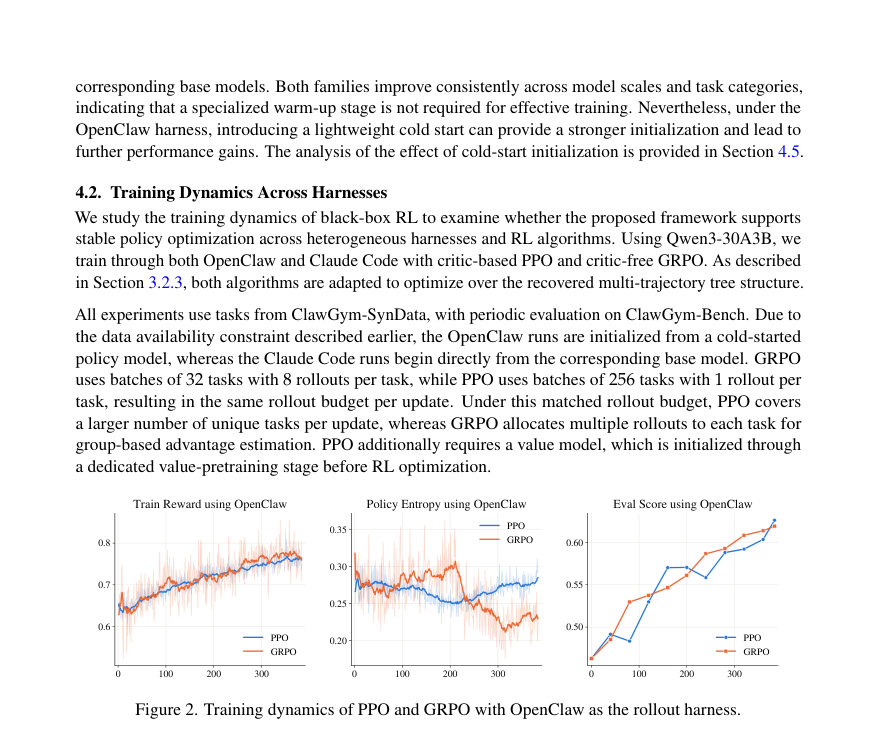
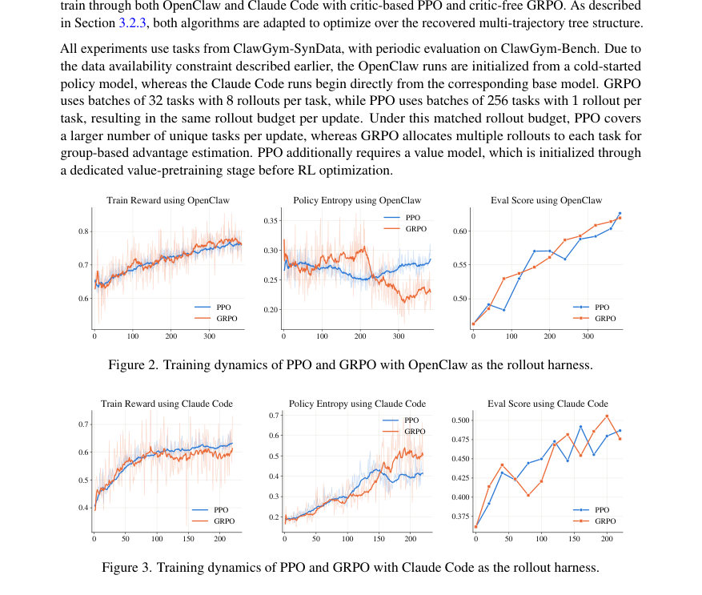

# ClawGym II: Exploring Black-Box RL on Agent Harness

- **게시일:** 2026-08-18
- **arXiv:** [2608.16798v1](http://arxiv.org/abs/2608.16798v1) · [PDF](https://arxiv.org/pdf/2608.16798v1)
- **저자:** Huatong Song, Fei Bai, Ming Yang, Renyuan Li, Jia Deng, Jujie He, Zhange Zhang, Daixuan Cheng, Yan Xing, Qi Yun, Xuxing Chen, Danyang Li, Feng Chang, Chuan Hao, Ran Tao, Jian Yang, Bryan Dai, Wayne Xin Zhao, Mingjie Tang, Ji-Rong Wen
- **분야:** cs.CL, cs.AI, cs.LG
- **선정 점수:** 6.22
- **선정 이유:** 최근성 0.8, 인용 영향 0.0 (인용 0회), 저자 영향 1.7 (최고 h-index 19), AI 주제 적합성 2.7, 개발자 관심 0.8, 학술 신호 0.3, 오픈 웨이트·주요 연구조직 신호 0.0

[← 2026-08-18 목록으로 돌아가기](../daily/2026-08-18.html)

<!-- paper-visuals:start -->
## 주요 Figure

> 원문 PDF에서 실제 Figure 캡션과 그림 영역이 함께 확인된 자료만 자동 추출했다.

*Figure · 원문 PDF 6쪽 · Figure 1. Overview of our black-box RL framework for optimizing general agents through harnesses.*

*Figure · 원문 PDF 12쪽 · Figure 2. Training dynamics of PPO and GRPO with OpenClaw as the rollout harness.*

*Figure · 원문 PDF 12쪽 · Figure 3. Training dynamics of PPO and GRPO with Claude Code as the rollout harness.*

<!-- paper-visuals:end -->

## 한 문장 요약

복잡한 에이전트 실행 하니스(harness)를 불투명(black-box)으로 취급하면서 샌드박스 기반 인프라, 프록시로 캡처한 토큰 기록의 접두사 트리(prefix tree) 재구성, 그리고 토큰 수준 중요도 보정 및 PPO/GRPO 적응을 통해 일반 에이전트를 안정적·대규모로 RL 최적화하는 통합 프레임워크를 제안한다.

## 해결하려는 문제

현대의 복잡한 에이전트 하니스는 내부 제어 흐름과 도구 실행을 불투명하게 감추어 모델-하니스 상호작용이 단편적이고 포크된(분기된) 모델 호출 기록으로 드러난다. 이로 인해 (1) 장시간 롤아웃을 대규모로 안정적으로 수행할 인프라가 필요하고, (2) 잘게 조각난 모델 호출을 학습 가능한 다중턴 궤적로 재구성해야 하며, (3) 하니스별 상호작용 규약 차이를 통합해 하나의 모델을 다중 하니스로 학습할 수 있는 확장성이 필요하다. 연구 질문은 ‘하니스를 블랙박스로 다루면서 일반 에이전트를 안정적으로 최적화하는 방법’이다.

## 핵심 기여

- 샌드박스 기반 실행 인프라와 서빙 프록시를 통해 하니스 내부를 수정하지 않고도 대규모 동시 롤아웃을 안정적으로 수집하는 시스템을 구축함.
- 서빙 프록시에서 캡처한 입력·생성 토큰과 롤아웃 시 로그확률을 접두사 트리로 재구성해 포크된(분기된) 다중 루트→리프 궤적 구조로 변환하고, 불필요·비교적 무의미한 잎(재시도·보조 서브에이전트 등)을 필터링하는 궤적 복원 파이프라인을 제시함.
- 복원된 트리 구조에 대해 토큰 수준 중요도-샘플링 보정과 함께 PPO(critic 기반)와 GRPO(critic-free)를 트리 구조에 맞게 적응시켜 정책 최적화를 수행하고, 토큰-인-토큰-아웃(token-in-token-out) 규율으로 학습-추론 일관성을 유지함.
- 여러 하니스에서의 롤아웃을 하나의 학습 파이프라인에서 무작위 혼합해 단일 모델을 공동 최적화하는 mix-harness 학습을 제안하고, OpenClaw·Claude Code 등 서로 다른 하니스에서의 실험으로 확장성과 효과를 검증함.
- 롤아웃 안정성(타임아웃·실패 처리), 가짜 스트리밍(버퍼링 후 비스트리밍 파싱), 레코드 정착(settling) 등 실제 인프라 오류에 대한 공학적 안전장치를 설계·적용함.

## 접근 방법

* 아키텍처: 각 롤아웃마다 작업환경과 선택된 하니스를 일시적 샌드박스에 프로비저닝하여 격리 실행하고, 하니스-모델 경계에 서빙 프록시를 배치해 모든 모델 요청(입력 토큰, 생성 토큰, 롤아웃 시 로그확률, 메타데이터)을 기록한다.
* 공통 도구는 샌드박스 내부에서 MCP 서버로 제공한다.
* 궤적 재구성: 한 롤아웃에서 캡처된 (x_i,y_i) 호출들을 누적 역사(가장 긴 접두사)에 따라 접두사 트리로 구성하여 공유 접두사는 노드 하나로 저장하고 각 루트→리프 경로를 후보 다중턴 궤적으로 취급한다.
* 필터링: 재시도에 의한 dead leaves 제거(세그먼트별 가장 긴 유효 연속을 보존), 과도한 분기(허용 잎 수 초과 시 전체 롤아웃 폐기), 보조(서브에이전트·컴팩션) 궤적 제외.
* 학습 알고리즘 적응: GRPO는 롤아웃 그룹(논문에서는 task 또는 task–harness 그룹)에 대해 보상 정규화(평균·표준편차)로 이점 추정치를 구하고 해당 롤아웃의 모든 보존 토큰 노드에 동일한 롤아웃 보상을 할당한다.
* PPO는 value 모델을 사용하지만 트리의 포킹을 복잡하게 모델링하지 않고 동일 롤아웃의 각 궤적을 독립적으로 처리(γ=1, λ=1)하여 최종 토큰에서 롤아웃 보상으로 GAE 백업을 수행한다.
* 학습–추론 일관성: 생성 당시의 토큰 시퀀스를 훈련 데이터로 직접 사용(token-in-token-out), 롤아웃 시 기록된 log π_rollout과 훈련 시 재계산된 log π_old 사이의 불일치를 줄이기 위해 토큰 수준 중요도-샘플링 보정 w_t = min(exp(log π_old − log π_rollout), c̄) 적용(상한치로 분산 제어).
* Mix-harness: 동일 작업 환경에 대해 서로 다른 하니스를 결합하여 task–harness 쌍 단위로 그룹화 및 정규화를 수행하고 배치 내 혼합 훈련을 진행한다.
* 실무적 안전장치: 샌드박스 실패 시 폐기, pseudo-streaming(토큰 버퍼링 + 단일 비스트리밍 파서), 레코드 정착(레코드 수가 안정될 때까지 대기) 등.

## 주요 결과

- 핵심 정량 성능(논문 본문, Table 1): Qwen3-30A3B 초기화 기준, ClawGym-Bench Pass@1 향상 — OpenClaw로 학습한 ClawII-OC-30A3B가 +9.98점, Claude Code로 학습한 ClawII-CC-30A3B가 +14.81점 향상(각각 동일 하니스 내 평가).
- PinchBench에서의 향상(본문): Qwen3-30A3B 기반에서 ClawII-OC와 ClawII-CC가 각각 +11.71 및 +17.28 점 개선.
- 학습 안정성: 제시된 실험에서 PPO·GRPO 모두 대체로 200–400 최적화 스텝 동안 안정적 최적화를 보였음(훈련 보상 및 평가 점수 상승 추세; 본문 Fig.2–3).
- Mix-harness: OpenClaw·Claude Code의 롤아웃을 혼합한 공동 학습에서 단일 모델이 개별 하니스 전용 모델과 비슷하거나 더 나은 성능을 보이며 학습 불안정성은 관찰되지 않음(본문 Fig.4).
- 더 어려운 과제 확장: JobBench 스타일(Claude Code)에서 평가점수 20.46 → 27.20, OfficeQA-Full에서 8.53 → 21.54로 개선(본문 Fig.5–6).  (위 수치들은 본문에서 직접 보고된 값임.)

## 한계

- 저자가 명시한 한계: (1) 보조 궤적(서브에이전트·컴팩션 등)을 현재 학습에서 제외함 — 이는 향후 통합해야 할 명시적 한계로 저자가 밝힘; (2) PPO의 경우 트리 형태의 포킹을 엄밀하게 처리하지 않고 동일 롤아웃 내 각 궤적을 독립적으로 처리(γ=1, λ=1)하는 단순화로 인해 이론적 자원 배분·크레딧 할당이 미흡할 수 있으며 분산(variance) 증가 가능성을 저자가 지적함.
- 본문 실험·범위에서 합리적으로 확인되는 제약(저자 언급과 구분): (1) 적용 대상 하니스와 데이터셋은 OpenClaw·Claude Code·ClawGym 계열 등으로 한정되어 있어 더 다양한 상용 혹은 폐쇄형 하니스로의 일반화는 추가 검증 필요; (2) 일부 실험은 cold-start 데이터 가용성 제약으로 초기화 방식이 달랐음(예: ClawII-OC는 cold-start에서 출발), 이는 결과 해석에 영향을 줄 수 있음; (3) 시스템 재현을 위해서는 대규모 샌드박스 인프라·MCP 서버·검증자(예: GPT-5.4 사용) 등 높은 운영비용과 복잡한 엔지니어링이 요구됨; (4) 트리 필터링 기준(잎 수 임계값, 중요도 절단값 c̄ 등)과 같은 구현 세부값은 본문에 구체적 숫자·튜닝 절차가 제한적으로 제시되어 있어 재현 시 추가 튜닝이 필요함.

## 개발자 관점

- 재현 인프라: 각 롤아웃을 격리하는 샌드박스(프로비저닝·파괴), 하니스가 기대하는 런타임을 제공하는 MCP 서비스 배치, 그리고 하니스-모델 경계에 토큰·로그확률을 기록하는 서빙 프록시가 필수적이다.
- 데이터 캡처: 훈련은 '생성 당시 토큰'과 '롤아웃 시 기록된 로그확률'을 그대로 보존해야 하므로 토큰 단위 원본 기록(token-in-token-out)과 로그확률 저장을 반드시 구현해야 한다.
- 궤적 복원 파이프라인: 접두사 트리 구성, 세그먼트 경계(컴팩션·서브에이전트) 인식, dead-leaf 제거·과분기 판정(임계값 기반 폐기)·보조 궤적 제외 로직을 명확히 구현해야 동일한 학습 신호를 얻을 수 있다.
- 학습 적응: GRPO는 그룹 기반 보상 정규화(논문은 task 또는 task–harness 그룹)로 복원 트리를 자연스럽게 다루며, PPO는 value 사전학습과 γ=1, λ=1 단순화로 구현해야 하나 분산이 커질 수 있어 value 학습·정규화에 특히 신경 써야 한다.
- 훈련–추론 일치: 훈련 엔진과 추론(롤아웃) 엔진 간 수치·커널 차이로 log π 차이가 발생하므로 토큰 수준 중요도 보정(및 상한선 c̄) 적용이 필요하고, 상한값·트렁케이션은 경험적으로 튜닝해야 한다. 또한 cold-start(가벼운 SFT)로 행동 사전점을 주면 안정성이 개선됨을 실험적으로 확인함(권장).

**근거 범위:** 논문 PDF 본문(제공된 전체 페이지)을 근거로 분석함. 주요 정량 결과(예: Pass@1 향상치, JobBench·OfficeQA 수치, 학습 스텝 범위, 배치 구성 등)는 본문 표와 도표에서 직접 인용함. 반면 구현의 구체적 하이퍼파라미터(예: 접두사 트리의 잎 수 임계값, 중요도 상한 c̄의 정확한 값, 세부 튜닝 절차)는 본문에서 일반적 설명 또는 일부 실험 구성만 제공되어 구체 수치는 문서에 명시되지 않았으므로 재현 시 추가 튜닝 및 시스템 세부설계가 필요함.
