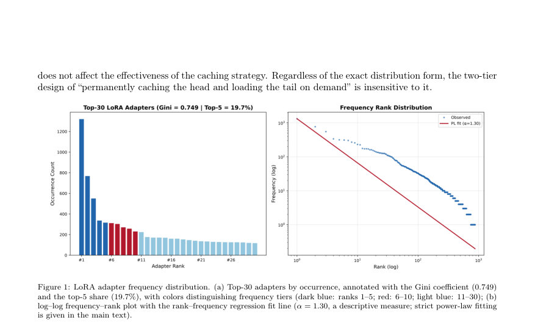
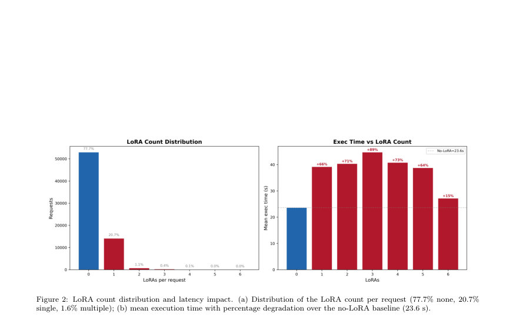
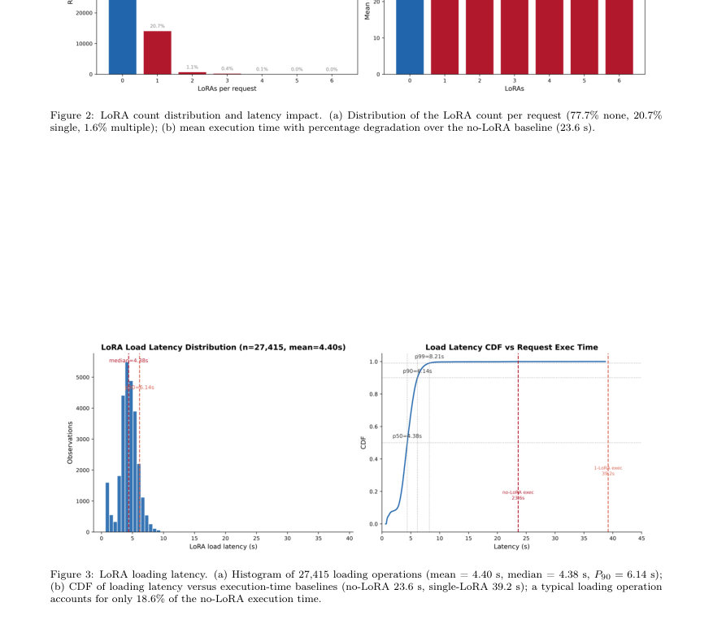

# Co-occurrence Patterns of LoRA Adapters in Production Diffusion Model Inference Services

- **게시일:** 2026-09-22
- **arXiv:** [2609.23321v1](http://arxiv.org/abs/2609.23321v1) · [PDF](https://arxiv.org/pdf/2609.23321v1)
- **저자:** Tao Zhang, Bin Liao, Tao Zhou, Yanping Liu
- **분야:** cs.DC, cs.AI, cs.LG
- **선정 점수:** 5.22
- **선정 이유:** 최근성 0.6, 인용 영향 0.0 (인용 0회), 저자 영향 0.0 (최고 h-index 0), AI 주제 적합성 2.0, 개발자 관심 0.8, 학술 신호 0.5, 오픈 웨이트·주요 연구조직 신호 1.4

[← 2026-09-22 목록으로 돌아가기](../daily/2026-09-22.html)

<!-- paper-visuals:start -->
## 주요 Figure

> 원문 PDF에서 실제 Figure 캡션과 그림 영역이 함께 확인된 자료만 자동 추출했다.

*Figure · 원문 PDF 6쪽 · Figure 1: LoRA adapter frequency distribution. (a) Top-30 adapters by occurrence, annotated with the Gini coefficient (0.749)*

*Figure · 원문 PDF 7쪽 · Figure 2: LoRA count distribution and latency impact. (a) Distribution of the LoRA count per request (77.7% none, 20.7%*

*Figure · 원문 PDF 7쪽 · Figure 3: LoRA loading latency. (a) Histogram of 27,415 loading operations (mean = 4.40 s, median = 4.38 s, P90 = 6.14 s);*

<!-- paper-visuals:end -->

## 한 문장 요약

생산 환경의 diffusion 모델 추론 로그(GenTD26)를 그래프 이론 기반으로 분석해 LoRA 어댑터의 공출현(co‑occurrence) 네트워크 구조와 시간적 진화 특성을 규명하고, 이를 바탕으로 top-k 공출현 기반 사전로딩(preloading) 전략을 제안·검증했다.

## 해결하려는 문제

생산 환경에서 대규모 개인화 모델과 diffusion 모델에 LoRA 어댑터가 널리 쓰이지만, 어댑터들의 공출현 패턴, 자원 경쟁(특히 GPU 메모리·로딩 지연) 관계, 시간에 따른 변화 규칙성에 대한 체계적·정량적 연구가 부족하다. 이로 인해 캐시 사전로딩, 적응형 스케줄링, GPU 메모리 관리 등 실서비스 최적화 정책을 데이터 기반으로 수립하기 어렵다.

## 핵심 기여

- 생산 추론 로그(Alibaba GenTD26)를 사용해 어댑터 공출현 네트워크를 구성하는 그래프 이론적 분석 프레임워크를 제시하고 정적·동적 특성을 분석했다.
- 공출현 네트워크의 구조적·주파수적 특성(매우 희소한 그래프, 어댑터 사용 빈도의 히비테일 분포)을 규명했다.
- 어댑터 추가가 추론 지연에 미치는 영향(첫 어댑터 도입으로 66.1%의 실행 지연 오버헤드 발생 및 이후 한계비용 감소)을 정량화했다.
- 베이스 모델 중심의 공출현 구동 현상을 보고(예: 다중 어댑터 요청의 90.6%가 동일 우세 베이스 모델을 공유 등) 및 코어-페리퍼리(핵심-주변) 양극 구조와 시간적 변화(주간 Jaccard 0.696, 상위10개 모델의 12시간 창 내 churn 54.5%)를 밝혔다.
- 분석 결과를 활용한 top-k 공출현 기반 사전로딩 전략을 제안하고, 오프라인 실험에서 k=3일 때 테스트 셋 공출현 쌍의 81.0%를 커버함으로써 실용성을 검증했다.

## 접근 방법

* (본 논문 본문은 제공되지 않아 초록 기반 기술) Alibaba의 생산 diffusion 모델 추론 데이터셋(GenTD26)에서 요청 로그를 추출하여 어댑터 간의 공출현 관계를 노드-엣지 형태의 네트워크로 구성했다.
* 구성된 네트워크에 대해 정적 구조 분석(희소성, 사용 빈도 분포 등)과 동적 분석(시간 윈도우별 Jaccard 유사도, 상위 모델의 churn 등)을 수행했다.
* 또한 요청 단위로 어댑터 수 증가가 추론 실행 지연에 미치는 영향을 측정해 첫 어댑터의 오버헤드를 계산했고, 공출현의 통계적 유의성 기준(본문 미제공)으로 '유의한 공출현 엣지'를 정의하여 베이스 모델 기반의 결속성 여부를 분석했다.
* 마지막으로, 학습·추론 파이프라인이나 온라인 배포가 아닌 오프라인 평가 환경에서 top-k 공출현 통계를 이용한 사전로딩 정책을 시뮬레이션하여 커버리지(테스트 세트 공출현 쌍 중 사전로딩으로 대비되는 비율)를 측정하고, 빈도 임계값·시간 창 등 변수에 대한 민감도 분석을 수행했다.

## 주요 결과

- 데이터셋: Alibaba의 생산 diffusion 추론 로그(GenTD26).
- 네트워크 구조: 공출현 네트워크는 '매우 희소'하며, 어댑터 사용 빈도는 현저한 heavy‑tailed(장꼬리) 분포를 따름(정량적 분포 파라미터는 본문 미제공).
- 지연 영향: 첫 번째 어댑터 도입 시 실행 지연 오버헤드 66.1%로 보고됨. 이후 추가 어댑터의 한계비용은 점차 감소함(구체적 단계별 수치·측정 방법 본문 미제공).
- 베이스 모델 드라이브: 다중 어댑터 요청의 90.6%에서 모든 어댑터가 동일한 우세 베이스 모델을 공유함.
- 유의한 공출현 엣지 관련: 전체 유의한 공출현 엣지의 66.2%가 동일 베이스 모델 쌍을 연결함; 다중 어댑터 요청의 85.8%는 모든 어댑터 쌍이 유의한 공출현 엣지를 형성함(엣지 유의성 정의는 본문 미기재).」「시간적 특성: 어댑터 생태계가 코어-페리퍼리 양극 구조를 보이며, 모델 수준의 주간 Jaccard 유사도는 0.696이고 상위 10개 인기 모델의 12시간 윈도우 내 churn(교체)율은 54.5%임.

## 한계

- 저자가 명시한 제한: 초록·제공 본문에서는 저자가 직접 밝힌 한계가 명시되어 있지 않음(전체 본문 미제공으로 확인 불가).
- 본 논문 본문 범위에서 확인되는 제약(추정적·검증 가능한 제약으로 명시):
- 데이터셋 편향성: 분석은 Alibaba의 생산 diffusion 추론 로그(GenTD26)에 기반하므로 다른 서비스(예: LLM 추론, 비-diffusion 모델)나 다른 트래픽 특성을 가진 환경에 일반화하기 어렵다.
- 오프라인 평가 한계: 제안한 top-k 사전로딩 정책은 오프라인 실험(정확히는 커버리지 측정)으로 검증되었고, 실제 온라인 환경에서의 지연/자원 절감·경합 완화 효과는 본문에 상세 실시간 평가 결과가 제시되지 않음(실서비스 적용 시 추가 검증 필요).」「측정·정의 불명확: '유의한 공출현 엣지'의 통계적 기준, 지연 측정의 정확한 실험 설정(하드웨어, 동시성, 배치 사이즈 등), 어댑터의 메모리/크기/로딩 비용에 대한 구체적 수치는 초록에 기술되어 있지 않아 재현성에 제약이 있음.

## 개발자 관점

- 첫 어댑터 로딩이 가장 큰 오버헤드를 야기하므로 시스템 설계 시 첫 어댑터에 대한 우선적 사전로딩(또는 비동기적 사전로딩)을 고려해야 함. 이후 추가 어댑터는 한계 비용이 낮아 우선순위에서 낮출 수 있음.
- 공출현이 주로 동일 베이스 모델 내부에서 발생하므로, 베이스 모델 단위로 어댑터를 묶어 배치하거나 동일 GPU에 콜로케이션(colocation)하도록 스케줄링하면 로딩 비용과 메모리 중복을 줄일 수 있음.
- 네트워크가 매우 희소하고 사용 빈도는 장꼬리 분포이므로, 캐시 용량을 소수의 '핫' 어댑터에 집중하고 롱테일 어댑터는 온디맨드 로딩으로 처리하는 정책이 비용-효율적일 가능성이 큼.
- top-k 공출현 기반 사전로딩은 작은 k(예: k=3)로도 높은 커버리지(논문: 81.0%)를 달성하므로 GPU 메모리와 로딩 비용 관점에서 실용적이다. 다만 k 선택은 메모리 예산과 추론 지연 절감 효과의 트레이드오프로 운영 환경에서 튜닝해야 함.
- 높은 모델 수준 churn(상위10개 중 54.5%가 12시간 내 교체)을 고려해 캐시·사전로딩 통계는 짧은 시간 간격(예: 12시간 단위)으로 갱신하는 정책을 도입해야 함. 갱신 주기가 너무 길면 핫셋 변화를 반영하지 못함으로 주기 조정 필요.」「재현성 및 배포: 본 연구를 재현하려면 유사한 생산 로그(어댑터 ID, 베이스 모델 ID, 타임스탬프, 요청 단위의 어댑터 집합)와 지연 측정 환경(하드웨어/동시성 정보)이 필요하다. 특히 '유의한 엣지' 정의·임계값과 지연 측정 프로토콜을 명확히 해야 실제 배포에서 동일한 이득을 기대할 수 있음.

**근거 범위:** 이 분석은 제공된 논문 본문이 추출되지 않아 초록(abstract) 텍스트만을 근거로 작성되었다. 따라서 본문에 포함된 세부 실험 설정(하드웨어 사양, 지연 측정 방법, '유의한 공출현 엣지' 정의, 통계적 유의성 검정, 전체 정량 표와 그래프 등)을 확인하지 못해 해당 항목들은 본문에 근거하여 확인되지 않은 부분으로 남아 있다. 위에 적힌 모든 정량 수치(예: 66.1%, 90.6%, 66.2%, 85.8%, Jaccard 0.696, churn 54.5%, preloading 커버리지 81.0% 등)는 초록에서 직접 보고된 값이며, 정확한 맥락·측정 조건은 원문 본문에서 확인해야 신뢰도가 높아진다.
