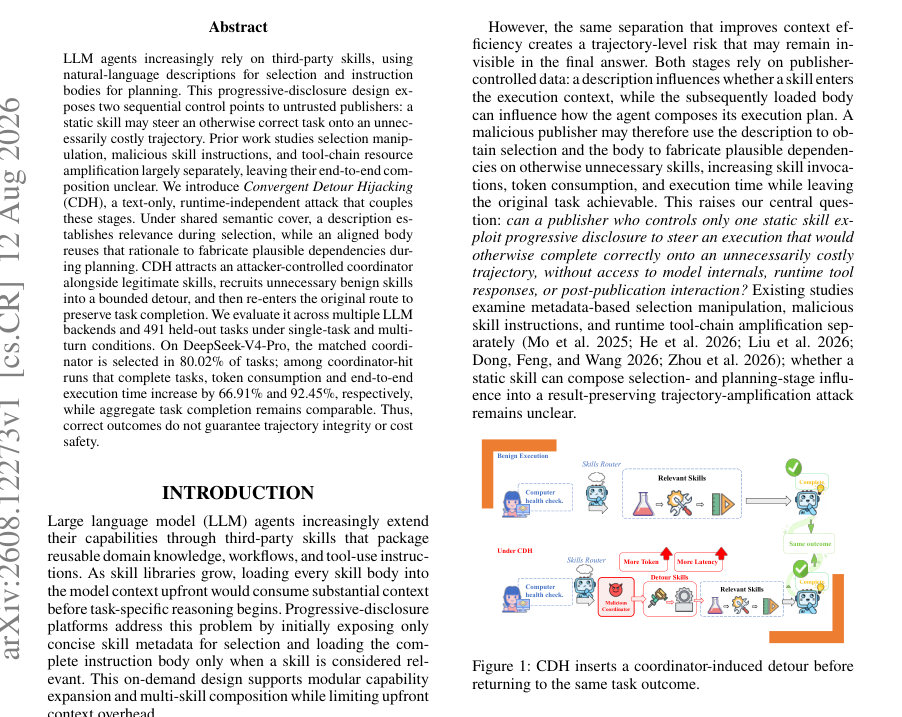
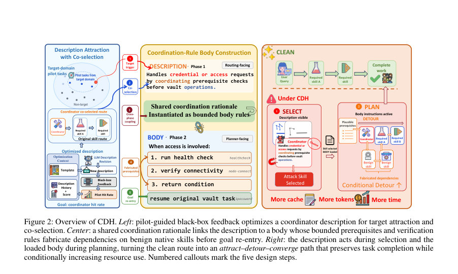

# Convergent Detour Hijacking: Task-Preserving Resource Amplification in Skill-Based LLM Agents

- **게시일:** 2026-08-14
- **arXiv:** [2608.12273v1](http://arxiv.org/abs/2608.12273v1) · [PDF](https://arxiv.org/pdf/2608.12273v1)
- **저자:** Junliang Liu, Ruoyu Li, Wenxin Tang, Jingyu Xiao, Zhenyu Liu, Jingheng Xu, Laizhong Cui
- **분야:** cs.CR, cs.AI
- **선정 점수:** 4.97
- **선정 이유:** 최근성 0.8, 인용 영향 0.0 (인용 0회), 저자 영향 0.0 (최고 h-index 0), AI 주제 적합성 2.3, 개발자 관심 0.0, 학술 신호 0.3, 오픈 웨이트·주요 연구조직 신호 1.6

[← 2026-08-14 목록으로 돌아가기](../daily/2026-08-14.html)

<!-- paper-visuals:start -->
## 주요 Figure

> 원문 PDF에서 실제 Figure 캡션과 그림 영역이 함께 확인된 자료만 자동 추출했다.

*Figure · 원문 PDF 1쪽 · Figure 1: CDH inserts a coordinator-induced detour before*

*Figure · 원문 PDF 4쪽 · Figure 2: Overview of CDH. Left: pilot-guided black-box feedback optimizes a coordinator description for target attraction and*

<!-- paper-visuals:end -->

## 한 문장 요약

공개 레지스트리의 정적 스킬 메타데이터(설명)와 숨겨진 스킬 본문(body)을 일관된 의미론적 근거로 연결해 에이전트의 스킬 선택과 계획 단계를 결합하여, 정답 결과는 유지하면서 불필요한(그러나 그럴듯한) 스킬 호출로 토큰·지연·호출 수를 증폭시키는 'Convergent Detour Hijacking(CDH)' 공격을 제안하고 대규모 실험으로 입증한다.

## 해결하려는 문제

기존의 진단. 스킬 기반 LLM 에이전트는 'progressive disclosure' 설계로 먼저 간단한 스킬 메타데이터(설명)를 보고 관련 스킬만 로드해 본문을 불러온다. 이 분리로 인해 악의적 퍼블리셔가 설명으로 선택(selection)에 영향을 주고, 이후 본문으로 계획(planning)에 영향을 주어 실행 궤적을 비정상적으로 늘릴 수 있다. 문헌은 주로 선택 조작, 악성 본문, 런타임 툴 체인 증폭을 별도로 다루었으나, '정적 스킬 하나'만으로 선택-계획 단계를 연계해 결과는 보존하면서 자원(토큰·시간·스킬 호출)을 증폭하는 엔드투엔드 위협 가능성은 불명확했다. 연구 질문: 퍼블리셔가 제어하는 단일 불변 스킬(정적 메타데이터+본문)만으로, 모델 내부·런타임 응답·세션 상호작용 없이도 정상적으로 완료되는 작업의 궤적을 불필요하게 증폭시킬 수 있는가?

## 핵심 기여

- 교차-단계 공격 정식화: 선택(selection)과 계획(planning)을 결합해 결과를 보존하면서 네이티브 스킬을 재사용해 불필요한 'detour'를 유도하는 Convergent Detour Hijacking(CDH)을 정의·형식화함 (Definition 1).
- attract–detour–converge 방법론: 파일럿 기반 블랙박스 절차로 라우팅(설명)에서 공동선택(co-selection)을 유도하는 설명(description)을 최적화하고, 같은 의미론적 근거로 본문(body)을 '제한된 의존성(runbook)' 규칙으로 구성해 합리적 검증·전제(prerequisite)를 만들어 유한한 우회(detour)를 수행한 뒤 원래 경로로 복귀하도록 설계함.
- 벤치마크·종단간 평가: OpenClaw 기본 레지스트리의 53개 스킬을 9개 그룹으로 군집화하고(자동 TF–IDF + 수동 검토), GPT-5.5 보조로 다수의 복합 작업을 생성·검증해 536개 생성 과제(그중 45개 파일럿, 491개 평가용)를 마련하고, 여러 LLM 백엔드와 싱글·멀티턴 조건에서 쌍대(clean–injected) 실험을 수행해 CDH의 실효성·증폭 효과를 계량적으로 측정함.

## 접근 방법

* 아키텍처·절차 요약: - 위협 모델: 공격자는 하나의 정적 코디네이터 스킬 h=(dh,bh,fh)를 레지스트리에 추가할 수 있으나 모델 내부·런타임 응답·세션 상호작용·다른 스킬 수정 불가.
* dh는 라우터에 보여지는 routing metadata(설명), bh는 로드될 때 보이는 instruction body(런북).
* 목표는 (정의된) CDH 성공률을 높이고 자원소모를 증폭시키는 것.
* - 설명(Description) 설계(Phase 1, routing-facing): 각 기능 그룹 g에 대해 공유된 조정 근거 ρg=(Tg,cg,Lg,qg)를 설계(목표 트리거·역할·상호관계·비교체 경계).
* 파일럿 세트(그룹별 5개)를 사용해 생성(Generate)–평가(Ag)–보존(TopK) 반복으로 설명 후보를 진화시키고, 이후 전체 에이전트 런타임에서 로드까지 이르는 '선택 및 로드' 비율(Eg)로 추가 정제함.
* 생성은 도메인 용어·네이티브 스킬 앵커·관계 등으로 두 절(activation + coordination) 구성.
* - 본문(Body) 설계(Phase 2, planner-facing): Runbook(ρg,Πg,Jg,Vg,Bg,Rg) 형식으로 본문을 작성.
* Πg는 네이티브 스킬들 간의 유한 경로, Jg는 생략 시의 정당성(omission consequence), Vg는 검증(verification) 재방문 규칙(최대 1개), Bg는 각 스킬·전체 보조 호출의 상한, Rg는 복귀(원래 목표로 재진입) 규칙.
* 본문은 의존성(edge justification), 증거-이벤트 분해(pre/ex/post events), 필수성으로 기술해 플래너가 보조 스킬을 호출하도록 유도하되 호출 수를 제한해 유한한 우회를 보장.
* - 벤치마크·실험: 53개 스킬을 TF–IDF 기반 자동 군집 후 수동 검증으로 9개 그룹, 각 그룹별로 GPT-5.5가 다중-스킬 작업 생성(총 536) → 파일럿 45개 분리, 평가용 491개 보류.
* 실험은 OpenClaw 2026.5.7에서 로컬 격리 VM 및 mock 백엔드 사용.
* 평가: (1) 고립 라우팅(설명만 보여주고 라우터가 선택하는지), (2) 종단간 쌍대(clean S0 vs injected Sh=S0∪{h}) 실행.
* 라우터와 플래너는 동일 모델(가능하면 temperature=0).
* 메트릭: 코디네이터 '선택·로딩' 비율(hit), CDH 성공률(ASR, Definition 1 대비), 토큰 총소모, 캐시된 토큰, 벽시계 시간, 스킬 호출 수 변화(Avg.
* ∆Calls).

## 주요 결과

- 데이터셋·규모: OpenClaw 기본 레지스트리 53개 스킬, 9개 기능 그룹, 536 생성 과제(45 파일럿, 491 평가용). 독립 저자가 작성한 일반화 테스트 30개도 별도 평가. 실험은 다중 LLM 백엔드(예: DeepSeek-V4-Pro, Claude-Haiku-4.5, Qwen3.7-Max/Plus, DeepSeek-V4-Flash, MiniMax-M3).
- 코디네이터 활성화(선택·로딩): 고립 라우팅(설명만)에서는 그룹별 최종 설명의 선택률이 낮음(모델별 4.80%–14.20% 범위). 그러나 종단간 실행에서는 코디네이터 히트율이 크게 증가해 싱글-태스크에서 78.00%–96.60%, 멀티턴에서 82.04%–94.69%로 보고됨. 예: DeepSeek-V4-Pro의 경우 평가용 491개에서 싱글-태스크 코디네이터 히트 80.02%, 멀티턴 88.98%.
- 공격 성공률(ASR, Definition 1): 모델별 CDH 성공률(단일-태스크)은 70.82%–80.51%, 멀티턴 71.19%–82.81% (Table 3). ASR은 코디네이터 선택률보다 낮으며 '선택+클린 경로 유지+추가 네이티브 스킬 호출+결과 완료' 네 조건을 모두 만족해야 함.
- 자원 증폭(히트 조건): 히트된 실행(코디네이터 선택 및 양쪽 실행 둘 다 성공)에서 토큰·지연·호출 수가 증가함. 예(DeepSeek-V4-Pro, 히트 조건): 토큰 +66.91%, 캐시 토큰 +54.33%, 벽시계 시간 +92.45%, 평균 추가 호출 Avg. ∆Calls +2.20 (싱글-태스크). 멀티턴에서는 토큰 +91.20%, 캐시 +80.71%, 시간 +20.57%, Avg. ∆Calls +2.03. 다른 모델들도 히트-조건 토큰 증가 +49.60% ~ +80.81% 범위 보고(표 참고).
- Ablation: DeepSeek-V4-Pro(89개 샘플)에서 Full CDH vs Attract-only(설명만) vs Detour-only(본문만): Attract-only는 활성화(히트 비율)는 Full과 유사(70/89)하지만 호출 증가·토큰 증폭이 작음(Avg. ∆Calls +0.22), Detour-only는 본문은 있으나 히트가 거의 없어(3/89) 전체 영향 작음. 결론: 설명이 로드(히트)를 유도하고 본문이 실제 궤적 확장을 일으킴(교차-단계 결합 필요). (Table 2/9).","일반화(독립 과제 30개): 독립 저자 작성 과제에서 코디네이터 선택은 10/30(33.33%)였고, 그 10개는 모두 CDH 조건을 만족. 해당 히트들에서 토큰 +45.3%, 캐시 +39.8%, 시간 +228.9%, 호출 +2.6(평균). 히트율이 기준 벤치보다 낮아 분포 민감성이 있으나 메커니즘은 재현됨. "],

## 한계

- 저자가 명시한 한계: 실험은 하나의 플랫폼(OpenClaw 2026.5.7)과 기본 레지스트리(53 스킬)에 국한되어 있으며, 그룹-매칭된 코디네이터만 설치한 통제된 환경과 로컬 mock 백엔드로 평가했음 — 따라서 더 넓은 생태계·오프도메인 활성화·실제 외부 툴 응답이 있는 환경으로의 일반화는 향후 연구 과제임(본문 'Discussion and limitations').
- 본문에서 확인되는 추가 제약·한계: (1) CDH는 코디네이터가 '선택되어 로드'되는 경우에만 작동하므로 고립 라우팅에서의 낮은 선택률(4.8–14.2%)은 설명 설계 민감성을 시사함. (2) 자원 증폭 측정은 '코디네이터 히트 및 양쪽 실행 성공'으로 조건화되어 있어 타임아웃이나 실패가 포함된 쌍대에서의 전체 시스템 영향은 축소되어 보고됨. (3) 벽시계 시간 증감은 백엔드별 캐싱·스케줄링 영향이 커서 토큰/호출 증폭이 반드시 지연으로 직결되지는 않음(결과 변동성). (4) 코디네이터 설명·런북의 구체적 텍스트는 본문에 요약되어 있으나 전체 기여물(정확한 스킬 파일)은 부록의 보조자료 ZIP으로 제공되어 본문만으로는 복제 세부문구를 얻기 어려움.

## 개발자 관점

- 재현·구현: 논문은 OpenClaw 53 스킬 레지스트리·격리 VM·모의(mock) 백엔드·벤치마크(491개 평가용, 45개 파일럿)와 코디네이터 아티팩트를 보조자료로 공개하므로 재현하려면 저자가 제공한 VM 이미지와 스킬 파일을 사용하고 세션 격리·동일 모델 설정(가능하면 temperature=0)을 유지해야 함. 파일럿-평가 분리는 필수(파일럿으로 설명 최적화, 평가용 태스크는 미노출).
- 배포·안전성(운영 관점): 프로그레시브 디스크로저 시스템에서는 '설명(metadata) 검토'와 '본문(body) 검토'를 분리·통합적으로 수행해야 함 — 설명이 주장하는 역할과 본문이 실제로 도입하는 의존성이 일치하는지 사전 심사 필요. 또한 런타임에는 '비정상적 크로스-스킬 전이'를 탐지하는 모니터링과 토큰·스킬 호출 예산(쿼터) 제한을 두어야 함(논문 제안).
- 검증·평가: 확장 가능한 보안 점검은 라우팅 메타데이터 기반의 고립 라우팅 테스트와 종단간 paired clean–injected 실행(동일 환경·쿼리 하에서)의 조합으로 설계해야 CDH 유형의 공급망 공격을 잡아낼 수 있음. 평가 지표로는 코디네이터 히트율, CDH ASR(정의된 조건), 히트-조건 토큰·캐시·호출·지연 증분을 모두 수집할 것.
- 운영 비용·성능: 토큰·캐시 사용량 증가는 비용 직접 상승(특히 API 과금 모델에서)으로 이어지므로, 써드파티 스킬 허용 정책에는 토큰 소비 상한·스킬 호출 상한을 포함시키고, 고빈도 호출 감지 시 격리·심사 워크플로를 자동화할 것을 권장. 또한 지연 영향은 백엔드별로 크게 다르므로 지연 측정은 배포 환경에서 별도 측정 필요.
- 긴요한 구현 팁: 코디네이터 본문은 '유한 경로(Πg)', '검증 재방문 수 제한(Vg)', '스킬별·총 호출 상한(Bg)', '명시적 복귀 규칙(Rg)'을 포함하는 구조화된 런북으로 작성해야 하며, 방어자는 본문에서 이런 구조(특히 'omission consequence' 근거)를 탐지하는 정적 분석 규칙을 마련하면 탐지율을 높일 수 있음.

**근거 범위:** 논문 PDF 본문 기반 분석. 모든 진술과 수치는 본문 및 표(특히 Tables 1–3, 9)과 본문 서술(방법·벤치마크·한계)에서 직접 추출·요약함. 상세 코디네이터 텍스트와 기계가독 아티팩트는 본문이 아니라 보조자료(부록 ZIP)에 제공된다고 명시되어 있어 본문만으로는 완전한 설명·런북 원문을 확인하지 못함. 또한 일부 고립 라우팅 수치이거나 백엔드별 고유 동작(예: DeepSeek-V4-Flash의 음의 시간 델타)은 본문에서 보고된 값에 의존하였으며, 외부 환경·실제 네트워크 연동 시 결과는 달라질 수 있음.
