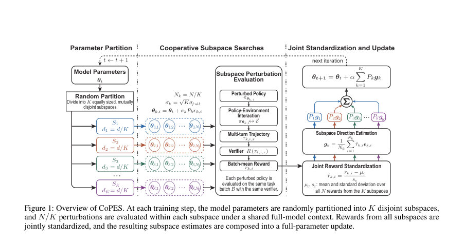
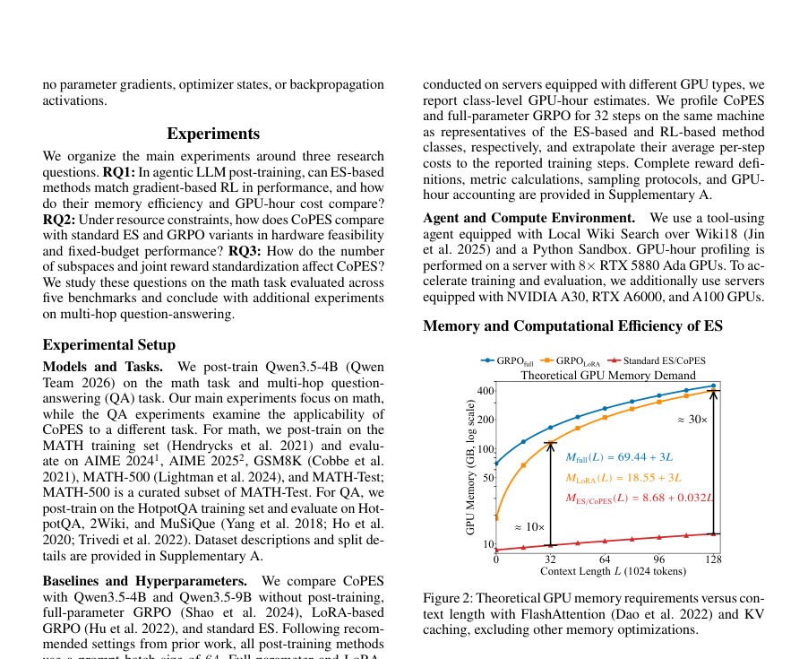
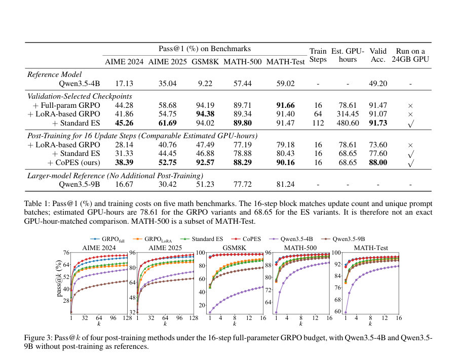

# Cooperative Coevolution for Resource-Constrained Agentic LLM Post-Training

- **arXiv:** [2608.02391v1](http://arxiv.org/abs/2608.02391v1) · [PDF](https://arxiv.org/pdf/2608.02391v1)
- **저자:** Zhiyuan Wang, Shengcai Liu, Jiahao Wu, Ning Lu, Hui Ouyang, Shaofeng Zhang, Haoze Lv, Ke Tang
- **분야:** cs.AI, cs.LG
- **선정 점수:** 12.46
- **선정 이유:** 최근성 0.7, 핵심어: large language model, 핵심어: llm, 핵심어: agent, 핵심어: efficient

### 한 문장 요약

CoPES는 전체 파라미터 공간을 저차원 부분공간으로 분해해 협력적으로 탐색함으로써, 메모리 제약이 있는 환경에서 진화전략(ES)을 이용한 에이전트형 LLM의 후(포스트)학습을 효율화하는 방법이다.

### 해결하려는 문제

도구를 사용하는 LLM 에이전트는 길고 다중 턴의 궤적을 생성해, 경사 기반 포스트-트레이닝에서 큰 메모리를 요구한다. 진화전략(ES)은 역전파 없이 전체 파라미터를 포스트-트레이닝할 수 있어 메모리 측면에서 유리하지만, 필요한 GPU-시간이 많아 GPU 수가 제한된 실제 환경에서는 학습 시간이 지나치게 길어진다.

### 핵심 기여

- Cooperative Parameter-subspace Evolution Strategy(CoPES)라는 협력적 공진화 방법을 제안해 전체 파라미터 공간을 낮은 차원의 부분공간으로 분해하고 이들 부분공간을 협력적으로 탐색하도록 설계함으로써 최적화 효율을 개선함.
- Qwen3.5-4B 도구 사용 에이전트를 수학 과제에 대해 포스트-트레이닝하고, 다섯 개의 난이도별 벤치마크에서 평가하여 CoPES의 성능을 검증함.
- 리소스 제약(제한된 GPU 메모리 및 GPU-시간) 하에서 CoPES가 표준 ES 및 LoRA 기반 GRPO 대비 더 나은 성능-메모리 균형을 보임을 보고함.

### 접근 방법

CoPES는 전체 파라미터 공간을 여러 저차원 부분공간으로 분해한 뒤, 각 부분공간에 대해 진화전략을 적용하고 이들을 협력적으로 결합하여 전체 모델 파라미터를 탐색하는 협력적 공진화(cooperative coevolution) 방식이다. 이렇게 함으로써 전체 파라미터를 한 번에 다루는 풀-파라미터 ES보다 이론상 요구되는 GPU 메모리를 크게 줄이고, 제한된 자원 환경에서 효율적인 탐색을 도모한다. (구체적 분해 방식, 서치 및 결합 알고리즘의 상세 구현은 초록만으로 확인하기 어렵다.)

### 주요 결과

- CoPES는 동일한 GPU-시간 예산(논문에서 '풀-파라미터 GRPO의 최적 검증 체크포인트에 맞춘 GPU-시간 예산') 하에서 GRPO의 검증 정확도 향상치의 92%를 회복함(표준 ES는 67% 회복).
- CoPES의 이론적 GPU 메모리 요구량은 풀-파라미터 GRPO의 1/8 미만이라고 보고됨.
- CoPES는 평가한 다섯 개 벤치마크의 모든 pass@k 지표에서 표준 ES와 LoRA 기반 GRPO보다 일관되게 우수한 성능을 보였음.
- 추가 실험에서 질문-응답(qa) 작업에서도 CoPES의 이점이 관찰되었다고 보고됨.

### 한계

- 초록만으로는 CoPES가 실제 벽시계(실제) 학습 시간(완전한 GPU-시간 대비 절감량 또는 절대 시간), 하이퍼파라미터 민감도, 부분공간 분해 방법의 구체적 설계(예: 분해 기준, 부분공간 수 및 차원) 등 구현 상세를 확인하기 어렵다.
- 제안 방법의 대규모 모델(예: 수십~수백억 매개변수)에 대한 확장성 및 성능 유지 여부는 초록만으로 확인하기 어렵다.
- 성과의 통계적 유의성(예: 실험 반복 횟수, 분산)과 벤치마크의 구체적 목록 및 난이도 구성은 초록만으로 확인하기 어렵다.
- CoPES가 특정 종류의 태스크(예: 대화, 계획, 멀티모달 등)에 대해 일반적으로 잘 동작하는지 또는 특정 작업군에만 유리한지는 초록만으로 확인하기 어렵다.

### 개발자 관점

- 리소스(특히 GPU 메모리)가 제한된 환경에서 에이전트형 LLM을 포스트-트레이닝하려면 전체 파라미터를 한 번에 다루는 방법보다 파라미터를 저차원 부분공간으로 분해해 협력적으로 탐색하는 전략이 실용적일 수 있다.
- CoPES는 역전파가 필요한 방법들과 달리 진화전략 기반으로 전체 파라미터를 업데이트할 수 있어 메모리 절감 이점이 있으며, 논문 기준으로는 풀-파라미터 GRPO 대비 이론적 메모리 요구량이 1/8 미만이다.
- 같은 GPU-시간 예산에서 CoPES가 GRPO의 성능 향상치 대부분(92%)을 재현했다는 점은, 실무에서 GPU 수가 적고 메모리가 제한된 상황에서 ES 계열 방법을 적용할 때 CoPES를 우선적으로 고려할 근거가 된다.
- LoRA 기반 수법과 비교해 일관된 성능 우위를 보였으므로, 파라미터 효율화 기법(LoRA 등)과 CoPES를 함께 실험해 보는 것이 실무적으로 유용할 수 있다(단, 초록만으로 병용 방법의 효과는 확인 불가).
- 구현을 바로 평가하려면 공개된 코드베이스(제공된 GitHub 링크)를 확인하고, 자신의 모델 크기·작업에 맞춰 부분공간 분해 전략과 ES 하이퍼파라미터를 튜닝해야 한다.초록만으로는 기본값·튜닝 범위가 제공되지 않으므로 재현 실험이 필요하다.

<!-- paper-visuals:start -->
## 주요 Figure

> 원문 PDF에서 실제 Figure 캡션과 그림 영역이 함께 확인된 자료만 자동 추출했다.

*Figure · 원문 PDF 4쪽 · Figure 1: Overview of CoPES. At each training step, the model parameters are randomly partitioned into K disjoint subspaces,*

*Figure · 원문 PDF 5쪽 · Figure 2: Theoretical GPU memory requirements versus con-*

*Figure · 원문 PDF 6쪽 · Figure 3: Pass@k of four post-training methods under the 16-step full-parameter GRPO budget, with Qwen3.5-4B and Qwen3.5-*

<!-- paper-visuals:end -->

**근거 범위:** 이 분석은 논문의 제목과 초록에만 기반해 작성되었음. 초록에 포함되지 않은 구현 세부사항, 실험 설정, 통계적 검증 등은 기술하지 않았고, 해당 내용들은 원문과 코드 저장소를 통해 확인해야 함.

---

- **소개 날짜:** 2026-08-05
- [← 2026-08-05 논문 목록으로 돌아가기](../daily/2026-08-05.md)
- [일별 아카이브 보기](../daily/index.md)

