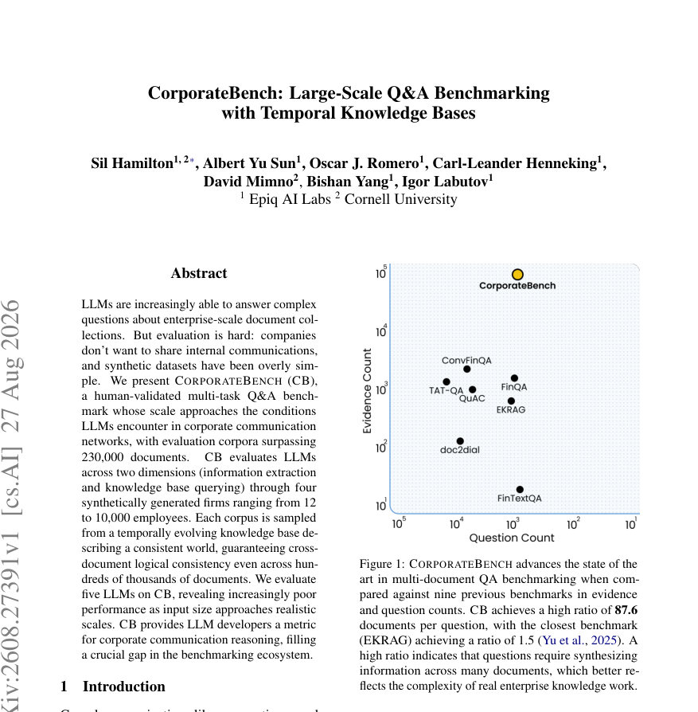
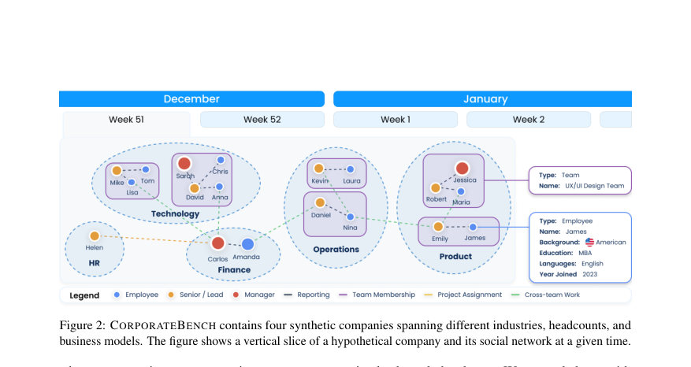
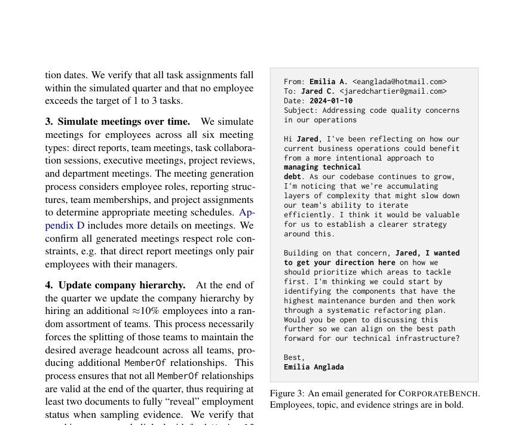

# CorporateBench: Large-Scale Q&A Benchmarking with Temporal Knowledge Bases

- **게시일:** 2026-08-28
- **arXiv:** [2608.27391v1](http://arxiv.org/abs/2608.27391v1) · [PDF](https://arxiv.org/pdf/2608.27391v1)
- **저자:** Sil Hamilton, Albert Yu Sun, Oscar J. Romero, Carl-Leander Henneking, David Mimno, Bishan Yang, Igor Labutov
- **분야:** cs.AI, cs.CL, cs.IR, cs.LG
- **선정 점수:** 4.81
- **선정 이유:** 최근성 1.2, 인용 영향 0.0 (인용 0회), 저자 영향 0.0 (최고 h-index 0), AI 주제 적합성 2.9, 개발자 관심 0.0, 학술 신호 0.8, 오픈 웨이트·주요 연구조직 신호 0.0

[← 2026-08-28 목록으로 돌아가기](../daily/2026-08-28.html)

<!-- paper-visuals:start -->
## 주요 Figure

> 원문 PDF에서 실제 Figure 캡션과 그림 영역이 함께 확인된 자료만 자동 추출했다.

*Figure · 원문 PDF 1쪽 · Figure 1: CORPORATEBENCH advances the state of the*

*Figure · 원문 PDF 3쪽 · Figure 2: CORPORATEBENCH contains four synthetic companies spanning different industries, headcounts, and*

*Figure · 원문 PDF 4쪽 · Figure 3: An email generated for CORPORATEBENCH.*

<!-- paper-visuals:end -->

## 한 문장 요약

기업 환경을 모사한 시계열 지식베이스에서 문서를 합성·샘플링해 기업 규모(최대 232k 문서)에 근접한 대규모 멀티문서 Q&A·추출 벤치마크(CORPORATEBENCH)를 만들고, 여러 LLM에 대해 RAG와 KB 접근에서 정보추출·질의응답 성능을 비교·분석하였다.

## 해결하려는 문제

실제 기업 내부 통신 데이터는 비공개여서 대규모·논리적 일관성을 가진 평가 데이터가 부족하고, 기존 합성 벤치마크는 지나치게 단순하거나 문서 수가 기업 규모를 반영하지 못함. 이에 따라 LLM의 대규모 멀티문서(시계열 포함) 추론·검색 성능을 현실적 조건에서 측정할 수 있는 평가셋이 필요하다.

## 핵심 기여

- 기업용 온톨로지(Turtle/OWL)로 정의된 시계열 지식베이스(KB)를 절차적 생성하여 조직 구조·업무·회의·임무 진행 등을 포함하는 논리적 일관성 보장된 '세계'를 만들고, 이 KB에서 임의 규모의 문서 코퍼스를 샘플링하도록 한 데이터 생성 파이프라인을 제시함.
- 문서 하나하나가 KB의 관계를 '증거 문자열(evidence strings)'로 명시하도록 설계해 수십만 건 이상에서도 문서 간 논리적 일관성을 유지하는 대규모(총 263,466개 문서, 4개 회사: S→XL) 멀티문서 벤치마크 CORPORATEBENCH를 공개함.
- 정보추출(엔티티·관계·시계열 관계 추출, 토픽 분류)과 질의응답(KB QA, Topic QA, Integrated QA)을 포함하는 실무 지향 태스크 집합과 결정론적 정답(ground truth)을 제공해 재현 가능한 평가 체계를 구축함.
- RAG(문서 검색 기반)과 KB(구조화된 쿼리 직접 접근) 두 환경에서 현대 LLM들(Claude Haiku 4.5, Claude Sonnet 4.5, GPT-5 Nano, GPT-5.1, Gemini 2.5 Flash Lite)을 대규모로 평가하고, 코퍼스 규모가 커질수록 성능 저하와 오류 유형(특히 관계·시계열 추출과 RAG의 검색 한계 등)을 분석·보고함.
- 데이터 생성·ETL·평가 파이프라인과 샘플 문서·프롬프트를 공개하여 연구자·개발자가 기업 문서 추론 역량을 측정할 수 있는 기준을 제공함.

## 접근 방법

* 중심 방법은 KB-중심의 합성 파이프라인이다.
* 먼저 Turtle/OWL로 정의한 온톨로지(엔티티: Company, Department, Team, Employee, Project, Task, Meeting; 관계: MemberOf, ReportsTo, WorksOn, WorksAt, Attends, Organize, BelongsTo 등)를 사용해 회사 C = (D, T, E) 형태의 KB를 생성한다.
* KB 생성 절차(본문 기준): (1) 직원 수에 따라 로그 스케일로 부서·팀·임원 수를 생성해 계층 구조 수립, (2) 90일(분기) 시뮬레이션 동안 업무 할당(확률 P=1/45로 직원별 1–3개 업무 완료 목표)·진행일 추적, (3) 6종 회의 유형(직속보고·팀·과제·임원·프로젝트·부서)에 따른 회의 스케줄과 아티팩트(회의록·의제) 생성, (4) 분기 말 약 10% 신규 채용으로 계층 업데이트(팀 분할·관계 종료 표기 등), (5) 회사별 한 문단 스토리와 LLM(Claude Haiku 4.5)을 이용한 엔티티 속성(이름·직함·별칭 등) 부여, (6) 모든 엔티티·속성·관계를 N-Quads로 직렬화하고 OWL으로 검증.
* 문서 생성은 KB의 관계를 실증(evidence strings)하는 방식으로 진행: 관계별로 총 3,217개의 증거 문자열(시간적 단계·난이도별 분류)을 준비하고 해당 문자열을 문서(주로 이메일) 내에 삽입한 뒤 Claude Haiku 4.5에 전달해 나머지 본문을 인필하도록 한다.
* 토픽은 Dirichlet(α=0.75)로 샘플링해 비즈니스/비비즈니스 토픽을 섞고, 직원별 성격(MBTI 16유형)·형식성(격식/비격식) 등을 조합해 어휘 다양성을 높였다.
* 평가 파이프라인: (A) KB 평가(LLM으로 문서에서 엔티티·관계 추출 → 중복 제거 → 정답 KB와 비교해 타입별 F1), (B) 토픽 분류(Biocure: 31클래스, Pound: 17클래스, 매크로 F1), (C) QA(250개 템플릿을 SPARQL로 인스턴스화한 질문 250개/회사/태스크; 답변 타입 string/date/int/bool/set).
* QA는 두 방법으로 평가: RAG(문서 임베딩·벡터 DB 검색, 임베딩 모델 text-embedding-3-small, pgvector/HNSW)과 KB(SQL 툴로 구조화된 DB 직접 질의).
* 점수 평가는 집합형은 F1, 나머지는 정확 매칭(0/1).
* 실험 시 프롬프트·툴콜 제한(예: 툴콜 상한 5), 로그·재시도 정책 등을 적용했다.

## 주요 결과

- 데이터셋 규모: 4개 회사 합계 263,466개 문서(Zenith S: 354, Streamvibe M: 3,926, Biocure L: 26,493, Pound XL: 232,693). 총 엔티티·관계·문서 등은 Table 1에 정리됨(예: Pound 직원 10,210명, 관계 371,905).
- 엔티티·관계 추출(KB Evaluation): 엔티티 추출은 규모에 걸쳐 안정적(매크로 F1 범위 ≈0.715–0.824). 반면 관계 추출은 규모 증가에 따라 성능 저하(작은 회사 대비 큰 회사에서 관계 F1가 하락). 본문 제시 범위: 관계 F1 범위 S:0.419–0.845 → M:0.256–0.676 → L:0.247–0.597 → XL:0.205–0.494. 시계열(temporal) 관계 추출은 더 어려워 S에서 F1 0.142–0.470에서 XL에서 0.062–0.173으로 악화.
- 토픽 분류: Biocure(L)에서 LLM들은 강한 제로샷 성능을 보임(제로샷 F1 0.872–0.950, 50-shot에서 0.877–0.982). 전통적 TF-IDF+LR는 10K 학습 예시로 F1 0.993에 도달(데이터 규모에 민감). Pound(XL)에서는 LLM 제로샷 F1 0.357–0.531에서 50-shot 0.598–0.751로 개선되나, 데이터가 많은 TF-IDF+LR(100K 예시)에는 미치지 못함(F1 0.983).
- QA(RAG vs. KB): 모든 QA 유형에서 KB(구조화 쿼리) 접근이 RAG(검색 기반)보다 우수했으며, 규모가 커질수록 KB와 RAG 사이 격차가 커짐(예: KB QA에서 KB–RAG 차이가 S에서 0.24 → XL에서 0.37로 증가). KB QA·Topic QA는 코퍼스 규모 증가에 따라 성능 저하가 뚜렷했으나 Integrated QA는 대규모에서 약간 개선되는 경향을 보였음(큰 코퍼스가 합성 문맥 제공 가능).
- 모델별 특성: RAG 설정에서 GPT-5 계열이 상대적으로 우수했고, KB 쿼리에서는 Claude Sonnet 4.5가 뛰어남. GPT-5.1은 KB 설정에서 'early stopping' 문제(도구 응답 후 빈 문자열 반환)가 빈발(본문 숫자: 191회 vs RAG 56회)하여 성능 편차에 기여함(로그·에러 분석 포함).

## 한계

- 저자가 명시한 한계: (1) 범위가 이메일 중심으로 한정되어 Slack·문서(스프레드시트·프레젠테이션 등)까지 다루지 않음, (2) 문서 유형이 단순화되어 이메일 외의 기업 문서 형식을 포괄하지 않음, (3) 시뮬레이션 기간을 90일(분기)로 제한해 장기 조직 변화(전략 전환·M&A·수년간 지식 축적 등)를 모델링하지 않음, (4) 데이터 생성에 Claude Haiku 4.5를 사용해 스타일·어휘 편향이나 LLM 산출물 특유의 인공적 아티팩트가 포함될 수 있음(저자: 이는 'lower bound' 난이도로 의도됨), (5) QA 데이터셋 설계상 몇몇 가정(예: 질문에 대한 정답은 SPARQL로 얻음, 미팅 관련 토픽 제외 등)이 있음.
- 본문 실험·분석에서 확인 가능한 제약(근거 기반 관찰): (1) 관계·시계열 추출 성능이 코퍼스 규모 증가에 크게 취약해 실제 기업 데이터에서의 일반화 위험, (2) 인간 검증에서는 샘플링된 1,000 판단 중 모델 의도 관계를 리뷰어가 76.2%만 식별해(노이즈/난도 존재), (3) 평가에 사용한 모델들은 'lighter' 모델군으로 비용·시간 제약 때문에 더 큰(최신·대형) 모델들의 성능은 미반영, (4) KB 방식은 상한 역할을 하나 text-to-SQL·툴 사용 실패 등 KB 통합 자체의 오류(본문: KB 쿼리에서 RAG 대비 에러율 높음)로 실제 적용에서 기대 성능과 괴리가 발생할 수 있음, (5) 문서 생성에 사용한 증거 문자열·템플릿 설계가 특정 패턴을 유도해 탐지·추론 난이도에 영향을 줄 가능성.

## 개발자 관점

- 재현성·데이터 접근: 저자들은 데이터·코드(데이터셋 페이지 주소 명시)를 공개하므로 환경 구성·데이터 로드(ETL→Postgres·pgvector·HNSW) 절차를 따라 벤치마크를 재현 가능. 다만 KB 파일→Postgres 변환·스키마(본문 Appendix E 참조)와 임베딩 생성(문서 자름 22,000 chars) 등 구현 세부는 본문과 부록을 함께 확인해야 함.
- 비용·인프라: 전체 코퍼스(263k 문서)에 대해 RAG·LLM 평가를 돌리려면 임베딩(대량 OpenAI API)·벡터 DB 저장(pgvector/HNSW)·다수의 LLM API 호출이 필요해 상당한 비용 발생. 실험에서는 'lighter' 모델을 선택한 이유도 비용·시간 때문이다.
- 시스템 안정성·툴 통합: KB 기반 접근은 검색 기반보다 성능 우위이나 툴 호출 제한·타임아웃·출력 검증 실패가 잦아(본문: KB에서 RAG보다 4.7× 많은 에러), 프로덕션 통합 시 툴콜 재시도·에러 핸들링·출력 검증 로직이 필수임.
- 프롬프트·컨텍스트 관리: 대규모 KB·문서로 확장할수록 'prompt too long' 오류와 문맥 길이 문제가 빈발(본문: L/XL에서 특히 많음). RAG 파이프라인의 검색·샘플링 설계(검색 k, 문서 길이 트렁케이션, 재랭킹 등)를 신중히 설계해야 하며, 긴 컨텍스트 처리 전략(분할·요약·증분 쿼리)이 필요함.
- 데이터 편향·안전성: 합성 문서가 Claude Haiku 4.5에 의해 생성되었으므로 모델 학습·평가 시 스타일·어휘 편향이 생길 수 있다. 기업 배포 전에는 실제 사람 작성 데이터와의 도메인 편차를 점검하고, 민감 정보·윤리 필터링을 확실히 해야 함(저자: Faker로 이름 다양성 확보, API 필터링 사용).

**근거 범위:** 이 분석은 요청하신 논문 PDF 본문(제공된 페이지 텍스트)을 근거로 작성했습니다. 본문과 표(Table 1, 3, 4, 12, 13 등) 및 부록(appendix)에서 직접 인용·요약했습니다. 일부 구현·실험 세부(예: 부록에만 상세 기재된 프롬프트와 ETL 소스코드)는 본문에 요약되어 있으므로 부록을 함께 확인하면 더 완전한 재현이 가능합니다. 본문에 명시되지 않은 수치·세부사항은 생성하지 않았습니다.
