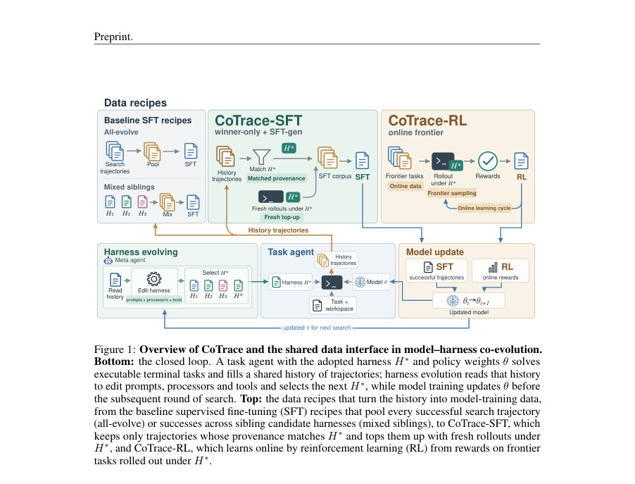
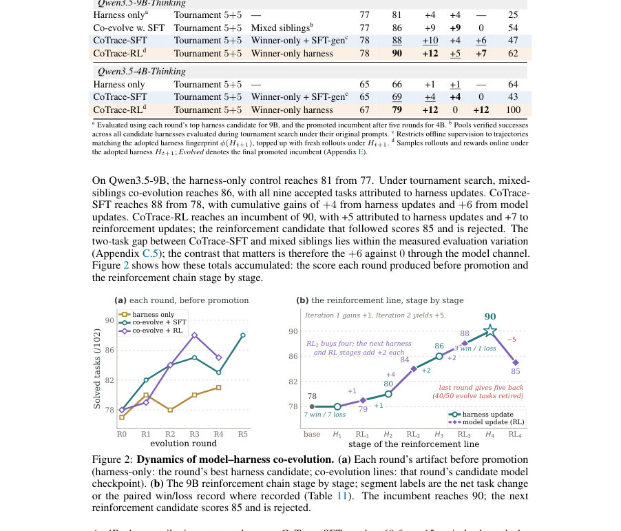
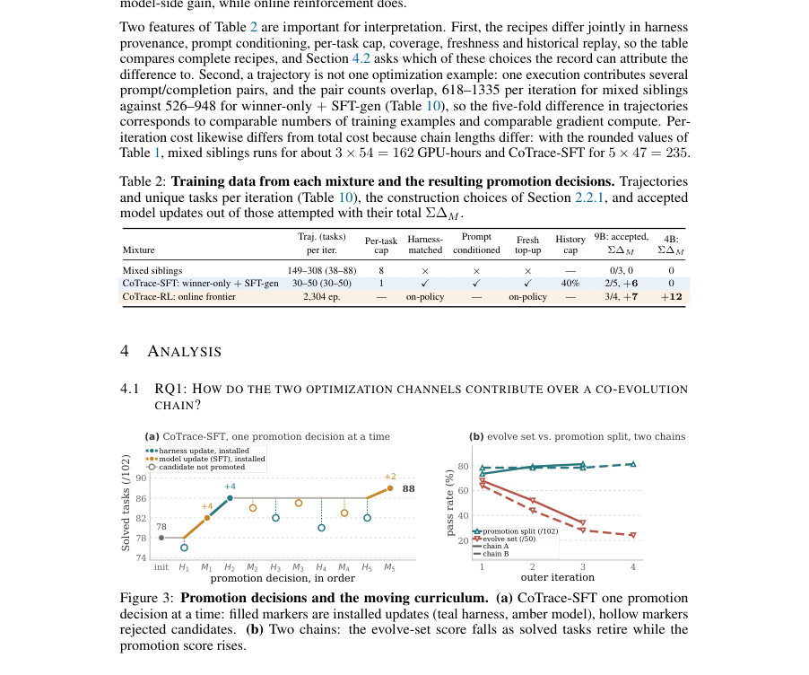

# CoTrace: Data Recipes for Training Terminal Agents with Harness-Model Co-Evolution

- **게시일:** 2026-10-08
- **arXiv:** [2610.10426v1](http://arxiv.org/abs/2610.10426v1) · [PDF](https://arxiv.org/pdf/2610.10426v1)
- **저자:** Jixuan Chen, Jiaxin Zhang, Qinyuan Ye, Yada Pruksachatkun, Haoxiang Zhang, Jingming Zhuo, Yifan Zhang, Yutong Dai, Juntao Tan, Xiangyu Peng, Silvio Savarese, Zeyuan Chen, Lianhui Qin, Chien-Sheng Wu
- **분야:** cs.CL
- **선정 점수:** 5.37
- **선정 이유:** 최근성 1.3, 인용 영향 0.0 (인용 0회), 저자 영향 0.0 (최고 h-index 0), AI 주제 적합성 2.2, 개발자 관심 0.2, 학술 신호 0.5, 오픈 웨이트·주요 연구조직 신호 1.1

[← 2026-10-08 목록으로 돌아가기](../daily/2026-10-08.html)

<!-- paper-visuals:start -->
## 주요 Figure

> 원문 PDF에서 실제 Figure 캡션과 그림 영역이 함께 확인된 자료만 자동 추출했다.

*Figure · 원문 PDF 2쪽 · Figure 1: Overview of CoTrace and the shared data interface in model–harness co-evolution.*

*Figure · 원문 PDF 6쪽 · Figure 2: Dynamics of model–harness co-evolution. (a) Each round’s artifact before promotion*

*Figure · 원문 PDF 7쪽 · Figure 3: Promotion decisions and the moving curriculum. (a) CoTrace-SFT one promotion*

<!-- paper-visuals:end -->

## 한 문장 요약

CoTrace는 터미널 에이전트의 런타임 하니스(harness)와 모델 가중치의 교호 발전(co-evolution)을 위한 하니스 인지형 데이터 레시피로, 실패 증거는 하니스 탐색에, 검증된 런타임-일치 성공 롤아웃만을 모델 학습에 사용하고 커리큘럼 갱신과 구성요소별 승격 규칙으로 안정적 공동 최적화를 달성한다.

## 해결하려는 문제

터미널 에이전트 성능은 모델 파라미터(정책)와 프롬프트·도구 바인딩·오류 복구 등을 담당하는 런타임 하니스(H)에 공동 의존한다. 기존의 하니스–모델 동시개선 접근법은 탐색 과정에서 생성된 실행 궤적을 구분 없이 리플레이 버퍼에 쌓아 모델 학습에 활용하는 경향이 있는데, 이로 인해 어떤 궤적이 어떤 하니스 하에서 생성되었는지(출처·provenance)에 따른 유효성이 무시된다. 그 결과 실패는 하니스 개선에 유용하지만 모방 학습 대상으로는 부적절하고, 성공 궤적은 특정 후보 하니스의 프로세서에 의존할 수 있어 나중에 채택된 런타임과 불일치하는 학습 신호를 줄 수 있다. 본 논문은 교호 진화 과정에서 정책과 하니스 사이에 실행 데이터를 어떻게 라우팅해야 하는지를 묻는다.

## 핵심 기여

- 하니스와 모델 업데이트를 별도 기록·검증하고 궤적 출처(provenance)를 보존하는 검사 가능한(model–harness) 교호진화 프레임워크를 제시함.
- Route, Ratchet, Refresh의 세 메커니즘을 결합한 하니스 인지형 데이터 레시피 CoTrace를 도입하여(1) 반복적 실행 실패를 하니스 합성에 라우팅, (2) 정책 학습은 채택된 런타임과 일치하는 검증된 롤아웃으로 엄격히 조건화, (3) 해결·수확된 과제를 은퇴시키는 커리큘럼 갱신을 수행함.
- 통제된 실험으로, 하니스-일치(harness-matched)로 구성된 소형 코퍼스가(30–50 궤적/iter) 더 큰(149–308 궤적/iter) 형제 하니스 혼합 코퍼스보다 적은 계산량으로 일관된 모델 향상을 가져옴을 보임.
- 교차 하니스 평가를 통해 학습된 역량은 모델 단독이 아니라 모델–하니스 쌍에 의존하며, 학습 시 사용한 런타임과 일치시키지 않으면 절차적 실행 실패로 전이 성능이 저하됨을 실증함.

## 접근 방법

* 프레임워크 개요: 교호진화를 외부 반복(iteration)으로 보고 각 반복에서 하니스 탐색(H-search)과 모델 업데이트(θ-update)를 교대로 수행한다(식 (1)).
* 핵심은 이 둘을 잇는 버전화된 궤적 은행 B0:t와 그 위에서 동작하는 데이터 레시피이다.
* 주요 구성요소
* Route: 궤적 은행을 실패 뷰(DH_t)와 모델 뷰(DM_t)로 분리한다.
* 실패 뷰는 런타임/도구 관련 반복적 오류를 군집화하여 하니스 합성의 근거로 사용하고(Appendix D.5), 모델 뷰는 검증된(well-formed) 성공 궤적을 채택된 런타임 지문 ϕ(H)과 일치시키는 방식으로 SFT 코퍼스를 구성한다(식 (2)).
* 각 궤적에는 프롬프트 템플릿·도구 바인딩·관찰 프로세서 등을 해시한 지문 ϕ(τ)를 기록한다.
* Ratchet: 성능 기여를 구성요소별로 귀속시키기 위해 고정된 프로모션 분할(frozen promotion split V)에서 평가한다.
* 후보 하니스는 θt 고정 상태에서, 후보 정책은 Ht+1 고정 상태에서 평가하며 후보가 채택되려면 새로 해결한(task newly solved) 개수 w가 깨뜨린(broken) 개수 ℓ보다 커야 한다(Promote iff w>ℓ).
* 동률은 평가 실행이 인프라 오류 없이 완전할 때만 허용한다.
* Refresh: 과제를 은퇴시키는 조건은 '해결(solved) AND 수확(harvested: SFT 코퍼스에 포함)'으로 하며 Et(활성 진화 집합)을 도메인 균형 샘플링으로 보충하여 이동하는 학습전선(frontier)을 유지한다.
* 구현 세부
* 하니스 탐색은 HARNESSX 타입 구성 공간을 메타-에이전트가 제안하고 토너먼트(5+5)로 후보를 선별(Algorithm 2).
* 구조적·건전성 스크린과 프로브 검사를 거쳐 후보를 평가한다.
* 정책 학습 대안: (A) SFT: LoRA 저랭크 어댑테이션으로 completion-only 손실을 사용해 검증된 하니스-일치 데모로 파인튜닝(Alg.4).
* 필요 시 fresh top-up rollouts를 생성하여 코퍼스 최소 커버리지 보장.
* (B) RL: DPPO 기반 온라인 보상학습(Alg.5)으로, outcome-only(이진) 보상, 그룹 상대 이점(centered group-relative advantage), 이진 총변동(binary TV) 신뢰영역을 적용.
* 온라인 RL은 하니스가 기초적 역량을 갖춘 뒤에 스케줄된다.
* 데이터 구성 제약: 코퍼스 크기 C, per-task cap cr, 역사 재생 비율(예: history ≤40%), 프롬프트 주입(학습 예시에 채택된 하니스의 system prompt를 삽입).
* 전체 루프는 Algorithm 1으로 정리되어 있으며, 각 단계에서 생성된 궤적은 B에 기록되고 다음 반복에서 라우팅·검색·학습에 사용된다.

## 주요 결과

- 테스트베드: Tmax promotion split V (102 tasks) 사용. 주요 정량 결과는 promotion-split에서의 해결(task solved) 수로 보고됨(단일 평가 잡음 ±≈2 tasks, Appendix C.5).
- Qwen3.5-9B 결과: CoTrace-SFT(토너먼트 5+5, winner-only + SFT-gen) 기준 초기 78 → 최종 88 solved(102-task promotion split), 누적 기여는 ∆H=+4, ∆M=+6. CoTrace-RL(online frontier)는 최고 incumbent 90 solved까지 도달(∆H=+5, ∆M=+7). (Table 1, Figure 2)
- 코퍼스 대비 효과: Mixed siblings(토너먼트 후보로부터 검증된 성공을 풀링) 는 반복당 149–308 궤적을 제공했지만 모델 측면에서 수용된(accepted) 업데이트를 전혀 만들지 못함(Σ∆M=0). 반면 CoTrace-SFT의 winner-only + SFT-gen은 30–50 궤적/iter로 두 번의 수용된 모델 업데이트(Σ∆M=+6)를 달성함(표준반복당 비용: CoTrace-SFT 47 GPU-h/iter vs mixed siblings 54 GPU-h/iter). (Table 2, Table 5)
- 모델 규모 의존성: Qwen3.5-4B에서는 CoTrace-SFT가 65 → 69로 모든 향상이 하니스 채널(∆H=+4)에서 발생했고 모델 업데이트는 거부되었음. 반대로 4B에서 CoTrace-RL(온라인 강화)은 67 → 79로 모델 채널(∆M=+12)이 주된 기여였음(표 1, 섹션 3.2, 4.2).
- 크로스-도메인/런타임 전이: 외부 벤치마크 TB2.1 및 SWE-bench Lite에서 체크포인트 단독 배포(학습 시 사용한 런타임과 불일치) 시 in-loop에서 본 대규모 개선이 상당 부분 사라짐을 확인함. 예: SWE-bench Lite에서 mini-swe-agent(공통 외부 런타임) 기준 해법 비율: base 34.7%, +SFT 24.7%, +RL 36.7%; 동일 체크포인트를 co-evolved 하니스와 함께 배치했을 때: base 37.3%, +SFT 35.0%, +RL 41.0%로 전반적 성능·'no-patch'(패치 미전송) 사례 수가 크게 감소(예: SFT no-patch 155→64). (Figure 5, Table 12)

## 한계

- 저자 명시 한계(본문·Appendix B): 연구는 소수의 교호진화 체인만 단회 실행된 결과에 의존하며(체인 수와 반복 수 제한), 프로모션 분할은 102개 과제로 단일-평가의 변동(대략 ±2 tasks)이 존재함으로 세밀한 순위 해석에 주의가 필요하다.
- 범위 제한: 하나의 모델 계열(Qwen3.5 계열)과 두 규모(9B, 4B)에 대한 실험, 하나의 주요 작업원(Tmax)과 두 외부 벤치마크에 대한 평가로 일반성은 검증 대상 런타임/도메인에 한정된다.
- 방법적 제약: 감독 방식(SFT)과 강화학습(RL) 간에 사용된 계산 예산이 일치하지 않음(따라서 직접적인 효율 비교는 제한적임).
- 재현성 관련: 하니스 제안은 사유(proprietary) 메타-에이전트가 생성하며 논문은 채택된 구성만 공개하므로 전체 탐색 제안의 복제는 제한될 수 있음(본문에서 수용된 구성은 공개 예정).

## 개발자 관점

- 데이터 파이프라인 설계: 각 궤적에 생성 당시의 런타임 지문(프롬프트 템플릿, 도구 바인딩, 프로세서)을 해시·기록(ϕ(τ))해 출처를 보존하라. 학습 데이터는 채택된 런타임 지문과 일치하는 궤적만 사용하라(하니스-일치 원칙).
- 실패 라우팅: 반복적·복구되지 않는 도구/런타임 오류를 군집화하여 하니스 수정(프로세서·프롬프트·도구 인터페이스)을 제안하라(ROUTE). 실패 유형에 따라 모델 학습(모델-view) 또는 하니스 진화(하니스-view)로 분리해 처리해야 함(표 7의 분류 규칙 참조).
- 프로모션 정책 운영: 후보 하니스는 고정된 정책에서, 후보 정책은 채택된 하니스에서 평가하는 구성요소별 프로모션(RATCHET)을 도입해 각 개선 기여를 명확히 귀속시키고 회귀를 차단하라(Promote iff w>ℓ).
- 커리큘럼 관리: 과제를 '해결 AND 수확'한 경우에만 Et에서 은퇴시키고 도메인 균형 샘플링으로 보충해 이동전선을 유지하라(REFRESH). 이는 학습 가능 경계(frontier)에 집중시키는 데 중요함.
- 데이터 양보다 적합성 우선: 대규모의 혼합된 궤적 풀링은 반드시 모델 향상으로 이어지지 않음. 특히 탐색 단계에서 많은 후보 하니스가 생성·거부될 경우 '형제(homologous) 하니스 풀'의 데이터는 오히려 오분포화될 수 있음. 소형의 런타임-일치 코퍼스와 필요시 fresh on-policy top-up이 더 비용 효율적임(예: CoTrace-SFT 47 GPU-h/iter).  이와 병행해, 성공 궤적이 희박할 때는 on-policy RL이 유의미한 신호를 제공할 수 있음(4B 사례).  

운영상/재현성 권장사항: 프로모션 분할(V), 난수 시드, 채택된 하니스 구성과 수확된 코퍼스의 메타데이터(지문)를 저장·공개해 체인 재현을 용이하게 하라. 또한 하니스 편집 전후의 회귀·프로브 검사를 자동화해 불필요한 과적합을 막아라.

안전·디버깅: 환경/그레이더 오류와 데이터-경로 결함(예: 리셋 시 인스턴스 렌더링 누락)이 보상·학습 신호를 '제로'로 만들 수 있으므로 (a) 실패 라우팅에서 환경·그레이더 오류를 분리하고, (b) 워크플로우 전반의 건전성(예: dry-fire, replay, 계약 검증)을 엄격히 검사하라(Appendix D.4,D.5).

**근거 범위:** 이 분석은 제출된 논문 PDF 본문(주요 본문과 부록 포함)의 텍스트를 근거로 작성되었다. 정량 수치, 표와 그림의 값, 알고리즘·절차 및 저자가 명시한 한계는 본문에서 직접 인용하였다. 다만 논문에 기술된 일부 구현세부(예: 메타-에이전트 내부 동작의 전체 로그, 비공개 제안 목록)는 본문에 전부 공개되어 있지 않아 그 내부 동작에 대해서는 문서화된 대로만 기술했음을 밝힌다.
