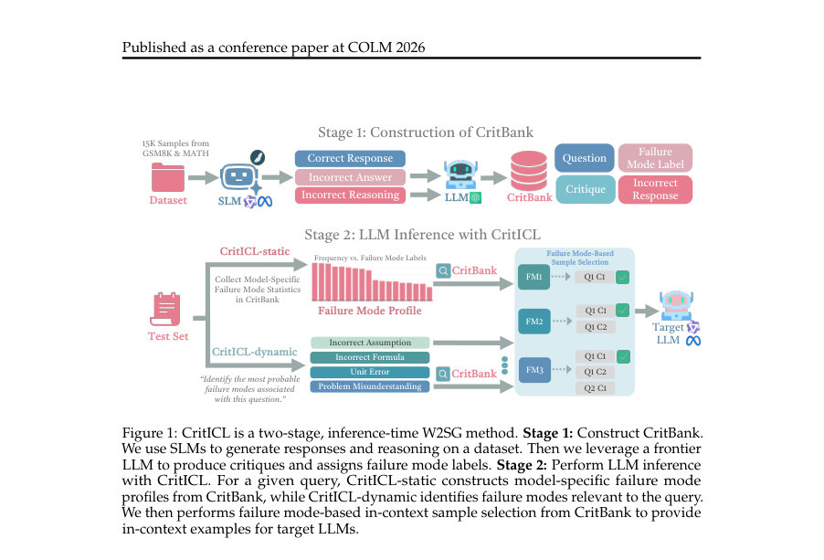
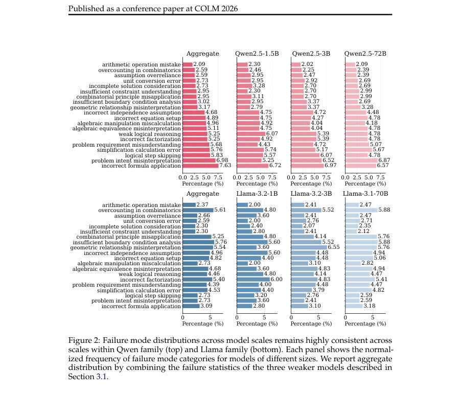

# CritICL: Inference-Time Weak-to-Strong Generalization from Small Language Model Failure Modes

- **게시일:** 2026-08-28
- **arXiv:** [2608.27455v1](http://arxiv.org/abs/2608.27455v1) · [PDF](https://arxiv.org/pdf/2608.27455v1)
- **저자:** Yufan Wu, Yinghui He, Zhengyi Hu, Lang Wei, Ruichen Li, Qifan Yang, Ting Zhu
- **분야:** cs.CL
- **선정 점수:** 4.98
- **선정 이유:** 최근성 1.2, 인용 영향 0.0 (인용 0회), 저자 영향 0.0 (최고 h-index 0), AI 주제 적합성 3.0, 개발자 관심 0.5, 학술 신호 0.3, 오픈 웨이트·주요 연구조직 신호 0.0

[← 2026-08-28 목록으로 돌아가기](../daily/2026-08-28.html)

<!-- paper-visuals:start -->
## 주요 Figure

> 원문 PDF에서 실제 Figure 캡션과 그림 영역이 함께 확인된 자료만 자동 추출했다.

*Figure · 원문 PDF 2쪽 · Figure 1: CritICL is a two-stage, inference-time W2SG method. Stage 1: Construct CritBank.*

*Figure · 원문 PDF 8쪽 · Figure 2: Failure mode distributions across model scales remains highly consistent across*

<!-- paper-visuals:end -->

## 한 문장 요약

작은 모델의 체계적 실패 모드를 오프라인으로 수집한 CritBank의 비판(critique) 예시를 인-컨텍스트로 재사용하여, 동적/정적 검색 전략으로 강한 모델의 추론 성능을 비용 효율적으로 향상시키는 CritICL 프레임워크를 제안한다.

## 해결하려는 문제

기존의 추론 시 스케일링 방법들은 반복 생성(self-consistency 등)이나 외부 검증(LLM-as-judge)처럼 다수의 생성 또는 보조 모델 호출을 요구해 추론 비용이 크다. 또한 약한 모델을 온라인으로 보조 지도로 사용하는 기존 W2S(weak-to-strong) 접근은 입력마다 약한 모델을 호출해야 하며 약한 모델의 직접 출력 품질에 의존한다. 본 연구는 동일 계열 내에서 약·강 모델이 공유하는 체계적 실패 모드를 활용해, 추가적인 반복 생성 없이(또는 최소한으로) 강한 모델의 추론을 개선할 수 있는지 묻는다.

## 핵심 기여

- 약한 모델의 잘못된 추론과 이에 대한 자연어 비판을 구조화해 저장한 대규모 데이터셋 CritBank를 제안하고 구성 절차(5회 CoT 생성, frontier LLM을 통한 실패 모드 라벨링 및 비판 생성, 레이블 클러스터링)를 제시했다.
- 입력마다 실패 모드를 예측해 관련 비판을 검색하는 CritICL-dynamic과, 모델 계열의 전역 실패 모드 프로필을 이용해 안정적 비판을 검색하는 CritICL-static이라는 두 가지 추론-시점(생성 시) 약→강 일반화(W2SG) 방식을 제안했다.
- 실험적으로 Qwen 및 LLaMA 계열(여러 약모델로 구성한 CritBank → 32B/72B/Qwen·LLaMA 대형 모델)에 대해 GSM8K, MATH, AMC23, AIME24/25, GPQA 등에서 표준 ICL 및 여러 테스트-타임 스케일링(Consistency@k, Self-Reflection, LLM-as-Judge)과 비교해 일관된 성능 향상과 낮은 추론 비용을 보였음을 보고했다.
- 실패 모드 분포가 동일 계열 내에서 고도로 일관됨을 정량적으로 증명(Spearman 상관: Qwen aggregate→72B 0.91, Llama aggregate→70B 0.88 등)하고, 실패 모드 기반 예시 선택이 의미 있는 성능 기여를 함을 다양한 소거(ablation) 실험으로 확인했다.

## 접근 방법

* 방법은 두 단계로 구성된다.
* (1) CritBank 구성: 수집 질문 집합(Q; GSM8K+MATH 훈련 샘플 합산 15K)에 대해 같은 계열의 작은 모델들(예: Qwen2.5-1.5B/3B/7B 등)을 chain-of-thought(CoT) 프롬프트로 각각 5회 생성하여 잘못된 응답들을 모은다.
* 각 잘못된 (q,r)에 대해 frontier LLM(gpt-4o-mini)을 이용해 최대 5개의 실패 모드 후보 라벨과 자연어 비판(critiques)을 생성하고, 후보 라벨들을 Didolkar et al.(2024) 방식의 클러스터링으로 정제해 대표 실패 모드를 할당한다.
* (2) CritICL 추론: 두 변형이 있다.
* CritICL-dynamic은 타겟 모델에 입력 q'를 주고 최대 5개의 예상 실패 모드를 예측하게 한 뒤, 실패 모드 기반 샘플 선택 알고리즘(Algorithm 1)을 통해 CritBank에서 실패 모드와 겹치는 (질문, 잘못된 응답, 비판) 예시를 최대 K개(실험 기본 K=5) 선택해 프롬프트에 포함하고 한 번 더 타겟 모델을 실행해 최종 답을 얻는다(따라서 세대 수 2회).
* CritICL-static은 계열별로 오프라인 집계한 실패 모드 분포 P_M(l)에서 상위 T 실패 모드를 고정해(프로필 S_prof) Algorithm 1로 예시를 선택하고, 이를 프롬프트에 넣어 타겟 모델을 한 번만 실행한다.
* 실패 모드 기반 샘플 선택은 L(q,r)∩S의 크기(또는 가중치 합)를 점수로 하여 중복을 줄이고 다양한 실패 모드를 커버하도록 그리디로 상위 K개를 선택한다.
* 프롬프트 템플릿(비판 생성, 실패 모드 예측, 최종 답 프롬프트)은 논문 부록에 제공된다.

## 주요 결과

- Qwen 계열: Qwen2.5-32B-Instruct에서 CritICL-static이 전체 기준 Pass@1 49.8%로 Consistency@7(49.5%)를 소폭 상회했고, CritICL-dynamic도 49.1%로 경쟁력 있었다(Table 1a). Qwen2.5-72B-Instruct에서는 CritICL-static이 59.2%로 Consistency@5(59.0%)를 제치며 최고 성능을 기록했고, CritICL-dynamic은 58.7%로 안정적 향상을 보였다(Table 1b).
- 추론 비용: MATH에서 Qwen2.5-32B 기준으로 CritICL-static은 세대 1회, 평균 총 토큰 3768; CritICL-dynamic은 세대 2회, 총 토큰 3897이었다. 반면 Consistency@5 등은 세대 5회로 총 토큰 4814 이상을 사용해(표 참조) CritICL이 토큰·세대 비용에서 유리했다(Table 2).
- 실패 모드 분포 일관성: 약모델 집계 프로필이 강모델의 실패 분포와 높은 유사도를 보였다(Spearman: Qwen aggregate→72B 0.91, Llama aggregate→70B 0.88; Top-10 overlap 9/10 등)(Table 4).
- 어노테이션 신뢰성: CritBank 구성에 사용된 GPT-4o-mini의 실패 모드 라벨은 GPT-4.1/Claude-3.5-Sonnet과의 비교에서 F1 0.84/0.81, Cohen’s κ 0.77/0.73을 보였고(300 샘플), 인간 라벨과 비교한 F1 0.82, κ 0.74로 합의도가 양호했다(Table 5).
- 선택 메커니즘 유효성: 실패 모드 기반 선택은 랜덤·고정·의미론적 유사성 기반 선택보다 우수했고(예: Qwen2.5-72B에서 GSM8K 정확도 93.6% 등, Table 3), 소거 실험에서도 실패 모드 정렬이 핵심 기여임을 확인했다(Table 7).

## 한계

- 저자가 밝힌 한계: CritBank 구성에는 오프라인 수집 및 실패 모드 어노테이션의 초기 비용이 필요하며(그러나 재사용 가능), 같은 모델 계열 내 전이(same-family)가 주요 전제라는 점이다(교차 계열 전이는 가능하지만 효력이 떨어짐, Table 10).
- 실험·통계적 제약: AIME 계열처럼 평가 집합이 작은 OOD 데이터셋에서는 성능 차이가 통계적으로 유의하지 않은 경우가 있고(Table 9), GSM8K 개선은 유의수준 p<0.05에 도달하지 않았다(p=0.083).
- 실험 범위에서 드러나는 제약(분석적): 실패 모드 전이는 동일 계열·유사 태스크에 강하게 의존하며(교차 계열 Spearman 0.43–0.46로 낮음), 과도하게 세분화된 실패 모드 분류는 검색 풀을 희박하게 만들어 성능을 저하시킬 수 있음(세분화 수준 트레이드오프, Table 6).
- 자동 라벨링 한계: 실패 모드와 비판 대부분을 frontier LLM으로 생성했으나(기본 gpt-4o-mini), 자동 어노테이션에는 노이즈가 존재할 수 있으며 완전한 기계적 원인 규명을 제공하지 않는다(저자도 인과적 연결은 추후 연구로 제시).

## 개발자 관점

- 재현·구성: CritBank 구성 절차가 본문과 부록에 상세히 제시되어 있어 재현 가능하다(작은 모델로 5회 CoT 생성 → gpt-4o-mini로 실패 모드 라벨/비판 생성 → 라벨 클러스터링). 프롬프트 템플릿과 샘플 선택 알고리즘(Algorithm 1)도 공개되어 있다(Appendix G).
- 오프라인 비용·재사용성: CritBank는 초기 오프라인 수집·주석 비용이 들지만 한 번 구축하면 동일 계열의 다수 쿼리에 재사용 가능하므로 빈번한 서비스성 쿼리에 적합하다(대규모 배포에서 비용 상쇄 가능).
- 실행 비용/성능 균형: CritICL-static은 타겟 모델 한 번 호출만으로 개선을 제공해 실시간 서비스에 유리하며, CritICL-dynamic은 입력별 실패 모드 예측 단계를 추가해 총 두 번의 생성이 필요하나 여전히 다회 생성 기반 방법들보다 토큰 비용이 적다(Tables 2,13–15).
- 구현 포인트: 실패 모드 기반 샘플 선택은 L(q,r)∩S의 겹침 크기(또는 가중치)로 점수화하고 중복 실패 모드 커버리지를 우선해 탐욕적으로 선택한다(Algorithm 1). 실패 모드 분포 집계, 프로필 상위 T 선택, 그리고 K 예시 예산은 하이퍼파라미터로 조정 가능하다.
- 안전성·품질 관리: CritBank 어노테이션은 자동화되지만 논문은 GPT와 사람 라벨 간의 합의를 제시해 신뢰성을 보였으나, 실제 배포시에는 비판이 잘못된 지침을 줄 수 있으므로 인간 검토 또는 보수적 필터링 절차를 권장한다.

**근거 범위:** 이 분석은 제공된 논문 PDF 본문(본문, 표, 부록 발췌)을 근거로 작성되었다. 제시된 수치, 표값, 알고리즘 및 프롬프트는 PDF에 명시된 내용을 그대로 인용했다. 다만 구현 세부사항(예: K/T의 정확한 기본값 일부, 내부 파이프라인의 최종 미세튜닝 등)이나 외부 코드·환경(저자가 공개한 코드의 최신 변경사항)은 PDF 본문만으로는 검증할 수 없어 언급을 자제했다.
