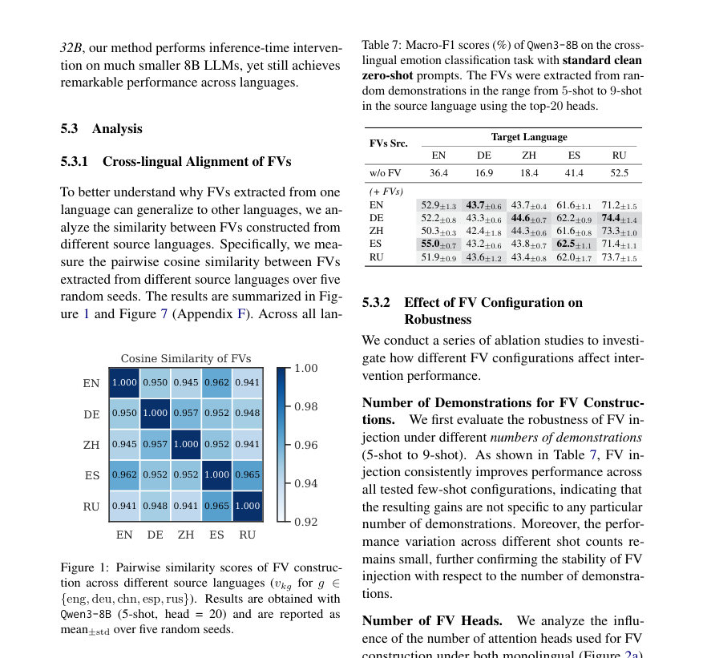
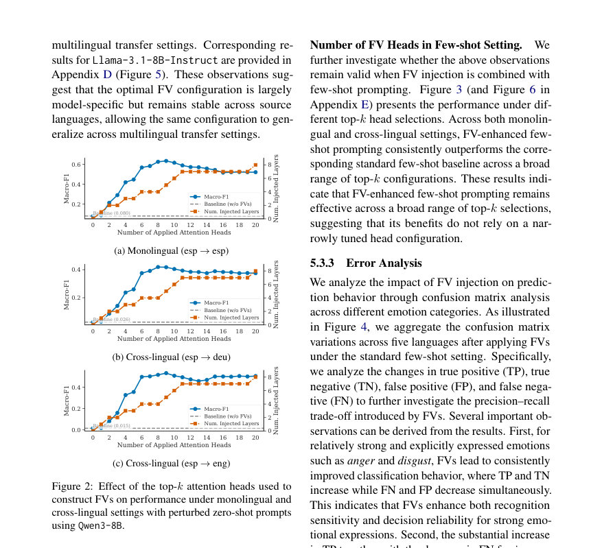
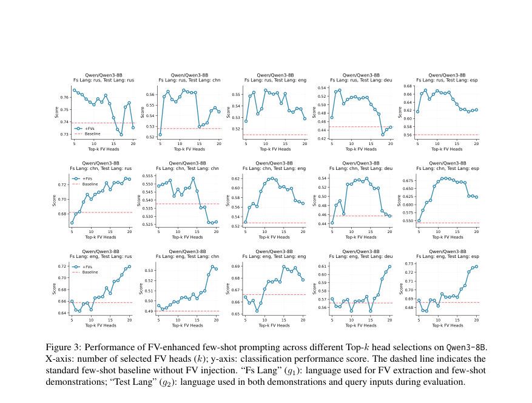

# Cross-lingual Functional Vectors for Emotion Detection in Large Language Models

- **게시일:** 2026-09-01
- **arXiv:** [2608.29613v1](http://arxiv.org/abs/2608.29613v1) · [PDF](https://arxiv.org/pdf/2608.29613v1)
- **저자:** Jieying Xue, Phuong Minh Nguyen, Minh Le Nguyen, Shogo Okada
- **분야:** cs.CL, cs.LG
- **선정 점수:** 4.46
- **선정 이유:** 최근성 0.6, 인용 영향 0.0 (인용 0회), 저자 영향 0.0 (최고 h-index 0), AI 주제 적합성 2.8, 개발자 관심 0.5, 학술 신호 0.6, 오픈 웨이트·주요 연구조직 신호 0.0

[← 2026-09-01 목록으로 돌아가기](../daily/2026-09-01.html)

<!-- paper-visuals:start -->
## 주요 Figure

> 원문 PDF에서 실제 Figure 캡션과 그림 영역이 함께 확인된 자료만 자동 추출했다.

*Figure · 원문 PDF 7쪽 · Figure 1: Pairwise similarity scores of FV construc-*

*Figure · 원문 PDF 8쪽 · Figure 2: Effect of the top-k attention heads used to*

*Figure · 원문 PDF 9쪽 · Figure 3: Performance of FV-enhanced few-shot prompting across different Top-k head selections on Qwen3-8B.*

<!-- paper-visuals:end -->

## 한 문장 요약

다국어 멀티라벨 감정 분류에서 함수 벡터(Function Vectors, FVs)를 추출·주입해 소스 언어에서 얻은 잠재적 작업 방향이 타깃 언어로 전이되어 제로샷 및 few-shot 조건에서 LLM의 감정 탐지 성능을 향상시키는지 실험적으로 분석했다.

## 해결하려는 문제

기존 연구는 함수 벡터(FVs)가 단순 분류·검색·사실 유도와 같은 구조화된 ICL 상황에서 모델 행동을 복원할 수 있음을 보였지만, (1) 문맥적 추론과 의미적 복잡성이 높은 작업(예: 멀티라벨 감정 인식)에서 FVs가 유효한지, (2) 소스 언어로부터 추출한 FVs가 대상 언어로 일반화(크로스-링궐 전이)되는지 여부는 충분히 검증되지 않았다. 또한 기존 연구는 주로 단일 언어·구조적 태스크에 집중되어 FVs의 다국어·의미적 과제 적용 가능성에 대한 질문이 남아있다.

## 핵심 기여

- 의미적으로 복잡한 다국어 멀티라벨 감정 인식 벤치마크로 FVs의 효과를 확장하여 FVs가 단순 패턴 매칭을 넘는 문맥적 의미 추론을 보조함을 보였다.
- 여러 계층에 걸쳐 FVs를 분산 주입하는 방식이 단일 계층 주입보다 복잡한 의미적 작업에서 성능이 크게 향상됨을 체계적으로 분석하고 실무적 적용 전략을 제시했다.
- 크로스-링궐(언어 간) FV 전이를 처음으로 체계적으로 연구하여, 소스 언어에서 추출한 FVs가 타깃 언어의 제로샷(정상·교란 프롬프트 모두) 및 few-shot 환경에서 작업 동작을 유도함을 실험적으로 입증했다.
- 각 LLM마다 FV 구성(선택할 attention head 수 및 주입 계층)에 대해 비교적 안정적인 최적 범위가 존재하며 이 패턴이 언어 간에 일관됨을 관찰했다.
- FVs가 표준 few-shot ICL의 작업 유도 효과를 부분적으로 재현하여, 추론 시 추가 데모를 처리하는 계산 비용 없이 다국어 적응을 경량화할 수 있음을 보였다.

## 접근 방법

* 문제 설정은 각 언어 g에 대해 문장-레이블 쌍 Dg를 사용한 다국어 멀티라벨 감정 분류이다.
* FV 추출은 Todd et al.(2024)의 방식(활성화 패칭을 이용한 인과적 간접효과(AIE) 계산)을 따른다.
* 단계는 다음과 같다: (1) clean(정보적) 프롬프트 p와 레이블을 임의로 섞은 corrupted 프롬프트 ˜p를 준비하고, 각 attention head a_{ℓj}의 평균 활성화 ¯a_{ℓj}를 clean 프롬프트에서 계산한다(식 4,6).
* (2) corrupted 프롬프트에서 해당 head를 ¯a_{ℓj}로 패치했을 때 모델의 출력 복구 정도로 AIE_{ℓj}를 계산하여 top-k AIE를 가진 attention head 집합 A를 선택한다(식 5).
* A는 FV용 head 집합으로 사용된다.
* (3) 선택된 head들의 평균 활성화들을 합산하여 다국어 감정 검출용 FV v_{k,g}를 구성한다(식 7).
* (4) FV 주입은 잔차 스트림에 v_{k,g}를 더하는 방식으로 이루어진다(h_ℓ = h_{ℓ-1} + m_ℓ + a_ℓ + v_{k,g}, 식 8).
* 주입 계층 ℓ은 AIE 기반으로 결정하며, 단일 계층보다 여러 계층에 걸쳐 주입하는 구성이 더 효과적임을 확인했다.
* 평가 설정은 (A) 제로샷(clean / perturbed)과 (B) few-shot(5-shot 등)이며, FV는 데모를 제공하지 않는 제로샷 추론 시에도 주입되어 성능을 비교한다.
* 사용한 모델은 Qwen3-8B 및 Llama-3.1-8B-Instruct이며, 데이터는 SemEval Task 11(28개 언어 중 EN, DE, ZH, ES, RU 5개 사용).
* 실험은 기본적으로 5개의 랜덤 시드로 반복했고 평균±표준편차를 보고했다.

## 주요 결과

- 데이터셋: SemEval Task 11의 문장급 다국어 감정 데이터에서 EN, DE, ZH, ES, RU 5개 언어 사용(각 언어의 train/dev/test 수치는 본문 Table 1에 명시).
- 제로샷(정상 프롬프트): Qwen3-8B 기준 베이스라인(w/o FV) macro-F1은 EN 36.4, DE 16.9, ZH 18.4, ES 41.4, RU 52.5였다(표 2). Top-k(|A|=20)로 추출한 FVs를 주입하면 예를 들어 EN→EN FV 주입 시 EN 53.7±1.4, DE→EN FV 주입 시 EN 50.5±0.8 등 전체 언어에서 일관된 성능 향상을 보였다(표 2).
- 제로샷(교란 프롬프트): 교란 프롬프트에서 베이스라인은 매우 낮았음(예: EN 0.6, DE 0.5, ZH 0.0, ES 8.0, RU 1.8). FV 주입 후 Qwen3-8B에서 EN은 48.6±1.7(EN FV), ZH는 42.7±0.9(RU FV), 타 언어로부터의 크로스-링궐 FV도 유의한 개선을 보였다(표 3).
- Few-shot: 표준 5-shot baseline(w/o FV) 대비 FV 주입은 monolingual 및 cross-lingual 설정에서 꾸준히 향상을 보였다(표 5,6). 예: 5-shot EN baseline 66.6 → EN FV 주입 일부 설정에서 67.6±0.3 등 소폭 향상. 일부 cross-lingual FV 조합은 해당 언어의 5-shot baseline을 능가하기도 함(본문 예시). 다만 SemEval 상위팀(PAI, JNLP)이 대형 파인튜닝·앙상블(예: Qwen32B 기반)을 이용해 더 높은 점수를 보고(예: PAI EN 82.3 등) 본 연구는 8B급 LLM에 추론 시점 개입만으로 경쟁력 있는 성능을 보임(표 5).
- FV 구성·안정성: Qwen3-8B의 FV 코사인 유사도는 소스 언어별로 매우 높음(0.94–0.96), Llama 계열은 0.85–0.93 범위로 보고되어 서로 유사한 방향을 차지함(Fig.1,7). Qwen에서 top-k head 수를 늘리면 성능이 개선되다가 약 6개 이후로 성능 향상이 둔화됨을 관찰했고(본문), 여러 계층에 걸쳐 주입할 때 단일·이중 계층보다 성능이 크게 향상됨을 확인했다(Fig.2). 또한 FV 구성은 5~9-shot으로 구성해도 안정적이며(Table 7), few-shot과 결합한 경우에도 다양한 top-k 범위에서 일관되게 baseline을 상회했다(Fig.3). 표준편차는 논문에서 5시드 평균±표준편차로 보고됨.

## 한계

- 저자가 직접 밝힌 한계: 본 연구는 주로 작업 수준의 크로스-링궐 전이(태스크 지향)를 평가했으며, 다중 레이블 예측에서 공존하는 레이블 간 상관관계(label dependency)를 어떻게 캡처하는지는 명시적으로 조사하지 않았다(논문 Limitations).
- 저자가 직접 밝힌 한계: 본 연구 결과가 다른 유형의 다국어 추론·생성 작업(예: 기계번역)으로 일반화되는지는 불확실하며, 특히 긴 시퀀스 생성에서는 FV의 과도한 주입이 잠재적으로 생성 품질을 저하시킬 위험이 있음을 저자도 지적했다.
- 실험적 제약(본문에서 합리적으로 확인되는 한계): 평가 대상 언어는 SemEval에서 선택한 5개(EN, DE, ZH, ES, RU)로 제한되며, 모델은 두 개의 공개 8B LLM(Qwen3-8B, Llama-3.1-8B-Instruct)으로만 실험되어 더 큰 모델 계층이나 다른 모델군에서의 거동은 추가 검증이 필요하다.
- 방법론적 제약: FV 헤드 선택(AIE 계산)은 Concept_V_Object_5와 같은 추출적 태스크에서 계산되었고(본문 명시), 이로 인해 헤드 선택이 특정 추출적 태스크 설정에 의존할 가능성이 있어 완전한 일반성은 추가 실험으로 확인해야 한다.

## 개발자 관점

- 재현성: 구현에 필요한 핵심 요소는 모델 내부의 활성화 추출·패칭 기능(activation patching), AIE 기반 head 중요도 계산, 선택된 head의 평균 활성화로 FV를 구성한 뒤 잔차 스트림에 더하는 주입 메커니즘이다. 논문은 코드 저장소(https://github.com/yingjie7/cross_lingual_fvs)를 제공하므로 이를 기반으로 재현 가능하다.
- 구현·운영 비용: FV 주입은 추론 시 데모 여러 개를 모델에 입력해 처리하는 비용을 피할 수 있어 대규모 배포에서 계산 비용과 지연을 절감할 수 있다. 본 연구는 8B급 모델에서 실험했으므로 대형(수십B) 모델 대비 저비용으로 적용 가능하다.
- 하이퍼파라미터: 모델마다 최적 top-k head 수와 주입 계층 분포가 다르므로(논문: Qwen의 경우 약 6개 이후로 성능 둔화, 실험에선 |A|=20 등의 값도 사용), 모델별로 head 수와 주입 계층을 탐색한 뒤 고정 설정을 여러 언어로 재사용하는 전략이 권장된다.
- 안전성·품질 모니터링: 감정 분류에서 FVs는 특정 감정(예: anger, disgust)에 대해 TP·TN을 모두 증가시키는 등 민감도를 높였지만 joy 등에서는 과대예측이 일부 증가하는 현상이 있으므로(오류 분석), 배포 시 감정별 오차 유형을 모니터링하고 임계값·후처리 규칙을 적용해야 한다.
- 제한적 적용 권고: 생성 작업(특히 긴 출력)은 FV의 전체-시간적(over-steering) 주입으로 잠재적 품질 저하가 발생할 수 있으므로, 생성 태스크에는 추가 실험과 안전장치(주입 위치·강도 제어)가 필요하다.

**근거 범위:** 본 분석은 제공된 논문 PDF 본문(본문, 표, 그림, 부록 포함)을 기반으로 작성되었다. 실험 수치(표 1–7, 11–12, 그림 1–7)와 방법·제한 사항은 PDF에 명시된 내용을 직접 인용·요약하였다. 코드·추가 파라미터(예: 일부 내부 구현 세부, 정확한 AIE 계산 파라미터 등) 등은 PDF에 충분히 상세히 기술되지 않은 경우가 있어 해당 부분은 논문 서술에 근거해 기술했음을 밝힌다.
