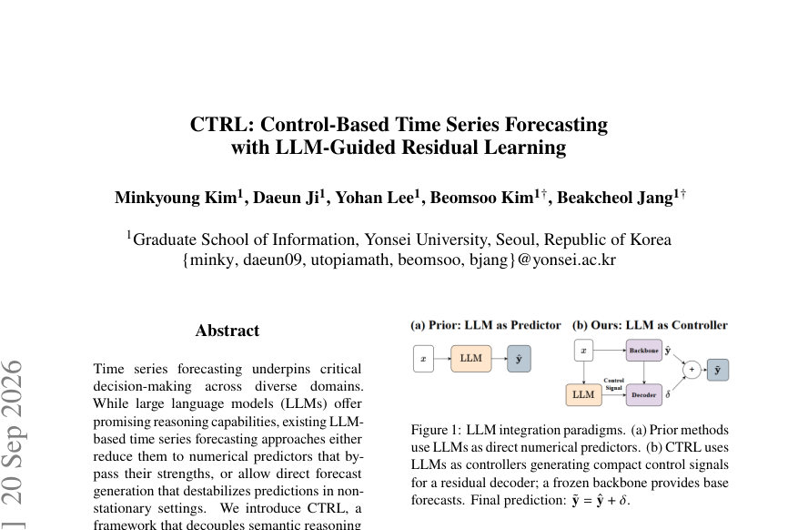
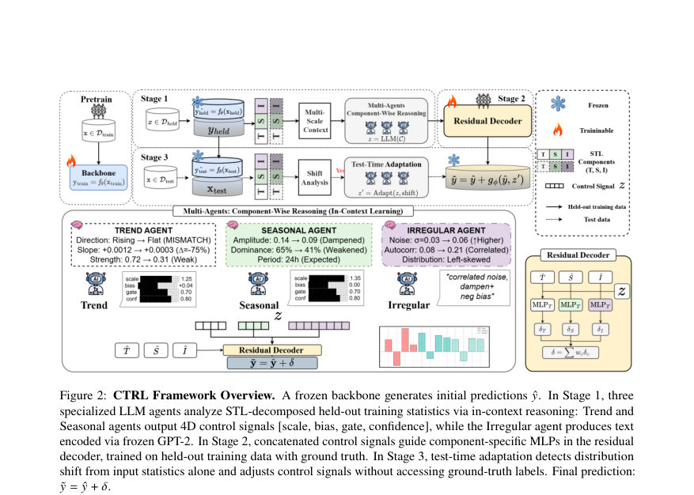
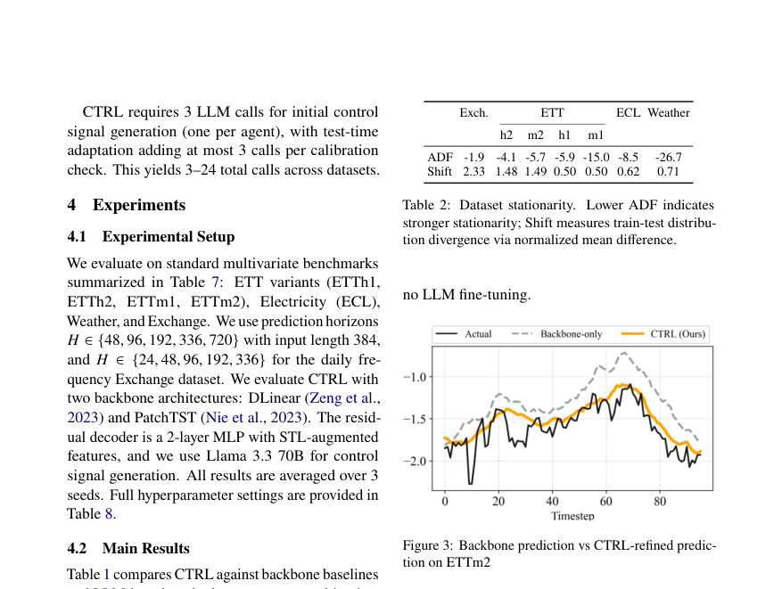

# CTRL: Control-Based Time Series Forecasting with LLM-Guided Residual Learning

- **게시일:** 2026-09-22
- **arXiv:** [2609.23257v1](http://arxiv.org/abs/2609.23257v1) · [PDF](https://arxiv.org/pdf/2609.23257v1)
- **저자:** Minkyoung Kim, Daeun Ji, Yohan Lee, Beomsoo Kim, Beakcheol Jang
- **분야:** cs.LG, cs.CL
- **선정 점수:** 4.09
- **선정 이유:** 최근성 0.5, 인용 영향 0.0 (인용 0회), 저자 영향 0.0 (최고 h-index 0), AI 주제 적합성 3.0, 개발자 관심 0.2, 학술 신호 0.3, 오픈 웨이트·주요 연구조직 신호 0.0

[← 2026-09-22 목록으로 돌아가기](../daily/2026-09-22.html)

<!-- paper-visuals:start -->
## 주요 Figure

> 원문 PDF에서 실제 Figure 캡션과 그림 영역이 함께 확인된 자료만 자동 추출했다.

*Figure · 원문 PDF 1쪽 · Figure 1: LLM integration paradigms. (a) Prior methods*

*Figure · 원문 PDF 4쪽 · Figure 2: CTRL Framework Overview. A frozen backbone generates initial predictions ˆ𝑦. In Stage 1, three*

*Figure · 원문 PDF 7쪽 · Figure 3: Backbone prediction vs CTRL-refined predic-*

<!-- paper-visuals:end -->

## 한 문장 요약

CTRL는 고정된 예측 백본에서 나오는 베이스 예측을 STL로 분해한 시계열 특성 기반으로 LLM 에이전트가 해석적 제어 신호를 생성하고, 소형 잔차 디코더가 이를 수치적 보정으로 변환해 비정상성(분포변화)에서의 견고한 시계열 예측을 달성하는 프레임워크이다.

## 해결하려는 문제

기존 LLM 기반 시계열 예측 방법은 (1) 수치 예측기로 LLM을 환원시켜 비교·추론 능력을 제대로 활용하지 못하거나, (2) LLM이 직접 수치 출력을 생성해 비정상(non-stationary) 상황에서 백본의 예측 안정성을 해칠 수 있다는 한계를 가진다. 본 논문은 LLM의 의미적·비교적 추론 능력은 살리되 수치적 정밀도는 보존하는 구조로 비정상성 및 분포변화 하에서의 견고한 예측을 달성할 수 있는지를 연구한다.

## 핵심 기여

- LLM을 직접 수치예측에 사용하지 않고 '컨트롤러'로 재위치시켜 의미적 추론(Trend, Seasonal, Irregular 진단)만 수행하도록 분리한 CTRL 프레임워크를 제안하였다.
- Trend·Seasonal 에이전트는 4차원 제어신호(scale, bias, gate, confidence)를, Irregular 에이전트는 자연어 설명을 GPT-2 임베딩으로 투사하는 방식으로 각 성분별 보정 정책을 산출하도록 설계하였다.
- 약 400K 파라미터의 경량 잔차 디코더만 학습하여 LLM과 백본은 동결시키는 구조를 제시하고, STL 분해 기반의 구성(성분별 MLP 병렬 구조)을 통해 해석적 매핑을 보장하였다.
- 라벨이 없는 테스트시 적응(label-free test-time adaptation)을 도입하여 입력 통계(STL 통계)의 z-스코어로 분포변화를 검출하고, 필요 시 LLM에게 제어신호 재계산을 요청해 3–24회 정도의 LLM 호출만으로 정책을 보정하도록 구현하였다.
- 다양한 백본(DLinear, PatchTST)과 표준 멀티변량 벤치마크(ETT variants, Electricity, Weather, Exchange)에서 비정상성 크기에 비례한 성능 향상을 보이며 실효성을 입증하였다.

## 접근 방법

* CTRL는 세 단계로 동작한다.
* (1) Control Signal Generation: held-out training 데이터에서 STL 분해 통계(추세 기울기, 계절 진폭·dominance, 불규칙 분산 등)와 TypiClust 기반 k=16개의 few-shot 예시(백본 오류 포함)를 LLM 프롬프트로 제공해 Trend·Seasonal 에이전트는 각기 [scale, bias, gate, confidence]의 4D 수치 제어신호를 생성하고 Irregular 에이전트는 자연어 진단을 생성해 GPT-2 임베딩(기본 차원 d_I=32)으로 투사한다.
* LLM은 미세조정 없이 동결된 채 in-context reasoning만 수행한다.
* (2) Residual Decoder Training: 백본(동결)이 만든 예측을 STL로 분해해 각 성분별 MLP(병렬)를 두고, 앞서 생성된 제어신호를 입력으로 연결해 보정 델타 δ(c)=MLP_c([ŷ_c, z])를 학습한다.
* 잔차는 성분 가중치(w_T, w_S, w_I)로 합쳐져 최종 예측 ŷ + δ로 MSE를 최솟값화하며 잔차 디코더(약 400K 파라미터)만 학습된다.
* (3) Test-Time Adaptation: held-out training의 성분별 통계 분포를 캐시하고 테스트 배치에서 STL 통계를 계산해 z-score(정규화 차이)가 임계치 τ=2.0을 넘는 성분에 대해 LLM에 분포변화 통계를 전달해 제어신호를 업데이트(scale', bias', gate', conf' 규격화된 방식으로 조정).
* 초기 컨트롤 생성은 에이전트당 1콜(총 3콜), 적응 점검은 K=50 배치 간격으로 최대 3콜씩 추가되어 전체 데이터셋 당 3–24 LLM 호출로 동작하도록 설계되었다.

## 주요 결과

- 평가 데이터셋: ETTh1, ETTh2, ETTm1, ETTm2, Electricity(ECL), Weather, Exchange(여러 horizon 포함). 백본으로 DLinear(표기 DL)와 PatchTST(PT)를 사용했다.
- 전체적으로 비정상성(traintest distribution gap)이 큰 데이터에서 향상폭이 컸고, ETTh2·ETTm2에서는 최대 약 12% MSE 감소를 보고하였다(본문).
- Exchange와 고차원 ECL에서도 전반적인 개선을 보였고, Weather(가장 정적 데이터)에서는 적응적 보정의 이득이 작아 CALF에 비해 일부 중간 horizon에서 뒤처진 경우가 있었다(저자 설명).
- LLM을 직접 수치예측에 사용하는 LLMTime 대비 ETTm2와 Weather에서 MSE 기준 19.6%–44.3% 개선을 보고하였다(Table 3).
- 시스템 효율성: 학습 가능한 파라미터는 약 400K로 CALF 대비 45× 적고, LLM 호출은 캐싱 덕분에 데이터셋별로 최대 24회(일반적으로 3–24회)로 제한되어 per-sample 호출 방식에 비해 수백~천배 적은 비용으로 동작한다(Table 5,6). 평균적으로 test-time adaptation을 끄면 성능이 +1.03% MSE 악화되며, hardest quartile에서는 적응이 성능 향상에 더 큰 기여를 해(적응 있음: +5.7% vs 없음: +1.4%) 적응의 선택적 영향이 큼을 보였다(Appendix C).

## 한계

- 저자 명시: (1) 장기간 예측(horizon이 길어질수록)에서는 백본 오차가 커져 잔차 보정의 불확실성이 증가해 개선 폭이 감소한다고 저자가 명시했다. (2) 매우 정적(stationary)한 데이터셋(예: Weather)에서는 적응적 추론의 이득이 제한적이며 일부 정렬 기반 방법(CALF)에 밀리는 경우가 발생한다고 저자가 명시했다. (3) TimesFM 같은 대형 시계열 전용 파운데이션 모델 평가는 본 연구 범위에서 제외되어, 대형 파운데이션 모델 출력에 CTRL를 후처리로 적용하는 연구는 향후 과제로 남긴다고 저자가 명시했다.
- 분석(본문 근거로 확인 가능한 제약): (1) 방법은 STL 분해와 held-out training 통계에 크게 의존하므로 해당 held-out 분포가 테스트 상황의 대표성을 갖지 못하면 제어신호가 비적절해질 위험이 있다(논문은 TypiClust 기반 예시 선택과 적응으로 완화하나 근본적 한계는 존재). (2) Irregular 에이전트의 자연어 임베딩에 디코더가 크게 의존함(민감도 분석에서 불규칙 텍스트 임베딩이 가장 큰 영향력 0.032로 보고됨), 따라서 텍스트 표현의 질·일관성 및 LLM 출력의 의미적 안정성에 민감하다. (3) 시스템은 LLM 호출을 최소화했지만 LLM(예: Llama 3.3 70B) 사용은 여전히 비용과 레이턴시를 유발하므로 실시간 저지연 환경에서는 추가 설계가 필요하다.

## 개발자 관점

- 재현을 위해서는 held-out training 분할과 해당 분포의 STL 통계 캐시가 필수이며, TypiClust로 시계열 특징(기울기, 변동성, 1차 자기상관, 계절강도)을 기준으로 few-shot 예시를 선택해야 본 논문의 성능을 재현하기 쉬움(본문과 Appendix A에 구현·하이퍼파라미터 존재).
- LLM은 미세조정하지 않고 동결된 상태로 in-context reasoning만 사용하므로 LLM 파라미터 업데이트 비용을 피할 수 있으나, 신뢰성 확보를 위해 프롬프트에 STL 기반 수치 통계를 명시적으로 제공해야 함(프롬프트 설계이탈 시 성능 저하: STL 제거 시 +2.11%/+3.10% MSE 악화).
- 잔차 디코더는 경량(약 400K 파라미터, 2-layer MLP)로 설계되어 빠르게 학습·배포 가능하며, 백본과 LLM은 동결하여 모델 관리 및 배포 복잡도를 낮출 수 있음. 실험 자원은 RTX 3080으로 수행되었음(본문 Appendix).
- 운영 측면에서는 초기 제어신호를 3번(에이전트당 1콜) 호출해 캐시하고, K=50 배치 간격으로 z-score(τ=2.0) 기반 체크 시 최대 3콜만 추가하는 전략으로 LLM 호출 수를 3–24회로 제한해 비용을 제어한다(테이블 6, B.1). 배포시 이 호출 예산과 체크 간격을 서비스 제약에 맞게 조절하면 트레이드오프를 관리할 수 있다.
- 안전·데이터유출 측면에서 LLM에게는 원시 시계열 값이나 데이터셋 식별자를 제공하지 않고 백본 오류 통계·STL 요약만 제공하므로 사전학습 데이터 누수 위험을 구조적으로 줄였다는 점은 보안·규정 준수에 유리하다(본문 주장 및 실험적 근거 존재).

**근거 범위:** 이 분석은 제공된 논문 PDF 본문(본문, 표, 알고리즘, 부록)을 근거로 작성되었다. 표와 부록의 수치(예: 개선율, 민감도, 파라미터 수, LLM 호출 횟수, 하이퍼파라미터)는 PDF에 명시된 값을 직접 인용하였다. 코드 구현의 세부적 내부 동작이나 런타임 환경(예: LLM API 비용, 실제 레이턴시) 등 PDF에 구체적 근거가 없는 항목은 생성하지 않았다.
