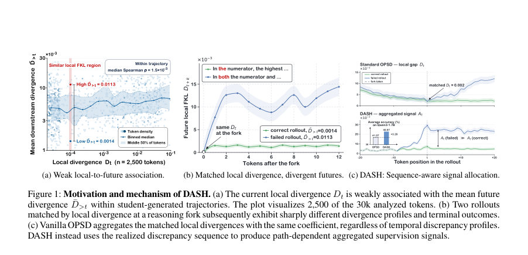
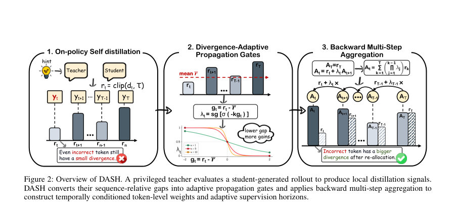
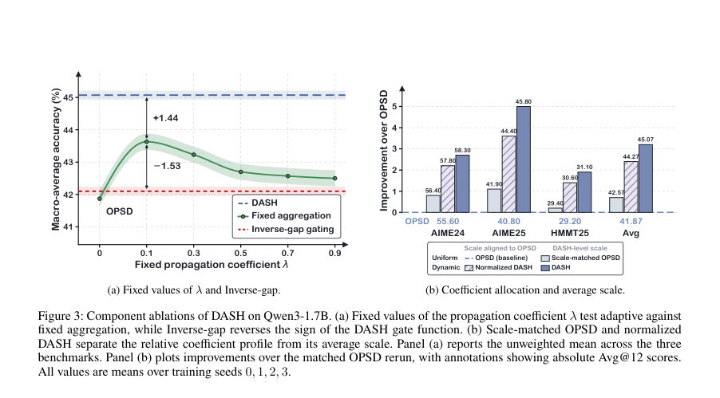

# DASH: Divergence-Adaptive Supervision Horizons for On-Policy Self-Distillation of Reasoning Models

- **게시일:** 2026-08-09
- **arXiv:** [2608.06243v1](http://arxiv.org/abs/2608.06243v1) · [PDF](https://arxiv.org/pdf/2608.06243v1)
- **저자:** ZhiYan Hou, Xinyu Tang, Hongyan An, Jianjin Zhang, Weizhen Wang, Yunyun Han, Gengsheng Li, Xiangzhao Hao, Haiyun Guo, Wenbin Hu, Jinqiao Wang, Yafeng Deng
- **분야:** cs.AI
- **선정 점수:** 3.38
- **선정 이유:** 최근성 0.5, 인용 영향 0.0 (인용 0회), 저자 영향 0.0 (최고 h-index 0), AI 주제 적합성 2.1, 개발자 관심 0.2, 학술 신호 0.6, 오픈 웨이트·주요 연구조직 신호 0.0

[← 2026-08-09 목록으로 돌아가기](../daily/2026-08-09.html)

<!-- paper-visuals:start -->
## 주요 Figure

> 원문 PDF에서 실제 Figure 캡션과 그림 영역이 함께 확인된 자료만 자동 추출했다.

*Figure · 원문 PDF 2쪽 · Figure 1: Motivation and mechanism of DASH. (a) The current local divergence Dt is weakly associated with the mean future*

*Figure · 원문 PDF 4쪽 · Figure 2: Overview of DASH. A privileged teacher evaluates a student-generated rollout to produce local distillation signals.*

*Figure · 원문 PDF 7쪽 · Figure 3: Component ablations of DASH on Qwen3-1.7B. (a) Fixed values of the propagation coefficient λ test adaptive against*

<!-- paper-visuals:end -->

## 한 문장 요약

긴 시퀀스 추론에서 토큰별 분포적 자기증류(OPSD)가 시간적 불일치(teacher–student divergence)의 경로 정보를 활용하지 못하는 문제를 해결하기 위해, 각 위치의 지역적 발산과 시퀀스 평균의 차이를 이용해 적응적 전파 게이트를 만들고 역방향 다단계 집계를 통해 토큰별 감독 가중치와 유효 감독 지평선을 동적으로 조정하는 DASH 방법을 제안한다.

## 해결하려는 문제

문제: RLVR(검증 가능한 보상)를 통한 추론 능력 향상은 최종 답의 정답 여부 등 시퀀스 수준의 희소한 보상에 의존하므로 긴 추론 경로에 대한 시점별 기여도 할당(temporal credit assignment)이 어렵다. 기존의 on-policy self-distillation(OPSD)은 학생이 생성한 접두사들에 대해 교사 분포로부터 밀집(token-level) 분포 감독을 제공해 희소성 문제를 완화하지만, OPSD는 모든 위치의 지역적 발산(local divergence)에 동일한 계수(예: 1/T)를 부여하여 동일한 지역 발산값이지만 서로 다른 과거 불일치 이력을 가진 경우를 구분하지 못한다. 연구 질문: 지역적 발산 값의 시간적 배열(경로)이 감독 가중치 배분에 유의미하므로, 이 경로 정보를 이용해 토큰별 감독 가중치와 감독 지평선을 적응적으로 조정하면 성능 향상이 가능한가?

## 핵심 기여

- 현상식별: vanilla OPSD가 지역적 발산들에 대해 위치·경로 무관한 균일 계수를 사용함으로써 동일한 발산값이지만 서로 다른 시간적 불일치 이력에 대해 감독 가중치를 조정하지 못하는 '시간적 계수 할당(gap)'을 지적함 (Section 4.1).
- 방법 제안: Divergence-Adaptive Supervision Horizons (DASH)를 제안함 — 각 위치의 지역적 신호와 시퀀스 평균의 차이를 이용해 적응적 전파 게이트 λt를 구성하고 역방향 다단계(백워드) 재귀 At = rt + λt At+1 를 적용해 경로 조건부 토큰별 가중치와 유효 감독 지평선을 생성함 (Section 4.2).
- 효율성: DASH는 vanilla OPSD가 이미 계산하는 교사·학생 분포를 재사용하므로 추가적인 교사/학생 전방 패스가 필요 없고, 추가 연산은 스칼라 역스캔에 한정되어 훈련 오버헤드가 거의 없음(문서측정상 스텝 시간의 <1%) (섹션 5 및 부록 B).
- 실험적 검증: OpenThoughts-Math-30K 데이터와 Qwen3-{1.7B,4B,8B} 모델에서 AIME 2024/2025, HMMT Feb 2025 세 벤치마크(Avg@12)를 사용한 비교에서, 동일한 OPSD 재실행(matched OPSD) 대비 모든 모델 스케일과 모든 벤치마크에서 성능 향상을 보였으며(예: Qwen3-1.7B 매크로 평균 41.87 → 45.07, +3.20) 포괄적 성분·하이퍼파라미터 소거 연구를 제시함 (섹션 5).

## 접근 방법

* 전체 접근 개요: DASH는 OPSD 파이프라인 내에서 다음 절차로 동작한다.
* 로컬 신호 계산: privileged teacher(LoRA 비활성화된 동일 베이스 모델, 참조 해답 포함)가 학생이 방문한 각 접두사 st에서 student 분포 πS_t와 teacher 분포 πT_t를 제공한다.
* 로컬 분산 신호로는 교사→학생의 forward KL의 어휘원소 합 ℓ_{t,v}=πT_t(v) log(πT_t(v)/πS_t(v))을 사용한다.
* 클리핑 및 위치 신호 rt: 각 어휘 항목별로 상한 τ(논문 기본값 τ=0.05)로 포인트와이즈 상한을 적용하여 rt = Σ_v min(ℓ_{t,v}, τ)를 얻는다(부호화상 일부 ℓ_{t,v}<0일 수 있음).
* 시퀀스 평균과 차이: 전체 룰아웃에서 ¯r = (1/T) Σ_t r_t 를 계산하고 gt = r_t − ¯r 로 차이를 얻는다.
* 이 평균 및 게이트 계산은 detached(역전파 전달 차단)로 구성된다.
* 전파 게이트 λt: gt를 민감도 κ(논문 기본 κ=5)를 사용한 시그모이드에 삽입하고 부호를 음(-)으로 사용하여 λt = sg[σ(−κ (r_t − ¯r))] 를 얻는다.
* 여기서 sg[·]는 교사 신호 차단(gradient block)임.
* 역방향 다단계 집계: 마지막 위치부터 역으로 AT = rT, At = r_t + λ_t A_{t+1} 를 계산한다.
* 이때 At는 해당 위치에 할당되는 누적 감독 신호이고, 최종 손실 LDASH = (1/T) Σ_t A_t 를 최소화한다.
* 그래디언트 흐름: 게이트 λt와 평균 ¯r 계산은 detached되어 있으므로, 실제 역전파는 각 위치의 로컬 신호 r_t를 통해서만 흐르고 각 위치 기여도는 시퀀스 조건부 상수 계수 c_k(재귀로 유도됨)에 의해 스케일 조정된다(부록 A.6).
* 구현·훈련 세부: LoRA(rank=64, scaling=128), 학습률 5e-6, 글로벌 배치 64, 학생 룰아웃 최대 1,024 토큰(실험상 2,048·4,096도 시험했으나 1,024로 효율화), 샘플링: train temp=1.1 top-p=0.95 top-k=20, 평가 Avg@12은 온도1.0 top-p=1.0 max 신규생성 38912토큰, 체크포인트 200스텝 이내 20스텝 간격 저장 후 세 벤치마크의 비가중 평균을 최대화하는 체크포인트를 선택하는 best-within-200-step 프로토콜(부록 B).

## 주요 결과

- 데이터·모델: OpenThoughts-Math-30K(29,434 예제), 평가 벤치마크 AIME 2024, AIME 2025, HMMT Feb 2025 (각각 30문제). 모델: Qwen3-1.7B, Qwen3-4B, Qwen3-8B. 측정: Avg@12(문제별로 12개 독립 샘플 응답의 정답 비율 평균).
- 주요 정량 결과(Table 1, 네 씨앗 평균 및 비교 재실행 기준): Qwen3-1.7B: OPSD 41.87 → DASH 45.07 (매크로 평균, +3.20). 벤치별 DASH 점수: AIME2024 58.30, AIME2025 45.80, HMMT2025 31.10. Qwen3-4B: OPSD 63.60 → DASH 65.00 (+1.40); DASH 벤치별(77.20,71.10,46.70). Qwen3-8B: OPSD 64.80 → DASH 66.40 (+1.60); DASH 벤치별(78.90,71.40,48.90). DASH는 매칭된 OPSD 재실행 및 다른 OPSD-family 방법(PW-OPSD, EOPD, AVSD 등)과 비교해 모든 모델·벤치에서 최고 표시 점수를 기록함(단, 통계적 유의성 표시는 없음).
- 성분 소거·민감도 (섹션 5.3·5.4, 부록 D): 고정 λ(모든 위치 동일)들도 OPSD 대비 개선(예: λ=0.1 은 매크로 43.63). 그러나 DASH(시퀀스 적응형)는 고정 최적값 대비 추가 개선(+1.44) 보임. Inverse-gap(게이트의 부호 반전) 은 42.10으로 거의 개선 효과 없음. 상대적 계수 분배가 핵심: normalized DASH(동일 평균 스케일)와 scale-matched OPSD 실험에서, 동적(경로조건부) 분배는 OPSD 스케일에서 +2.40, DASH 스케일에서 +2.50 향상; 평균 스케일 증가만으로 얻는 이득은 각각 ~0.70, 0.80에 불과. Propagation sensitivity κ 실험: κ ∈{1,2,5,10,20} 중 κ=5가 최고(매크로 45.07). 로컬 분산 지표 비교: forward KL(논문 기본)이 JSD(38.23 매크로)와 reverse KL(41.47 매크로)보다 우수(45.07). 어휘 지원 절약: top-100+tail은 44.37로 거의 보존, top-1+tail은 큰 성능 저하(34.83).
- 추가: DASH는 교사·학생 분포를 재사용하므로 추가 전방 패스가 없고, 부록 B의 런타임 로그에서는 추가 역스캔 연산이 전체 스텝 시간의 <1%를 차지함. 또한 부록 E에서 GRPO(결과 수준 RL)와 혼합할 때 특정 하이퍼파라미터에서 성능 보완 가능성을 보였음(규모 의존).

## 한계

- 저자 명시 한계: DASH는_fixed-horizon gradient decomposition_에서 동기화된 궤적(score-function) 항을 추정하거나 score-function 기반의 과거로의 보상 전달(future-to-past credit assignment)을 수행하지 않음 — DASH는 오직 직접적인 로컬 분산 경로에 대해 계수를 적응시켜 차이를 메우려는 방법임(부록 A.8). 또한 주요 비교에서 일부 베이스라인 결과(Base, SFT, GRPO)는 외부 보고값을 그대로 사용했고(부록 B), OPSD 및 DASH 재실행은 네 시드 평균을 사용하지만 일부 경쟁 기법(EOPD, AVSD, PW-OPSD)은 단일 시드 재실행이라 통계적 유의성 주장은 제한적임(섹션 5, 부록 B).
- 본문·실험 범위에서 확인되는 제약(분석적 한계): 실험은 수학적 추론 벤치(OpenThoughts-Math-30K 기반 AIME/HMMT)와 특정 Qwen3 모델군에 한정되어 있어 다른 태스크(예: 일반 언어생성·코드 생성)로의 일반화는 미검증임. 또 하이퍼파라미터(κ, τ, 클리핑, 게이트 함수, distillation divergence 선택)에 민감하며(섹션 5.4), 일부 설정에서는 성능이 떨어짐(예: JSD 대체, top-1 어휘 축소). 체크포인트 선택이 best-within-200-step 프로토콜에 의존하므로(세 개 벤치마크 평균을 최대로 하는 체크포인트 선택), 실제 검증/배포 시 과적합 방지나 정규 검증 세트 정책과 충돌할 수 있음. 또한 DASH는 훈련 시 privileged teacher(참조 해답)를 필요로 하므로 실제 환경에서 참조 제공이 불가능한 태스크에는 적용이 제한될 수 있음.

## 개발자 관점

- 재현·구현 핵심: DASH는 OPSD가 이미 계산하는 teacher·student 분포(교사 확률분포 πT_t와 학생 πS_t)만을 재사용하므로 추가 교사/학생 전방 패스가 필요없고, 구현은 로컬 KL 항을 어휘별로 계산한 뒤 포인트와이즈 클리핑(τ 기본 0.05) · 합산 → 시퀀스 평균 계산 → detached로 게이트 λt = sg[σ(−κ (rt − ¯r))] 구성 → 역방향 At 재귀 계산 → LDASH = (1/T) Σ At 로 정리하면 됨(Algorithm 1, 부록 A).
- 권장 하이퍼·설정: 논문 기본값이 실험적으로 견고함 — κ≈5(게이트 민감도), τ=0.05(어휘 레벨 클리핑), forward KL을 로컬 발산으로 사용, 전체 어휘를 유지하거나(top-100+tail로 압축 가능) 너무 과도한 축소(예: top-1+tail)는 피할 것. LoRA(rank=64, scaling=128), lr=5e−6, batch size=64, student rollout length=1024 권장. 네 시드(0–3) 평균으로 보고하는 것이 바람직함(부록 C).
- 성능·비용·운영: DASH의 추가 계산 비용은 매우 작음(문서 측정상 스텝 시간의 <1%) — 즉, 실무에서는 기존 OPSD 파이프라인에 거의 비용 없이 적용 가능. 다만 평가(Avg@12)는 많은 샘플(문제당 12 응답, 최대 신규생성 토큰 38,912 등)을 요구하므로 평가 비용은 높음. 훈련 롤아웃 생성이 런타임의 대부분을 차지하므로 분산/배치 설계(문서에 A800 GPU별 배치 구성 예시 있음)를 염두에 둘 것(부록 B 표).
- 안전성·데이터 관리: privileged teacher가 참조 해답을 사용하므로 학습 과정에서 참조 정보가 학생에게 유출되지 않도록(학생 입력에 참조 포함 금지) 로깅·데이터 파이프라인을 주의할 것. 또한 teacher 분포를 구성할 때 LoRA 어댑터를 비활성화하여 교사 파라미터가 고정되도록 구현해야 함(부록 B).
- 확장성·호환성: 부록 E에서 결과 수준 RL(GRPO) 경로와 혼합하는 실험을 제시하여 DASH가 outcome-level 방법과 상호보완적으로 작동할 수 있음을 보여줌(단, 규모 의존적 효과 관찰). 따라서 RLVR 파이프라인에 무리 없이 통합 가능함.

**근거 범위:** 이 분석은 제공된 논문 PDF 본문(본문, 그림, 표, 부록 포함)에 기초하여 작성되었음. 본문과 부록의 수치·설정(하이퍼파라미터, 데이터셋, 모델, 표의 정량값 등)을 그대로 인용했으며, 논문에 명시되지 않았거나 본문에서 명확히 제시되지 않은 구현 세부사항이나 통계적 유의성 주장은 추가하지 않았음. 일부 비교값(Base, SFT, GRPO)은 논문이 외부에서 인용한 결과임을 부록 B에서 명시하고 있으므로 해당 항목들과의 직접 비교는 논문에서 사용한 'matched rerun' 프로토콜과 구분되어야 함.
