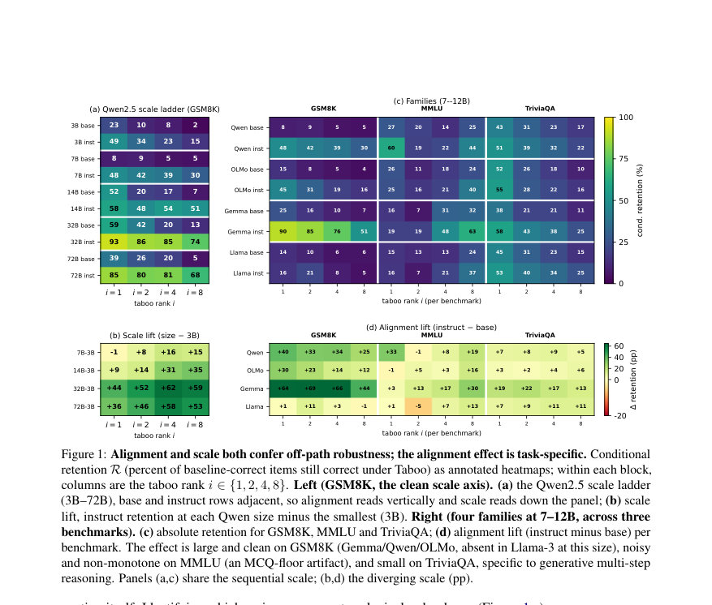
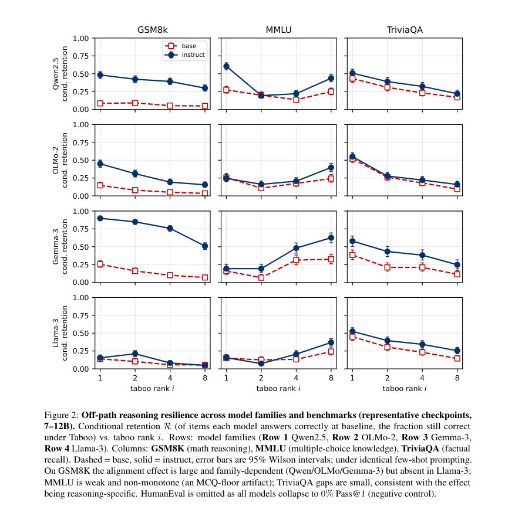
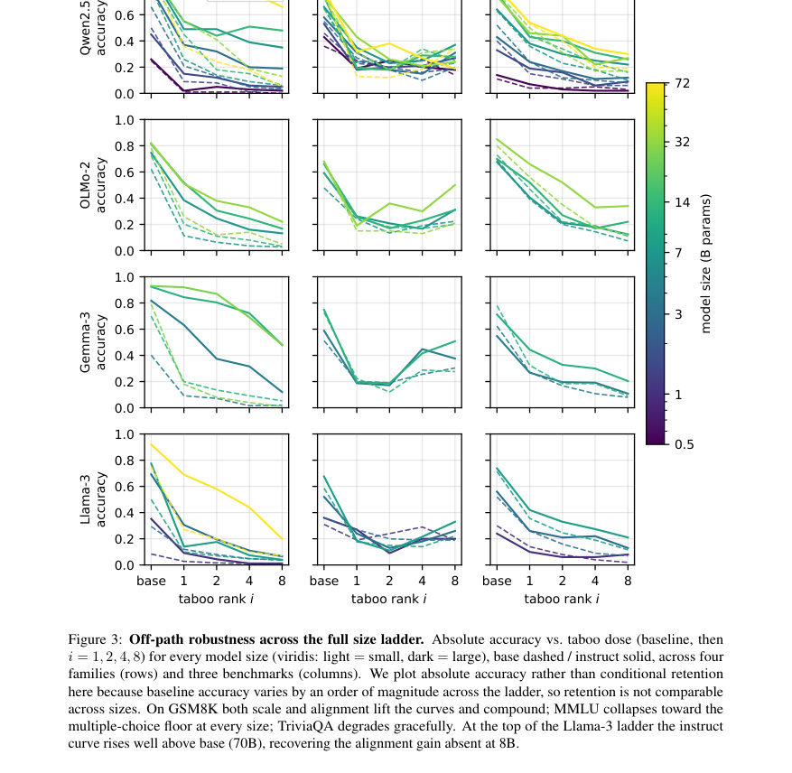

# Decoding-Level Taboo: A Diagnostic Stress Test for LLM Robustness

- **게시일:** 2026-08-12
- **arXiv:** [2608.09900v1](http://arxiv.org/abs/2608.09900v1) · [PDF](https://arxiv.org/pdf/2608.09900v1)
- **저자:** Tadanobu Chuyo Kamijo, Ori Rottenstreich, Javier Conde, Gonzalo Martínez, Pedro Reviriego
- **분야:** cs.CL
- **선정 점수:** 8.09
- **선정 이유:** 최근성 0.8, 인용 영향 0.0 (인용 0회), 저자 영향 1.9 (최고 h-index 29), AI 주제 적합성 3.0, 개발자 관심 0.3, 학술 신호 0.6, 오픈 웨이트·주요 연구조직 신호 1.6

[← 2026-08-12 목록으로 돌아가기](../daily/2026-08-12.html)

<!-- paper-visuals:start -->
## 주요 Figure

> 원문 PDF에서 실제 Figure 캡션과 그림 영역이 함께 확인된 자료만 자동 추출했다.

*Figure · 원문 PDF 7쪽 · Figure 1: Alignment and scale both confer off-path robustness; the alignment effect is task-specific. Conditional*

*Figure · 원문 PDF 13쪽 · Figure 2: Off-path reasoning resilience across model families and benchmarks (representative checkpoints,*

*Figure · 원문 PDF 14쪽 · Figure 3: Off-path robustness across the full size ladder. Absolute accuracy vs. taboo dose (baseline, then*

<!-- paper-visuals:end -->

## 한 문장 요약

입력 프롬프트를 변경하지 않고 디코딩 단계의 로짓을 런타임에 조작(상위 후보 토큰을 단어 시작 부분에서 마스킹)하여 모델을 주된 생성 경로에서 강제로 벗어나게 하고, 이를 통해 대형 언어모델(LLM)의 '오프-패스' 추론 강인성(robustness)을 진단하는 Decoding-Level Taboo 기법과 정량화 지표(Injected Surprisal)를 제안한다.

## 해결하려는 문제

기존 LLM 평가들은 주로 명목(nominal) 조건에서의 정답 생성 능력에만 초점을 맞추어 모델이 최적화된 좁은 생성 경로를 잘 따라가는지를 평가한다. 실제 배포 환경에서는 복잡한 시스템 프롬프트, 안전 가드레일, 구조적 출력 제약 등이 모델을 지속적으로 명목 경로에서 벗어나게 하며, 프롬프트 수준에서의 음성 제약(negative constraints)은 규칙 준수 실패가 내적 추론 붕괴인지 단순한 지시 불이행인지 구분하지 못한다. 따라서 프롬프트 변경을 배제한 채 런타임에서 직접 디코딩 단계의 로짓에 개입하여 모델의 오프-패스(강제 우회) 추론 내구성을 진단할 방법이 필요하다.

## 핵심 기여

- Decoding-Level Taboo: 프롬프트를 고정한 채 디코딩 루프의 로짓 공간에서 상위 후보(Top-i) 토큰을 단어 시작(word-initial) 단계에서 마스킹하여 모델을 주된 생성 경로에서 강제로 벗어나게 하는 제로-프롬프트 진단 기법을 제안한다.
- Injected Surprisal(∆S) 및 누적 Stotal: 마스킹으로 인해 모델이 자기 신념 하에서 추가로 부담해야 하는 비트 단위의 정보비용을 정의해 개입의 강도를 정량화한다(평균 ∆S로 표준화 가능).
- 광범위한 실험: Qwen2.5, Gemma-3, Llama-3, OLMo-2 등 4개 오픈 웨이트 패밀리의 base vs instruct(정렬/튜닝) 체크포인트와 여러 스케일(0.5B–72B)을 대상으로 GSM8K, MMLU, TriviaQA, HumanEval을 사용해 Taboo의 진단적 효용을 실증한다.
- 주요 발견: (1) 오프-패스 강인성은 파라미터 규모와 사후 정렬(alignment)에 의해 공동으로 결정되며, 정렬된(checkpoint) 모델이 더 많은 injected surprisal을 흡수하면서도 다중 단계 생성 추론을 더 잘 보존한다; (2) 이 효과는 과제 유형에 의존(생성적 추론에 유효, MCQ/MMLU는 포맷 아티팩트, 코드/인공 문법(HumanEval)은 거의 복구 불가)하고 모델 계열별로 차별적(예: Llama-3는 7–8B에서 예외적 동작).
- 실용적 활용 제안: Taboo를 안전성 감사(거절 토큰 마스킹으로 표층 동작 vs 내부 정렬 판별), 합성 CoT 궤적 생성, 구조화 출력 스트레스 테스트, Taboo 기반 정책 정렬 강화 신호 등으로 확장 제안.

## 접근 방법

* 제안 기법은 autoregressive 모델의 각 디코딩 단계 t에서 생성 logits z_t에 대해 단어 시작(토크나이저의 word-boundary 접두사로 미리 계산한 boolean 마스크로 판단)에서만 Top-i(탭부 순위 i) 후보들의 로그잇을 -∞로 마스킹하는 방식이다.
* 이렇게 하면 nominal 최상위 후보들의 확률이 0이 되어 모델은 다음 선호 토큰을 선택하게 되고, 이로 인해 '기계적 우회(machine circumlocution)'가 발생한다.
* 각 개입의 즉시 비용으로 Injected Surprisal ∆S_t = -log2 P_nom(x*_t \| x_<t) - (-log2 P_nom(x_nom_t \| x_<t))를 정의하며, 시퀀스에 걸친 누적 Stotal과 개입 횟수로 정규화한 평균 ¯∆S를 사용해 개입의 강도를 표준화한다.
* 구현은 Hugging Face transformers의 LogitsProcessor 형태로 제작해 배치별 top-i 추출과 단어 시작 판정을 수행하며, 개입은 W=1(단어 시작)일 때만 적용하고 중간 서브워드 단계에서는 개입을 중지해 토크나이저 구조 손상을 최소화한다.
* 실험 설정은 2-shot CoT 프롬프트(프롬프트 고정), 결정적 추출(최종 정답 라인이나 숫자 추출 규칙), 표본 크기 n=500(주요 7–12B 비교) 또는 n=100(스케일 사다리 및 ≥32B), 그리고 i∈{1,2,4,8}로 taboo rank를 조정해 Acc_base, Acc_taboo, 그리고 baseline에서 정답을 맞춘 항목들에 대한 Conditional Retention R을 측정했다.
* 런타임 및 정밀도 통제(4-bit nf4, bf16 연산)와 온도 샘플링(τ=0.7,1.0) 검증도 보조 실험으로 수행되었다.

## 주요 결과

- GSM8K(생성적 다중 단계 수학 문제)에서 정렬된(instruct) 체크포인트가 base보다 오프-패스 보존률(Conditional Retention R)이 월등히 높음: 예시로 Qwen2.5-7B은 i=1에서 base 8%→instruct 48%, OLMo-2-7B 15%→45%, Gemma-3-12B 25%→90%. 반면 Llama-3.1-8B은 i=1에서 base 14% vs instruct 16%로 분명한 이득이 관찰되지 않음.
- 스케일 효과(예: Qwen2.5): base 기준 i=1에서 retention은 0.5B:6%, 1.5B:11%, 3B:23%, (7B dip→8%), 14B:52%, 32B:59%로 일반적으로 증가하지만 비단조적이며 72B-base는 32B-base보다 낮음(예: 72B-base 39% vs 32B-base 59%). 정렬된 모델은 0.5B의 6%에서 32B에서 93%(i=1)까지 증가해 스케일×정렬이 시너지 효과를 냄.
- 도메인/형식 의존성: TriviaQA(자연어 사실 회수)는 보존률이 가장 높고 완만하게 저하되는 반면, MMLU(단일 알파벳 정답의 MCQ)는 형식적 아티팩트로 거의 바닥으로 붕괴함. HumanEval(코드 합성)는 단어-초기 키워드 마스킹으로 인해 모든 모델에서 Pass@1이 거의 0%로 떨어져 형식적 문법의 복원 불가성을 확인함.
- Injected Surprisal(¯∆S) 분석: 일반적으로 정렬된 체크포인트가 각 개입에서 더 큰 ¯∆S를 흡수(즉, 더 샤프한 다음 토큰 분포를 가짐)하면서도 더 높은 보존률을 보임—따라서 정렬 효과는 단순히 더 가벼운 유효 도스 때문이 아님. Llama-3는 예외로 instruct가 base보다 더 큰 ¯∆S를 흡수하지 않음(곡선 겹침 또는 역전).
- 실행·성능 부가효과: 개입은 토큰당 오버헤드는 작으나 생성 길이를 증가시킴(예: GSM8K에서 i=1 기준 평균 생성 토큰 수 약 1.4× 증가; 일부 instruct 체크포인트는 i=8에서 2.4–2.9×까지 확장).

## 한계

- 저자 명시 한계 — 개입 규칙 범위 제한: 본 연구는 단일 규칙(모든 단어 시작에서 Top-i 후보 일괄 마스킹)만 탐색했으며, 희소/적응형 개입(서프라이즈 임계값 기반, 비-top-i 마스킹 등)은 미탐색이다.
- 저자 명시 한계 — 언어 범위: 모든 평가는 영어로만 수행되었고, 형태론·토크나이저 차이가 큰 다른 언어(다중언어/저자원 언어)에 일반화되지 않을 수 있다.
- 저자 명시 한계 — 모델 아키텍처 범위: 실험은 공개된 autoregressive 오픈 웨이트 계열에 한정되며 MoE, 멀티모달, 폐쇄형(proprietary) 모델 등은 평가에 포함되지 않음.
- 저자 명시 한계 — 디코딩·정밀도: 주 실험은 결정적(그리디) 디코딩 기반이며 샘플링 전략 전반에 대한 완전한 분석은 향후 작업으로 남음. 또한 대형 모델은 4-bit 양자화로 실행하였으나 일부 통제 실험은 정밀도 노이즈가 통계적 변이 범위에 있음만 보고되었다(완전 고정밀도 재평가는 향후 과제).

## 개발자 관점

- 배포 전 감사(Pre-deployment audit): Taboo는 프롬프트를 변경하지 않고 런타임에서 로짓만 조작하므로, 배포 전 모델이 실제 운영 제약(가드레일·구조적 출력) 아래서 추론을 유지하는지 빠르게 진단할 수 있다. 특히 거절 토큰(refusal templates)을 마스킹하면 표층적 거절 패턴과 내부적 안전 정렬을 구분할 수 있다.
- 토크나이저·단어 경계 중요성: 구현은 토크나이저 접두사 기반의 word-boundary 판정에 의존하므로, 다른 토크나이저(BPE vs SentencePiece 등)나 다국어 환경에서는 경계 판정 로직을 반드시 검증해야 한다.
- 실행·비용: 개입 자체의 연산 비용은 미미하나(벡터화된 Top-i 마스킹·argmax), 개입으로 인해 생성 길이가 늘어나므로 총 추론 비용(시간·토큰 수)은 증가한다. 논문에서 제시한 대략적 실행 시간은 A100/H100 단일 GPU에서 7B 모델 n=100 조건 약 4분, 32B 약 9분, 70–72B 약 16분 수준으로 대규모 배치·스윕을 고려할 때 비용 산정 필요.
- 재현성·정밀도 주의: 저자들은 4-bit(nf4, bf16 compute) 양자화를 기본으로 사용했으며 소수의 셀에서 양자화가 결과에 영향을 줄 수 있음을 보고함. 재현 시에는 bf16/8-bit 대조 실험을 병행해 양자화 영향 확인 권장.
- 활용 가능성 — 데이터 생성 및 정렬: Taboo 기반 샘플링은 합성 CoT 경로를 다양하게 수집하는 데 유용하므로 지식증류·검증기 기반 RL(예: verifier-based RL)에서 롤아웃 다양성 확보 및 Taboo-aware 정렬 신호로 활용할 수 있다.

**근거 범위:** 이 분석은 제공된 논문 PDF 본문(본문 및 부록 포함)의 텍스트를 근거로 작성되었음. 본문에 명시된 주요 수치(예: retention 비율, 스케일별 수치, 평균 생성 토큰 증가, 실행 시간)는 PDF 내 표기와 그림·본문 설명에서 직접 추출했으며, 코드 리포지토리나 외부 메타데이터는 접근하지 않았음. 부가적인 구체적 구현 파라미터(예: 내부 라이브러리 세부 옵션)나 재현 시의 하드웨어 환경 차이에 따른 미세한 값 변동은 PDF에 명시된 범위를 벗어나 판단하지 않았음을 밝힌다.
