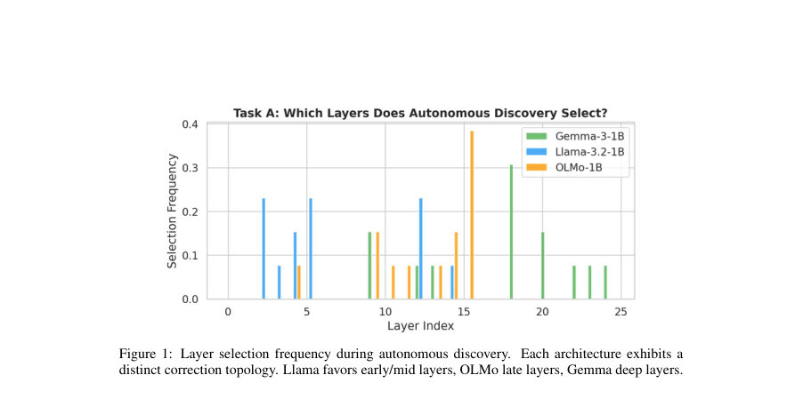
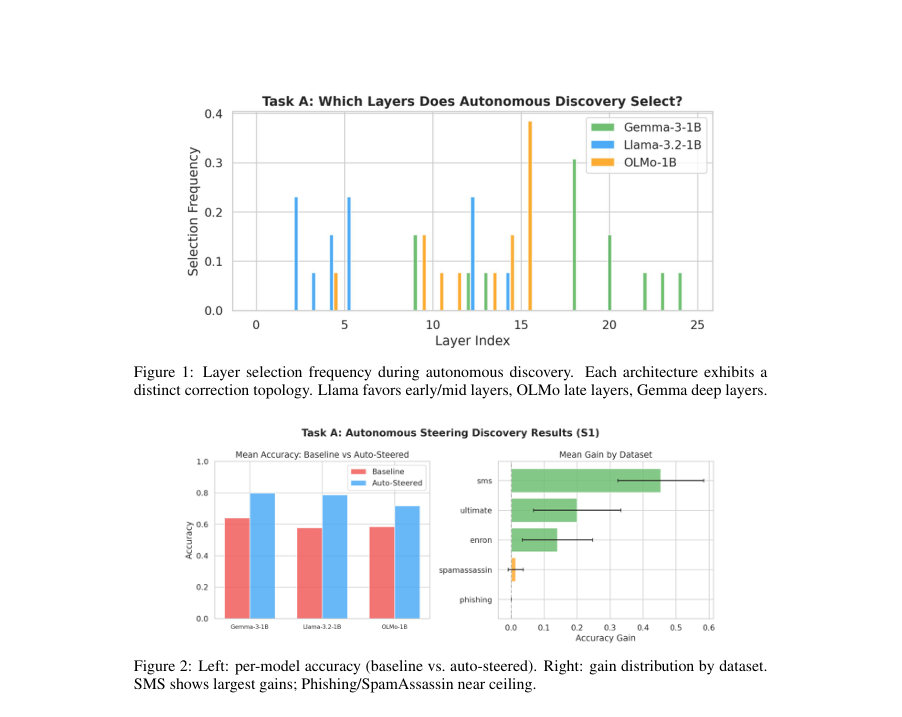
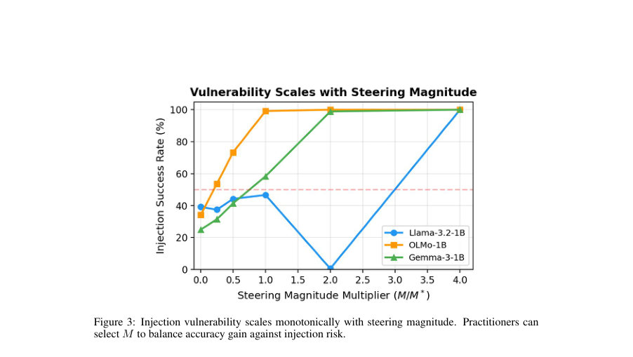

# Deep Noir: Autonomous Steering Discovery via Architectural Chronometry in Transformer Models

- **게시일:** 2026-09-19
- **arXiv:** [2609.20722v1](http://arxiv.org/abs/2609.20722v1) · [PDF](https://arxiv.org/pdf/2609.20722v1)
- **저자:** Frank E. Bobe, Gregory D. Vetaw, Darshan W. Bryner, Matthew G. Cook, Jose L. Salas-Vernis
- **분야:** cs.AI
- **선정 점수:** 6.47
- **선정 이유:** 최근성 0.8, 인용 영향 0.0 (인용 0회), 저자 영향 1.4 (최고 h-index 9), AI 주제 적합성 3.0, 개발자 관심 0.8, 학술 신호 0.6, 오픈 웨이트·주요 연구조직 신호 0.0

[← 2026-09-19 목록으로 돌아가기](../daily/2026-09-19.html)

<!-- paper-visuals:start -->
## 주요 Figure

> 원문 PDF에서 실제 Figure 캡션과 그림 영역이 함께 확인된 자료만 자동 추출했다.

*Figure · 원문 PDF 5쪽 · Figure 1: Layer selection frequency during autonomous discovery. Each architecture exhibits a*

*Figure · 원문 PDF 5쪽 · Figure 2: Left: per-model accuracy (baseline vs. auto-steered). Right: gain distribution by dataset.*

*Figure · 원문 PDF 8쪽 · Figure 3: Injection vulnerability scales monotonically with steering magnitude. Practitioners can*

<!-- paper-visuals:end -->

## 한 문장 요약

Deep Noir은 Logit Lens 기반의 층별 '해결 시점' 측정(Architectural Chronometry)과 인과적 헤드 수준 기여도(gradient/patching)를 결합해, 레이어·헤드·크기·방향을 자동으로 탐색하여 활성화 스티어링(activation steering)을 자율적으로 발견하고 적용하는 프레임워크이다.

## 해결하려는 문제

활성화 스티어링은 추론 시 모델 동작을 바꿀 수 있으나, 어느 레이어에, 어떤 헤드 부분집합에, 어느 정도의 크기로 개입할지 수동으로 선택해야 하며 이는 아키텍처나 과제에 따라 확장성이 떨어진다. 기존 자동화 시도는 통계적 점수화나 입력별 적응을 사용하지만, 인과적·기계론적 근거가 부족해 범용적으로 일반화되지 못한다는 문제가 있다.

## 핵심 기여

- 아키텍처 크로노메트리(Architectural Chronometry) — Logit Lens 수렴 지표와 앤타고니스트 헤드 강도를 결합한 층 순위화로 '의사결정이 언제(어느 층에서) 확정되는지' 진단하는 단계 도입.
- 헤드 수준의 인과적 분리(gradient 기반 헤드 선택 및 마스킹)와 콘트라스티브 평균 표현을 이용해 (레이어, 헤드 수, 마그니튜드, 방향) 전 구성공간을 자동 탐색하는 5단계 Steering Discovery Engine 제안(탐색 + 골든섹션으로 M 보정 + 반복적 보완).
- 다양한 규모(1B, 2–3B, 7–9B)와 네 아키텍처에서의 광범위한 실험: 스팸 분류에서 1B 합산 +16.7pts(±4.7, 39 runs)에서 7–9B에서 +21–42pts, SST-2 감성에서 +13.1pts 등 자동 발견으로 일관된 성능 향상 보고.
- 기계론적 근거를 통한 교차과제 일반화 및 구성요소 필수성 입증: RepE(헤드 마스킹 없음)는 감성에서 개선을 못하는 반면 DN은 모든 모델에서 유의미한 개선(p<0.01)을 달성하며, 구성요소별 소거 실험으로 각 단계의 필요성 확인.
- 스티어링이 예측 가능한 프롬프트 인젝션 공격면을 생성함을 실험적으로 규명하고, 취약성이 스티어링 크기에 대해 단조증가함을 보여 실전 배포 환경(에이전트 보안)에 대한 시사점 제공.

## 접근 방법

* 입력: 사전학습된 트랜스포머 모델 M과 라벨이 있는 프로브 집합 D.
* 출력: 스티어링 구성 (l*, K*, M*, d*, m*).
* 파이프라인(Algorithm 1):
* Phase 1(층 순위화): 각 층 l에 대해 Logit Lens 차이 SLL(l)=\|P(t\|l)−P(c\|l)\|와 층 내 앤타고니스트 헤드 강도 Sant(l)=max_h ah(ah=−⟨W_O^{(h)} h(h), u⟩, u = W_U[t]−W_U[c])를 계산하고 정규화된 가중합 S(l)=0.4·ŜLL+0.6·Ŝant로 상위 5개 층 선정.
* Phase 2(헤드 분리): 후보층에서 10개 프로브(클래스별 5개)로 손실의 헤드별 그래디언트 크기 ∇_h L를 계산해 상위 K(1,2,4) 헤드 선택, 선택된 헤드 차원만 살리는 이진 마스크 m 생성.
* Phase 3(방향 계산): 개입점 바로 아래층(l+1)의 히든 상태에서 클래스별 평균을 취해 대조방향 d = mean(counter) − mean(target)을 구하고 정규화(ĥ).
* Phase 4(크기 보정): 스티어링 벡터 v = α · M · ĥ · m (α=450 고정)로 정의하고 M ∈ [0.01,20]에 대해 골든섹션 탐색(사전 그리드 스캔 포함)하여 정확도를 최대화하는 M* 탐색.
* 각 평가 시 해당 층에 forward hook으로 벡터 주입하여 정확도 측정.
* Phase 5(선택): 정확도 기준 최적 (l,K,M) 선택(동점 시 K·M 최소 선호).
* 그 후 반복적 정제: 오분류 샘플에 가중치를 두고 이전 층 제외하여 추가 보정 탐색, 전체에 적용 후 성능 감쇠 시 롤백, 최대 5회 반복 또는 수렴.
* 특이사항: LayerNorm으로 인해 가중치 편집(SVD 기반)은 유의미한 변화 없음(정규화로 감쇄), 따라서 활성화 공간(hook)에서의 개입만 유효하다고 보고함.

## 주요 결과

- 스팸(1B, 39 discovery runs, 50 probes/폴드, 5-fold CV 일부): 전체 기준 베이스 60.1% → 스티어드 76.7%, 평균 이득 +16.7 pts (±4.7), 33/39 runs에서 개선.
- 스팸(아키텍처별, 1B): Llama-3.2-1B 57.7→78.6 (+20.9±8.1, 12/13), Gemma-3-1B 64.0→79.8 (+15.8±8.9, 11/13), OLMo-1B 58.5→71.7 (+13.2±7.7, 10/13).
- 감성(SST-2, 1B, 5-fold, 50 probes): 전체 69.5%→82.5% (+13.1±3.0), 모든 모델(15/15 folds)에서 개선(예: Llama 77.6→89.2 +11.6). RepE는 감성에서 모든 15개 fold에서 베이스와 동일(개선 없음).
- 규모별 스케일링: Gemma 계열 스팸 이득은 +15.8(1B)→+30.4(2B)→+42.4(9B)로 증가, Llama 계열도 유사한 증가 패턴 관찰. 7–9B에서 네 모델 모두 스팸 +21~+42 pts.
- 구성요소 소거: 헤드 마스킹 제거 시 Llama −5%, Gemma −1% 등 성능 하락; 고정 M(=0.2) 사용 시 Llama −11% 등. Deep Noir은 동일한 콘트라스티브 방향을 주고 30개의 랜덤 구성과 비교하면 +14~+33% 우수함을 보임(기계론적 순위화·헤드 기여가 검색을 능가함).

## 한계

- 저자가 명시한 한계: (1) 바이너리 분류(스팸·감성)에 가장 강하고 추론/추론형(다지문 선택) 과제에서는 성능 향상이 제한적(기저 성능이 무작위에 가깝다면 대조적 신호가 부족). (2) 스케일링 실험은 각 패밀리당 모델 하나만 사용했고, 7B급은 4-bit 양자화 사용. (3) LoRA로 전환 시 평균 약 10%의 충실도 손실이 관찰됨(Appendix G). (4) 선형 방향 가정은 비선형 결정경계 정보를 놓칠 수 있음. (5) 폴드별 분산이 RepE보다 큼(±10–11 vs. ±5–7). (6) 스티어링 자체가 프롬프트 인젝션 취약성을 만들 수 있음(본질적 위험). (7) 70B+ 수준의 대형 모델과 복잡한 추론·수학·지시추종 과제에 대한 검증은 향후 작업으로 남음.
- 추가 관찰 기반 제약(본문에서 합리적으로 확인 가능): 발견 시간·비용: 탐색은 아키텍처에 따라 4–31분(1B: 4–10분, 3B~7B 더 증가), 전체 실험에 약 210 GPU-시 사용(Quadro RTX 5000). LayerNorm 때문에 가중치 편집 방식은 효과 없음(activation-hook 필요). 프로브 수가 작을 경우(논문은 50 샘플을 주로 사용) 과적합 위험과 폴드 간 가변성이 존재함(교차폴드 일반화는 있으나 이득이 일부 감소).

## 개발자 관점

- 실행·재현: 엔진은 모델 내부의 residual stream에 forward hook으로 활성화 벡터를 더하는 방식이므로 모델 가중치 수정이 필요 없고, 발견은 한 번만 수행하면 이후 추론에 오버헤드가 거의 없음(단, discovery 단계는 수십 분·GPU 리소스 요구).
- 핵심 구현 요소: Logit Lens를 층별로 계산(층 l에서 unembedding을 통해 토큰 확률 측정), 헤드별 출력 및 출력 프로젝션 W_O^{(h)}를 사용한 앤타고니스트 점수 계산, 헤드별 그래디언트(손실에 대한 ∇_h)로 상위 K 헤드 선택, l+1 층 히든 상태로부터 콘트라스티브 평균 계산, α(저자 제안값 450)·M 스케일링으로 v 구성, 골든섹션 탐색으로 최적 M 결정 및 반복적 보정·롤백 로직.
- 레이어노름(LayerNorm) 주의: 가중치 기반 편집(SVD 등)은 LayerNorm으로 인해 유효하지 않으므로 활성화 단계에서의 후킹만 고려해야 함.
- 보안·배포 고려: 스티어링 크기 M은 정확도(A(M))와 인젝션 취약성(V(M))의 파레토 트레이드오프를 형성하므로 운영 시 M 선택은 위협 모델링과 함께 이루어져야 하며, 일부 아키텍처에서는 스티어링 층의 activation-norm 변화를 이용해 인젝션 감지 신호를 구축할 수 있음(아키텍처 의존적).
- 모델·데이터 종속성: 발견된 (L,K,M) 구성이 아키텍처·태스크에 강하게 의존하므로 다른 데이터셋·도메인으로 옮길 때는 재발견 또는 검증(held-out fold 평가)을 권장. 또한 LoRA 변환 시 정확도 손실이 보고되어 실제 서비스용 경량화는 추가 연구·조정 필요.

**근거 범위:** 이 분석은 제공된 논문 PDF 본문(페이지 1–16, 부속 Appendix 포함)의 텍스트를 근거로 작성되었음. 표, 수치, 알고리즘 상세(α=450, 탐색 범위, 프로브 수, 각 테이블의 수치 등)는 본문에 명시된 값을 그대로 사용했다. 코드·데이터 공개, 양자화 및 LoRA 변환의 구체 구현(예: 세부 학습 스케줄, 양자화 파라미터)은 논문에서 제한적으로만 기술되어 있어 재현 시 동일 환경(모델 릴리스·quantization)을 확보해야 하며 이 부분은 본 분석에서 확인이 제한적임.
