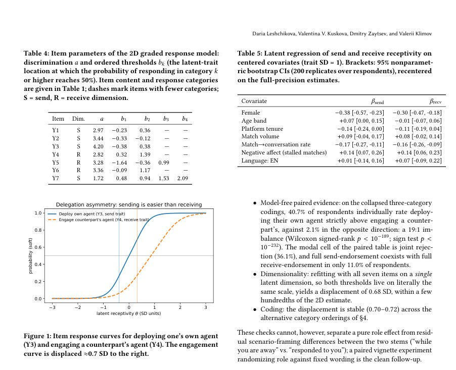
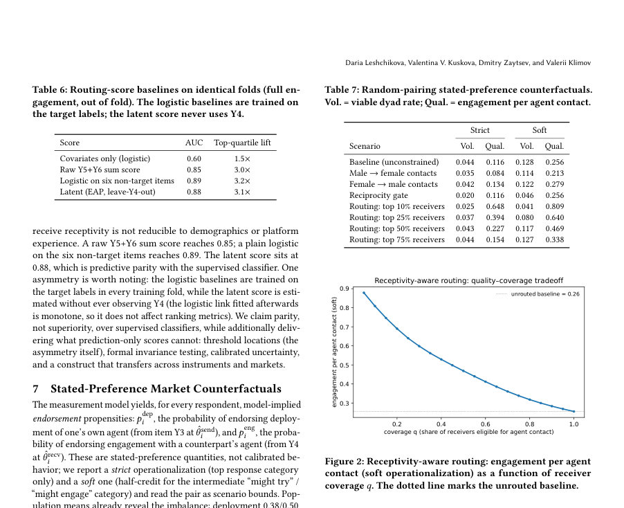

# Delegation Asymmetry in Agentic Recommender Systems: Measuring Two-Sided Receptivity in Online Dating

- **게시일:** 2026-08-19
- **arXiv:** [2608.18058v1](http://arxiv.org/abs/2608.18058v1) · [PDF](https://arxiv.org/pdf/2608.18058v1)
- **저자:** Daria Leshchikova, Valentina V. Kuskova, Dmitry Zaytsev, Valerii Klimov
- **분야:** cs.AI
- **선정 점수:** 5.97
- **선정 이유:** 최근성 0.8, 인용 영향 0.0 (인용 0회), 저자 영향 1.3 (최고 h-index 7), AI 주제 적합성 3.0, 개발자 관심 0.6, 학술 신호 0.3, 오픈 웨이트·주요 연구조직 신호 0.0

[← 2026-08-19 목록으로 돌아가기](../daily/2026-08-19.html)

<!-- paper-visuals:start -->
## 주요 Figure

> 원문 PDF에서 실제 Figure 캡션과 그림 영역이 함께 확인된 자료만 자동 추출했다.

*Figure · 원문 PDF 6쪽 · Figure 1: Item response curves for deploying one’s own agent*

*Figure · 원문 PDF 8쪽 · Figure 2: Receptivity-aware routing: engagement per agent*

<!-- paper-visuals:end -->

## 한 문장 요약

온라인 데이팅 플랫폼 사용자 대상 대규모 설문(총 N≈2.6–2.9k)과 다차원 graded response 잠재변수 모델을 사용해 ‘내가 에이전트를 쓰려는 정도(보내기)’와 ‘다른 사람의 에이전트를 받아들일 정도(받기)’를 동일한 잠재척도에서 동시에 측정하고, 그 차이(위임 비대칭)가 시장·설계에 미치는 영향을 양적·검증 가능 방식으로 분석했다.

## 해결하려는 문제

대부분의 기존 연구와 제품 설계는 에이전트 기반 자동화(대리 대화)를 '보내는 쪽' 수용성(사용자 자신이 AI를 쓰려는지)만 측정하거나 수요와 공급을 분리해 연구했다. 그러나 에이전트 중개 메시지는 상대방의 수용성(받는 쪽 동의)이 있어야 실제 상호작용이 발생하며, 이 두 역할을 동일 척도에서 개인 내에서 동시에 측정하지 않으면 위임 시장의 존재 가능성을 판단할 수 없다. 또한 기존 태도척도들은 범주별 문턱(threshold)을 모델로 다루지 않으므로 '어느 수준의 수용성에서 실제 행동으로 이어질지'를 직접적으로 제공하지 못한다.

## 핵심 기여

- send(보내기)·receive(받기) 수용성을 동일 잠재척도에서 개인 내에 걸쳐 분리된 구성개념으로 도입·측정하고 두 구성은 강하게 상관되나(ρ=0.92) 통계적으로 구분됨(ΔBIC=51.8) 을 보였다.
- ‘receptivity audit’라는 실무용 파이프라인을 제시: 짧은 순서형 문항 설계 → 다차원 graded response 측정모델(잠재회귀 포함) 적합 → 개인별 모델 유도 propensities 산출·교차검증 → 상태-기반(이론적) 시장/매칭 반사실(counterfactual) 계산으로 설계 레버를 정량화.
- 대규모 플랫폼 자료로 위임 비대칭을 정량화: 같은 척도에서 자신의 에이전트 배치는 요구 수용성(θ = -0.38) 이 상대의 에이전트 수락(θ = +0.32, 완전 수락 +1.39)보다 훨씬 낮아 평균 배치 성향이 수락 성향을 약 3배 초과함을 보고.
- 모델 기반의 설계·운영 시사점 제시: 수신측 동의(수용성) 를 매칭·라우팅 신호로 쓰면 per-contact 참여율을 3× 수준으로 끌어올릴 수 있고(교차검증 AUC≈0.88, 상위사분위 3.1× 리프트), 반면 상호성(reciprocity) 규칙은 상호작용 볼륨을 절반 이상 줄인다.

## 접근 방법

* 데이터: 두 차례 플랫폼 내 자발 응답 설문을 사용(A: 생성형 프로필 기능 N=2,894, 러시아어; B: 자율 대화 에이전트 N=2,617, 러시아·영어 병행; B의 완전케이스 N=2,499).
* 도구: B 설문에 에이전트 기능 모형화 목업을 제시하고 7개 태도 문항(Y1–Y7)을 수집(네 항목은 send 역할, 세 항목은 receive 역할).
* 모델링: 두 차원(보내기/받기) graded response model(항목별 판별도 a_j, 순서형 문항별 문턱 b_jk)과 잠재회귀(성별·연령·플랫폼 재직기간·매치량·매치→대화 전환율·매치 정체에 대한 부정감·언어) 결합.
* 추정은 주변최대우도(MML)로 132노드 Gauss–Hermite 수치적분을 사용, 식별을 위해 잠재분산 고정 및 공변량 중심화.
* 차원성은 1D vs 2D를 BIC·검정으로 비교했고, 항목별 DIF(언어·성별) 검정 후 부분불변성(partial invariance) 적용.
* 개인 점수는 EAP로 산출하고 200회 비모수 부트스트랩으로 불확실성 추정.
* 라우팅 신호 검증: Y4(수신 핵심문항)를 홀드아웃한 채 5-겹 응답자 수준 교차검증으로 수신 잠재점수(EAP, Y4 제외)로 Y4를 예측(AUC/Brier).
* 시장 반사실: 모델 유도 per-user propensities (p_dep from Y3 at θ_send, p_eng from Y4 at θ_recv)를 독립 확률로 가정한 무작위 지향(directed) 쌍(pairing) 시뮬레이션에 투입하여 '유효한 dyad 비율(볼륨) V' 및 '에이전트 한 건당 참여율 Q' 을 계산하고 설계 규칙(배치 자격 S, 수신 라우팅 R, 상호성 게이트 등)의 비용·이득을 정량화.
* 군집: 항목 기반 잠재클래스 분석으로 4개 클래스(거절자·열성자·애매·비대칭 위임자) 확인.

## 주요 결과

- 샘플: Instrument A N=2,894(러시아어), Instrument B 총 N=2,617(러시아어 2,385 / 영어 232), 완전케이스 N=2,499.
- 구조: 2차원 모델 선호(ΔBIC=51.8, LRT p<10⁻¹⁵), send·receive 잠재상관 ρ=0.92.
- 문항 품질: 판별도 a는 1.7–4.2 범위(가장 높은 항목 Y3 a=4.20), 제품 전체평가 Y7는 가장 약한 판별도 a=1.72.
- 위임 비대칭(핵심 수치): 같은 잠재척도에서 '자기 에이전트 배치' 문항 임계 위치 θ = −0.38, '상대 에이전트 참여' 임계 θ = +0.32(완전 참여 +1.39). 두 문항 간 이동량 0.71 SD (부트스트랩 95% CI [0.65,0.77]). 코딩·차원 수 변경에 대해 수치 안정성 확인(0.68–0.72 범위).
- 개인 수준 propensities(항목 기준 strict/soft): 평균 배치(자기 에이전트) 0.38(strict)/0.50(soft) 대 수락(상대 에이전트) 0.12/0.26; 응답자 쌍으로 보면 40.7%가 개인적으로 '보내기' > '받기'를 보고, 2.1%만 그 반대(모달은 공동 거절 36.1%). 전체적으로 4.4%–12.8%의 directed dyads만이 배치·수락을 모두 만족(무작위 매칭 가정). 에이전트 1건당 참여율은 불제약 기준 11.6%(strict)/25.6%(soft). (Table 7).

## 한계

- 저자 명시 한계: (1) 설문은 개념 목업에 대한 stated preferences이고 실제 배포 후 행동(행동적 증거)과는 차이가 있을 수 있음; (2) 표본은 단일 플랫폼의 자발응답자이며 영어 소표본(EN n=232)이 작고 자가선택되어 언어와 모집단 구성(confounding) 이 얽혀 있어 교차언어 해석에 제약이 있음; (3) 일부 응답 옵션의 서열화(범주 병합 등)는 연구자 판단을 포함하며 비록 민감도 분석에서 주된 수치가 안정적이지만 모든 가능한 코딩을 배제할 수는 없음; (4) 두 설문은 응답자 레벨에서 연결되지 않아 passive vs active 비교는 표본 간 비교임; (5) 시장 시뮬레이션은 무작위 쌍 형성과 정적 propensities를 가정해 동역학·동질성(homophily)·균형을 무시함; (6) 태도는 비정상적(nonstationary)일 수 있어 2026년 시점의 스냅샷이라는 한계.
- 추가로 본문에서 확인되는 제약: 라우팅 신호는 Y4를 홀드아웃해 교차검증으로 검증되었으나 실제 에이전트 발송·행동 데이터에 대한 예측·운영 검증은 아직 미비하다(실제 A/B·생산 데이터 필요). 또한 부분불변성 검사에서 수신측 항목들(Y4,Y5)에 DIF가 발견되어 지역별(언어·문화) 보정 없이 글로벌 임계값을 적용하면 오차가 생길 수 있음.

## 개발자 관점

- 재현·데이터: 코드·코드북·분석 파이프라인과 익명화된 응답 데이터가 DOI(논문 본문에 명시된 10.5281/zenodo.21971273)로 공개되어 있어 결과 재현 가능. 다만 원자료(자유응답·연락처·정확 타임스탬프)는 제외됨.
- 짧은 계측기(7개 문항)로 사전배포 평가 가능: 운영 전 ‘receptivity audit’ 절차를 통해 배포 전 시장 존재 여부(양측 수용성)를 판단하고 라우팅 신호를 마련할 수 있음.
- 모델·검증 실무: graded response 모델(MML, 다차원)·부분불변성 검사·EAP 점수·응답자 수준 교차검증(leave-target-item-out) 조합은 생산 라우팅 신호로 적합. 계산 비용은 132노드 Gauss–Hermite 적분 + 200회 부트스트랩으로 중간 수준의 계산 자원 필요(재학습시 고려).
- 배치·라우팅 설계: (1) receive-side consent 옵션을 제품 설계의 1순위 원시(primitive)로 고려할 것(미고지시 기만·신뢰 손상 위험); (2) 수신 라우팅을 도입하면 상위 수용자 집단에 한정해 에이전트 트래픽 품질을 크게 개선할 수 있음(예: 상위 25% 수신자에 라우팅하면 per-contact 참여율 3× 이상 상승). 이 라우팅은 senders에게는 투명하지 않아도 되며(플랫폼 정책에 따라) 송신량을 줄이지 않고 품질을 개선할 수 있음.
- 윤리·안전: 수신측 라우팅은 보호로도 악용으로도 가능(취약·좌절한 사용자에게 집중 노출 유도 가능). 배포 전 윤리적 정책(취약자 보호, 타겟팅 금지 규칙), 명시적 고지·동의, 실험적 모니터링이 필요하다. 또한 성별 등 인구통계적 차이는 집단 평균 차이를 설명할 뿐 개별 차별 근거로 사용해서는 안 됨(논문 경고).

**근거 범위:** 본 분석은 제출된 논문 PDF(본문 pp.1–11)에 근거해 작성되었으며, 모든 수치·절차·제언은 논문 본문에서 직접 추출 또는 본문에 명시된 분석 결과에 근거함. 부록·추가 자료나 코드에서 파생된 세부 구현·환경(setup) 정보는 DOI로 출처가 제공되나 본 요약에는 본문에 명시된 내용만 사용했음. 교차언어 소표본(EN n=232)과 생산환경에서의 행동적 검증은 본문에서 저자도 제한점으로 명시하고 있어 실제 배포 시 추가 실험 검증이 필요함.
