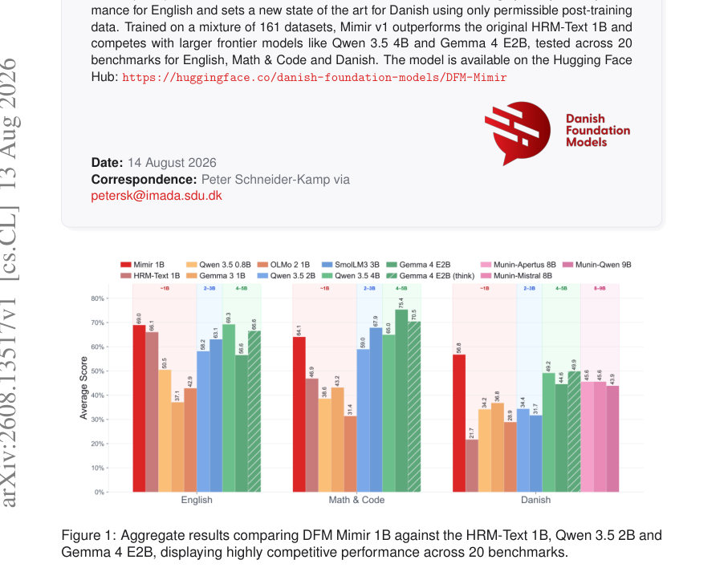

# DFM Mimir v1: An Open HRM Delivering Frontier Performance at 1B Parameters Using Only Permissible Post-Training Data

- **게시일:** 2026-08-14
- **arXiv:** [2608.13517v1](http://arxiv.org/abs/2608.13517v1) · [PDF](https://arxiv.org/pdf/2608.13517v1)
- **저자:** Peter Schneider-Kamp, Jacob Nielsen, Gianluca Barmina, Kenneth Enevoldsen, Lukas Galke Poech
- **분야:** cs.CL, cs.AI
- **선정 점수:** 8.01
- **선정 이유:** 최근성 0.8, 인용 영향 0.0 (인용 0회), 저자 영향 1.3 (최고 h-index 6), AI 주제 적합성 3.0, 개발자 관심 0.7, 학술 신호 0.3, 오픈 웨이트·주요 연구조직 신호 2.0

[← 2026-08-14 목록으로 돌아가기](../daily/2026-08-14.html)

<!-- paper-visuals:start -->
## 주요 Figure

> 원문 PDF에서 실제 Figure 캡션과 그림 영역이 함께 확인된 자료만 자동 추출했다.

*Figure · 원문 PDF 1쪽 · Figure 1: Aggregate results comparing DFM Mimir 1B against the HRM-Text 1B, Qwen 3.5 2B and*

<!-- paper-visuals:end -->

## 한 문장 요약

HRM-Text 기반의 1B 파라미터 언어모델 Mimir v1을 허용된(퍼미시블) 후처리 데이터만으로 학습·공개하여 덴마크어에서 최첨단 성능을 달성하고 영어·수학·코드 과제에서도 경쟁력 있는 성능을 보임.

## 해결하려는 문제

현행 대형 언어모델 개발은 대규모이면서 종종 비허용(저작권·개인정보 포함) 데이터에 의존해 오픈·윤리적 데이터만 사용하려는 연구자·프로젝트(예: 덴마크 재단 모델 프로젝트)에 높은 진입 장벽을 만든다. 덴마크어처럼 자원이 적은 언어에서는 허용 가능한 데이터만으로도 실용적이고 경쟁력 있는 베이스 모델을 학습하는 것이 어렵다. 본 연구는 '허용 가능한' 데이터 한정하에, 사전학습(또는 초기 학습)과정에서 실무에 쓸 수 있는 성능을 내는 1B 모델을 만드는 문제를 다룬다.

## 핵심 기여

- 허용 가능한(퍼미시블) 후처리 데이터만으로 학습된 1B 파라미터 HRM-Text 기반 언어모델 Mimir v1을 제안하고 공개함(Hugging Face에 모델 배포).
- 161개 데이터셋(토큰 약 70.48B/epoch)을 조합해 덴마크어 중심·영어 보강 혼합 코퍼스를 구성하고, 원본이 허용되지 않는 Sapient 계열 데이터를 LLM으로 합성·감사(audited)하여 'transplant' 방식으로 대체함을 설계·적용함.
- 모델 아키텍처·학습 파이프라인(세부 하이퍼파라미터 포함)을 공개하고, 비교 대상(여러 1B, 2–3B, 4–5B 모델)과 20개 벤치마크(영어·수학·코드·덴마크어)에서 정량적 평가를 수행하여 덴마크어에서 새로운 SOTA 수준의 성능을 보임.
- HRM-Text 아키텍처(계층적 reasoning 설정)와 Gemma-4 토크나이저·chat 템플릿을 포함한 실용적인 학습·서빙(FlashAttention 필요) 구현 경험과 설정을 문서화함.
- 허용성 정책을 지키면서도 합성 데이터(다양한 포맷: reformatted, curated, synthetic+audited, tool-call formatted 등)를 포함해 생성된 코퍼스로 높은 생성·정확도 기반 과제(예: GSM8K, HumanEval, DROP 등)를 달성할 수 있음을 실험적으로 보였음.

## 접근 방법

* Mimir v1은 HRM-Text 아키텍처를 그대로 사용하되(hidden size 1536, 32 레이어, 12 attention heads, FFN expansion 4), hierarchical reasoning 파라미터를 H-cycles=2, L-cycles=3로 설정하고 truncated backprop을 5 스텝으로 제한했다.
* RoPE positional embedding(θ=10,000)과 pre-norm layernorm(ϵ=1e-6)을 적용한다.
* 토크나이저는 Gemma-4를 사용하고 학습 시 chat 템플릿을 적용해 대화·assistant 행태를 학습했다.
* 데이터는 161개 공개·계약·합성 데이터셋을 혼합(총 70.48B 토큰/epoch)했으며, Sapient 관련 비허용 데이터를 Gemma4 31B로 합성하고 품질 감사를 거쳐 'transplant' 데이터로 대체했다(감사 통과율은 데이터군별로 매우 다름).
* 학습은 FSDP로 진행하였고 연산은 bfloat16, 집계는 fp32로 수행했으며 AdamW(peak lr=3e-4, warmup 2,000 steps, constant schedule, min ratio=1.0)를 사용했다.
* 글로벌 배치 사이즈는 262,144 토큰, gradient accumulation 2로 8개 가속기(각 16384 토큰)에서 학습했고 문맥 길이 4096을 4개 컨텍스트로 맞춰 학습했다.
* 총 1.65M 스텝을 8개의 NVIDIA B200(180 GB HBM each)에서 약 3주간(평균 스텝 타임 ~1.1s) 학습했다.
* 평가 시에는 온도 0(그리디), seed 4242, vLLM/Transformers를 사용했고 Mimir는 PrefixLM·Gemma4 chat 템플릿을 제대로 반영하려면 FlashAttention이 필요하다고 보고했다.

## 주요 결과

- 코퍼스 구성: 161개 데이터셋, 총 70.48B 토큰/epoch. 언어 분포는 영어 68.62%, 덴마크어 24.74%, 이중언어(da+en) 6.54%. 데이터 형태별로는 reformatted 65.96%, curated+reformatted 16.91%, synthetic+audited 11.08% 등.
- 데이터 집중: 상위 10개 데이터셋이 전체 토큰의 66.5%를 차지하며 상위 3개만으로 38.1%를 차지(특히 sapient mega-repo 11.92B(16.91%)와 danish 'lærebogen' 8.32B(11.81%)가 큼).
- 영어 벤치마크(표7): Mimir 1B의 평균 점수는 69.0(영어 벤치마크 평균 표기 기준). 개별 항목에서는 BoolQ 87.8, Winogrande 73.5, DROP F1 83.1로 HRM-Text 1B(영어 평균 66.1) 대비 향상됨. Qwen 3.5 4B의 영어 평균(표기 기준)과 근접(예: Qwen 3.5 4B 평균 69.3).
- 수학·코드(표8): GSM8K 89.9, MATH 45.8, HumanEval 56.7로 벤치마크 평균 64.1을 기록. 동일 무게급 HRM-Text 1B 대비 Math&Code 평균에서 46.9→64.1로 약 36.7% 상대 개선을 보고함. 일부 더 큰 모델(Gemma 4 E2B 등)에는 여전히 뒤처지는 분야가 있음(특히 Math&Code에서 Gemma 4 E2B 평균 75.4 등).
- 덴마크어(표9): 덴마크어 벤치마크 평균 56.8로 동일 무게급 HRM-Text 1B(21.7)에 비해 큰 폭 향상하여 덴마크어 과제들(예: DaLA F1 96.1, GEC EM 85.6, WikiQA EM 53.9 등)에서 최고 혹은 근접한 성능을 보임. 저자들은 덴마크어에서 새로운 SOTA 수준이라고 기술함. 전체 평가 구성은 온도 0, 고정 시드, 일부 영어 벤치에는 few-shot이 사용됨(표 B 참고).

## 한계

- 저자 명시 한계: 수학·코드 도메인에서는 Gemma 4(5B, effective 2.3B)에 여전히 뒤처지며 assistant(대화형) 능력은 최첨단에 비해 제한적임. 강화학습(RL)은 HRM 계열에서 아직 탐색되지 않았고 향후 연구 과제로 남아 있음. 또한 데이터셋의 완전한 라이선스 공개성을 더 개선해야 한다고 밝힘.
- 논문 본문에서 확인되는 제약(분석자 판단): 코퍼스가 소수 데이터에 매우 집중(상위 10개가 66.5%)되고 특정 덴마크 데이터는 반복 샘플링(예: 'lærebogen' 4×, 일부 소규모 데이터 10–20×)으로 구성되어 있어 분포 편향 또는 과적합 위험이 존재함. 합성(transplant) 데이터는 Gemma4 같은 상위 모델로 생성·감사되었으나 합성 과정과 감사 기준이 데이터군별로 크게 다르므로 합성 데이터의 보편적 품질·편향 영향을 완전히 배제할 수 없음. 일부 데이터는 계약상(public sharing 불가)으로 제공되어 전체 데이터 재현성이 제한적임(예: DBC, Lex.dk). 평가가 온도 0·그리디로 고정되어 실제 생성·대화 시나리오(샘플링·다양성 요구)에서의 행동을 충분히 반영하지 못할 수 있음.

## 개발자 관점

- 재현성: 모델 구성·학습 하이퍼파라미터(표 5·6), 토크나이저(Gemma-4), 학습 스택(FSDP, bfloat16, AdamW, 글로벌 배치 262,144 등), 훈련 스텝(1.65M)과 사용 하드웨어(8×NVIDIA B200, 180 GB HBM) 등 구체적 설정을 본문에서 제공하므로 동일·유사 환경에서는 재현 가능성이 높음. 공개된 코드베이스(저자 제공 리포지토리)를 기반으로 구현함.
- 데이터 파이프라인: 허용성 정책을 유지하려면 비허용 데이터는 합성·감사로 대체하는 'transplant' 전략을 적용할 수 있음. 합성 데이터는 고성능 모델(여기서는 Gemma4 31B)로 생성하되, 도메인별로 엄격한 품질 감사 절차가 필요하고 수용율이 매우 다를 수 있음을 감안해야 함.
- 서빙·추론: Mimir는 PrefixLM·Gemma4 chat 템플릿을 제대로 반영하기 위해 FlashAttention이 필요하다고 명시했으므로 배포 시 해당 스택(vLLM+FlashAttention 또는 Transformers+FlashAttention) 지원을 고려해야 함.
- 비용·인프라: 1B 모델이라도 전문 하드웨어(8×B200, 대용량 HBM)에서 수 주간 학습해야 하므로 중소 연구팀은 클라우드·정부 지원·공동 인프라를 고려해야 함. 다만 1B 규모는 대형(>10B) 모델에 비해 상대적으로 저렴하며 실서비스 배포·실행 비용이 낮음.
- 안전성·거버넌스: '퍼미시블' 데이터 철학은 법적·윤리적 위험을 낮추지만, 계약상 공유 불가 데이터의 존재는 완전한 오픈 재현성을 제한하므로 공개·배포 정책과 데이터 사용권을 명확히 관리해야 함.

**근거 범위:** 이 분석은 제공된 논문 PDF 본문(페이지 1–20, 본문·표·부록 포함)을 근거로 작성되었음. 본문에 명시된 수치(토큰 수, 하이퍼파라미터, 평가 점수, 학습 스펙 등)를 그대로 인용하였고, 저자가 직접 명시하지 않은 세부 구현·감소된 수치(예: 총 GPU 시간(kGPUh) 또는 전력·비용 추정)는 생성하지 않았다. 계약상 공개 불가 데이터 항목과 합성 데이터의 감사 세부 기준은 본문에 일반적으로 서술되어 있으나 감사의 정밀한 절차·통계(예: 카테고리별 acceptance rate 수치)는 데이터군별로 '다름'만 언급되어 있어 구체 수치는 포함하지 않았음.
