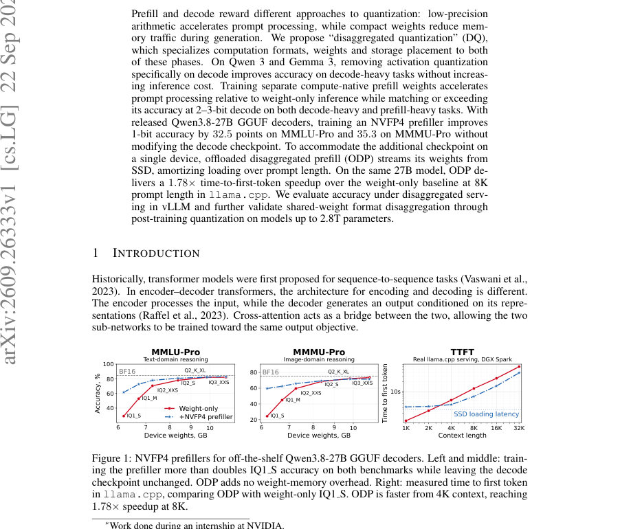
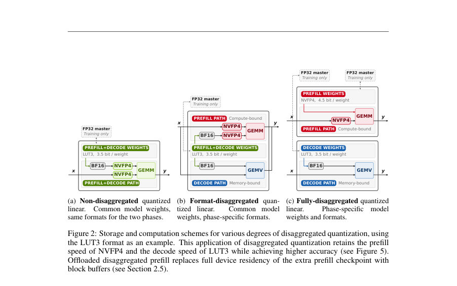
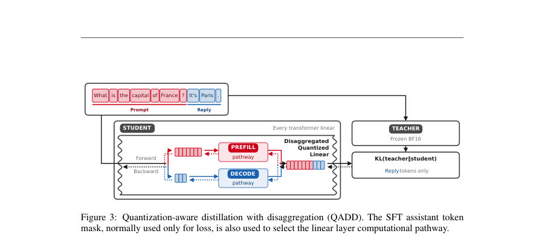

# Disaggregated Quantization: Specializing LLM Prefill and Decode

- **게시일:** 2026-09-23
- **arXiv:** [2609.26333v1](http://arxiv.org/abs/2609.26333v1) · [PDF](https://arxiv.org/pdf/2609.26333v1)
- **저자:** Andrei Panferov, Maximilian Kleinegger, Sweta Priyadarshi, Tijmen Blankevoort, Dan Alistarh
- **분야:** cs.LG
- **선정 점수:** 7.99
- **선정 이유:** 최근성 1.2, 인용 영향 0.0 (인용 0회), 저자 영향 0.0 (최고 h-index 0), AI 주제 적합성 2.7, 개발자 관심 0.5, 학술 신호 0.6, 오픈 웨이트·주요 연구조직 신호 3.1

[← 2026-09-23 목록으로 돌아가기](../daily/2026-09-23.html)

<!-- paper-visuals:start -->
## 주요 Figure

> 원문 PDF에서 실제 Figure 캡션과 그림 영역이 함께 확인된 자료만 자동 추출했다.

*Figure · 원문 PDF 1쪽 · Figure 1: NVFP4 prefillers for off-the-shelf Qwen3.8-27B GGUF decoders. Left and middle: train-*

*Figure · 원문 PDF 2쪽 · Figure 2: Storage and computation schemes for various degrees of disaggregated quantization, using*

*Figure · 원문 PDF 3쪽 · Figure 3: Quantization-aware distillation with disaggregation (QADD). The SFT assistant token*

<!-- paper-visuals:end -->

## 한 문장 요약

LLM의 입력 처리(prefill)와 출력 생성(decode)을 위상별로 서로 다른 양자화 포맷·가중치·배치로 분리(Disaggregated Quantization)하고, 이를 학습(분산 양자화 인식 증류, QADD)·서빙(ODP 등)까지 설계하여 저비트 디코더에서 정확도와 대화 응답성(시간)을 동시에 개선한다.

## 해결하려는 문제

기존의 LLM 양자화는 동일한 포맷과 가중치를 prefill과 decode에 일괄 적용한다. 그러나 prefill은 토큰 재사용으로 연산(컴퓨트) 바운드가 되는 반면, decode는 매 토큰마다 가중치 전송이 필요해 메모리(대역폭) 바운드이다. 이에 따라 (1) 하드웨어-네이티브 저정밀 산술(예: NVFP4)은 prefill 가속에는 유리하지만 decode의 저용량 가중치 이점(메모리 트래픽 절감)을 살리지 못하고, (2) 가중치 전용 압축은 decode 효율은 높이나 prefill에서 네이티브 가속을 활용하지 못한다. 연구 질문은 ‘두 위상에 대해 서로 다른 양자화 포맷·가중치·저장배치를 적용하면 정확도와 지연/메모리 트레이드오프를 동시에 개선할 수 있는가’ 이다.

## 핵심 기여

- QADD(Quantization-Aware Distillation with Disaggregation): SFT 어시스턴트 토큰 마스크를 이용해 각 입력 위치별로 prefill/decod e 계산 경로를 선택하고 한 순전파-역전파로 두 경로를 공동 목표(교사 BF16 분포에 대한 KL)로 학습할 수 있게 했다. 이는 공유 마스터 가중치 또는 고정된 디코더에 대한 prefill 전용 적응(평가 시 디코더 냉동) 모두를 지원한다.
- Disaggregated Quantization(DQ) 설계 사다리 제시: (a) Format-disaggregation — prefill은 컴퓨트-네이티브 포맷(NVFP4)으로, decode는 가중치만 저비트(예: LUT2/3)로 두어 활성화 양자화만 해제한 decode(NVFP4A16)로 품질 향상과 비용 보존을 달성, (b) Full disaggregation — prefill과 decode의 가중치를 분리하여 각 위상에 네이티브 포맷으로 학습·저장, (c) Offloaded Disaggregated Prefill(ODP) — 추가 prefill 체크포인트를 SSD에서 블록 단위로 스트리밍해 장치(weight) 메모리 점유를 늘리지 않고도 단일-디바이스에서 두 체크포인트를 운용 가능하게 함.
- Prefillers(실용성): 이미 공개·사전압축된 디코더(GGUF 등)를 수정하지 않고도, 그 디코더에 맞춘 NVFP4 네이티브 prefill 체크포인트만 학습해(디코더 냉동) 저비트 디코더의 정확도를 대폭 개선하고 prefill을 가속할 수 있음을 보였다.
- 대규모/무수정 적용 검증: 포맷-비분리 PTQ 수준(활성화 양자화만 decode에서 비활성화)에서도 최대 2.8T급 모델까지 적용해 다수 모델·벤치마크에서 통계적으로 유의미한 개선을 확인하고, Qwen/Gemma 계열 소형~중형 가족에서 정량적 이득을 제시했다.

## 접근 방법

* (1) 핵심 개념: prefill과 decode에 대해 계산 포맷(activation+weight의 네이티브 저정밀 연산)·가중치 인코딩(가중치 전용 저비트 룩업 등)·저장 장소(장치 메모리 또는 SSD 스트리밍)를 분리해 설계하고, 두 위상이 동일한 응답 목표를 공유하도록 학습한다.
* (2) QADD: KL(p_teacher \|\| p_student)를 목표로, SFT의 응답(assistant) 마스크로 각 입력 토큰이 prefill 경로(프리필 가중치/포맷) 또는 decode 경로(디코더 가중치/포맷)를 사용하도록 양자화-인식 증류를 수행한다.
* 가중치는 FP32 마스터 유지, ST 에스티메이터를 통해 양자화 가중치로 전파한다.
* (3) 포맷·가중치·서빙 스킴: NVFP4(W4A4)와 NVFP4A16(가중치 W4, activation BF16), LUT3/LUT2(weight-only, 3/2-bit LUT with two-level scaling) 등 포맷을 정의하고, prefill에서는 NVFP4 네이티브 연산을, decode에서는 압축 가중치(또는 활성화 미양자화) 경로를 조합하는 세 가지 분리 수준을 실험했다.
* (4) Fully-disaggregated: 동일 초기 FP 모델에서 prefill·decode 가중치를 별도로 최적화(각 디코더 비트윗별로 그에 맞는 prefill을 학습)해 prefill은 NVFP4 네이티브, decode는 압축 가중치로 운용.
* (5) ODP: 프리필 블록을 생성한 이후 가중치는 더 이상 필요 없다는 점을 이용해 블록 단위로 SSD에서 스트리밍하고 장치 버퍼(두 슬롯)를 재활용, 짧은 프롬프트에서는 로딩으로 인한 정지 가능성 있으나 긴 프롬프트에선 로딩 오버헤드가 암무타이즈됨.
* (6) 구현/학습 세부: 교사 BF16 고정, 코퍼스 T¨ulu 3 SFT 100M 토큰(코어 실험), 옵티마이저 AdamW, lr=3e-6, 시퀀스 길이 2048(27B 실험에선 8192), FP32 master weights, straight-through estimator.
* 평가 엔진으로 vLLM(서버)과 llama.cpp(로컬 TTFT)를 사용.

## 주요 결과

- Format-disaggregation 효과: decode-heavy 작업에서, NVFP4 기준으로 모든 7개 모델군에서 평균 정확도가 Qwen3에서 +1.9점, Gemma3에서 +3.1점 향상. LUT3/LUT2에 대해서도 각각 Qwen3/Gemma3에서 최대 +4.5/+3.7점, +2.5/+1.8점 개선을 보고(본문 섹션 3.2, Figure 5).
- Full disaggregation 효과: 2–3비트 저비트 디코더에서 큰 개선을 관찰. 예: decode-heavy에서 LUT3는 +6.3 / +5.2 점, LUT2는 +10.7 / +7.4 점(각각 Qwen3 / Gemma3 평균), prefill-heavy에서도 LUT3는 +4.1 / +4.3 점, LUT2는 +5.3 / +10.5 점 개선(본문 섹션 3.2).
- Prefiller on Qwen3.8-27B: 공개된 GGUF 1-bit 디코더들에 대해 NVFP4 prefiller만 학습(디코더는 고정)하면 1-bit 디코더 정확도가 MMLU-Pro에서 +32.5 percentage points, MMMU-Pro에서 +35.3 points 향상(예: IQ1 S: MMLU-Pro 29.04%→61.54%; 표와 본문 참조, Section 3.2 및 Table 5). 2-bit에서는 약 +6~7점 개선, 3-bit 이상에서는 효과가 작아지거나 일부 포맷에서 악화 관찰.
- ODP와 응답성: Qwen3.8-27B에 대해 llama.cpp 구현으로 NVFP4 prefiller(ODP)를 사용하면 8K 컨텍스트에서 weight-only baseline 대비 time-to-first-token(TTFT)을 1.78× 단축(예: TTFT 12.27s→6.90s; Figure 1, Sec 3.2). 또한 ODP는 긴 컨텍스트(약 ≥8K)에서 SSD 로딩 오버헤드를 컴퓨트로 상쇄해 1.47×–1.58×의 prefill 가속을 유지하면서 추가 장치 가중치 메모리를 요구하지 않음(Table 1, Sec 2.5–3.2).
- 대형 모델 PTQ 검증: 포맷-비분리(간단한 조치: decode에서 활성화 양자화만 비활성화)로 2.8T까지의 모델들에서 MMLU-Pro/MMMU-Pro 총 13 조합 중 11개에서 점추정치 개선, 6개는 통계적으로 유의미한 개선(α=0.05, Table 2, Sec 3.3).

## 한계

- 저자가 명시한 한계(본문 5절): (1) 평가가 배치가 큰(batched) 성능, 다중 턴(multi-turn) 및 에이전트 행위(agentic behavior)에 대해 수행되지 않았음. (2) 다중 턴에서 캐시-정책 의존성(복구 시 prefill이 생성하는 표현이 달라질 수 있음)에 대한 견고성은 테스트되지 않음. (3) ODP는 Mixture-of-Experts(MoE) 모델에는 원활히 적용되지 않음—활성 파라미터 비율 때문에 로딩 비용이 매우 커짐. (4) ODP는 짧은 프롬프트에서 SSD 로딩으로 인해 오히려 느릴 수 있음.
- 본문에서 확인 가능한 추가 제약(분리): (a) Fully-disaggregated은 추가 prefill 체크포인트 저장을 요구하므로 디바이스 메모리가 제한될 경우 ODP 같은 스트리밍이 필요하다(저자는 이 점을 명확히 기술). (b) 대부분의 정량적 불확실성(오차막대)은 동일한 학습 실행의 후기 체크포인트(시계열 평균) 내부 변화에 대한 것이며, 독립적인 여러 시드/실행에 대한 불확실성은 보고되지 않음(Appendix A.1,A.5). (c) Qwen3.8-27B prefiller 학습에는 원문 코퍼스에 멀티모달(비전) 예제가 없는데도 MMMU-Pro로 전이되는 결과가 관찰되나, 멀티모달 데이터가 없는 학습의 일반적 안전성·일반성은 제한적으로 해석해야 함(본문 Sec 3.2, A.2).

## 개발자 관점

- 간단한 첫 조치: 배포 시 decode에서만 활성화(activation) 양자화를 끄는 것(format-disaggregation, NVFP4A16)은 추가 가중치 저장 증가 없이 decode-heavy 작업의 정확도를 향상시키므로 PTQ 환경에서 빠르게 적용해 볼 것.
- 저비트 디코더(1–2비트)와 함께 쓸 경우: 기존의 weight-only 디코더를 변경할 수 없다면 NVFP4 네이티브 prefiller만 학습(디코더 냉동)하면 1-bit에서 대폭(예: MMLU-Pro +32.5pp) 정확도 개선과 prefill 가속을 동시에 얻을 수 있다. 공개된 GGUF 디코더와 상호운용 가능함.
- 단일-디바이스 배포 전략: fully-disaggregated을 적용하려면 추가 prefill 체크포인트가 필요하므로 장치 메모리가 부족하면 ODP(SSD→장치 블록 스트리밍, 두 버퍼, carve-out 방식)를 사용해 장치 weight 점유를 늘리지 않고도 혜택을 누릴 수 있음. 다만 ODP는 긴 컨텍스트에서 유리(예: ≥8K), 짧은 컨텍스트에서는 SSD 로딩으로 느릴 수 있음.
- 실험·재현 관련 구체사항: QADD는 KL(p_teacher||p_student) 목적, teacher BF16 고정, 코퍼스(예: T¨ulu 3 SFT 100M 토큰), AdamW(β=(0.9,0.95)), lr=3e-6, 시퀀스 길이 2048(27B는 8192), FP32 master weights, straight-through estimator의 조합으로 구현됨—저자 코드를 공개하였으므로 동일 세팅으로 재현이 가능함(본문 및 Appendix A).
- 성능 측정 권장: decode 속도는 메모리 대역폭(가중치 바이트/토큰)에 민감하므로 vLLM에서 per-output-token latency와 llama.cpp에서 time-to-first-token(TTFT)을 함께 측정하라. 또한 prefill은 layer별 연산-메모리 특성(예: attention 혼합(슬라이딩/글로벌)에 따라 가속 효과가 희석됨)을 고려해 평가해야 함(Table 11, Sec C).

**근거 범위:** 이 분석은 제공된 논문 PDF 본문(본문, 표, 그림, 부록)을 근거로 작성했다. 본문에서 명시적으로 제시된 수치·설정(예: 정확도 변화, 학습 코퍼스·하이퍼파라미터, TTFT 수치, ODP 동작 방식 등)을 사용했고, 본문에 명확히 기술되지 않은 반복 횟수·내부 구현 디테일(예: 일부 커널 최적화의 낮은 수준 세부)은 생성하지 않았다. 논문 본문의 표·그림(예: Table 1, Table 2, Table 5, Figures 1,4,5,6)과 부록(A–C)을 기준으로 요약·해석했으며, 원문에 대한 참조 오류 가능성을 줄이기 위해 주요 숫자는 본문 인용부(섹션/표)를 좇아 제시했다.
