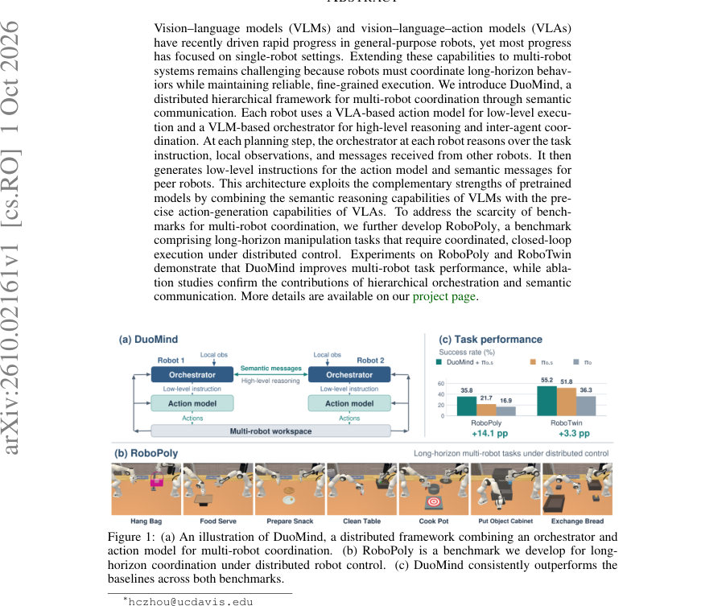
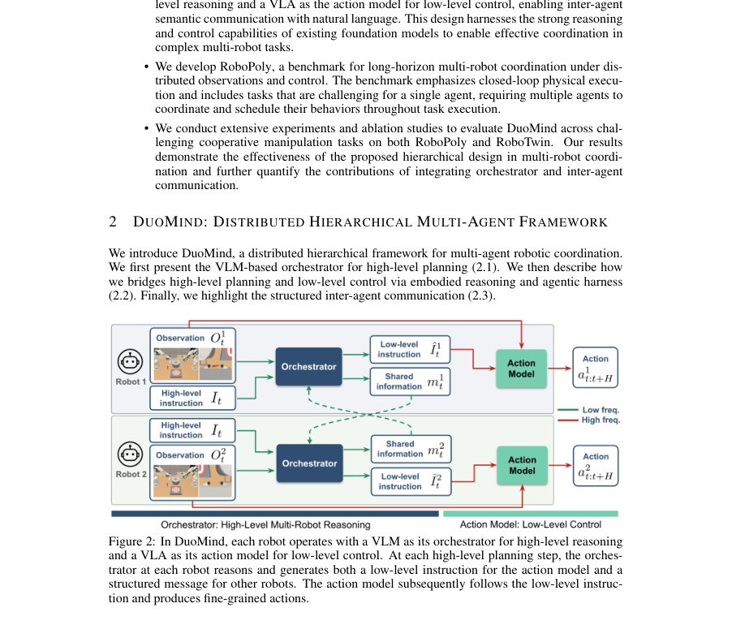
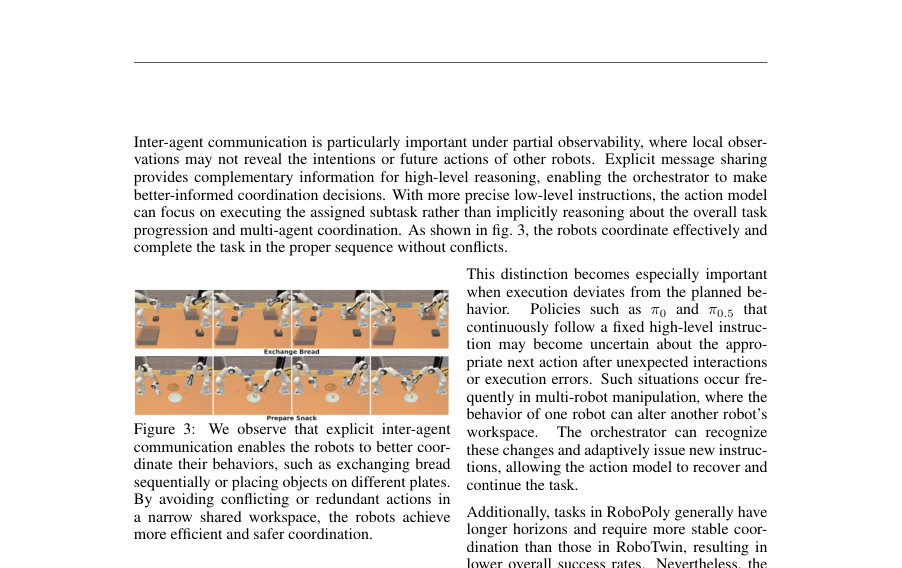

# DuoMind: Enabling Distributed Multi-Robot Coordination with Semantic Communication

- **게시일:** 2026-10-03
- **arXiv:** [2610.02161v1](http://arxiv.org/abs/2610.02161v1) · [PDF](https://arxiv.org/pdf/2610.02161v1)
- **저자:** Hanchu Zhou, Dechen Gao, Hang Wang, Brendan Lynch, Boqi Zhao, Qiyao Ma, Raman Goyal, Junshan Zhang
- **분야:** cs.RO, cs.AI
- **선정 점수:** 5.87
- **선정 이유:** 최근성 0.8, 인용 영향 0.0 (인용 0회), 저자 영향 1.2 (최고 h-index 5), AI 주제 적합성 2.8, 개발자 관심 0.2, 학술 신호 0.9, 오픈 웨이트·주요 연구조직 신호 0.0

[← 2026-10-03 목록으로 돌아가기](../daily/2026-10-03.html)

<!-- paper-visuals:start -->
## 주요 Figure

> 원문 PDF에서 실제 Figure 캡션과 그림 영역이 함께 확인된 자료만 자동 추출했다.

*Figure · 원문 PDF 1쪽 · Figure 1: (a) An illustration of DuoMind, a distributed framework combining an orchestrator and*

*Figure · 원문 PDF 3쪽 · Figure 2: In DuoMind, each robot operates with a VLM as its orchestrator for high-level reasoning*

*Figure · 원문 PDF 8쪽 · Figure 3: We observe that explicit inter-agent*

<!-- paper-visuals:end -->

## 한 문장 요약

DuoMind은 각 로봇에 VLM 기반 오케스트레이터(고수준 추론)와 VLA 기반 액션 모델(저수준 실행)을 결합하고 구조화된 자연어 메시지로 에이전트 간 의미적 통신을 수행하여 분산 다중 로봇의 장기ㆍ정밀 협조를 가능하게 하는 계층적 프레임워크이다.

## 해결하려는 문제

기존 VLM/VLA 기반 로봇 연구는 대부분 단일 로봇에 집중되어 왔고, 분산 다중 로봇 환경에서는 부분 관측과 동적 상호작용으로 인해 장기 협조와 정밀한 저수준 제어를 동시에 달성하기 어렵다. 기존 다중 에이전트 방법들은 종종 단순 환경·짧은 수평·사전 정의된 스킬에 의존하거나 중앙집중 제어에 의존하며, 고수준 다중 에이전트 추론과 저수준 물리 실행을 연결하는 실용적이고 확장 가능한 인터페이스와 평가 벤치마크가 부족하다.

## 핵심 기여

- DuoMind: 분산 계층적 프레임워크로, 각 로봇에 VLM 오케스트레이터(고수준 계획·타 에이전트와의 의미적 통신)와 VLA 액션 모델(저수준 실행)을 결합하여 자연어 기반의 인터페이스로 다중 로봇 협조를 실현함.
- 구조화된 에이전트 간 메시지 설계(intention, subgoals, belief, uncertainty(선택적))를 도입하여 부분 관측 하에서 의도·하위목표·관찰 기반 신념을 공유함으로써 충돌·비동기 행동을 완화함.
- RoboPoly: 분산 관측·제어 하의 장기 협조가 요구되는 7개 다중 로봇 조작 과제로 구성된 시뮬레이션 벤치마크 및 데이터셋(ManiSkill3 기반) 공개.
- 광범위한 실험 및 절제된 소거실험을 통해 계층적 오케스트레이션과 에이전트 간 통신의 기여도를 정량적으로 분석함(다양한 VLA π0.5/π0 비교 포함).

## 접근 방법

* DuoMind 아키텍처는 두 수준으로 분해된다.
* (1) 고수준 오케스트레이터: VLM(Qwen3-VL-4B-Instruct 사용)을 각 로봇에 배치하여 고수준 지시, 전역 카메라·자기 손목 카메라 관측, 동료로부터 수신한 구조화된 메시지를 입력으로 현재 하위 과업을 결정하고 자연어 형식의 저수준 지시와 동료에게 보낼 공유 메시지를 생성한다.
* 오케스트레이터는 미리 허용된(low-level instruction 후보 집합) 문장들로 출력 범위를 제한하고 진행 정지(stagnation) 방지 규칙을 둔다(진행 규칙: 현재 단계가 완료되었는지 시각적으로 확인하여 한 단계씩 전진).
* (2) 저수준 액션 모델: VLA(주로 π0.5, 대안으로 π0)를 LoRA로 미세조정하여 오케스트레이터가 생성한 자연어 저수준 지시를 따라 세부 행동을 생성한다.
* 에이전트 간 통신은 JSON 구조로 의도(intention), 하위목표(subgoals), 관찰 기반 신념(belief), 불확실성(optional)을 포함하며, 이는 오케스트레이터가 부분 관측 상태에서 타 에이전트의 의도를 추론·조정하는 데 사용된다.
* 학습 데이터는 ManiSkill3의 모션 플래너로 생성한 시연을 통해 얻었고, 각 조작 단계에 대해 저수준 지시와 고수준 지시를 레이블로 제공한다.
* 평가 시 각 태스크에 대해 400 롤아웃을 수행했으며, 분산 설정에서 각 로봇은 전역 카메라와 자기 손목 카메라만 수신한다.

## 주요 결과

- 데이터셋·평가: RoboPoly(7개 과제)와 RoboTwin(8개 선택 과제)에서 평가. 각 태스크별로 50 듀얼-로봇 데모를 수집하여 단일-로봇 경로 100개로 분해해 미세조정에 사용. 평가: 태스크당 400 롤아웃, 실험 장비: 4× NVIDIA A100, 실험당 10–24시간 소요.
- RoboPoly 성공률(Table 1, 방법: DuoMind w/ π0.5 vs π0.5-only vs π0-only): Hang Bag 78.00 / 52.25 / 58.75, Food Serve 32.75 / 29.75 / 22.25, Prepare Snack 18.00 / 16.25 / 3.75, Clean Table 24.75 / 16.50 / 0.00, Cook Pot 39.25 / 1.00 / 0.25, Put Object Cabinet 26.50 / 18.50 / 14.50, Exchange Bread 31.00 / 17.50 / 18.50.
- RoboTwin 성공률(Table 2): Hanging Mug 24.75 / 17.25 / 12.50, Pick Diverse Bottles 58.50 / 48.50 / 42.50, Stack Bowls Two 85.50 / 82.50 / 33.75, Put Bottle Dustbin 34.50 / 31.25 / 21.25, Lift Pot 94.75 / 94.00 / 77.50, Handover Mic 98.00 / 94.75 / 84.50, Blocks Ranking RGB 2.00 / 0.00 / 0.25, Put Object Cabinet 43.25 / 46.50 / 18.00.
- 요약 해석: 대부분의 태스크에서 DuoMind(특히 π0.5 사용 시)는 π0.5-only 및 π0-only 대비 성공률이 향상되었고, RoboPoly(장기·고협력 요구)에서 개선폭이 더 큼. 예외적으로 RoboTwin의 Put Object Cabinet에서는 π0.5-only가 DuoMind보다 소폭 높음. 소거실험에서는 에이전트 간 통신을 비활성화하면 충돌·비동기 행동이 증가하여 성공률이 떨어짐(예: Cook Pot에서 동시 리프팅 실패, Prepare Snack에서 동일 타겟 경쟁).
- 액션 모델 호환성: π0.5 대신 π0를 사용할 경우 DuoMind의 절대 성공률은 낮아지지만(약한 액션 모델의 영향), 여전히 π0-only 대비 뚜렷한 개선을 보이며 계층적 오케스트레이션의 일관된 이득을 입증함.

## 한계

- 저자 명시: 본 연구는 계산 비용과 복잡성 때문에 2-에이전트(두 로봇) 설정에 집중했으며, 더 큰 규모의 팀으로의 확장은 향후 연구 과제로 남겨둠.
- 저자 명시: 오케스트레이터가 생성하는 저수준 지시는 사전에 정의된 허용 후보 집합으로 제한되어 있어, 액션 모델이 훈련된 지시 분포를 넘어서지 않도록 제약함(이는 유연성을 일부 제한할 수 있음).
- 본문에서 확인되는 제약: 모든 실험이 시뮬레이션(ManiSkill3 기반 RoboPoly, RoboTwin 적응 설정)에서 수행되었으며 실제 하드웨어 실증이나 현실 세계 일반화 실험은 보고되지 않음.
- 본문에서 확인되는 제약: VLM·VLA의 성능 및 비용(예: Qwen3-VL-4B-Instruct와 π0.5 사용, 4×A100 필요)은 재현 시 하드웨어·라이선스·추론 비용 부담으로 이어질 수 있음.

## 개발자 관점

- 모듈 재사용성: 고수준(VLM)과 저수준(VLA)을 자연어 인터페이스로 분리하면 서로 다른 백본을 손쉽게 교체·업그레이드 가능함(논문은 Qwen3-VL-4B-Instruct와 π0.5/π0 조합을 사례로 제시).
- 구조화된 메시지 설계 권장: intention/subgoals/belief/(uncertainty) 필드로 구성된 자연어 메시지는 부분 관측 하 협조 문제에서 실용적이고 해석 가능함. 구현 시 메시 스키마를 엄격히 규정하고 파싱·검증 로직을 두어야 함.
- 실험 재현 팁: 데이터는 ManiSkill3 기반 모션 플래너로 생성하였고, 각 태스크당 50 듀얼-데모→100 단일-로봇 경로로 분해해 LoRA로 VLA를 미세조정. 실험 환경은 전역 카메라 + 각 로봇 손목 카메라(분산 관측). 평가 시 태스크당 400 롤아웃으로 통계적 안정성 확보.
- 안전·동작 규칙: 좁은 공유 작업공간에서는 오케스트레이터의 진행 규칙(progress rule)·동작 후보 집합 제한이 실시간 충돌·비동기 문제를 완화하는 데 중요함. 실장 시 추가적인 저수준 안전감지(충돌 회피) 필요.
- 운영·비용 고려: VLM 호출 빈도(VLM interval)와 저수준 액션 청크(Execute/horizon)를 조정하여 추론 비용과 반응성(고주파 제어 vs 저주파 계획) 사이 균형을 맞출 것(논문은 태스크별로 VLM interval을 2–4로 설정한 예시 제시).

**근거 범위:** 이 분석은 제공된 논문 PDF 본문(페이지 1–19)에 근거하여 작성되었음. 도표(Table 1, Table 2, Tables 3–4), 본문 및 부록(F, D, A–C)의 수치·설정·시스템 프롬프트를 직접 인용했음. 실제 구현 세부사항(예: 코드·모델 가중치·런타임 최적화)는 PDF에 기술되지 않았거나 공개 링크가 명시되지 않아 분석에 포함되지 않았음.
